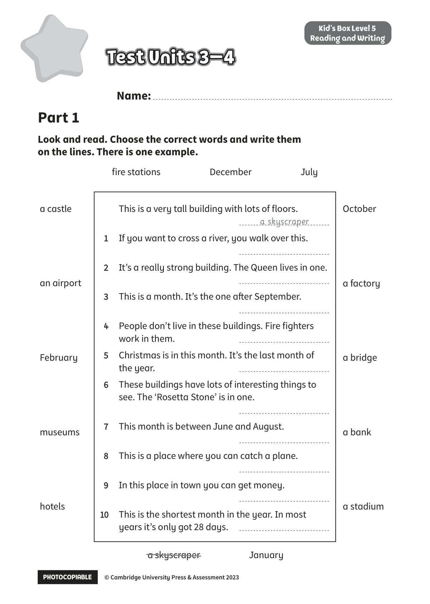

## 音频文件

- 🎧 [KidsBox_Level5_Test_Units_3-4_Listening_1_Audio_Track_21.mp3](KidsBox_Level5_Test_Units_3-4_Listening_1_Audio_Track_21.mp3)
- 🎧 [KidsBox_Level5_Test_Units_3-4_Listening_2_Audio_Track_22.mp3](KidsBox_Level5_Test_Units_3-4_Listening_2_Audio_Track_22.mp3)
- 🎧 [KidsBox_Level5_Test_Units_3-4_Listening_3_Audio_Track_23.mp3](KidsBox_Level5_Test_Units_3-4_Listening_3_Audio_Track_23.mp3)
- 🎧 [KidsBox_Level5_Test_Units_3-4_Listening_4_Audio_Track_24.mp3](KidsBox_Level5_Test_Units_3-4_Listening_4_Audio_Track_24.mp3)
- 🎧 [KidsBox_Level5_Test_Units_3-4_Listening_5_Audio_Track_25.mp3](KidsBox_Level5_Test_Units_3-4_Listening_5_Audio_Track_25.mp3)

## 第 1 页

PHOTOCOPIABLE        © Cambridge University Press & Assessment 2023
© Cambridge University Press & Assessment 2023
Name:
Part 1
Kid’s Box Level 5
Reading and Writing
Look and read. Choose the correct words and write them
on the lines. There is one example.
Test Units 3–4
Test Units 3–4
Test Units 3–4
fire stations          December          July
This is a very tall building with lots of floors.

1
If you want to cross a river, you walk over this.

2
It’s a really strong building. The Queen lives in one.

3
This is a month. It’s the one after September.

4
People don’t live in these buildings. Fire fighters
work in them.
5
Christmas is in this month. It’s the last month of
the year.
6
These buildings have lots of interesting things to
see. The ‘Rosetta Stone’ is in one.

7
This month is between June and August.

8
This is a place where you can catch a plane.

9
In this place in town you can get money.

10
10
This is the shortest month in the year. In most
years it’s only got 28 days.
a skyscraper
October
a factory
a bridge
a bank
a stadium
a castle
an airport
February
museums
hotels
a skyscraper          January
