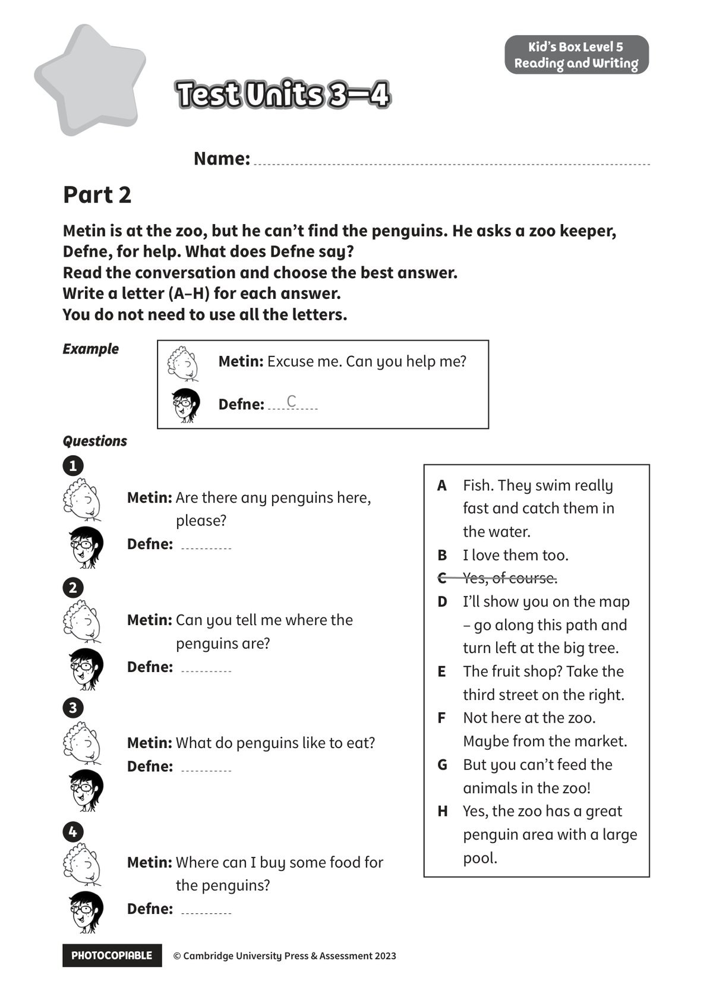

## 音频文件

- 🎧 [KidsBox_Level5_Test_Units_3-4_Listening_1_Audio_Track_21.mp3](KidsBox_Level5_Test_Units_3-4_Listening_1_Audio_Track_21.mp3)
- 🎧 [KidsBox_Level5_Test_Units_3-4_Listening_2_Audio_Track_22.mp3](KidsBox_Level5_Test_Units_3-4_Listening_2_Audio_Track_22.mp3)
- 🎧 [KidsBox_Level5_Test_Units_3-4_Listening_3_Audio_Track_23.mp3](KidsBox_Level5_Test_Units_3-4_Listening_3_Audio_Track_23.mp3)
- 🎧 [KidsBox_Level5_Test_Units_3-4_Listening_4_Audio_Track_24.mp3](KidsBox_Level5_Test_Units_3-4_Listening_4_Audio_Track_24.mp3)
- 🎧 [KidsBox_Level5_Test_Units_3-4_Listening_5_Audio_Track_25.mp3](KidsBox_Level5_Test_Units_3-4_Listening_5_Audio_Track_25.mp3)

## 第 1 页

PHOTOCOPIABLE        © Cambridge University Press & Assessment 2023
© Cambridge University Press & Assessment 2023
Name:
Part 2
Kid’s Box Level 5
Reading and Writing
Metin is at the zoo, but he can’t find the penguins. He asks a zoo keeper,
Defne, for help. What does Defne say?
Read the conversation and choose the best answer.
Write a letter (A–H) for each answer.
You do not need to use all the letters.
Test Units 3–4
Test Units 3–4
Test Units 3–4
Example
Example
Questions
Questions
Metin: Are there any penguins here,
please?
Defne:
Metin: Can you tell me where the
penguins are?
Defne:
Metin: What do penguins like to eat?
Defne:
Metin: Where can I buy some food for
the penguins?
Defne:
Metin: Excuse me. Can you help me?
Defne:
C
A	 Fish. They swim really
fast and catch them in
the water.
B	 I love them too.
C	 Yes, of course.
D	 I’ll show you on the map
– go along this path and
turn left at the big tree.
E
The fruit shop? Take the
third street on the right.
F
Not here at the zoo.
Maybe from the market.
G	 But you can’t feed the
animals in the zoo!
H	 Yes, the zoo has a great
penguin area with a large
pool.
1
2
3
4

## 第 2 页

PHOTOCOPIABLE        © Cambridge University Press & Assessment 2023
© Cambridge University Press & Assessment 2023
Metin: I’m going to get some for the
penguins’ dinner.
Defne:
5
