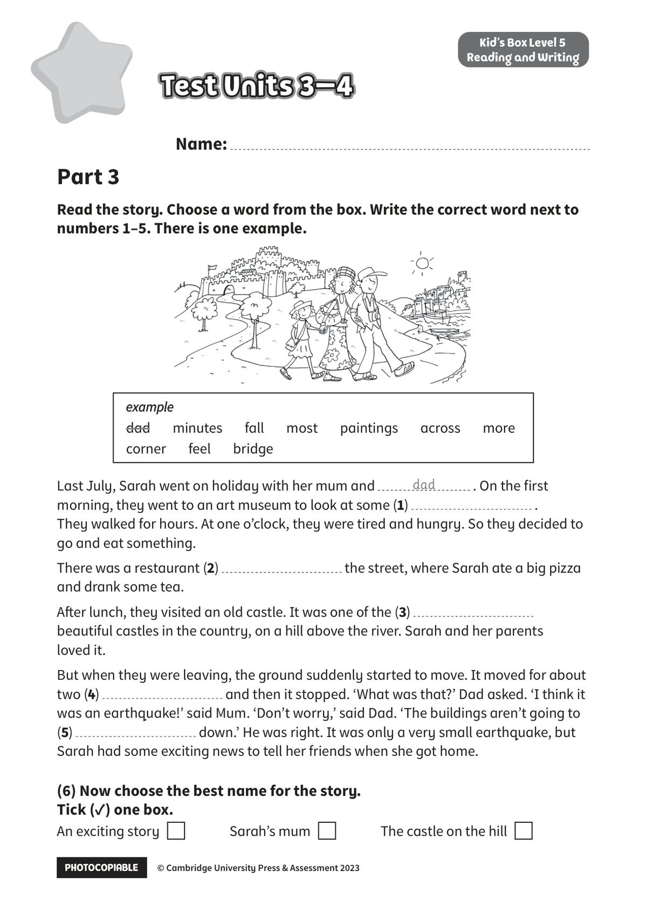

## 音频文件

- 🎧 [KidsBox_Level5_Test_Units_3-4_Listening_1_Audio_Track_21.mp3](KidsBox_Level5_Test_Units_3-4_Listening_1_Audio_Track_21.mp3)
- 🎧 [KidsBox_Level5_Test_Units_3-4_Listening_2_Audio_Track_22.mp3](KidsBox_Level5_Test_Units_3-4_Listening_2_Audio_Track_22.mp3)
- 🎧 [KidsBox_Level5_Test_Units_3-4_Listening_3_Audio_Track_23.mp3](KidsBox_Level5_Test_Units_3-4_Listening_3_Audio_Track_23.mp3)
- 🎧 [KidsBox_Level5_Test_Units_3-4_Listening_4_Audio_Track_24.mp3](KidsBox_Level5_Test_Units_3-4_Listening_4_Audio_Track_24.mp3)
- 🎧 [KidsBox_Level5_Test_Units_3-4_Listening_5_Audio_Track_25.mp3](KidsBox_Level5_Test_Units_3-4_Listening_5_Audio_Track_25.mp3)

## 第 1 页

PHOTOCOPIABLE        © Cambridge University Press & Assessment 2023
© Cambridge University Press & Assessment 2023
Name:
Part 3
Kid’s Box Level 5
Reading and Writing
Read the story. Choose a word from the box. Write the correct word next to
numbers 1–5. There is one example.
Test Units 3–4
Test Units 3–4
Test Units 3–4
Last July, Sarah went on holiday with her mum and
. On the first
morning, they went to an art museum to look at some (1)
.
They walked for hours. At one o’clock, they were tired and hungry. So they decided to
go and eat something.
There was a restaurant (2)
the street, where Sarah ate a big pizza
and drank some tea.
After lunch, they visited an old castle. It was one of the (3)
beautiful castles in the country, on a hill above the river. Sarah and her parents
loved it.
But when they were leaving, the ground suddenly started to move. It moved for about
two (4)
and then it stopped. ‘What was that?’ Dad asked. ‘I think it
was an earthquake!’ said Mum. ‘Don’t worry,’ said Dad. ‘The buildings aren’t going to
(5)
down.’ He was right. It was only a very small earthquake, but
Sarah had some exciting news to tell her friends when she got home.
(6) Now choose the best name for the story.
Tick (✓) one box.
An exciting story
Sarah’s mum
The castle on the hill
dad
example
example
dad      minutes      fall      most      paintings      across      more
corner      feel      bridge
