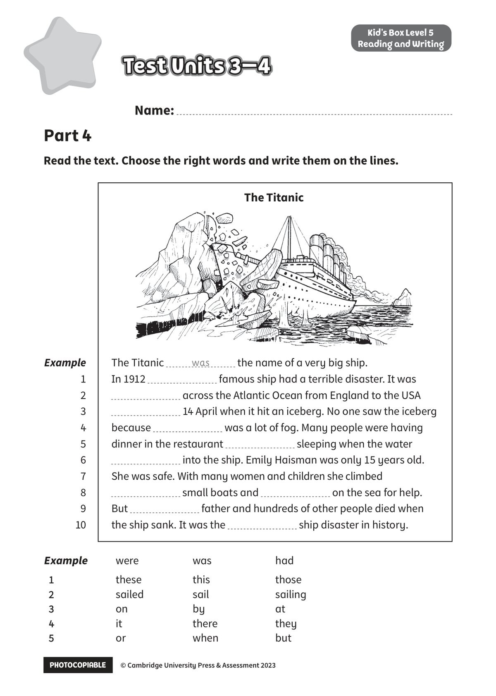
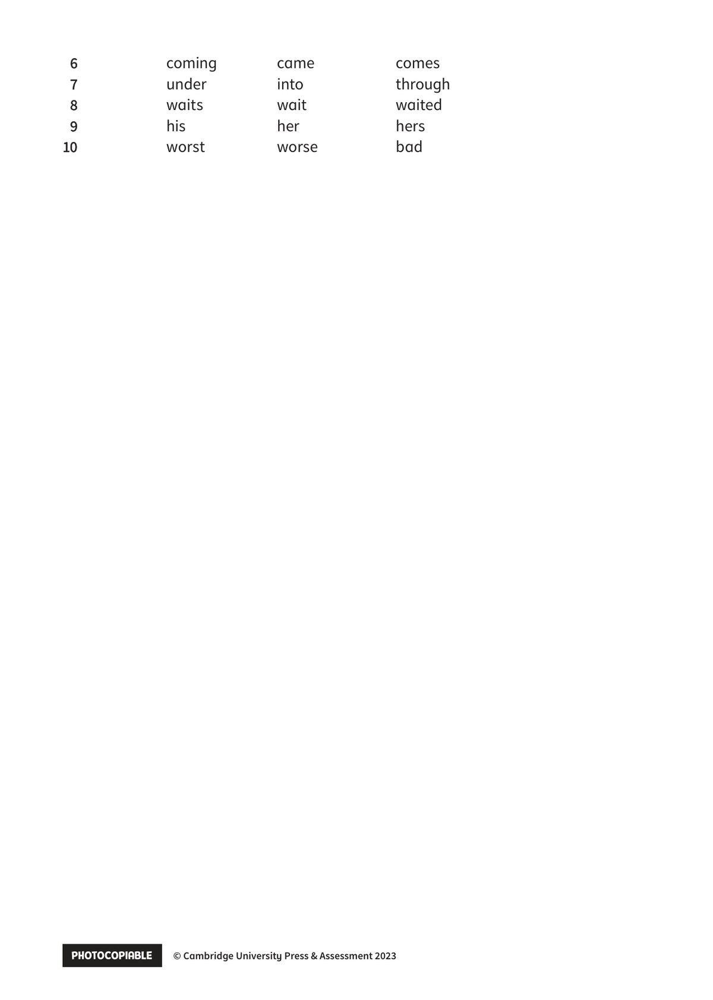

## 音频文件

- 🎧 [KidsBox_Level5_Test_Units_3-4_Listening_1_Audio_Track_21.mp3](KidsBox_Level5_Test_Units_3-4_Listening_1_Audio_Track_21.mp3)
- 🎧 [KidsBox_Level5_Test_Units_3-4_Listening_2_Audio_Track_22.mp3](KidsBox_Level5_Test_Units_3-4_Listening_2_Audio_Track_22.mp3)
- 🎧 [KidsBox_Level5_Test_Units_3-4_Listening_3_Audio_Track_23.mp3](KidsBox_Level5_Test_Units_3-4_Listening_3_Audio_Track_23.mp3)
- 🎧 [KidsBox_Level5_Test_Units_3-4_Listening_4_Audio_Track_24.mp3](KidsBox_Level5_Test_Units_3-4_Listening_4_Audio_Track_24.mp3)
- 🎧 [KidsBox_Level5_Test_Units_3-4_Listening_5_Audio_Track_25.mp3](KidsBox_Level5_Test_Units_3-4_Listening_5_Audio_Track_25.mp3)

## 第 1 页

PHOTOCOPIABLE        © Cambridge University Press & Assessment 2023
© Cambridge University Press & Assessment 2023
Name:
Part 4
Kid’s Box Level 5
Reading and Writing
Read the text. Choose the right words and write them on the lines.
Test Units 3–4
Test Units 3–4
Test Units 3–4
The Titanic
the name of a very big ship.
In 1912
famous ship had a terrible disaster. It was
across the Atlantic Ocean from England to the USA
14 April when it hit an iceberg. No one saw the iceberg
because
was a lot of fog. Many people were having
dinner in the restaurant
sleeping when the water
into the ship. Emily Haisman was only 15 years old.
She was safe. With many women and children she climbed
small boats and
on the sea for help.
But
father and hundreds of other people died when
the ship sank. It was the
ship disaster in history.
was
Example
1
2
3
4
5
6
7
8
9
10
The Titanic
Example
were
was
had
1
1
these
this
those
2
2
sailed
sail
sailing
3
3
on
by
at
4
4
it
there
they
5
5
or
when
but

## 第 2 页

PHOTOCOPIABLE        © Cambridge University Press & Assessment 2023
© Cambridge University Press & Assessment 2023
6
6
coming
came
comes
7
7
under
into
through
8
8
waits
wait
waited
9
9
his
her
hers
10
10
worst
worse
bad
