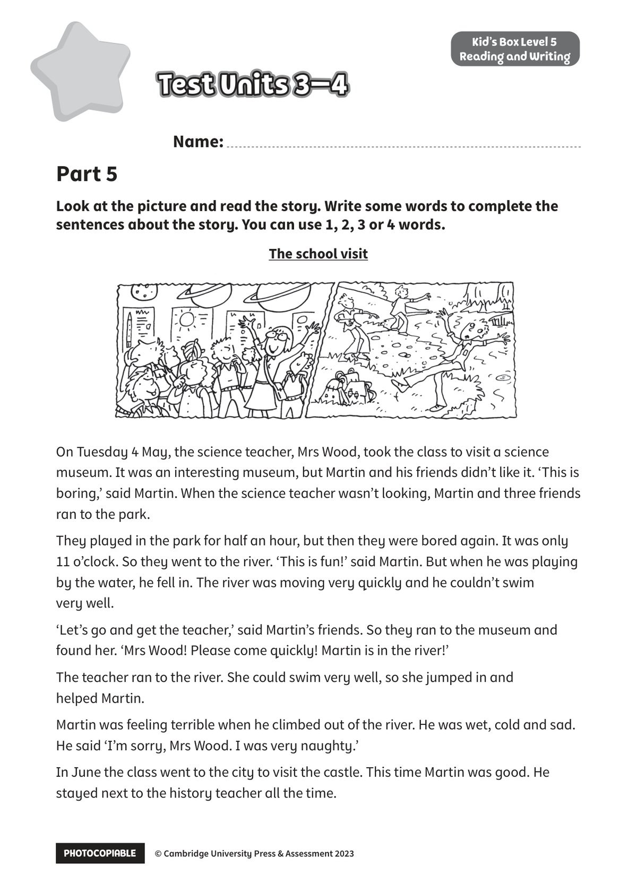
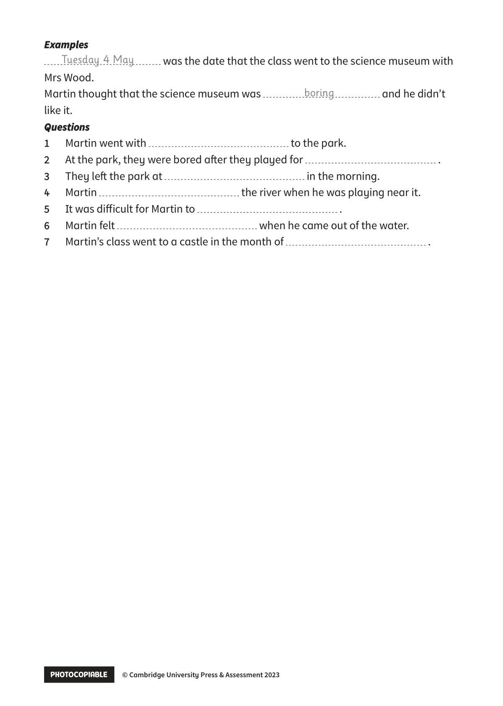

## 音频文件

- 🎧 [KidsBox_Level5_Test_Units_3-4_Listening_1_Audio_Track_21.mp3](KidsBox_Level5_Test_Units_3-4_Listening_1_Audio_Track_21.mp3)
- 🎧 [KidsBox_Level5_Test_Units_3-4_Listening_2_Audio_Track_22.mp3](KidsBox_Level5_Test_Units_3-4_Listening_2_Audio_Track_22.mp3)
- 🎧 [KidsBox_Level5_Test_Units_3-4_Listening_3_Audio_Track_23.mp3](KidsBox_Level5_Test_Units_3-4_Listening_3_Audio_Track_23.mp3)
- 🎧 [KidsBox_Level5_Test_Units_3-4_Listening_4_Audio_Track_24.mp3](KidsBox_Level5_Test_Units_3-4_Listening_4_Audio_Track_24.mp3)
- 🎧 [KidsBox_Level5_Test_Units_3-4_Listening_5_Audio_Track_25.mp3](KidsBox_Level5_Test_Units_3-4_Listening_5_Audio_Track_25.mp3)

## 第 1 页

PHOTOCOPIABLE        © Cambridge University Press & Assessment 2023
© Cambridge University Press & Assessment 2023
Name:
Part 5
Kid’s Box Level 5
Reading and Writing
Look at the picture and read the story. Write some words to complete the
sentences about the story. You can use 1, 2, 3 or 4 words.
Test Units 3–4
Test Units 3–4
Test Units 3–4
On Tuesday 4 May, the science teacher, Mrs Wood, took the class to visit a science
museum. It was an interesting museum, but Martin and his friends didn’t like it. ‘This is
boring,’ said Martin. When the science teacher wasn’t looking, Martin and three friends
ran to the park.
They played in the park for half an hour, but then they were bored again. It was only
11 o’clock. So they went to the river. ‘This is fun!’ said Martin. But when he was playing
by the water, he fell in. The river was moving very quickly and he couldn’t swim
very well.
‘Let’s go and get the teacher,’ said Martin’s friends. So they ran to the museum and
found her. ‘Mrs Wood! Please come quickly! Martin is in the river!’
The teacher ran to the river. She could swim very well, so she jumped in and
helped Martin.
Martin was feeling terrible when he climbed out of the river. He was wet, cold and sad.
He said ‘I’m sorry, Mrs Wood. I was very naughty.’
In June the class went to the city to visit the castle. This time Martin was good. He
stayed next to the history teacher all the time.
The school visit

## 第 2 页

PHOTOCOPIABLE        © Cambridge University Press & Assessment 2023
© Cambridge University Press & Assessment 2023
Examples
Examples
was the date that the class went to the science museum with
Mrs Wood.
Martin thought that the science museum was
and he didn’t
like it.
Questions
Questions
1
Martin went with
to the park.
2
At the park, they were bored after they played for
.
3
They left the park at
in the morning.
4
Martin
the river when he was playing near it.
5
It was difficult for Martin to
.
6
Martin felt
when he came out of the water.
7
Martin’s class went to a castle in the month of
.
Tuesday 4 May
boring
