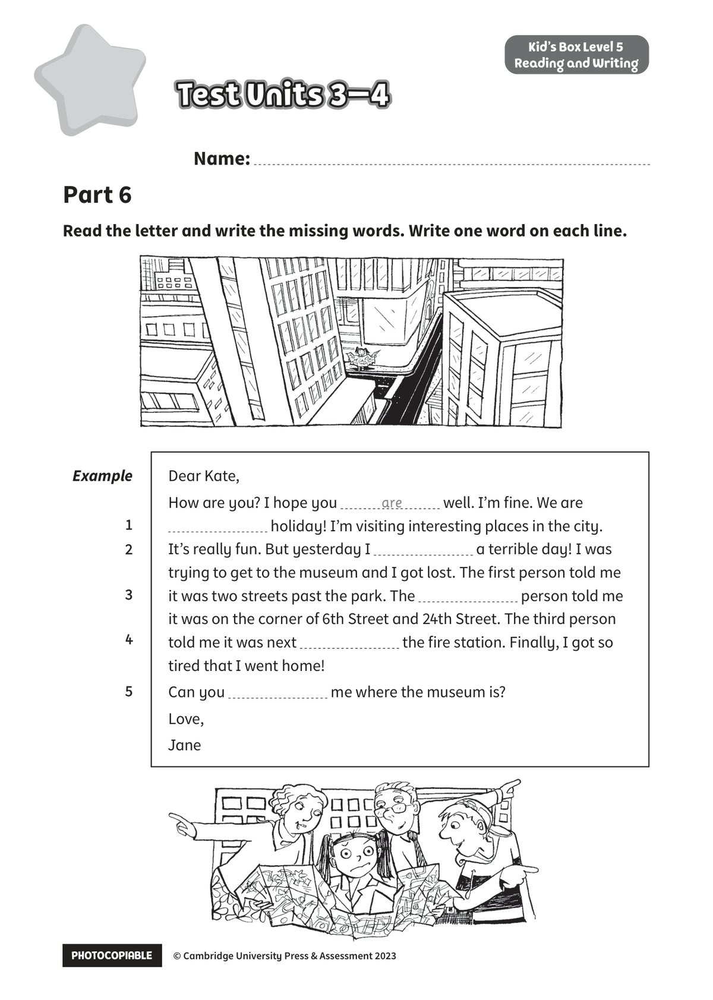

## 音频文件

- 🎧 [KidsBox_Level5_Test_Units_3-4_Listening_1_Audio_Track_21.mp3](KidsBox_Level5_Test_Units_3-4_Listening_1_Audio_Track_21.mp3)
- 🎧 [KidsBox_Level5_Test_Units_3-4_Listening_2_Audio_Track_22.mp3](KidsBox_Level5_Test_Units_3-4_Listening_2_Audio_Track_22.mp3)
- 🎧 [KidsBox_Level5_Test_Units_3-4_Listening_3_Audio_Track_23.mp3](KidsBox_Level5_Test_Units_3-4_Listening_3_Audio_Track_23.mp3)
- 🎧 [KidsBox_Level5_Test_Units_3-4_Listening_4_Audio_Track_24.mp3](KidsBox_Level5_Test_Units_3-4_Listening_4_Audio_Track_24.mp3)
- 🎧 [KidsBox_Level5_Test_Units_3-4_Listening_5_Audio_Track_25.mp3](KidsBox_Level5_Test_Units_3-4_Listening_5_Audio_Track_25.mp3)

## 第 1 页

PHOTOCOPIABLE        © Cambridge University Press & Assessment 2023
© Cambridge University Press & Assessment 2023
Name:
Part 6
Kid’s Box Level 5
Reading and Writing
Read the letter and write the missing words. Write one word on each line.
Test Units 3–4
Test Units 3–4
Test Units 3–4
Example
1
2
3
4
5
Dear Kate,
How are you? I hope you
well. I’m fine. We are
holiday! I’m visiting interesting places in the city.
It’s really fun. But yesterday I
a terrible day! I was
trying to get to the museum and I got lost. The first person told me
it was two streets past the park. The
person told me
it was on the corner of 6th Street and 24th Street. The third person
told me it was next
the fire station. Finally, I got so
tired that I went home!
Can you
me where the museum is?
Love,
Jane
are
