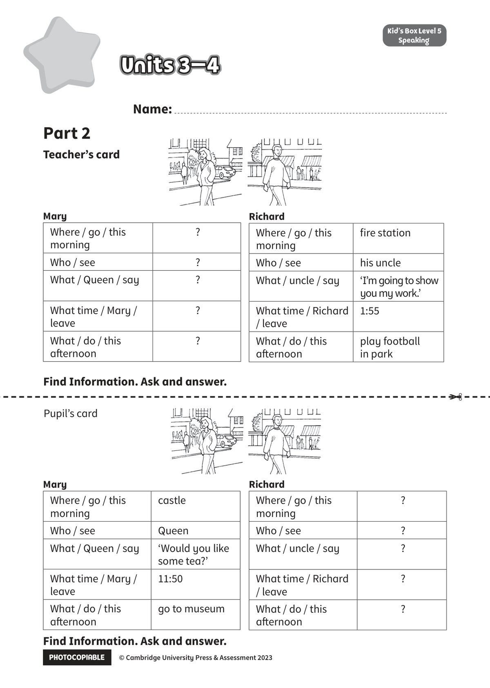

## 音频文件

- 🎧 [KidsBox_Level5_Test_Units_3-4_Listening_1_Audio_Track_21.mp3](KidsBox_Level5_Test_Units_3-4_Listening_1_Audio_Track_21.mp3)
- 🎧 [KidsBox_Level5_Test_Units_3-4_Listening_2_Audio_Track_22.mp3](KidsBox_Level5_Test_Units_3-4_Listening_2_Audio_Track_22.mp3)
- 🎧 [KidsBox_Level5_Test_Units_3-4_Listening_3_Audio_Track_23.mp3](KidsBox_Level5_Test_Units_3-4_Listening_3_Audio_Track_23.mp3)
- 🎧 [KidsBox_Level5_Test_Units_3-4_Listening_4_Audio_Track_24.mp3](KidsBox_Level5_Test_Units_3-4_Listening_4_Audio_Track_24.mp3)
- 🎧 [KidsBox_Level5_Test_Units_3-4_Listening_5_Audio_Track_25.mp3](KidsBox_Level5_Test_Units_3-4_Listening_5_Audio_Track_25.mp3)

## 第 1 页

PHOTOCOPIABLE        © Cambridge University Press & Assessment 2023
© Cambridge University Press & Assessment 2023
Units 3–4
Units 3–4
Units 3–4
Kid’s Box Level 2
Speaking
Kid’s Box Level 5
Speaking
Teacher’s card
Name:
Part 2
Mary
Where / go / this
morning
?
Who / see
?
What / Queen / say
?
What time / Mary /
leave
?
What / do / this
afternoon
?
Richard
Where / go / this
morning
fire station
Who / see
his uncle
What / uncle / say
‘I’m going to show
you my work.’
What time / Richard
/ leave
1:55
What / do / this
afternoon
play football
in park
Mary
Where / go / this
morning
castle
Who / see
Queen
What / Queen / say
‘Would you like
some tea?’
What time / Mary /
leave
11:50
What / do / this
afternoon
go to museum
Richard
Where / go / this
morning
?
Who / see
?
What / uncle / say
?
What time / Richard
/ leave
?
What / do / this
afternoon
?
Find Information. Ask and answer.
✂
Find Information. Ask and answer.
Pupil’s card
