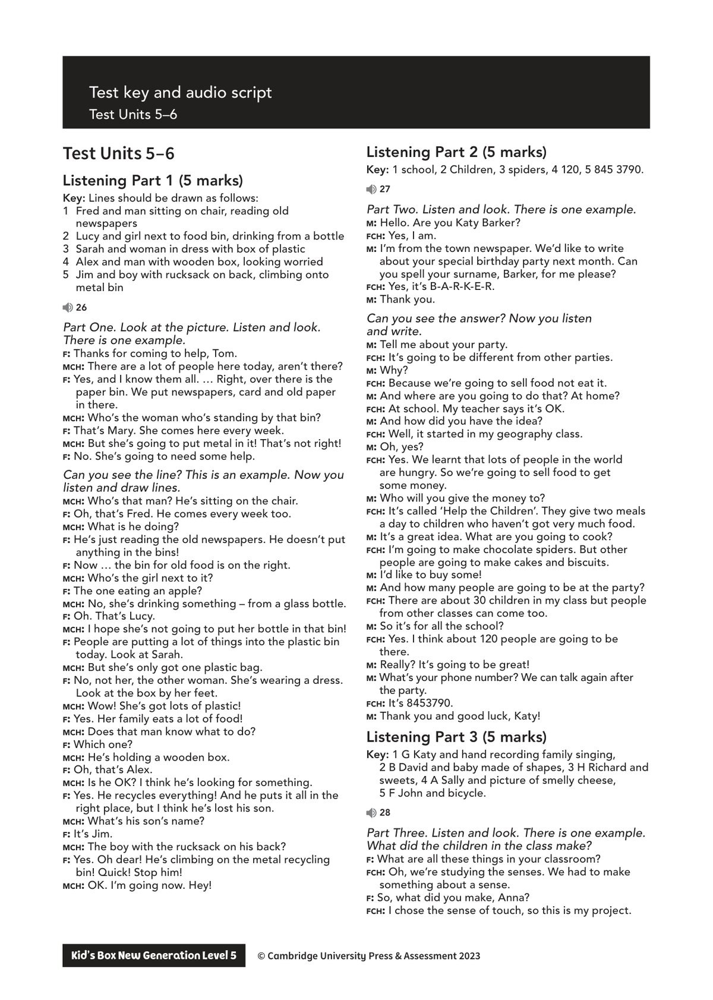
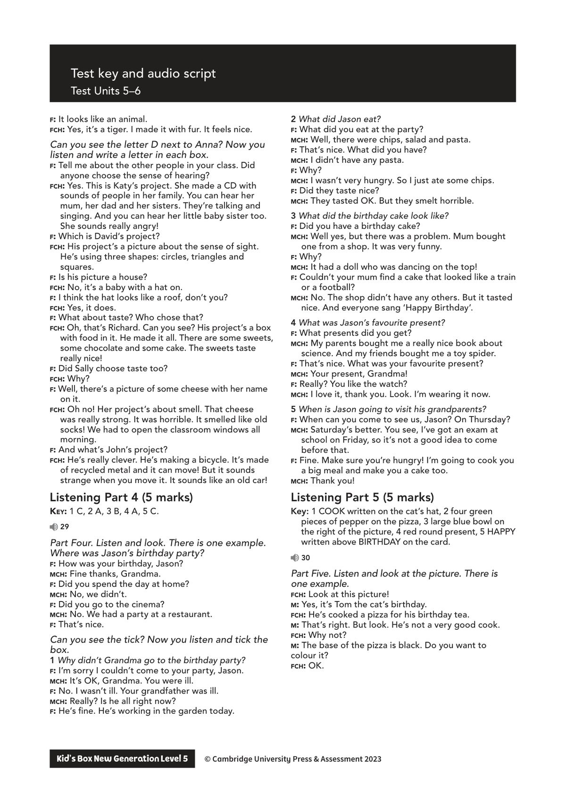
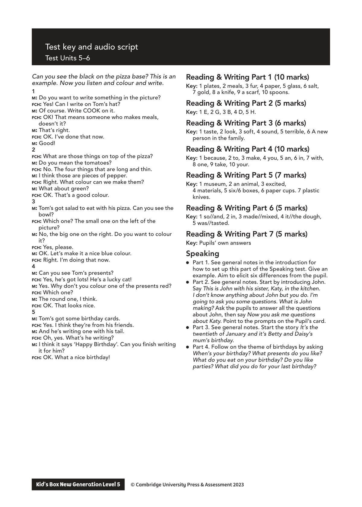

## 音频文件

- 🎧 [KidsBox_Level5_Test_Units_5-6_Listening_1_Audio_Track_26.mp3](KidsBox_Level5_Test_Units_5-6_Listening_1_Audio_Track_26.mp3)
- 🎧 [KidsBox_Level5_Test_Units_5-6_Listening_2_Audio_Track_27.mp3](KidsBox_Level5_Test_Units_5-6_Listening_2_Audio_Track_27.mp3)
- 🎧 [KidsBox_Level5_Test_Units_5-6_Listening_3_Audio_Track_28.mp3](KidsBox_Level5_Test_Units_5-6_Listening_3_Audio_Track_28.mp3)
- 🎧 [KidsBox_Level5_Test_Units_5-6_Listening_4_Audio_Track_29.mp3](KidsBox_Level5_Test_Units_5-6_Listening_4_Audio_Track_29.mp3)
- 🎧 [KidsBox_Level5_Test_Units_5-6_Listening_5_Audio_Track_30.mp3](KidsBox_Level5_Test_Units_5-6_Listening_5_Audio_Track_30.mp3)

## 第 1 页

Test key and audio script
Test Units 5–6
Kid’s Box New Generation Level 5        © Cambridge University Press & Assessment 2023
© Cambridge University Press & Assessment 2023
Test Units 5–6
Listening Part 1 (5 marks)
Key: Lines should be drawn as follows:
1	 Fred and man sitting on chair, reading old
newspapers
2	 Lucy and girl next to food bin, drinking from a bottle
3	 Sarah and woman in dress with box of plastic
4	 Alex and man with wooden box, looking worried
5	 Jim and boy with rucksack on back, climbing onto
metal bin
26
Part One. Look at the picture. Listen and look.
There is one example.
f: Thanks for coming to help, Tom.
mch: There are a lot of people here today, aren’t there?
f: Yes, and I know them all. … Right, over there is the
paper bin. We put newspapers, card and old paper
in there.
mch: Who’s the woman who’s standing by that bin?
f: That’s Mary. She comes here every week.
mch: But she’s going to put metal in it! That’s not right!
f: No. She’s going to need some help.
Can you see the line? This is an example. Now you
listen and draw lines.
mch: Who’s that man? He’s sitting on the chair.
f: Oh, that’s Fred. He comes every week too.
mch: What is he doing?
f: He’s just reading the old newspapers. He doesn’t put
anything in the bins!
f: Now … the bin for old food is on the right.
mch: Who’s the girl next to it?
f: The one eating an apple?
mch: No, she’s drinking something – from a glass bottle.
f: Oh. That’s Lucy.
mch: I hope she’s not going to put her bottle in that bin!
f: People are putting a lot of things into the plastic bin
today. Look at Sarah.
mch: But she’s only got one plastic bag.
f: No, not her, the other woman. She’s wearing a dress.
Look at the box by her feet.
mch: Wow! She’s got lots of plastic!
f: Yes. Her family eats a lot of food!
mch: Does that man know what to do?
f: Which one?
mch: He’s holding a wooden box.
f: Oh, that’s Alex.
mch: Is he OK? I think he’s looking for something.
f: Yes. He recycles everything! And he puts it all in the
right place, but I think he’s lost his son.
mch: What’s his son’s name?
f: It’s Jim.
mch: The boy with the rucksack on his back?
f: Yes. Oh dear! He’s climbing on the metal recycling
bin! Quick! Stop him!
mch: OK. I’m going now. Hey!
Listening Part 2 (5 marks)
Key: 1 school, 2 Children, 3 spiders, 4 120, 5 845 3790.
27
Part Two. Listen and look. There is one example.
m: Hello. Are you Katy Barker?
fch: Yes, I am.
m: I’m from the town newspaper. We’d like to write
about your special birthday party next month. Can
you spell your surname, Barker, for me please?
fch: Yes, it’s B-A-R-K-E-R.
m: Thank you.
Can you see the answer? Now you listen
and write.
m: Tell me about your party.
fch: It’s going to be different from other parties.
m: Why?
fch: Because we’re going to sell food not eat it.
m: And where are you going to do that? At home?
fch: At school. My teacher says it’s OK.
m: And how did you have the idea?
fch: Well, it started in my geography class.
m: Oh, yes?
fch: Yes. We learnt that lots of people in the world
are hungry. So we’re going to sell food to get
some money.
m: Who will you give the money to?
fch: It’s called ‘Help the Children’. They give two meals
a day to children who haven’t got very much food.
m: It’s a great idea. What are you going to cook?
fch: I’m going to make chocolate spiders. But other
people are going to make cakes and biscuits.
m: I’d like to buy some!
m: And how many people are going to be at the party?
fch: There are about 30 children in my class but people
from other classes can come too.
m: So it’s for all the school?
fch: Yes. I think about 120 people are going to be
there.
m: Really? It’s going to be great!
m: What’s your phone number? We can talk again after
the party.
fch: It’s 8453790.
m: Thank you and good luck, Katy!
Listening Part 3 (5 marks)
Key: 1 G Katy and hand recording family singing,
2 B David and baby made of shapes, 3 H Richard and
sweets, 4 A Sally and picture of smelly cheese,
5 F John and bicycle.
28
Part Three. Listen and look. There is one example.
What did the children in the class make?
f: What are all these things in your classroom?
fch: Oh, we’re studying the senses. We had to make
something about a sense.
f: So, what did you make, Anna?
fch: I chose the sense of touch, so this is my project.

## 第 2 页

Test key and audio script
Test Units 5–6
Kid’s Box New Generation Level 5        © Cambridge University Press & Assessment 2023
© Cambridge University Press & Assessment 2023
f: It looks like an animal.
fch: Yes, it’s a tiger. I made it with fur. It feels nice.
Can you see the letter D next to Anna? Now you
listen and write a letter in each box.
f: Tell me about the other people in your class. Did
anyone choose the sense of hearing?
fch: Yes. This is Katy’s project. She made a CD with
sounds of people in her family. You can hear her
mum, her dad and her sisters. They’re talking and
singing. And you can hear her little baby sister too.
She sounds really angry!
f: Which is David’s project?
fch: His project’s a picture about the sense of sight.
He’s using three shapes: circles, triangles and
squares.
f: Is his picture a house?
fch: No, it’s a baby with a hat on.
f: I think the hat looks like a roof, don’t you?
fch: Yes, it does.
f: What about taste? Who chose that?
fch: Oh, that’s Richard. Can you see? His project’s a box
with food in it. He made it all. There are some sweets,
some chocolate and some cake. The sweets taste
really nice!
f: Did Sally choose taste too?
fch: Why?
f: Well, there’s a picture of some cheese with her name
on it.
fch: Oh no! Her project’s about smell. That cheese
was really strong. It was horrible. It smelled like old
socks! We had to open the classroom windows all
morning.
f: And what’s John’s project?
fch: He’s really clever. He’s making a bicycle. It’s made
of recycled metal and it can move! But it sounds
strange when you move it. It sounds like an old car!
Listening Part 4 (5 marks)
Key: 1 C, 2 A, 3 B, 4 A, 5 C.
29
Part Four. Listen and look. There is one example.
Where was Jason’s birthday party?
f: How was your birthday, Jason?
mch: Fine thanks, Grandma.
f: Did you spend the day at home?
mch: No, we didn’t.
f: Did you go to the cinema?
mch: No. We had a party at a restaurant.
f: That’s nice.
Can you see the tick? Now you listen and tick the
box.
1 Why didn’t Grandma go to the birthday party?
f: I’m sorry I couldn’t come to your party, Jason.
mch: It’s OK, Grandma. You were ill.
f: No. I wasn’t ill. Your grandfather was ill.
mch: Really? Is he all right now?
f: He’s fine. He’s working in the garden today.
2 What did Jason eat?
f: What did you eat at the party?
mch: Well, there were chips, salad and pasta.
f: That’s nice. What did you have?
mch: I didn’t have any pasta.
f: Why?
mch: I wasn’t very hungry. So I just ate some chips.
f: Did they taste nice?
mch: They tasted OK. But they smelt horrible.
3 What did the birthday cake look like?
f: Did you have a birthday cake?
mch: Well yes, but there was a problem. Mum bought
one from a shop. It was very funny.
f: Why?
mch: It had a doll who was dancing on the top!
f: Couldn’t your mum find a cake that looked like a train
or a football?
mch: No. The shop didn’t have any others. But it tasted
nice. And everyone sang ‘Happy Birthday’.
4 What was Jason’s favourite present?
f: What presents did you get?
mch: My parents bought me a really nice book about
science. And my friends bought me a toy spider.
f: That’s nice. What was your favourite present?
mch: Your present, Grandma!
f: Really? You like the watch?
mch: I love it, thank you. Look. I’m wearing it now.
5 When is Jason going to visit his grandparents?
f: When can you come to see us, Jason? On Thursday?
mch: Saturday’s better. You see, I’ve got an exam at
school on Friday, so it’s not a good idea to come
before that.
f: Fine. Make sure you’re hungry! I’m going to cook you
a big meal and make you a cake too.
mch: Thank you!
Listening Part 5 (5 marks)
Key: 1 COOK written on the cat’s hat, 2 four green
pieces of pepper on the pizza, 3 large blue bowl on
the right of the picture, 4 red round present, 5 HAPPY
written above BIRTHDAY on the card.
30
Part Five. Listen and look at the picture. There is
one example.
fch: Look at this picture!
m: Yes, it’s Tom the cat’s birthday.
fch: He’s cooked a pizza for his birthday tea.
m: That’s right. But look. He’s not a very good cook.
fch: Why not?
m: The base of the pizza is black. Do you want to
colour it?
fch: OK.

## 第 3 页

Test key and audio script
Test Units 5–6
Kid’s Box New Generation Level 5        © Cambridge University Press & Assessment 2023
© Cambridge University Press & Assessment 2023
Can you see the black on the pizza base? This is an
example. Now you listen and colour and write.
1
m: Do you want to write something in the picture?
fch: Yes! Can I write on Tom’s hat?
m: Of course. Write COOK on it.
fch: OK! That means someone who makes meals,
doesn’t it?
m: That’s right.
fch: OK. I’ve done that now.
m: Good!
2
fch: What are those things on top of the pizza?
m: Do you mean the tomatoes?
fch: No. The four things that are long and thin.
m: I think those are pieces of pepper.
fch: Right. What colour can we make them?
m: What about green?
fch: OK. That’s a good colour.
3
m: Tom’s got salad to eat with his pizza. Can you see the
bowl?
fch: Which one? The small one on the left of the
picture?
m: No, the big one on the right. Do you want to colour
it?
fch: Yes, please.
m: OK. Let’s make it a nice blue colour.
fch: Right. I’m doing that now.
4
m: Can you see Tom’s presents?
fch: Yes, he’s got lots! He’s a lucky cat!
m: Yes. Why don’t you colour one of the presents red?
fch: Which one?
m: The round one, I think.
fch: OK. That looks nice.
5
m: Tom’s got some birthday cards.
fch: Yes. I think they’re from his friends.
m: And he’s writing one with his tail.
fch: Oh, yes. What’s he writing?
m: I think it says ‘Happy Birthday’. Can you finish writing
it for him?
fch: OK. What a nice birthday!
Reading & Writing Part 1 (10 marks)
Key: 1 plates, 2 meals, 3 fur, 4 paper, 5 glass, 6 salt,
7 gold, 8 a knife, 9 a scarf, 10 spoons.
Reading & Writing Part 2 (5 marks)
Key: 1 E, 2 G, 3 B, 4 D, 5 H.
Reading & Writing Part 3 (6 marks)
Key: 1 taste, 2 look, 3 soft, 4 sound, 5 terrible, 6 A new
person in the family.
Reading & Writing Part 4 (10 marks)
Key: 1 because, 2 to, 3 make, 4 you, 5 an, 6 in, 7 with,
8 one, 9 take, 10 your.
Reading & Writing Part 5 (7 marks)
Key: 1 museum, 2 an animal, 3 excited,
4 materials, 5 six/6 boxes, 6 paper cups. 7 plastic
knives.
Reading & Writing Part 6 (5 marks)
Key: 1 so//and, 2 in, 3 made//mixed, 4 it//the dough,
5 was//tasted.
Reading & Writing Part 7 (5 marks)
Key: Pupils’ own answers
Speaking
● Part 1. See general notes in the introduction for
how to set up this part of the Speaking test. Give an
example. Aim to elicit six differences from the pupil.
● Part 2. See general notes. Start by introducing John.
Say This is John with his sister, Katy, in the kitchen.
I don’t know anything about John but you do. I’m
going to ask you some questions. What is John
making? Ask the pupils to answer all the questions
about John, then say Now you ask me questions
about Katy. Point to the prompts on the Pupil’s card.
● Part 3. See general notes. Start the story It’s the
twentieth of January and it’s Betty and Daisy’s
mum’s birthday.
● Part 4. Follow on the theme of birthdays by asking
When’s your birthday? What presents do you like?
What do you eat on your birthday? Do you like
parties? What did you do for your last birthday?
