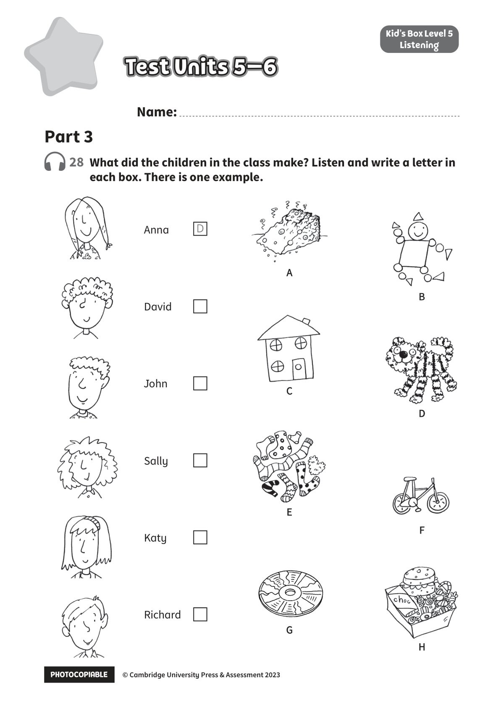

## 音频文件

- 🎧 [KidsBox_Level5_Test_Units_5-6_Listening_1_Audio_Track_26.mp3](KidsBox_Level5_Test_Units_5-6_Listening_1_Audio_Track_26.mp3)
- 🎧 [KidsBox_Level5_Test_Units_5-6_Listening_2_Audio_Track_27.mp3](KidsBox_Level5_Test_Units_5-6_Listening_2_Audio_Track_27.mp3)
- 🎧 [KidsBox_Level5_Test_Units_5-6_Listening_3_Audio_Track_28.mp3](KidsBox_Level5_Test_Units_5-6_Listening_3_Audio_Track_28.mp3)
- 🎧 [KidsBox_Level5_Test_Units_5-6_Listening_4_Audio_Track_29.mp3](KidsBox_Level5_Test_Units_5-6_Listening_4_Audio_Track_29.mp3)
- 🎧 [KidsBox_Level5_Test_Units_5-6_Listening_5_Audio_Track_30.mp3](KidsBox_Level5_Test_Units_5-6_Listening_5_Audio_Track_30.mp3)

## 第 1 页

PHOTOCOPIABLE        © Cambridge University Press & Assessment 2023
© Cambridge University Press & Assessment 2023
Test Units 5–6
Test Units 5–6
Test Units 5–6
Kid’s Box Level 5
Listening
28  What did the children in the class make? Listen and write a letter in
each box. There is one example.
Name:
Part 3
Anna
D
David
John
Sally
Katy
Richard
A
B
C
D
E
F
G
H
