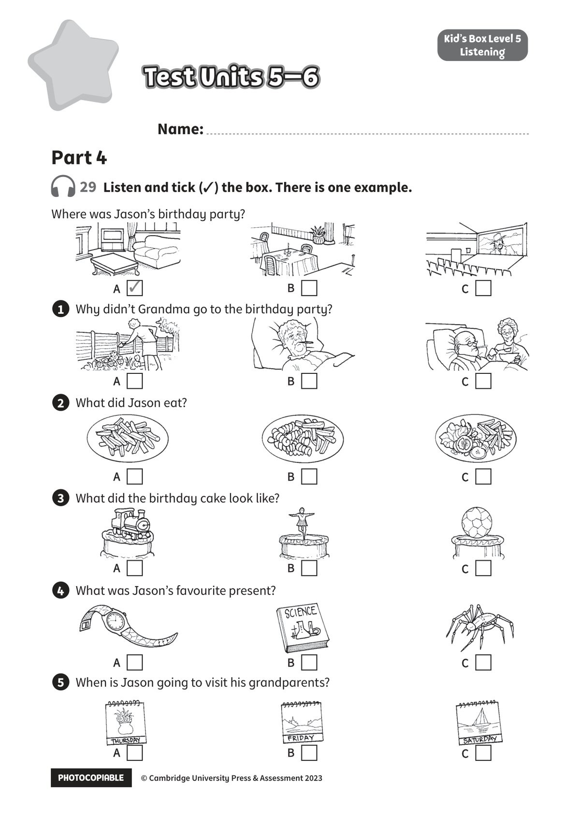

## 音频文件

- 🎧 [KidsBox_Level5_Test_Units_5-6_Listening_1_Audio_Track_26.mp3](KidsBox_Level5_Test_Units_5-6_Listening_1_Audio_Track_26.mp3)
- 🎧 [KidsBox_Level5_Test_Units_5-6_Listening_2_Audio_Track_27.mp3](KidsBox_Level5_Test_Units_5-6_Listening_2_Audio_Track_27.mp3)
- 🎧 [KidsBox_Level5_Test_Units_5-6_Listening_3_Audio_Track_28.mp3](KidsBox_Level5_Test_Units_5-6_Listening_3_Audio_Track_28.mp3)
- 🎧 [KidsBox_Level5_Test_Units_5-6_Listening_4_Audio_Track_29.mp3](KidsBox_Level5_Test_Units_5-6_Listening_4_Audio_Track_29.mp3)
- 🎧 [KidsBox_Level5_Test_Units_5-6_Listening_5_Audio_Track_30.mp3](KidsBox_Level5_Test_Units_5-6_Listening_5_Audio_Track_30.mp3)

## 第 1 页

PHOTOCOPIABLE        © Cambridge University Press & Assessment 2023
© Cambridge University Press & Assessment 2023
Test Units 5–6
Test Units 5–6
Test Units 5–6
Kid’s Box Level 5
Listening
29  Listen and tick (✓) the box. There is one example.
Name:
Part 4
Where was Jason’s birthday party?
1 	 Why didn’t Grandma go to the birthday party?
2 	 What did Jason eat?
3 	 What did the birthday cake look like?
4 	 What was Jason’s favourite present?
5 	 When is Jason going to visit his grandparents?
A  ✓
A
A
A
A
A
B
B
B
B
B
B
C
C
C
C
C
C
