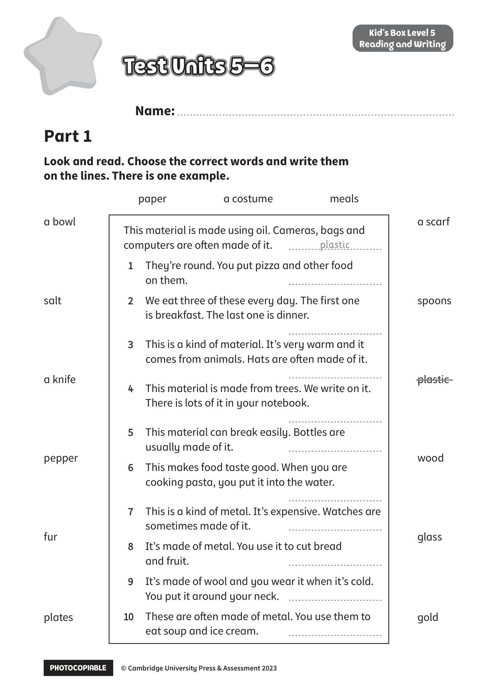

## 音频文件

- 🎧 [KidsBox_Level5_Test_Units_5-6_Listening_1_Audio_Track_26.mp3](KidsBox_Level5_Test_Units_5-6_Listening_1_Audio_Track_26.mp3)
- 🎧 [KidsBox_Level5_Test_Units_5-6_Listening_2_Audio_Track_27.mp3](KidsBox_Level5_Test_Units_5-6_Listening_2_Audio_Track_27.mp3)
- 🎧 [KidsBox_Level5_Test_Units_5-6_Listening_3_Audio_Track_28.mp3](KidsBox_Level5_Test_Units_5-6_Listening_3_Audio_Track_28.mp3)
- 🎧 [KidsBox_Level5_Test_Units_5-6_Listening_4_Audio_Track_29.mp3](KidsBox_Level5_Test_Units_5-6_Listening_4_Audio_Track_29.mp3)
- 🎧 [KidsBox_Level5_Test_Units_5-6_Listening_5_Audio_Track_30.mp3](KidsBox_Level5_Test_Units_5-6_Listening_5_Audio_Track_30.mp3)

## 第 1 页

PHOTOCOPIABLE        © Cambridge University Press & Assessment 2023
© Cambridge University Press & Assessment 2023
Name:
Part 1
Kid’s Box Level 5
Reading and Writing
Look and read. Choose the correct words and write them
on the lines. There is one example.
Test Units 5–6
Test Units 5–6
Test Units 5–6
paper          a costume          meals
This material is made using oil. Cameras, bags and
computers are often made of it.
1
They’re round. You put pizza and other food
on them.
2
We eat three of these every day. The first one
is breakfast. The last one is dinner.

3
This is a kind of material. It’s very warm and it
comes from animals. Hats are often made of it.

4
This material is made from trees. We write on it.
There is lots of it in your notebook.

5
This material can break easily. Bottles are
usually made of it.
6
This makes food taste good. When you are
cooking pasta, you put it into the water.

7
This is a kind of metal. It’s expensive. Watches are
sometimes made of it.
8
It’s made of metal. You use it to cut bread
and fruit.
9
It’s made of wool and you wear it when it’s cold.
You put it around your neck.
10
10
These are often made of metal. You use them to
eat soup and ice cream.
plastic
a scarf
spoons
plastic
wood
glass
gold
a bowl
salt
a knife
pepper
fur
plates
