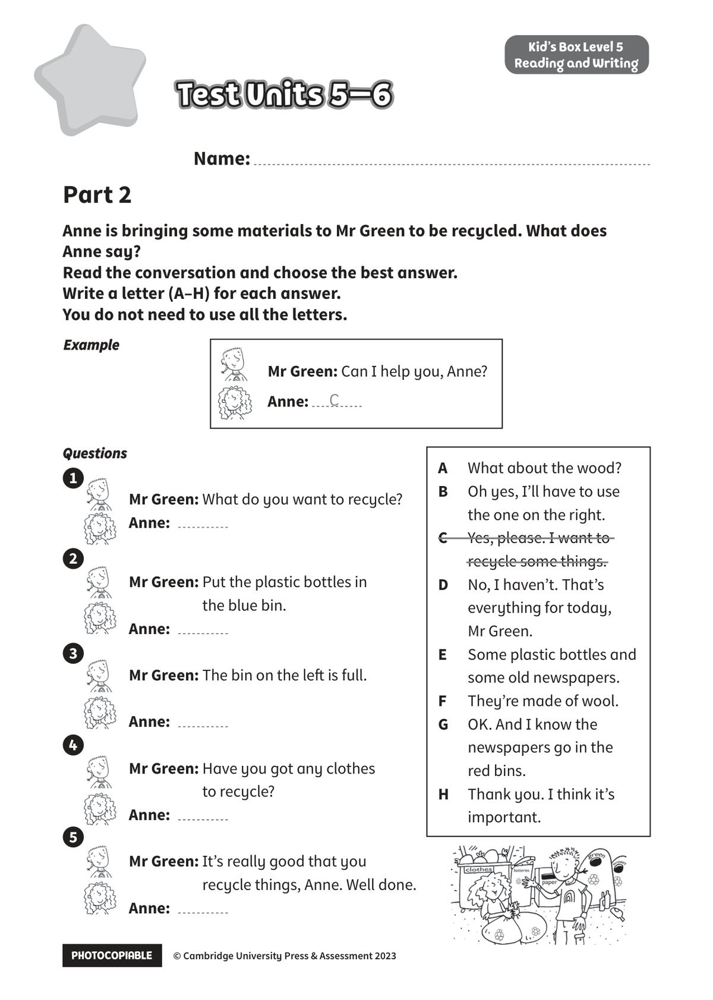

## 音频文件

- 🎧 [KidsBox_Level5_Test_Units_5-6_Listening_1_Audio_Track_26.mp3](KidsBox_Level5_Test_Units_5-6_Listening_1_Audio_Track_26.mp3)
- 🎧 [KidsBox_Level5_Test_Units_5-6_Listening_2_Audio_Track_27.mp3](KidsBox_Level5_Test_Units_5-6_Listening_2_Audio_Track_27.mp3)
- 🎧 [KidsBox_Level5_Test_Units_5-6_Listening_3_Audio_Track_28.mp3](KidsBox_Level5_Test_Units_5-6_Listening_3_Audio_Track_28.mp3)
- 🎧 [KidsBox_Level5_Test_Units_5-6_Listening_4_Audio_Track_29.mp3](KidsBox_Level5_Test_Units_5-6_Listening_4_Audio_Track_29.mp3)
- 🎧 [KidsBox_Level5_Test_Units_5-6_Listening_5_Audio_Track_30.mp3](KidsBox_Level5_Test_Units_5-6_Listening_5_Audio_Track_30.mp3)

## 第 1 页

PHOTOCOPIABLE        © Cambridge University Press & Assessment 2023
© Cambridge University Press & Assessment 2023
Name:
Part 2
Kid’s Box Level 5
Reading and Writing
Anne is bringing some materials to Mr Green to be recycled. What does
Anne say?
Read the conversation and choose the best answer.
Write a letter (A–H) for each answer.
You do not need to use all the letters.
Test Units 5–6
Test Units 5–6
Test Units 5–6
Example
Example
Questions
Questions
Mr Green: What do you want to recycle?
Anne:
Mr Green: Put the plastic bottles in
the blue bin.
Anne:
Mr Green: The bin on the left is full.
Anne:
Mr Green: Have you got any clothes
to recycle?
Anne:
Mr Green: It’s really good that you
recycle things, Anne. Well done.
Anne:
A
What about the wood?
B
Oh yes, I’ll have to use
the one on the right.
C
Yes, please. I want to
recycle some things.
D
No, I haven’t. That’s
everything for today,
Mr Green.
E
Some plastic bottles and
some old newspapers.
F
They’re made of wool.
G
OK. And I know the
newspapers go in the
red bins.
H
Thank you. I think it’s
important.
Mr Green: Can I help you, Anne?
Anne:
C
1
2
3
4
5
