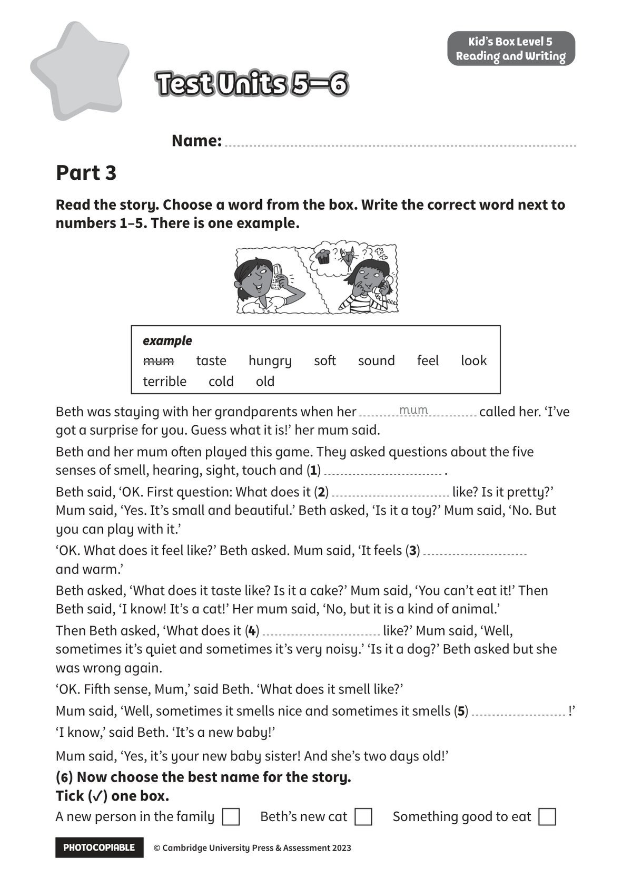

## 音频文件

- 🎧 [KidsBox_Level5_Test_Units_5-6_Listening_1_Audio_Track_26.mp3](KidsBox_Level5_Test_Units_5-6_Listening_1_Audio_Track_26.mp3)
- 🎧 [KidsBox_Level5_Test_Units_5-6_Listening_2_Audio_Track_27.mp3](KidsBox_Level5_Test_Units_5-6_Listening_2_Audio_Track_27.mp3)
- 🎧 [KidsBox_Level5_Test_Units_5-6_Listening_3_Audio_Track_28.mp3](KidsBox_Level5_Test_Units_5-6_Listening_3_Audio_Track_28.mp3)
- 🎧 [KidsBox_Level5_Test_Units_5-6_Listening_4_Audio_Track_29.mp3](KidsBox_Level5_Test_Units_5-6_Listening_4_Audio_Track_29.mp3)
- 🎧 [KidsBox_Level5_Test_Units_5-6_Listening_5_Audio_Track_30.mp3](KidsBox_Level5_Test_Units_5-6_Listening_5_Audio_Track_30.mp3)

## 第 1 页

PHOTOCOPIABLE    © Cambridge University Press & Assessment 2023
© Cambridge University Press & Assessment 2023
Name:
Part 3
Kid’s Box Level 5
Reading and Writing
Read the story. Choose a word from the box. Write the correct word next to
numbers 1–5. There is one example.
Test Units 5–6
Test Units 5–6
Test Units 5–6
Test Units 5–6
Test Units 5–6
Beth was staying with her grandparents when her
called her. ‘I’ve
got a surprise for you. Guess what it is!’ her mum said.
Beth and her mum of en played this game. They asked questions about the five
senses of smell, hearing, sight, touch and (1)
.
Beth said, ‘OK. First question: What does it (2)
like? Is it pretty?’
Mum said, ‘Yes. It’s small and beautiful.’ Beth asked, ‘Is it a toy?’ Mum said, ‘No. But
you can play with it.’
‘OK. What does it feel like?’ Beth asked. Mum said, ‘It feels (3)
and warm.’
Beth asked, ‘What does it taste like? Is it a cake?’ Mum said, ‘You can’t eat it!’ Then
Beth said, ‘I know! It’s a cat!’ Her mum said, ‘No, but it is a kind of animal.’
Then Beth asked, ‘What does it (4)
like?’ Mum said, ‘Well,
sometimes it’s quiet and sometimes it’s very noisy.’ ‘Is it a dog?’ Beth asked but she
was wrong again.
‘OK. Fif h sense, Mum,’ said Beth. ‘What does it smell like?’
Mum said, ‘Well, sometimes it smells nice and sometimes it smells (5)
!’
‘I know,’ said Beth. ‘It’s a new baby!’
Mum said, ‘Yes, it’s your new baby sister! And she’s two days old!’
(6) Now choose the best name for the story.
Tick (✓) one box.
A new person in the family
Beth’s new cat
Something good to eat
mum
example
example
mum   taste   hungry   sof    sound   feel   look
terrible   cold   old
