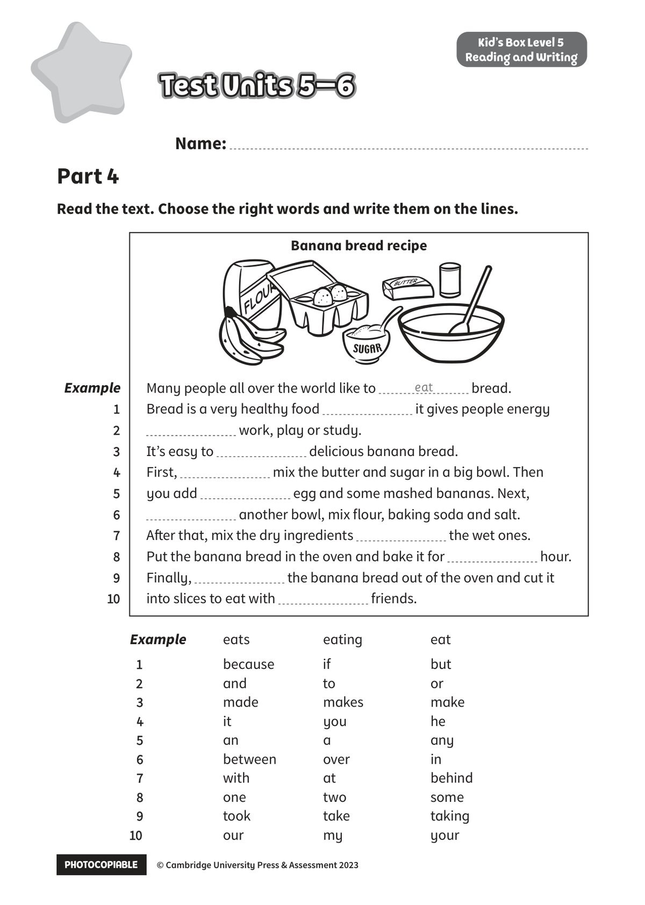

## 音频文件

- 🎧 [KidsBox_Level5_Test_Units_5-6_Listening_1_Audio_Track_26.mp3](KidsBox_Level5_Test_Units_5-6_Listening_1_Audio_Track_26.mp3)
- 🎧 [KidsBox_Level5_Test_Units_5-6_Listening_2_Audio_Track_27.mp3](KidsBox_Level5_Test_Units_5-6_Listening_2_Audio_Track_27.mp3)
- 🎧 [KidsBox_Level5_Test_Units_5-6_Listening_3_Audio_Track_28.mp3](KidsBox_Level5_Test_Units_5-6_Listening_3_Audio_Track_28.mp3)
- 🎧 [KidsBox_Level5_Test_Units_5-6_Listening_4_Audio_Track_29.mp3](KidsBox_Level5_Test_Units_5-6_Listening_4_Audio_Track_29.mp3)
- 🎧 [KidsBox_Level5_Test_Units_5-6_Listening_5_Audio_Track_30.mp3](KidsBox_Level5_Test_Units_5-6_Listening_5_Audio_Track_30.mp3)

## 第 1 页

PHOTOCOPIABLE        © Cambridge University Press & Assessment 2023
© Cambridge University Press & Assessment 2023
Name:
Part 4
Kid’s Box Level 5
Reading and Writing
Read the text. Choose the right words and write them on the lines.
Test Units 5–6
Test Units 5–6
Test Units 5–6
Banana bread recipe
Example
eats
eating
eat
1
1
because
if
but
2
2
and
to
or
3
made
makes
make
4
it
you
he
5
an
a
any
6
between
over
in
7
with
at
behind
8
one
two
some
9
took
take
taking
10
10
our
my
your
Many people all over the world like to
bread.
Bread is a very healthy food
it gives people energy
work, play or study.
It’s easy to
delicious banana bread.
First,
mix the butter and sugar in a big bowl. Then
you add
egg and some mashed bananas. Next,
another bowl, mix flour, baking soda and salt.
After that, mix the dry ingredients
the wet ones.
Put the banana bread in the oven and bake it for
hour.
Finally,
the banana bread out of the oven and cut it
into slices to eat with
friends.
eat
Example
1 1
2
2
3
3
4
4
5
5
6
6
7
8
8
9
9
10
10
