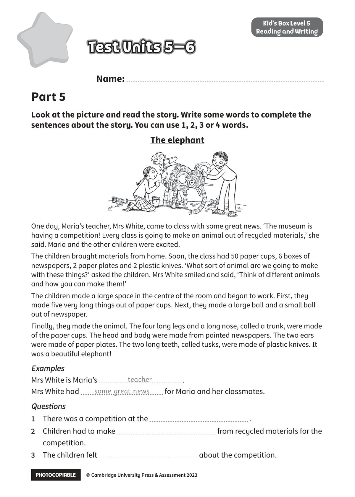
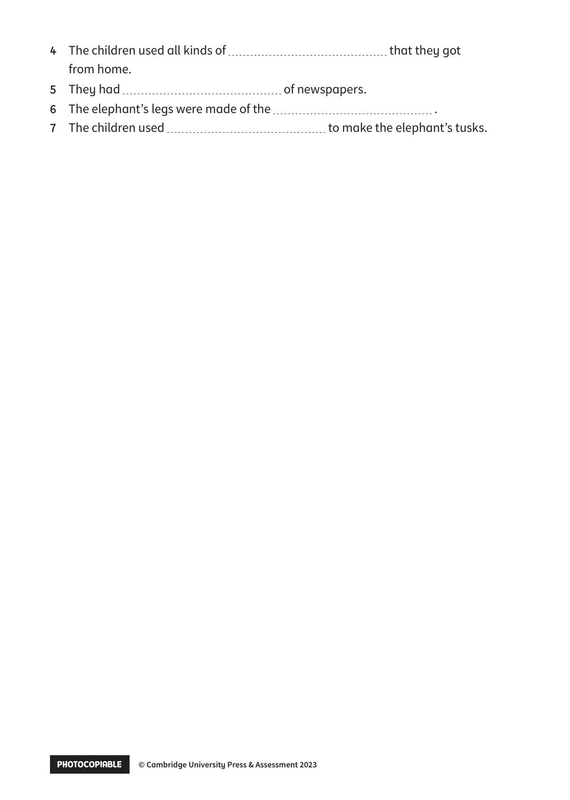

## 音频文件

- 🎧 [KidsBox_Level5_Test_Units_5-6_Listening_1_Audio_Track_26.mp3](KidsBox_Level5_Test_Units_5-6_Listening_1_Audio_Track_26.mp3)
- 🎧 [KidsBox_Level5_Test_Units_5-6_Listening_2_Audio_Track_27.mp3](KidsBox_Level5_Test_Units_5-6_Listening_2_Audio_Track_27.mp3)
- 🎧 [KidsBox_Level5_Test_Units_5-6_Listening_3_Audio_Track_28.mp3](KidsBox_Level5_Test_Units_5-6_Listening_3_Audio_Track_28.mp3)
- 🎧 [KidsBox_Level5_Test_Units_5-6_Listening_4_Audio_Track_29.mp3](KidsBox_Level5_Test_Units_5-6_Listening_4_Audio_Track_29.mp3)
- 🎧 [KidsBox_Level5_Test_Units_5-6_Listening_5_Audio_Track_30.mp3](KidsBox_Level5_Test_Units_5-6_Listening_5_Audio_Track_30.mp3)

## 第 1 页

PHOTOCOPIABLE        © Cambridge University Press & Assessment 2023
© Cambridge University Press & Assessment 2023
Name:
Part 5
Kid’s Box Level 5
Reading and Writing
Look at the picture and read the story. Write some words to complete the
sentences about the story. You can use 1, 2, 3 or 4 words.
Test Units 5–6
Test Units 5–6
Test Units 5–6
The elephant
One day, Maria’s teacher, Mrs White, came to class with some great news. ‘The museum is
having a competition! Every class is going to make an animal out of recycled materials,’ she
said. Maria and the other children were excited.
The children brought materials from home. Soon, the class had 50 paper cups, 6 boxes of
newspapers, 2 paper plates and 2 plastic knives. ‘What sort of animal are we going to make
with these things?’ asked the children. Mrs White smiled and said, ‘Think of different animals
and how you can make them!’
The children made a large space in the centre of the room and began to work. First, they
made five very long things out of paper cups. Next, they made a large ball and a small ball
out of newspaper.
Finally, they made the animal. The four long legs and a long nose, called a trunk, were made
of the paper cups. The head and body were made from painted newspapers. The two ears
were made of paper plates. The two long teeth, called tusks, were made of plastic knives. It
was a beautiful elephant!
Examples
Examples
Mrs White is Maria’s
.
Mrs White had
for Maria and her classmates.
Questions
Questions
1	 There was a competition at the
.
2	 Children had to make
from recycled materials for the
competition.
3	 The children felt
about the competition.
teacher
some great news

## 第 2 页

PHOTOCOPIABLE        © Cambridge University Press & Assessment 2023
© Cambridge University Press & Assessment 2023
4	 The children used all kinds of
that they got
from home.
5	 They had
of newspapers.
6	 The elephant’s legs were made of the
.
7	 The children used
to make the elephant’s tusks.
