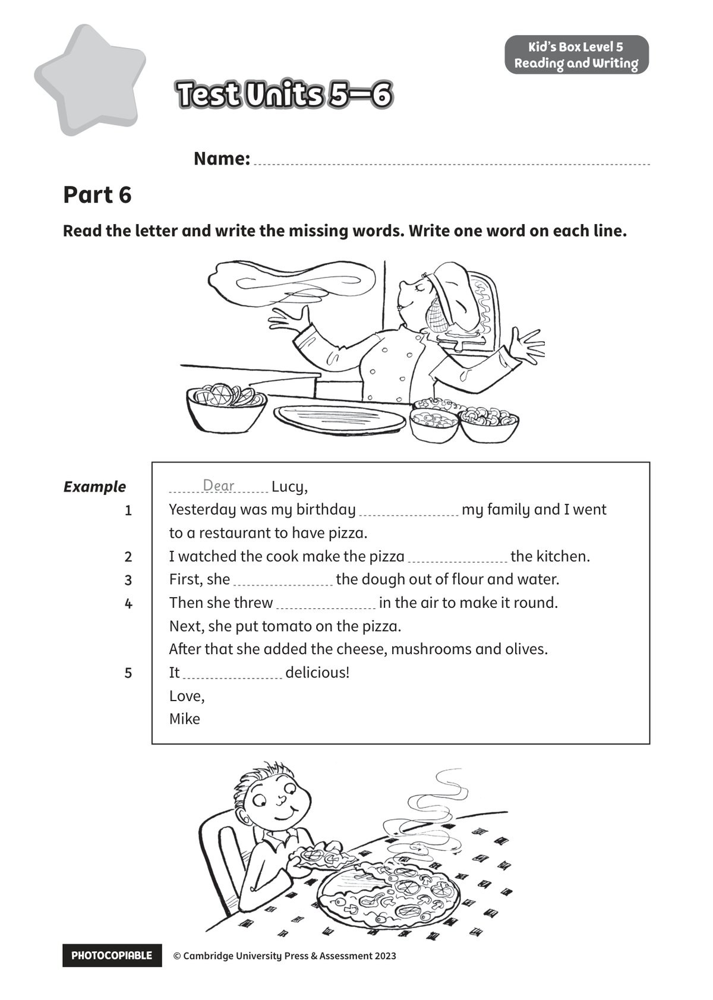

## 音频文件

- 🎧 [KidsBox_Level5_Test_Units_5-6_Listening_1_Audio_Track_26.mp3](KidsBox_Level5_Test_Units_5-6_Listening_1_Audio_Track_26.mp3)
- 🎧 [KidsBox_Level5_Test_Units_5-6_Listening_2_Audio_Track_27.mp3](KidsBox_Level5_Test_Units_5-6_Listening_2_Audio_Track_27.mp3)
- 🎧 [KidsBox_Level5_Test_Units_5-6_Listening_3_Audio_Track_28.mp3](KidsBox_Level5_Test_Units_5-6_Listening_3_Audio_Track_28.mp3)
- 🎧 [KidsBox_Level5_Test_Units_5-6_Listening_4_Audio_Track_29.mp3](KidsBox_Level5_Test_Units_5-6_Listening_4_Audio_Track_29.mp3)
- 🎧 [KidsBox_Level5_Test_Units_5-6_Listening_5_Audio_Track_30.mp3](KidsBox_Level5_Test_Units_5-6_Listening_5_Audio_Track_30.mp3)

## 第 1 页

PHOTOCOPIABLE        © Cambridge University Press & Assessment 2023
© Cambridge University Press & Assessment 2023
Name:
Part 6
Kid’s Box Level 5
Reading and Writing
Read the letter and write the missing words. Write one word on each line.
Test Units 5–6
Test Units 5–6
Test Units 5–6
Example
1
2
2
3
3
4
5
Lucy,
Yesterday was my birthday
my family and I went
to a restaurant to have pizza.
I watched the cook make the pizza
the kitchen.
First, she
the dough out of flour and water.
Then she threw
in the air to make it round.
Next, she put tomato on the pizza.
After that she added the cheese, mushrooms and olives.
It
delicious!
Love,
Mike
Dear
