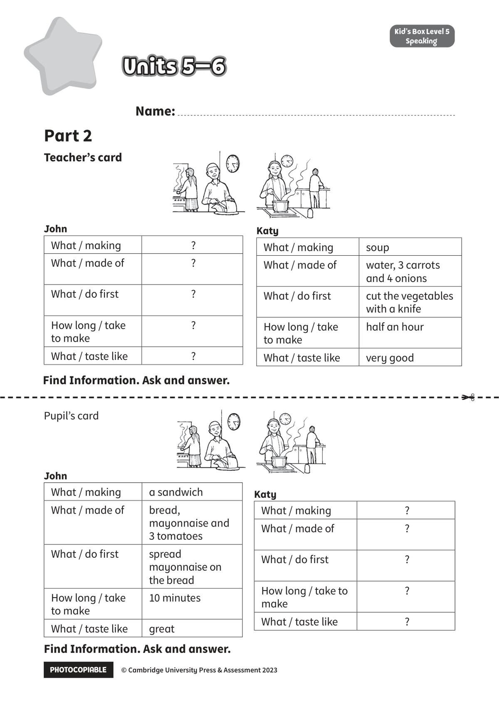

## 音频文件

- 🎧 [KidsBox_Level5_Test_Units_5-6_Listening_1_Audio_Track_26.mp3](KidsBox_Level5_Test_Units_5-6_Listening_1_Audio_Track_26.mp3)
- 🎧 [KidsBox_Level5_Test_Units_5-6_Listening_2_Audio_Track_27.mp3](KidsBox_Level5_Test_Units_5-6_Listening_2_Audio_Track_27.mp3)
- 🎧 [KidsBox_Level5_Test_Units_5-6_Listening_3_Audio_Track_28.mp3](KidsBox_Level5_Test_Units_5-6_Listening_3_Audio_Track_28.mp3)
- 🎧 [KidsBox_Level5_Test_Units_5-6_Listening_4_Audio_Track_29.mp3](KidsBox_Level5_Test_Units_5-6_Listening_4_Audio_Track_29.mp3)
- 🎧 [KidsBox_Level5_Test_Units_5-6_Listening_5_Audio_Track_30.mp3](KidsBox_Level5_Test_Units_5-6_Listening_5_Audio_Track_30.mp3)

## 第 1 页

PHOTOCOPIABLE        © Cambridge University Press & Assessment 2023
© Cambridge University Press & Assessment 2023
Units 5–6
Units 5–6
Units 5–6
Kid’s Box Level 2
Speaking
Kid’s Box Level 5
Speaking
Teacher’s card
Name:
Part 2
John
What / making
?
What / made of
?
What / do first
?
How long / take
to make
?
What / taste like
?
Katy
What / making
soup
What / made of
water, 3 carrots
and 4 onions
What / do first
cut the vegetables
with a knife
How long / take
to make
half an hour
What / taste like
very good
John
What / making
a sandwich
What / made of
bread,
mayonnaise and
3 tomatoes
What / do first
spread
mayonnaise on
the bread
How long / take
to make
10 minutes
What / taste like
great
Katy
What / making
?
What / made of
?
What / do first
?
How long / take to
make
?
What / taste like
?
Find Information. Ask and answer.
Find Information. Ask and answer.
Pupil’s card
✂
