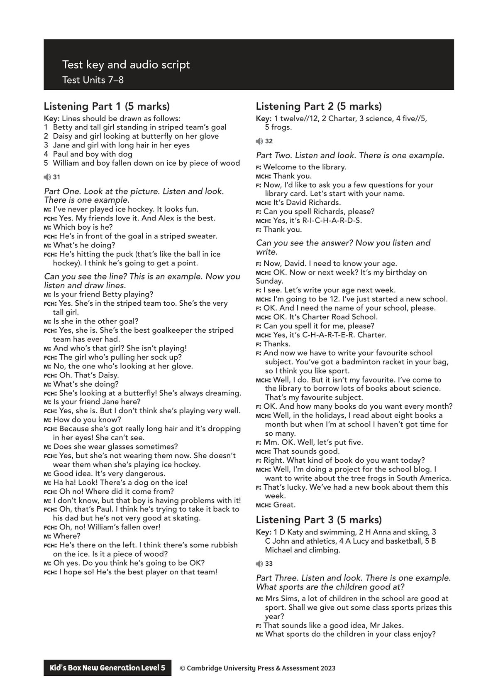
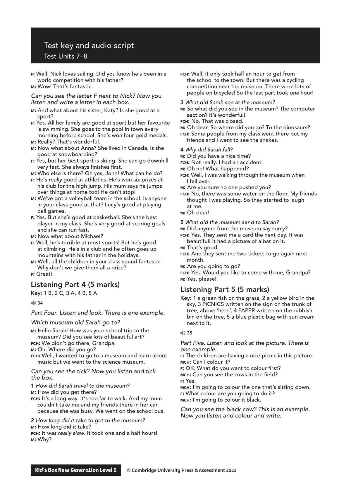
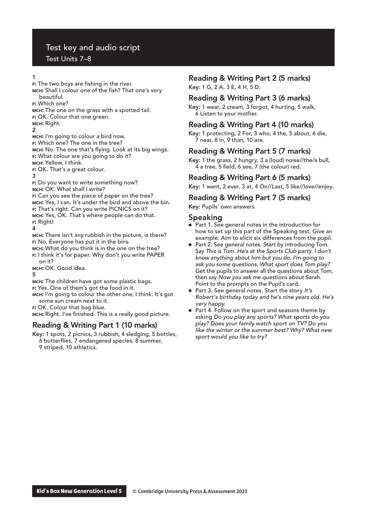

## 音频文件

- 🎧 [KidsBox_Level5_Test_Units_7-8_Listening_1_Audio_Track_31.mp3](KidsBox_Level5_Test_Units_7-8_Listening_1_Audio_Track_31.mp3)
- 🎧 [KidsBox_Level5_Test_Units_7-8_Listening_2_Audio_Track_32.mp3](KidsBox_Level5_Test_Units_7-8_Listening_2_Audio_Track_32.mp3)
- 🎧 [KidsBox_Level5_Test_Units_7-8_Listening_3_Audio_Track_33.mp3](KidsBox_Level5_Test_Units_7-8_Listening_3_Audio_Track_33.mp3)
- 🎧 [KidsBox_Level5_Test_Units_7-8_Listening_4_Audio_Track_34.mp3](KidsBox_Level5_Test_Units_7-8_Listening_4_Audio_Track_34.mp3)
- 🎧 [KidsBox_Level5_Test_Units_7-8_Listening_5_Audio_Track_35.mp3](KidsBox_Level5_Test_Units_7-8_Listening_5_Audio_Track_35.mp3)

## 第 1 页

Test key and audio script
Test Units 7–8
Kid’s Box New Generation Level 5        © Cambridge University Press & Assessment 2023
© Cambridge University Press & Assessment 2023
Listening Part 1 (5 marks)
Key: Lines should be drawn as follows:
1	 Betty and tall girl standing in striped team’s goal
2	 Daisy and girl looking at butterfly on her glove
3	 Jane and girl with long hair in her eyes
4	 Paul and boy with dog
5	 William and boy fallen down on ice by piece of wood
31
Part One. Look at the picture. Listen and look.
There is one example.
m: I’ve never played ice hockey. It looks fun.
fch: Yes. My friends love it. And Alex is the best.
m: Which boy is he?
fch: He’s in front of the goal in a striped sweater.
m: What’s he doing?
fch: He’s hitting the puck (that’s like the ball in ice
hockey). I think he’s going to get a point.
Can you see the line? This is an example. Now you
listen and draw lines.
m: Is your friend Betty playing?
fch: Yes. She’s in the striped team too. She’s the very
tall girl.
m: Is she in the other goal?
fch: Yes, she is. She’s the best goalkeeper the striped
team has ever had.
m: And who’s that girl? She isn’t playing!
fch: The girl who’s pulling her sock up?
m: No, the one who’s looking at her glove.
fch: Oh. That’s Daisy.
m: What’s she doing?
fch: She’s looking at a butterfly! She’s always dreaming.
m: Is your friend Jane here?
fch: Yes, she is. But I don’t think she’s playing very well.
m: How do you know?
fch: Because she’s got really long hair and it’s dropping
in her eyes! She can’t see.
m: Does she wear glasses sometimes?
fch: Yes, but she’s not wearing them now. She doesn’t
wear them when she’s playing ice hockey.
m: Good idea. It’s very dangerous.
m: Ha ha! Look! There’s a dog on the ice!
fch: Oh no! Where did it come from?
m: I don’t know, but that boy is having problems with it!
fch: Oh, that’s Paul. I think he’s trying to take it back to
his dad but he’s not very good at skating.
fch: Oh, no! William’s fallen over!
m: Where?
fch: He’s there on the left. I think there’s some rubbish
on the ice. Is it a piece of wood?
m: Oh yes. Do you think he’s going to be OK?
fch: I hope so! He’s the best player on that team!
Listening Part 2 (5 marks)
Key: 1 twelve//12, 2 Charter, 3 science, 4 five//5,
5 frogs.
32
Part Two. Listen and look. There is one example.
f: Welcome to the library.
mch: Thank you.
f: Now, I’d like to ask you a few questions for your
library card. Let’s start with your name.
mch: It’s David Richards.
f: Can you spell Richards, please?
mch: Yes, it’s R-I-C-H-A-R-D-S.
f: Thank you.
Can you see the answer? Now you listen and
write.
f: Now, David. I need to know your age.
mch: OK. Now or next week? It’s my birthday on
Sunday.
f: I see. Let’s write your age next week.
mch: I’m going to be 12. I’ve just started a new school.
f: OK. And I need the name of your school, please.
mch: OK. It’s Charter Road School.
f: Can you spell it for me, please?
mch: Yes, it’s C-H-A-R-T-E-R. Charter.
f: Thanks.
f: And now we have to write your favourite school
subject. You’ve got a badminton racket in your bag,
so I think you like sport.
mch: Well, I do. But it isn’t my favourite. I’ve come to
the library to borrow lots of books about science.
That’s my favourite subject.
f: OK. And how many books do you want every month?
mch: Well, in the holidays, I read about eight books a
month but when I’m at school I haven’t got time for
so many.
f: Mm. OK. Well, let’s put five.
mch: That sounds good.
f: Right. What kind of book do you want today?
mch: Well, I’m doing a project for the school blog. I
want to write about the tree frogs in South America.
f: That’s lucky. We’ve had a new book about them this
week.
mch: Great.
Listening Part 3 (5 marks)
Key: 1 D Katy and swimming, 2 H Anna and skiing, 3
C John and athletics, 4 A Lucy and basketball, 5 B
Michael and climbing.
33
Part Three. Listen and look. There is one example.
What sports are the children good at?
m: Mrs Sims, a lot of children in the school are good at
sport. Shall we give out some class sports prizes this
year?
f: That sounds like a good idea, Mr Jakes.
m: What sports do the children in your class enjoy?

## 第 2 页

Test key and audio script
Test Units 7–8
Kid’s Box New Generation Level 5        © Cambridge University Press & Assessment 2023
© Cambridge University Press & Assessment 2023
f: Well, Nick loves sailing. Did you know he’s been in a
world competition with his father?
m: Wow! That’s fantastic.
Can you see the letter F next to Nick? Now you
listen and write a letter in each box.
m: And what about his sister, Katy? Is she good at a
sport?
f: Yes. All her family are good at sport but her favourite
is swimming. She goes to the pool in town every
morning before school. She’s won four gold medals.
m: Really? That’s wonderful.
m: Now what about Anna? She lived in Canada, is she
good at snowboarding?
f: Yes, but her best sport is skiing. She can go downhill
very fast. She always finishes first.
m: Who else is there? Oh yes, John! What can he do?
f: He’s really good at athletics. He’s won six prizes at
his club for the high jump. His mum says he jumps
over things at home too! He can’t stop!
m: We’ve got a volleyball team in the school. Is anyone
in your class good at that? Lucy’s good at playing
ball games.
f: Yes. But she’s good at basketball. She’s the best
player in my class. She’s very good at scoring goals
and she can run fast.
m: Now what about Michael?
f: Well, he’s terrible at most sports! But he’s good
at climbing. He’s in a club and he often goes up
mountains with his father in the holidays.
m: Well, all the children in your class sound fantastic.
Why don’t we give them all a prize?
f: Great!
Listening Part 4 (5 marks)
Key: 1 B, 2 C, 3 A, 4 B, 5 A.
34
Part Four. Listen and look. There is one example.
Which museum did Sarah go to?
m: Hello Sarah! How was your school trip to the
museum? Did you see lots of beautiful art?
fch: We didn’t go there, Grandpa.
m: Oh. Where did you go?
fch: Well, I wanted to go to a museum and learn about
music but we went to the science museum.
Can you see the tick? Now you listen and tick
the box.
1 How did Sarah travel to the museum?
m: How did you get there?
fch: It’s a long way. It’s too far to walk. And my mum
couldn’t take me and my friends there in her car
because she was busy. We went on the school bus.
2 How long did it take to get to the museum?
m: How long did it take?
fch: It was really slow. It took one and a half hours!
m: Why?
fch: Well, it only took half an hour to get from
the school to the town. But there was a cycling
competition near the museum. There were lots of
people on bicycles! So the last part took one hour!
3 What did Sarah see at the museum?
m: So what did you see in the museum? The computer
section? It’s wonderful!
fch: No. That was closed.
m: Oh dear. So where did you go? To the dinosaurs?
fch: Some people from my class went there but my
friends and I went to see the snakes.
4 Why did Sarah fall?
m: Did you have a nice time?
fch: Not really. I had an accident.
m: Oh no! What happened?
fch: Well, I was walking through the museum when
I fell over.
m: Are you sure no one pushed you?
fch: No, there was some water on the floor. My friends
thought I was playing. So they started to laugh
at me.
m: Oh dear!
5 What did the museum send to Sarah?
m: Did anyone from the museum say sorry?
fch: Yes. They sent me a card the next day. It was
beautiful! It had a picture of a bat on it.
m: That’s good.
fch: And they sent me two tickets to go again next
month.
m: Are you going to go?
fch: Yes. Would you like to come with me, Grandpa?
m: Yes, please!
Listening Part 5 (5 marks)
Key: 1 a green fish on the grass, 2 a yellow bird in the
sky, 3 PICNICS written on the sign on the trunk of
tree, above ‘here’, 4 PAPER written on the rubbish
bin on the tree, 5 a blue plastic bag with sun cream
next to it.
35
Part Five. Listen and look at the picture. There is
one example.
f: The children are having a nice picnic in this picture.
mch: Can I colour it?
f: OK. What do you want to colour first?
mch: Can you see the cows in the field?
f: Yes.
mch: I’m going to colour the one that’s sitting down.
f: What colour are you going to do it?
mch: I’m going to colour it black.
Can you see the black cow? This is an example.
Now you listen and colour and write.

## 第 3 页

Test key and audio script
Test Units 7–8
Kid’s Box New Generation Level 5        © Cambridge University Press & Assessment 2023
© Cambridge University Press & Assessment 2023
1
f: The two boys are fishing in the river.
mch: Shall I colour one of the fish? That one’s very
beautiful.
f: Which one?
mch: The one on the grass with a spotted tail.
f: OK. Colour that one green.
mch: Right.
2
mch: I’m going to colour a bird now.
f: Which one? The one in the tree?
mch: No. The one that’s flying. Look at its big wings.
f: What colour are you going to do it?
mch: Yellow, I think.
f: OK. That’s a great colour.
3
f: Do you want to write something now?
mch: OK. What shall I write?
f: Can you see the piece of paper on the tree?
mch: Yes, I can. It’s under the bird and above the bin.
f: That’s right. Can you write PICNICS on it?
mch: Yes, OK. That’s where people can do that.
f: Right!
4
mch: There isn’t any rubbish in the picture, is there?
f: No. Everyone has put it in the bins.
mch: What do you think is in the one on the tree?
f: I think it’s for paper. Why don’t you write PAPER
on it?
mch: OK. Good idea.
5
mch: The children have got some plastic bags.
f: Yes. One of them’s got the food in it.
mch: I’m going to colour the other one, I think. It’s got
some sun cream next to it.
f: OK. Colour that bag blue.
mch: Right. I’ve finished. This is a really good picture.
Reading & Writing Part 1 (10 marks)
Key: 1 spots, 2 picnics, 3 rubbish, 4 sledging, 5 bottles,
6 butterflies, 7 endangered species, 8 summer,
9 striped, 10 athletics.
Reading & Writing Part 2 (5 marks)
Key: 1 G, 2 A, 3 E, 4 H, 5 D.
Reading & Writing Part 3 (6 marks)
Key: 1 wear, 2 cream, 3 forgot, 4 hurting, 5 walk,
6 Listen to your mother.
Reading & Writing Part 4 (10 marks)
Key: 1 protecting, 2 For, 3 who, 4 the, 5 about, 6 die,
7 near, 8 in, 9 than, 10 are.
Reading & Writing Part 5 (7 marks)
Key: 1 the grass, 2 hungry, 3 a (loud) noise//the/a bull,
4 a tree, 5 field, 6 see, 7 (the colour) red.
Reading & Writing Part 6 (5 marks)
Key: 1 went, 2 ever, 3 at, 4 On//Last, 5 like//love//enjoy.
Reading & Writing Part 7 (5 marks)
Key: Pupils’ own answers
Speaking
● Part 1. See general notes in the introduction for
how to set up this part of the Speaking test. Give an
example. Aim to elicit six differences from the pupil.
● Part 2. See general notes. Start by introducing Tom.
Say This is Tom. He’s at the Sports Club party. I don’t
know anything about him but you do. I’m going to
ask you some questions. What sport does Tom play?
Get the pupils to answer all the questions about Tom,
then say Now you ask me questions about Sarah.
Point to the prompts on the Pupil’s card.
● Part 3. See general notes. Start the story It’s
Robert’s birthday today and he’s nine years old. He’s
very happy.
● Part 4. Follow on the sport and seasons theme by
asking Do you play any sports? What sports do you
play? Does your family watch sport on TV? Do you
like the winter or the summer best? Why? What new
sport would you like to try?
