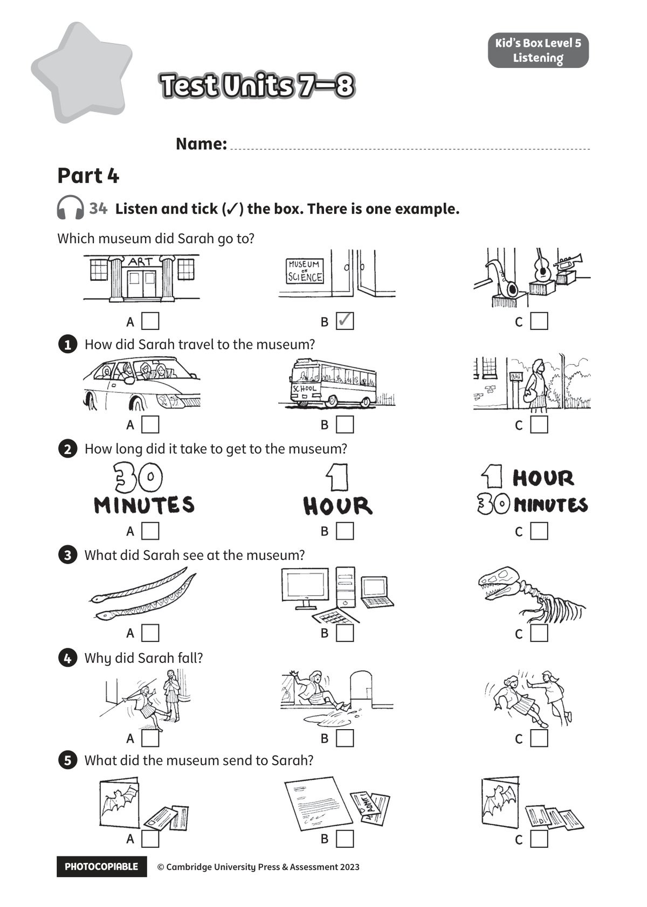

## 音频文件

- 🎧 [KidsBox_Level5_Test_Units_7-8_Listening_1_Audio_Track_31.mp3](KidsBox_Level5_Test_Units_7-8_Listening_1_Audio_Track_31.mp3)
- 🎧 [KidsBox_Level5_Test_Units_7-8_Listening_2_Audio_Track_32.mp3](KidsBox_Level5_Test_Units_7-8_Listening_2_Audio_Track_32.mp3)
- 🎧 [KidsBox_Level5_Test_Units_7-8_Listening_3_Audio_Track_33.mp3](KidsBox_Level5_Test_Units_7-8_Listening_3_Audio_Track_33.mp3)
- 🎧 [KidsBox_Level5_Test_Units_7-8_Listening_4_Audio_Track_34.mp3](KidsBox_Level5_Test_Units_7-8_Listening_4_Audio_Track_34.mp3)
- 🎧 [KidsBox_Level5_Test_Units_7-8_Listening_5_Audio_Track_35.mp3](KidsBox_Level5_Test_Units_7-8_Listening_5_Audio_Track_35.mp3)

## 第 1 页

PHOTOCOPIABLE        © Cambridge University Press & Assessment 2023
© Cambridge University Press & Assessment 2023
Test Units 7–8
Test Units 7–8
Test Units 7–8
Kid’s Box Level 5
Listening
34  Listen and tick (✓) the box. There is one example.
Name:
Part 4
Which museum did Sarah go to?
1 	 How did Sarah travel to the museum?
2 	 How long did it take to get to the museum?
3 	 What did Sarah see at the museum?
4 	 Why did Sarah fall?
5 	 What did the museum send to Sarah?
A
A
A
A
A
A
B  ✓
B
B
B
B
B
C
C
C
C
C
C
