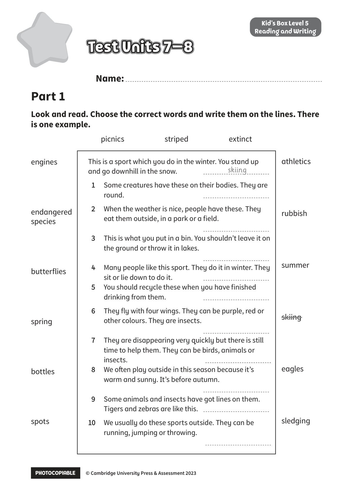

## 音频文件

- 🎧 [KidsBox_Level5_Test_Units_7-8_Listening_1_Audio_Track_31.mp3](KidsBox_Level5_Test_Units_7-8_Listening_1_Audio_Track_31.mp3)
- 🎧 [KidsBox_Level5_Test_Units_7-8_Listening_2_Audio_Track_32.mp3](KidsBox_Level5_Test_Units_7-8_Listening_2_Audio_Track_32.mp3)
- 🎧 [KidsBox_Level5_Test_Units_7-8_Listening_3_Audio_Track_33.mp3](KidsBox_Level5_Test_Units_7-8_Listening_3_Audio_Track_33.mp3)
- 🎧 [KidsBox_Level5_Test_Units_7-8_Listening_4_Audio_Track_34.mp3](KidsBox_Level5_Test_Units_7-8_Listening_4_Audio_Track_34.mp3)
- 🎧 [KidsBox_Level5_Test_Units_7-8_Listening_5_Audio_Track_35.mp3](KidsBox_Level5_Test_Units_7-8_Listening_5_Audio_Track_35.mp3)

## 第 1 页

PHOTOCOPIABLE        © Cambridge University Press & Assessment 2023
© Cambridge University Press & Assessment 2023
Name:
Part 1
Kid’s Box Level 5
Reading and Writing
Look and read. Choose the correct words and write them on the lines. There
is one example.
Test Units 7–8
Test Units 7–8
Test Units 7–8
This is a sport which you do in the winter. You stand up
and go downhill in the snow.
1
Some creatures have these on their bodies. They are
round.
2
When the weather is nice, people have these. They
eat them outside, in a park or a field.
3
This is what you put in a bin. You shouldn’t leave it on
the ground or throw it in lakes.
4
Many people like this sport. They do it in winter. They
sit or lie down to do it.
5
You should recycle these when you have finished
drinking from them.
6
They fly with four wings. They can be purple, red or
other colours. They are insects.
7
They are disappearing very quickly but there is still
time to help them. They can be birds, animals or
insects.
8
We often play outside in this season because it’s
warm and sunny. It’s before autumn.
9
Some animals and insects have got lines on them.
Tigers and zebras are like this.
10
10
We usually do these sports outside. They can be
running, jumping or throwing.

skiing
picnics          striped          extinct
athletics
rubbish
summer
skiing
eagles
sledging
engines
endangered
species
butterflies
spring
bottles
spots
