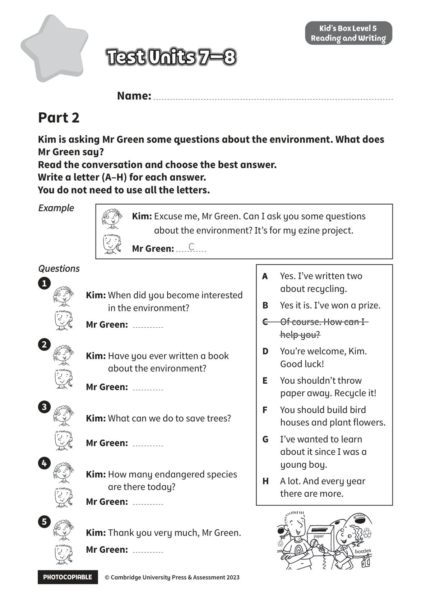

## 音频文件

- 🎧 [KidsBox_Level5_Test_Units_7-8_Listening_1_Audio_Track_31.mp3](KidsBox_Level5_Test_Units_7-8_Listening_1_Audio_Track_31.mp3)
- 🎧 [KidsBox_Level5_Test_Units_7-8_Listening_2_Audio_Track_32.mp3](KidsBox_Level5_Test_Units_7-8_Listening_2_Audio_Track_32.mp3)
- 🎧 [KidsBox_Level5_Test_Units_7-8_Listening_3_Audio_Track_33.mp3](KidsBox_Level5_Test_Units_7-8_Listening_3_Audio_Track_33.mp3)
- 🎧 [KidsBox_Level5_Test_Units_7-8_Listening_4_Audio_Track_34.mp3](KidsBox_Level5_Test_Units_7-8_Listening_4_Audio_Track_34.mp3)
- 🎧 [KidsBox_Level5_Test_Units_7-8_Listening_5_Audio_Track_35.mp3](KidsBox_Level5_Test_Units_7-8_Listening_5_Audio_Track_35.mp3)

## 第 1 页

PHOTOCOPIABLE        © Cambridge University Press & Assessment 2023
© Cambridge University Press & Assessment 2023
Name:
Part 2
Kid’s Box Level 5
Reading and Writing
Kim is asking Mr Green some questions about the environment. What does
Mr Green say?
Read the conversation and choose the best answer.
Write a letter (A–H) for each answer.
You do not need to use all the letters.
Test Units 7–8
Test Units 7–8
Test Units 7–8
Questions
Questions
Kim: When did you become interested
in the environment?
Mr Green:
Kim: Have you ever written a book
about the environment?
Mr Green:
Kim: What can we do to save trees?
Mr Green:
Kim: How many endangered species
are there today?
Mr Green:
Kim: Thank you very much, Mr Green.
Mr Green:
Example
Example
A
Yes. I’ve written two
about recycling.
B
Yes it is. I’ve won a prize.
C
Of course. How can I
help you?
D
You’re welcome, Kim.
Good luck!
E
You shouldn’t throw
paper away. Recycle it!
F
You should build bird
houses and plant flowers.
G
I’ve wanted to learn
about it since I was a
young boy.
H
A lot. And every year
there are more.
Kim: Excuse me, Mr Green. Can I ask you some questions
about the environment? It’s for my ezine project.
Mr Green:
C
1
2
3
4
5
