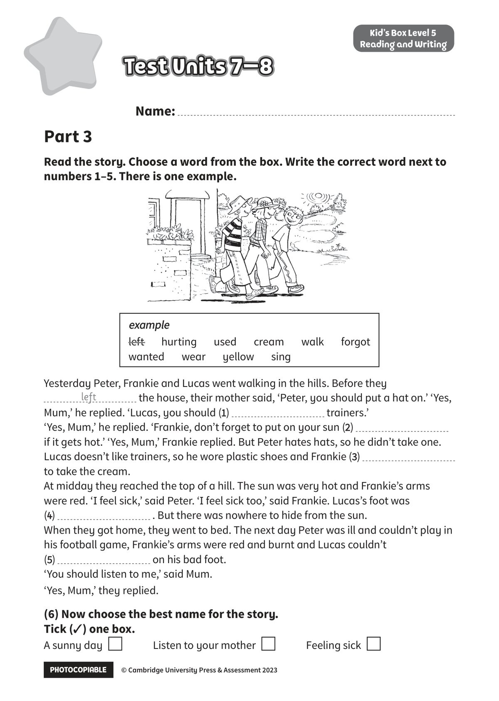

## 音频文件

- 🎧 [KidsBox_Level5_Test_Units_7-8_Listening_1_Audio_Track_31.mp3](KidsBox_Level5_Test_Units_7-8_Listening_1_Audio_Track_31.mp3)
- 🎧 [KidsBox_Level5_Test_Units_7-8_Listening_2_Audio_Track_32.mp3](KidsBox_Level5_Test_Units_7-8_Listening_2_Audio_Track_32.mp3)
- 🎧 [KidsBox_Level5_Test_Units_7-8_Listening_3_Audio_Track_33.mp3](KidsBox_Level5_Test_Units_7-8_Listening_3_Audio_Track_33.mp3)
- 🎧 [KidsBox_Level5_Test_Units_7-8_Listening_4_Audio_Track_34.mp3](KidsBox_Level5_Test_Units_7-8_Listening_4_Audio_Track_34.mp3)
- 🎧 [KidsBox_Level5_Test_Units_7-8_Listening_5_Audio_Track_35.mp3](KidsBox_Level5_Test_Units_7-8_Listening_5_Audio_Track_35.mp3)

## 第 1 页

PHOTOCOPIABLE        © Cambridge University Press & Assessment 2023
© Cambridge University Press & Assessment 2023
Name:
Part 3
Kid’s Box Level 5
Reading and Writing
Read the story. Choose a word from the box. Write the correct word next to
numbers 1–5. There is one example.
Test Units 7–8
Test Units 7–8
Test Units 7–8
example
example
left      hurting      used      cream      walk      forgot
wanted      wear      yellow      sing
Yesterday Peter, Frankie and Lucas went walking in the hills. Before they
the house, their mother said, ‘Peter, you should put a hat on.’ ‘Yes,
Mum,’ he replied. ‘Lucas, you should (1)
trainers.’
‘Yes, Mum,’ he replied. ‘Frankie, don’t forget to put on your sun (2)
if it gets hot.’ ‘Yes, Mum,’ Frankie replied. But Peter hates hats, so he didn’t take one.
Lucas doesn’t like trainers, so he wore plastic shoes and Frankie (3)
to take the cream.
At midday they reached the top of a hill. The sun was very hot and Frankie’s arms
were red. ‘I feel sick,’ said Peter. ‘I feel sick too,’ said Frankie. Lucas’s foot was
(4)
. But there was nowhere to hide from the sun.
When they got home, they went to bed. The next day Peter was ill and couldn’t play in
his football game, Frankie’s arms were red and burnt and Lucas couldn’t
(5)
on his bad foot.
‘You should listen to me,’ said Mum.
‘Yes, Mum,’ they replied.
(6) Now choose the best name for the story.
Tick (✓) one box.
A sunny day
Listen to your mother
Feeling sick
left
