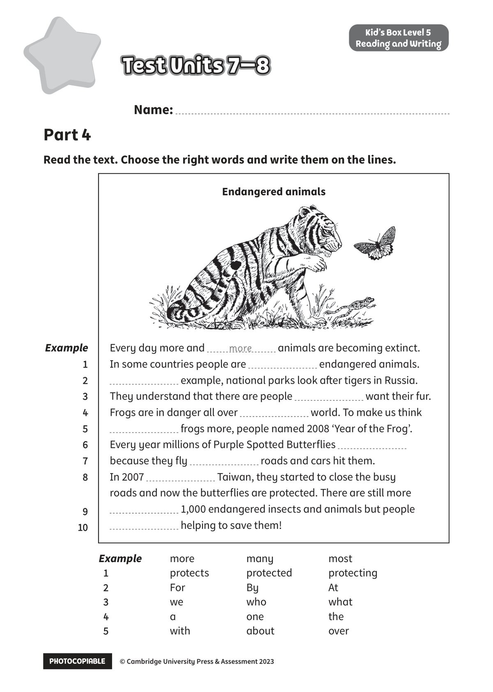
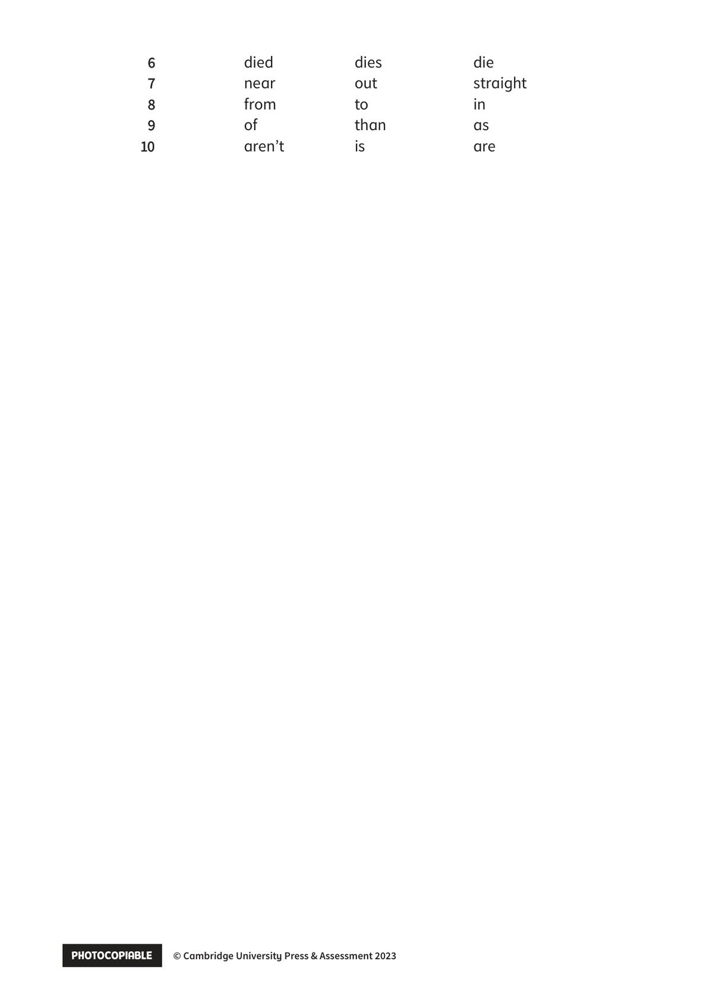

## 音频文件

- 🎧 [KidsBox_Level5_Test_Units_7-8_Listening_1_Audio_Track_31.mp3](KidsBox_Level5_Test_Units_7-8_Listening_1_Audio_Track_31.mp3)
- 🎧 [KidsBox_Level5_Test_Units_7-8_Listening_2_Audio_Track_32.mp3](KidsBox_Level5_Test_Units_7-8_Listening_2_Audio_Track_32.mp3)
- 🎧 [KidsBox_Level5_Test_Units_7-8_Listening_3_Audio_Track_33.mp3](KidsBox_Level5_Test_Units_7-8_Listening_3_Audio_Track_33.mp3)
- 🎧 [KidsBox_Level5_Test_Units_7-8_Listening_4_Audio_Track_34.mp3](KidsBox_Level5_Test_Units_7-8_Listening_4_Audio_Track_34.mp3)
- 🎧 [KidsBox_Level5_Test_Units_7-8_Listening_5_Audio_Track_35.mp3](KidsBox_Level5_Test_Units_7-8_Listening_5_Audio_Track_35.mp3)

## 第 1 页

PHOTOCOPIABLE        © Cambridge University Press & Assessment 2023
© Cambridge University Press & Assessment 2023
Name:
Part 4
Kid’s Box Level 5
Reading and Writing
Read the text. Choose the right words and write them on the lines.
Test Units 7–8
Test Units 7–8
Test Units 7–8
Endangered animals
Example
more
many
most
1
1
protects
protected
protecting
2
2
For
By
At
3
3
we
who
what
4
4
a
one
the
5
5
with
about
over
Every day more and
animals are becoming extinct.
In some countries people are
endangered animals.
example, national parks look after tigers in Russia.
They understand that there are people
want their fur.
Frogs are in danger all over
world. To make us think
frogs more, people named 2008 ‘Year of the Frog’.
Every year millions of Purple Spotted Butterflies
because they fly
roads and cars hit them.
In 2007
Taiwan, they started to close the busy
roads and now the butterflies are protected. There are still more
1,000 endangered insects and animals but people
helping to save them!
more
Example
1
2
2
3
3
4
4
5
5
6
6
7
8
8
9 9
10
10

## 第 2 页

PHOTOCOPIABLE        © Cambridge University Press & Assessment 2023
© Cambridge University Press & Assessment 2023
6
6
died
dies
die
7
7
near
out
straight
8
8
from
to
in
9
9
of
than
as
10
10
aren’t
is
are
