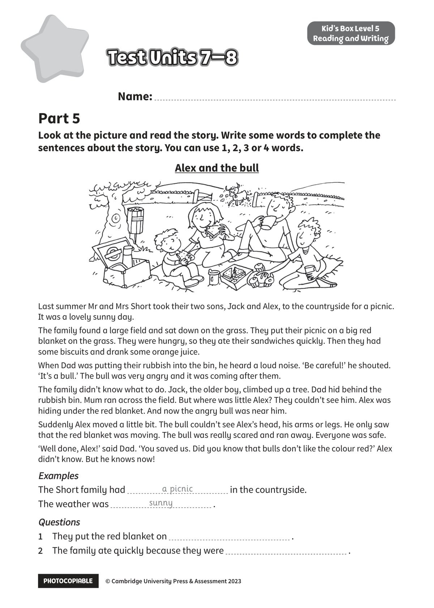
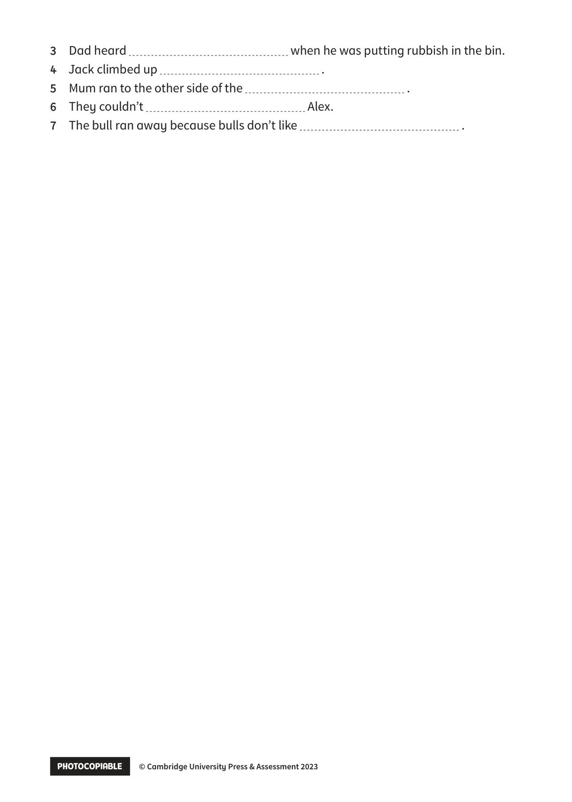

## 音频文件

- 🎧 [KidsBox_Level5_Test_Units_7-8_Listening_1_Audio_Track_31.mp3](KidsBox_Level5_Test_Units_7-8_Listening_1_Audio_Track_31.mp3)
- 🎧 [KidsBox_Level5_Test_Units_7-8_Listening_2_Audio_Track_32.mp3](KidsBox_Level5_Test_Units_7-8_Listening_2_Audio_Track_32.mp3)
- 🎧 [KidsBox_Level5_Test_Units_7-8_Listening_3_Audio_Track_33.mp3](KidsBox_Level5_Test_Units_7-8_Listening_3_Audio_Track_33.mp3)
- 🎧 [KidsBox_Level5_Test_Units_7-8_Listening_4_Audio_Track_34.mp3](KidsBox_Level5_Test_Units_7-8_Listening_4_Audio_Track_34.mp3)
- 🎧 [KidsBox_Level5_Test_Units_7-8_Listening_5_Audio_Track_35.mp3](KidsBox_Level5_Test_Units_7-8_Listening_5_Audio_Track_35.mp3)

## 第 1 页

PHOTOCOPIABLE        © Cambridge University Press & Assessment 2023
© Cambridge University Press & Assessment 2023
Name:
Part 5
Kid’s Box Level 5
Reading and Writing
Look at the picture and read the story. Write some words to complete the
sentences about the story. You can use 1, 2, 3 or 4 words.
Test Units 7–8
Test Units 7–8
Test Units 7–8
Last summer Mr and Mrs Short took their two sons, Jack and Alex, to the countryside for a picnic.
It was a lovely sunny day.
The family found a large field and sat down on the grass. They put their picnic on a big red
blanket on the grass. They were hungry, so they ate their sandwiches quickly. Then they had
some biscuits and drank some orange juice.
When Dad was putting their rubbish into the bin, he heard a loud noise. ‘Be careful!’ he shouted.
‘It’s a bull.’ The bull was very angry and it was coming after them.
The family didn’t know what to do. Jack, the older boy, climbed up a tree. Dad hid behind the
rubbish bin. Mum ran across the field. But where was little Alex? They couldn’t see him. Alex was
hiding under the red blanket. And now the angry bull was near him.
Suddenly Alex moved a little bit. The bull couldn’t see Alex’s head, his arms or legs. He only saw
that the red blanket was moving. The bull was really scared and ran away. Everyone was safe.
‘Well done, Alex!’ said Dad. ‘You saved us. Did you know that bulls don’t like the colour red?’ Alex
didn’t know. But he knows now!
Examples
Examples
The Short family had
in the countryside.
The weather was
.
Questions
Questions
1	 They put the red blanket on
.
2	 The family ate quickly because they were
.
a picnic
sunny
Alex and the bull

## 第 2 页

PHOTOCOPIABLE        © Cambridge University Press & Assessment 2023
© Cambridge University Press & Assessment 2023
3	 Dad heard
when he was putting rubbish in the bin.
4	 Jack climbed up
.
5	 Mum ran to the other side of the
.
6	 They couldn’t
Alex.
7	 The bull ran away because bulls don’t like
.
