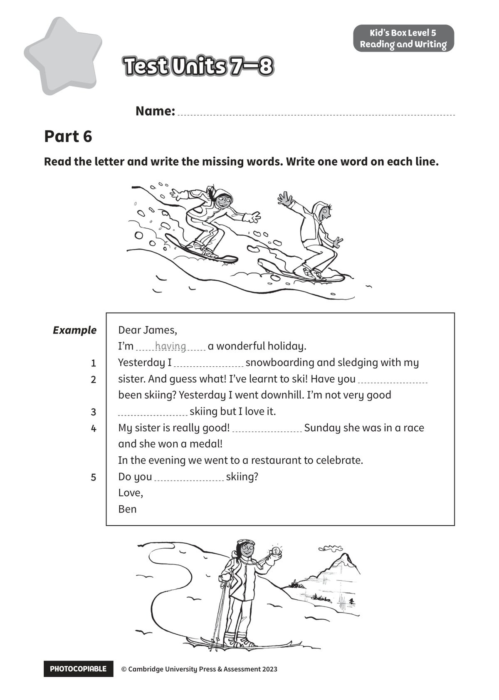

## 音频文件

- 🎧 [KidsBox_Level5_Test_Units_7-8_Listening_1_Audio_Track_31.mp3](KidsBox_Level5_Test_Units_7-8_Listening_1_Audio_Track_31.mp3)
- 🎧 [KidsBox_Level5_Test_Units_7-8_Listening_2_Audio_Track_32.mp3](KidsBox_Level5_Test_Units_7-8_Listening_2_Audio_Track_32.mp3)
- 🎧 [KidsBox_Level5_Test_Units_7-8_Listening_3_Audio_Track_33.mp3](KidsBox_Level5_Test_Units_7-8_Listening_3_Audio_Track_33.mp3)
- 🎧 [KidsBox_Level5_Test_Units_7-8_Listening_4_Audio_Track_34.mp3](KidsBox_Level5_Test_Units_7-8_Listening_4_Audio_Track_34.mp3)
- 🎧 [KidsBox_Level5_Test_Units_7-8_Listening_5_Audio_Track_35.mp3](KidsBox_Level5_Test_Units_7-8_Listening_5_Audio_Track_35.mp3)

## 第 1 页

PHOTOCOPIABLE    © Cambridge University Press & Assessment 2023
© Cambridge University Press & Assessment 2023
Name:
Part 6
Kid’s Box Level 5
Reading and Writing
Read the letter and write the missing words. Write one word on each line.
Test Units 7–8
Test Units 7–8
Test Units 7–8
Test Units 7–8
Test Units 7–8
Example
1
2
3 3
4
5
Dear James,
I’m
a wonderful holiday.
Yesterday I
snowboarding and sledging with my
sister. And guess what! I’ve learnt to ski! Have you
been skiing? Yesterday I went downhill. I’m not very good
skiing but I love it.
My sister is really good!
Sunday she was in a race
and she won a medal!
In the evening we went to a restaurant to celebrate.
Do you
skiing?
Love,
Ben
having
