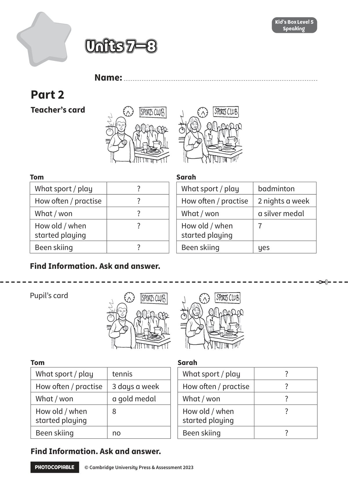

## 音频文件

- 🎧 [KidsBox_Level5_Test_Units_7-8_Listening_1_Audio_Track_31.mp3](KidsBox_Level5_Test_Units_7-8_Listening_1_Audio_Track_31.mp3)
- 🎧 [KidsBox_Level5_Test_Units_7-8_Listening_2_Audio_Track_32.mp3](KidsBox_Level5_Test_Units_7-8_Listening_2_Audio_Track_32.mp3)
- 🎧 [KidsBox_Level5_Test_Units_7-8_Listening_3_Audio_Track_33.mp3](KidsBox_Level5_Test_Units_7-8_Listening_3_Audio_Track_33.mp3)
- 🎧 [KidsBox_Level5_Test_Units_7-8_Listening_4_Audio_Track_34.mp3](KidsBox_Level5_Test_Units_7-8_Listening_4_Audio_Track_34.mp3)
- 🎧 [KidsBox_Level5_Test_Units_7-8_Listening_5_Audio_Track_35.mp3](KidsBox_Level5_Test_Units_7-8_Listening_5_Audio_Track_35.mp3)

## 第 1 页

PHOTOCOPIABLE        © Cambridge University Press & Assessment 2023
© Cambridge University Press & Assessment 2023
Units 7–8
Units 7–8
Units 7–8
Kid’s Box Level 2
Speaking
Kid’s Box Level 5
Speaking
Teacher’s card
Name:
Part 2
Tom
What sport / play
?
How often / practise
?
What / won
?
How old / when
started playing
?
Been skiing
?
Sarah
What sport / play
badminton
How often / practise
2 nights a week
What / won
a silver medal
How old / when
started playing
7
Been skiing
yes
Tom
What sport / play
tennis
How often / practise
3 days a week
What / won
a gold medal
How old / when
started playing
8
Been skiing
no
Sarah
What sport / play
?
How often / practise
?
What / won
?
How old / when
started playing
?
Been skiing
?
Find Information. Ask and answer.
Find Information. Ask and answer.
✂
Pupil’s card
