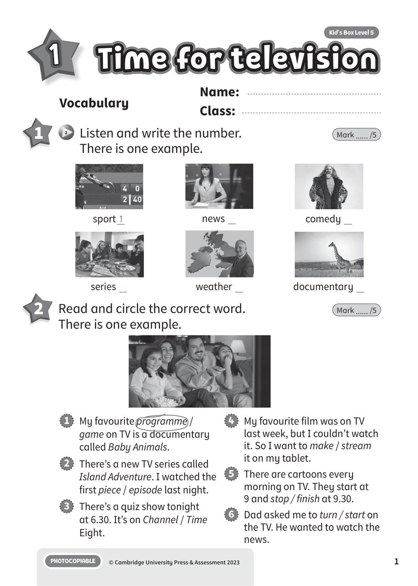
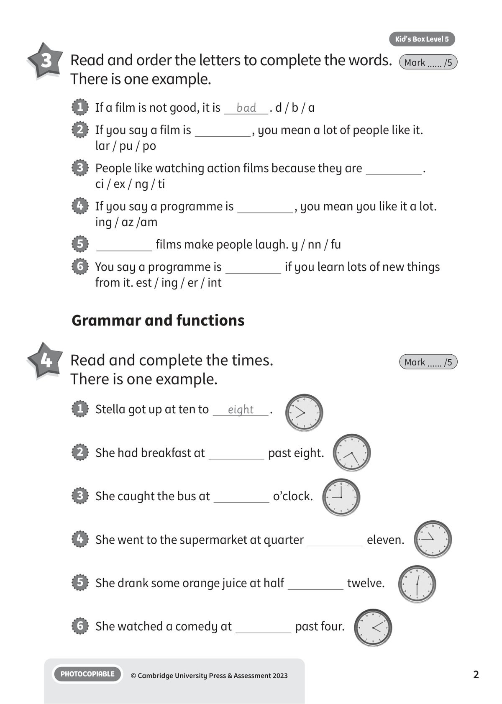
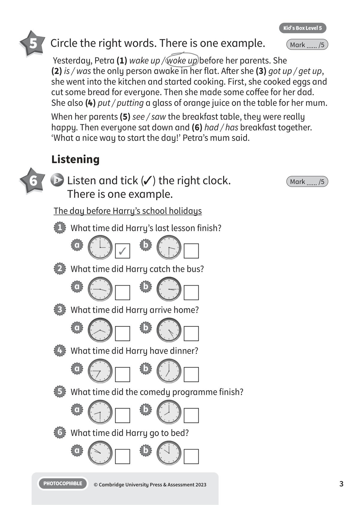
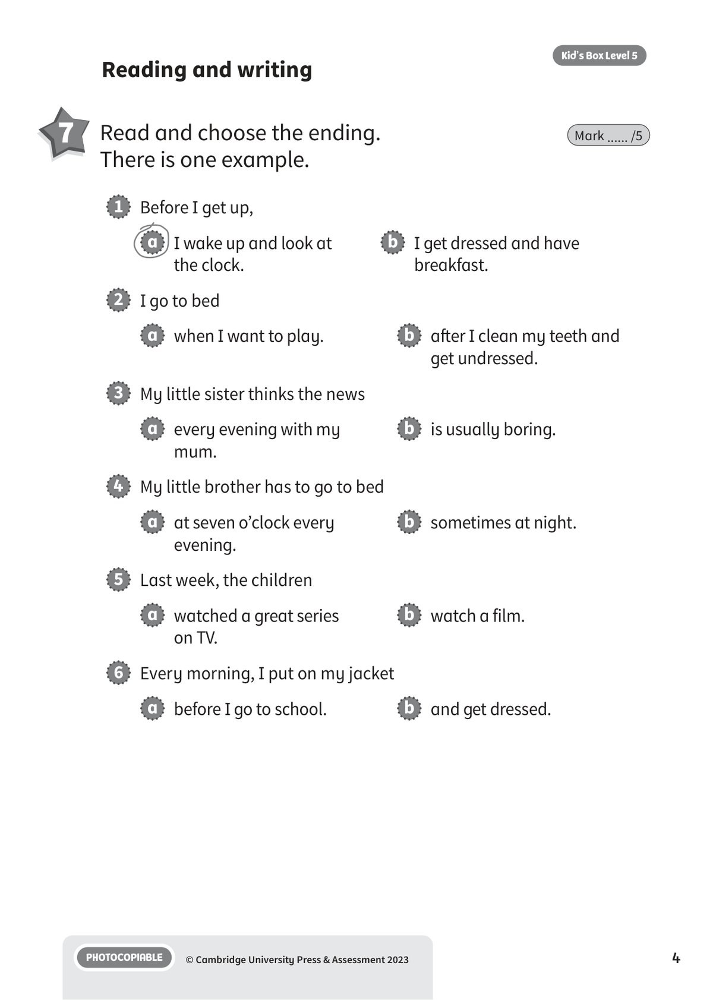
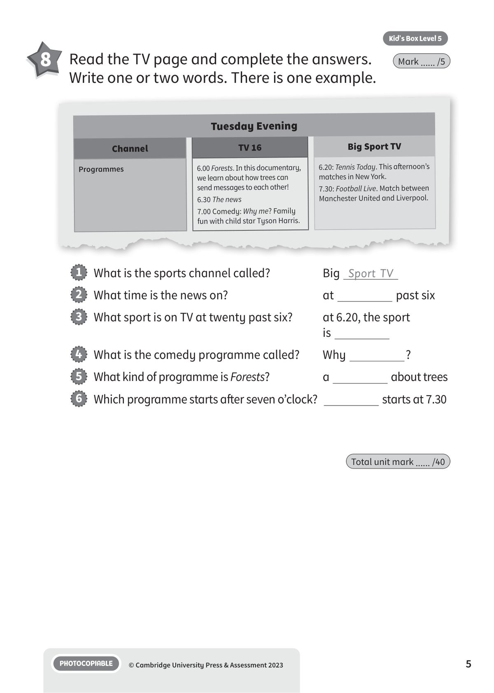
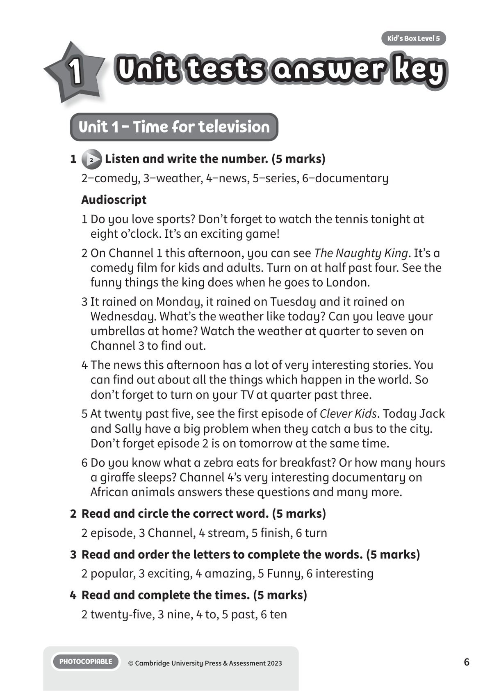
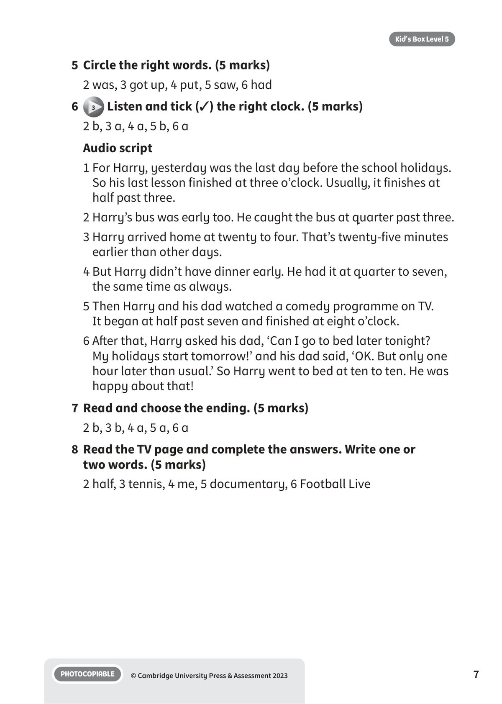

## 音频文件

- 🎧 [KBX_L5_U1_audio_T3.mp3](KBX_L5_U1_audio_T3.mp3)

## 第 1 页

Name:
Class:
PHOTOCOPIABLE
© Cambridge University Press & Assessment 2023
1
Vocabulary
1
Time for television
Time for television
Time for television
Kid’s Box Level 5
1
2 	 Listen and write the number.
There is one example.
Mark ...... /5
2 	 Read and circle the correct word.
There is one example.
Mark ...... /5
1   My favourite programme /
game on TV is a documentary
called Baby Animals.
2   There’s a new TV series called
Island Adventure. I watched the
first piece / episode last night.
3   There’s a quiz show tonight
at 6.30. It’s on Channel / Time
Eight.
4   My favourite film was on TV
last week, but I couldn’t watch
it. So I want to make / stream
it on my tablet.
5   There are cartoons every
morning on TV. They start at
9 and stop / finish at 9.30.
6   Dad asked me to turn / start on
the TV. He wanted to watch the
news.
sport 1
news
series
weather
documentary
comedy

## 第 2 页

PHOTOCOPIABLE
© Cambridge University Press & Assessment 2023
2
Kid’s Box Level 5
Grammar and functions
4 	 Read and complete the times.
There is one example.
Mark ...... /5
3 	 Read and order the letters to complete the words.
There is one example.
Mark ...... /5
1   If a film is not good, it is
bad
. d / b / a
2   If you say a film is
, you mean a lot of people like it.
lar / pu / po
3   People like watching action films because they are
.
ci / ex / ng / ti
4   If you say a programme is
, you mean you like it a lot.
ing / az /am
5
films make people laugh. y / nn / fu
6   You say a programme is
if you learn lots of new things
from it. est / ing / er / int
1   Stella got up at ten to
eight
.
2   She had breakfast at
past eight.
3   She caught the bus at
o’clock.
4   She went to the supermarket at quarter
eleven.
5   She drank some orange juice at half
twelve.
6   She watched a comedy at
past four.

## 第 3 页

PHOTOCOPIABLE
© Cambridge University Press & Assessment 2023
3
Kid’s Box Level 5
5 	 Circle the right words. There is one example.
Mark ...... /5
Yesterday, Petra (1) wake up / woke up before her parents. She
(2) is / was the only person awake in her flat. After she (3) got up / get up,
she went into the kitchen and started cooking. First, she cooked eggs and
cut some bread for everyone. Then she made some coffee for her dad.
She also (4) put / putting a glass of orange juice on the table for her mum.
When her parents (5) see / saw the breakfast table, they were really
happy. Then everyone sat down and (6) had / has breakfast together.
‘What a nice way to start the day!’ Petra’s mum said.
Listening
6 	  3 	Listen and tick (✓) the right clock.
There is one example.
Mark ...... /5
The day before Harry’s school holidays
1   What time did Harry’s last lesson finish?
a
✓
b
2   What time did Harry catch the bus?
a
b
3   What time did Harry arrive home?
a
b
4   What time did Harry have dinner?
a
b
5   What time did the comedy programme finish?
a
b
6   What time did Harry go to bed?
a
b

## 第 4 页

PHOTOCOPIABLE
© Cambridge University Press & Assessment 2023
4
Kid’s Box Level 5
Reading and writing
7 	 Read and choose the ending.
There is one example.
Mark ...... /5
1   Before I get up,
a   I wake up and look at
the clock.
b   I get dressed and have
breakfast.
2   I go to bed
a   when I want to play.
b   after I clean my teeth and
get undressed.
3   My little sister thinks the news
a   every evening with my
mum.
b   is usually boring.
4   My little brother has to go to bed
a   at seven o’clock every
evening.
b   sometimes at night.
5   Last week, the children
a   watched a great series
on TV.
b   watch a film.
6   Every morning, I put on my jacket
a   before I go to school.
b   and get dressed.

## 第 5 页

PHOTOCOPIABLE
© Cambridge University Press & Assessment 2023
5
Kid’s Box Level 5
Total unit mark ...... /40
8 	 Read the TV page and complete the answers.
Write one or two words. There is one example.
Mark ...... /5
1   What is the sports channel called?
Big Sport TV
2   What time is the news on?
at
past six
3   What sport is on TV at twenty past six?
at 6.20, the sport
is
4   What is the comedy programme called?
Why
?
5   What kind of programme is Forests?
a
about trees
6   Which programme starts after seven o’clock?
starts at 7.30
Tuesday Evening
Channel
TV 16
Big Sport TV
Programmes
6.00 Forests. In this documentary,
we learn about how trees can
send messages to each other!
6.30 The news
7.00 Comedy: Why me? Family
fun with child star Tyson Harris.
6.20: Tennis Today. This afternoon’s
matches in New York.
7.30: Football Live. Match between
Manchester United and Liverpool.

## 第 6 页

Unit tests answer key
Unit tests answer key
Unit tests answer key
PHOTOCOPIABLE
© Cambridge University Press & Assessment 2023
6
Kid’s Box Level 5
1
Unit 1 - Time for television
1
2 Listen and write the number. (5 marks)
2−comedy, 3−weather, 4−news, 5−series, 6−documentary
Audioscript
1 Do you love sports? Don’t forget to watch the tennis tonight at
eight o’clock. It’s an exciting game!
2 On Channel 1 this afternoon, you can see The Naughty King. It’s a
comedy film for kids and adults. Turn on at half past four. See the
funny things the king does when he goes to London.
3 It rained on Monday, it rained on Tuesday and it rained on
Wednesday. What’s the weather like today? Can you leave your
umbrellas at home? Watch the weather at quarter to seven on
Channel 3 to find out.
4 The news this afternoon has a lot of very interesting stories. You
can find out about all the things which happen in the world. So
don’t forget to turn on your TV at quarter past three.
5 At twenty past five, see the first episode of Clever Kids. Today Jack
and Sally have a big problem when they catch a bus to the city.
Don’t forget episode 2 is on tomorrow at the same time.
6 Do you know what a zebra eats for breakfast? Or how many hours
a giraffe sleeps? Channel 4’s very interesting documentary on
African animals answers these questions and many more.
2	 Read and circle the correct word. (5 marks)
2 episode, 3 Channel, 4 stream, 5 finish, 6 turn
3	 Read and order the letters to complete the words. (5 marks)
2 popular, 3 exciting, 4 amazing, 5 Funny, 6 interesting
4	 Read and complete the times. (5 marks)
2 twenty-five, 3 nine, 4 to, 5 past, 6 ten

## 第 7 页

PHOTOCOPIABLE
© Cambridge University Press & Assessment 2023
7
Kid’s Box Level 5
5	 Circle the right words. (5 marks)
2 was, 3 got up, 4 put, 5 saw, 6 had
6
3 Listen and tick (✓) the right clock. (5 marks)
2 b, 3 a, 4 a, 5 b, 6 a
Audio script
1 For Harry, yesterday was the last day before the school holidays.
So his last lesson finished at three o’clock. Usually, it finishes at
half past three.
2 Harry’s bus was early too. He caught the bus at quarter past three.
3 Harry arrived home at twenty to four. That’s twenty-five minutes
earlier than other days.
4 But Harry didn’t have dinner early. He had it at quarter to seven,
the same time as always.
5 Then Harry and his dad watched a comedy programme on TV.
It began at half past seven and finished at eight o’clock.
6 After that, Harry asked his dad, ‘Can I go to bed later tonight?
My holidays start tomorrow!’ and his dad said, ‘OK. But only one
hour later than usual.’ So Harry went to bed at ten to ten. He was
happy about that!
7	 Read and choose the ending. (5 marks)
2 b, 3 b, 4 a, 5 a, 6 a
8	 Read the TV page and complete the answers. Write one or
two words. (5 marks)
2 half, 3 tennis, 4 me, 5 documentary, 6 Football Live
