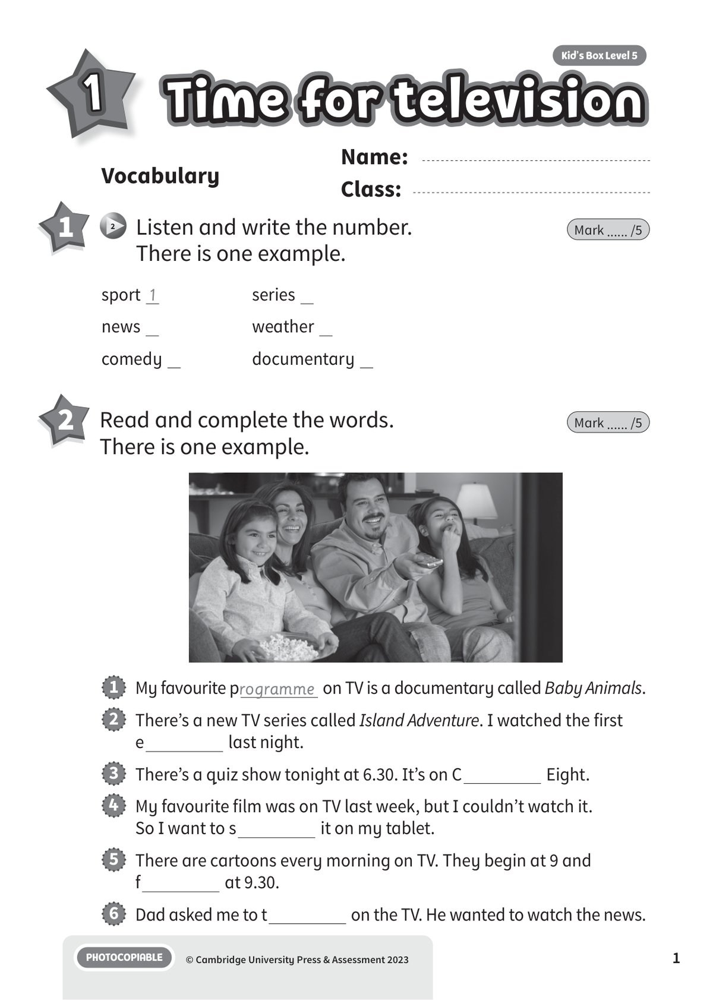
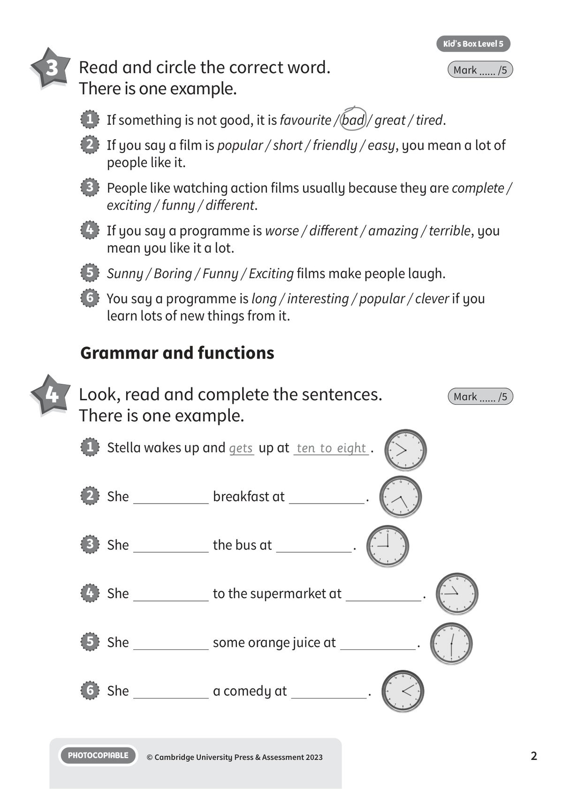
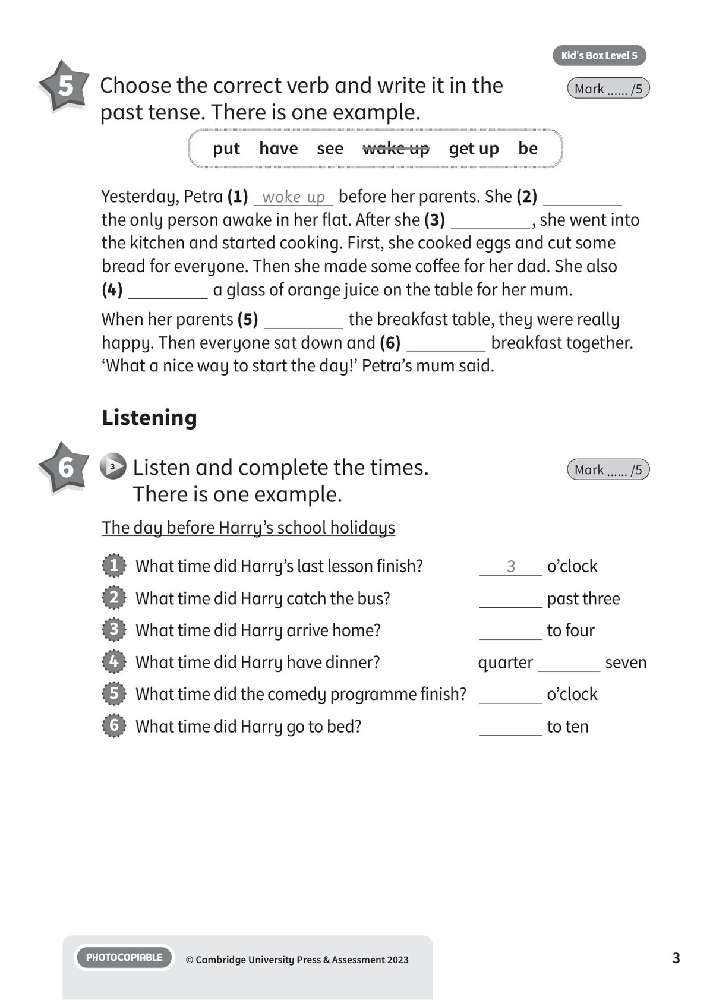
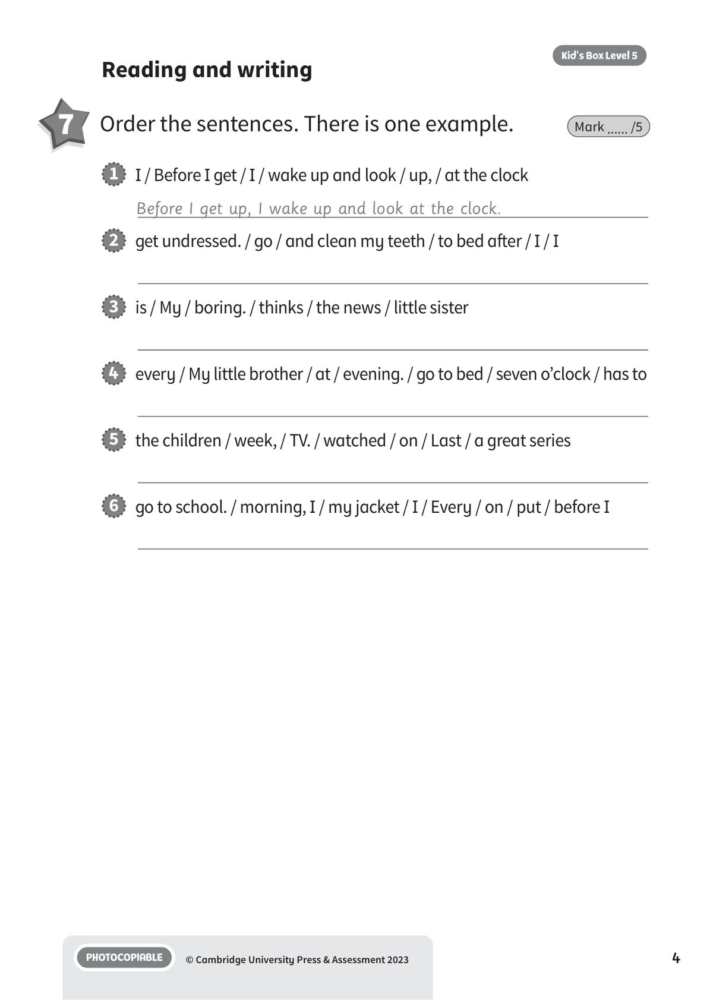
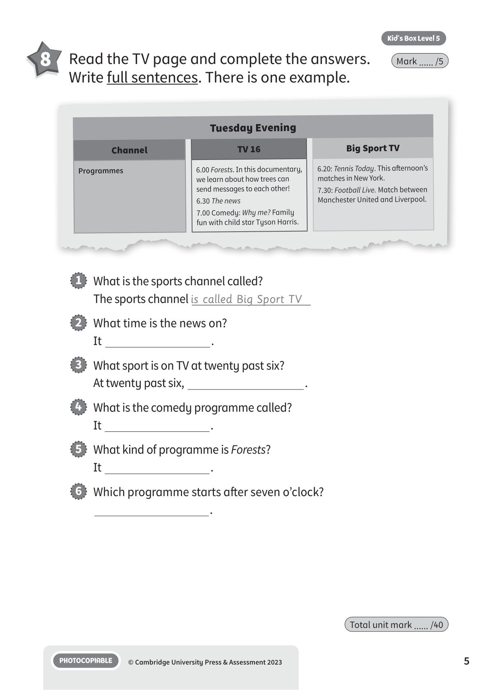
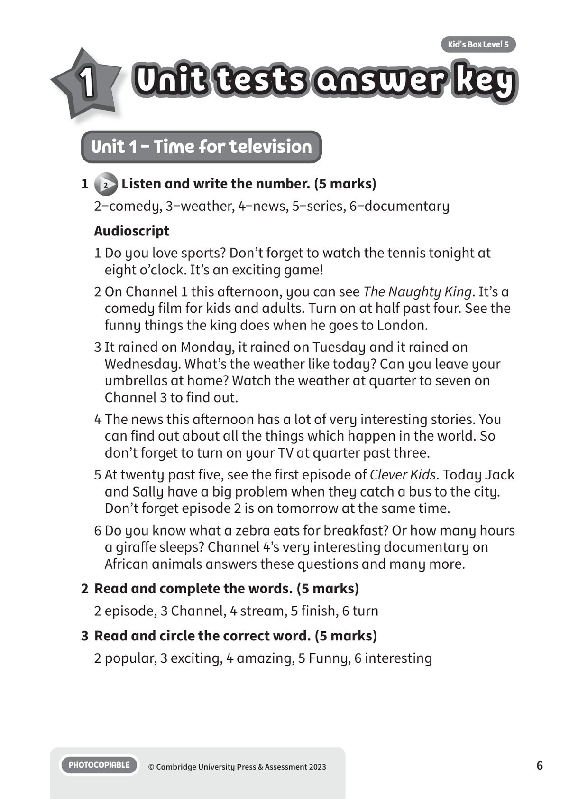
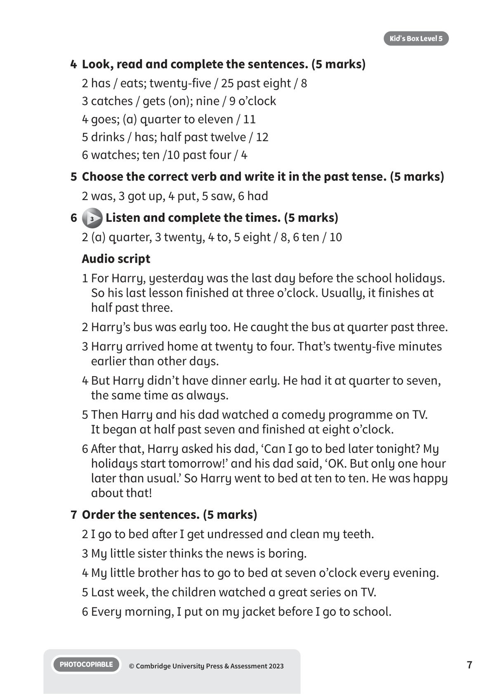
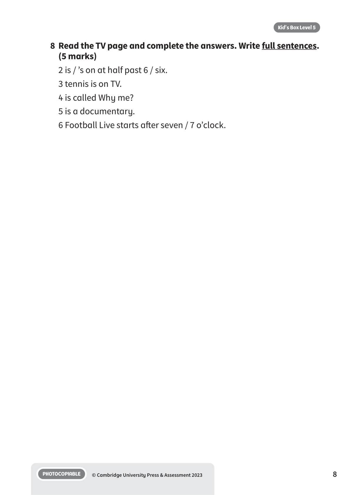

## 音频文件

- 🎧 [KBX_L5_U1_audio_T3.mp3](KBX_L5_U1_audio_T3.mp3)

## 第 1 页

Name:
Class:
PHOTOCOPIABLE
© Cambridge University Press & Assessment 2023
1
Vocabulary
1
Time for television
Time for television
Time for television
Kid’s Box Level 5
1
2 	 Listen and write the number.
There is one example.
Mark ...... /5
2 	 Read and complete the words.
There is one example.
Mark ...... /5
sport 1
news
comedy
series
weather
documentary
1   My favourite programme on TV is a documentary called Baby Animals.
2   There’s a new TV series called Island Adventure. I watched the first
e
last night.
3   There’s a quiz show tonight at 6.30. It’s on C
Eight.
4   My favourite film was on TV last week, but I couldn’t watch it.
So I want to s
it on my tablet.
5   There are cartoons every morning on TV. They begin at 9 and
f
at 9.30.
6   Dad asked me to t
on the TV. He wanted to watch the news.

## 第 2 页

PHOTOCOPIABLE
© Cambridge University Press & Assessment 2023
2
Kid’s Box Level 5
3 	 Read and circle the correct word.
There is one example.
Mark ...... /5
1   If something is not good, it is favourite / bad / great / tired.
2   If you say a film is popular / short / friendly / easy, you mean a lot of
people like it.
3   People like watching action films usually because they are complete /
exciting / funny / different.
4   If you say a programme is worse / different / amazing / terrible, you
mean you like it a lot.
5   Sunny / Boring / Funny / Exciting films make people laugh.
6   You say a programme is long / interesting / popular / clever if you
learn lots of new things from it.
Grammar and functions
4 	 Look, read and complete the sentences.
There is one example.
Mark ...... /5
1   Stella wakes up and gets up at ten to eight .
2   She
breakfast at
.
3   She
the bus at
.
4   She
to the supermarket at
.
5   She
some orange juice at
.
6   She
a comedy at
.

## 第 3 页

PHOTOCOPIABLE
© Cambridge University Press & Assessment 2023
3
Kid’s Box Level 5
5 	 Choose the correct verb and write it in the
past tense. There is one example.
Mark ...... /5
Yesterday, Petra (1) woke up before her parents. She (2)
the only person awake in her flat. After she (3)
, she went into
the kitchen and started cooking. First, she cooked eggs and cut some
bread for everyone. Then she made some coffee for her dad. She also
(4)
a glass of orange juice on the table for her mum.
When her parents (5)
the breakfast table, they were really
happy. Then everyone sat down and (6)
breakfast together.
‘What a nice way to start the day!’ Petra’s mum said.
Listening
6 	  3 	Listen and complete the times.
There is one example.
Mark ...... /5
put  have  see  wake up  get up  be
The day before Harry’s school holidays
1   What time did Harry’s last lesson finish?
3
o’clock
2   What time did Harry catch the bus?
past three
3   What time did Harry arrive home?
to four
4   What time did Harry have dinner?
quarter
seven
5   What time did the comedy programme finish?
o’clock
6   What time did Harry go to bed?
to ten

## 第 4 页

PHOTOCOPIABLE
© Cambridge University Press & Assessment 2023
4
Kid’s Box Level 5
Reading and writing
7 	 Order the sentences. There is one example.
Mark ...... /5
1   I / Before I get / I / wake up and look / up, / at the clock
Before I get up, I wake up and look at the clock.
2   get undressed. / go / and clean my teeth / to bed after / I / I
3   is / My / boring. / thinks / the news / little sister
4   every / My little brother / at / evening. / go to bed / seven o’clock / has to
5   the children / week, / TV. / watched / on / Last / a great series
6   go to school. / morning, I / my jacket / I / Every / on / put / before I

## 第 5 页

PHOTOCOPIABLE
© Cambridge University Press & Assessment 2023
5
Kid’s Box Level 5
Total unit mark ...... /40
8 	 Read the TV page and complete the answers.
Write full sentences. There is one example.
Mark ...... /5
1   What is the sports channel called?
The sports channel is called Big Sport TV
2   What time is the news on?
It
.
3   What sport is on TV at twenty past six?
At twenty past six,
.
4   What is the comedy programme called?
It
.
5   What kind of programme is Forests?
It
.
6   Which programme starts after seven o’clock?
.
Tuesday Evening
Channel
TV 16
Big Sport TV
Programmes
6.00 Forests. In this documentary,
we learn about how trees can
send messages to each other!
6.30 The news
7.00 Comedy: Why me? Family
fun with child star Tyson Harris.
6.20: Tennis Today. This afternoon’s
matches in New York.
7.30: Football Live. Match between
Manchester United and Liverpool.

## 第 6 页

Unit tests answer key
Unit tests answer key
Unit tests answer key
PHOTOCOPIABLE
© Cambridge University Press & Assessment 2023
6
Kid’s Box Level 5
1
Unit 1 - Time for television
1
2 Listen and write the number. (5 marks)
2−comedy, 3−weather, 4−news, 5−series, 6−documentary
Audioscript
1 Do you love sports? Don’t forget to watch the tennis tonight at
eight o’clock. It’s an exciting game!
2 On Channel 1 this afternoon, you can see The Naughty King. It’s a
comedy film for kids and adults. Turn on at half past four. See the
funny things the king does when he goes to London.
3 It rained on Monday, it rained on Tuesday and it rained on
Wednesday. What’s the weather like today? Can you leave your
umbrellas at home? Watch the weather at quarter to seven on
Channel 3 to find out.
4 The news this afternoon has a lot of very interesting stories. You
can find out about all the things which happen in the world. So
don’t forget to turn on your TV at quarter past three.
5 At twenty past five, see the first episode of Clever Kids. Today Jack
and Sally have a big problem when they catch a bus to the city.
Don’t forget episode 2 is on tomorrow at the same time.
6 Do you know what a zebra eats for breakfast? Or how many hours
a giraffe sleeps? Channel 4’s very interesting documentary on
African animals answers these questions and many more.
2	 Read and complete the words. (5 marks)
2 episode, 3 Channel, 4 stream, 5 finish, 6 turn
3	 Read and circle the correct word. (5 marks)
2 popular, 3 exciting, 4 amazing, 5 Funny, 6 interesting

## 第 7 页

PHOTOCOPIABLE
© Cambridge University Press & Assessment 2023
7
Kid’s Box Level 5
4	 Look, read and complete the sentences. (5 marks)
2 has / eats; twenty-five / 25 past eight / 8
3 catches / gets (on); nine / 9 o’clock
4 goes; (a) quarter to eleven / 11
5 drinks / has; half past twelve / 12
6 watches; ten /10 past four / 4
5	 Choose the correct verb and write it in the past tense. (5 marks)
2 was, 3 got up, 4 put, 5 saw, 6 had
6
3 Listen and complete the times. (5 marks)
2 (a) quarter, 3 twenty, 4 to, 5 eight / 8, 6 ten / 10
Audio script
1 For Harry, yesterday was the last day before the school holidays.
So his last lesson finished at three o’clock. Usually, it finishes at
half past three.
2 Harry’s bus was early too. He caught the bus at quarter past three.
3 Harry arrived home at twenty to four. That’s twenty-five minutes
earlier than other days.
4 But Harry didn’t have dinner early. He had it at quarter to seven,
the same time as always.
5 Then Harry and his dad watched a comedy programme on TV.
It began at half past seven and finished at eight o’clock.
6 After that, Harry asked his dad, ‘Can I go to bed later tonight? My
holidays start tomorrow!’ and his dad said, ‘OK. But only one hour
later than usual.’ So Harry went to bed at ten to ten. He was happy
about that!
7	 Order the sentences. (5 marks)
2 I go to bed after I get undressed and clean my teeth.
3 My little sister thinks the news is boring.
4 My little brother has to go to bed at seven o’clock every evening.
5 Last week, the children watched a great series on TV.
6 Every morning, I put on my jacket before I go to school.

## 第 8 页

PHOTOCOPIABLE
© Cambridge University Press & Assessment 2023
8
Kid’s Box Level 5
8	Read the TV page and complete the answers. Write full sentences.
(5 marks)
2 is / ’s on at half past 6 / six.
3 tennis is on TV.
4 is called Why me?
5 is a documentary.
6 Football Live starts after seven / 7 o’clock.
