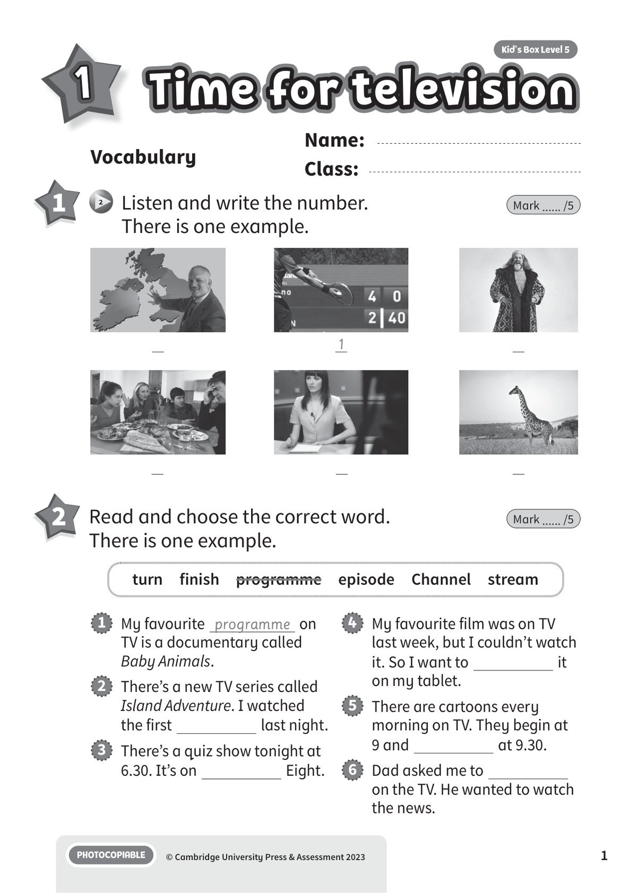
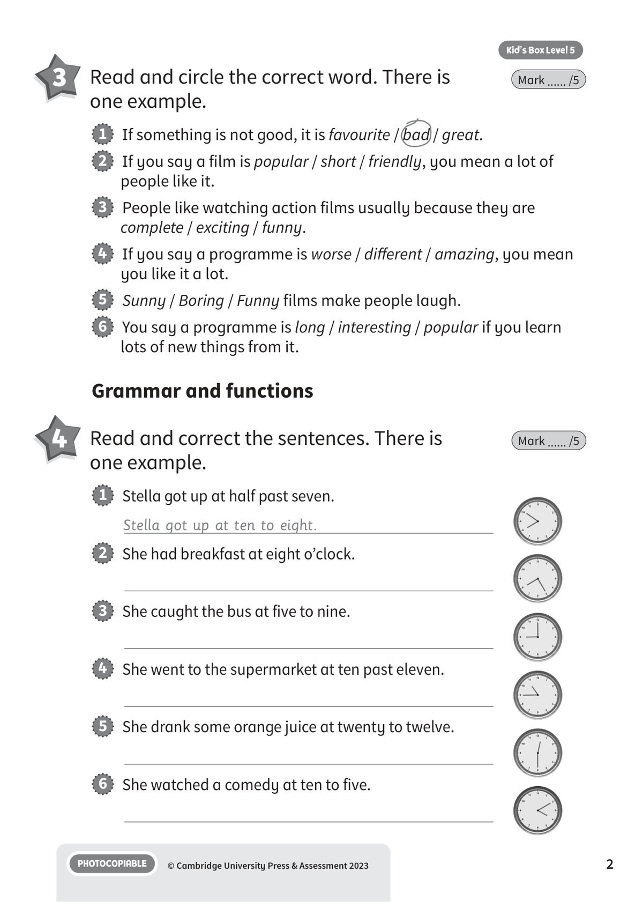
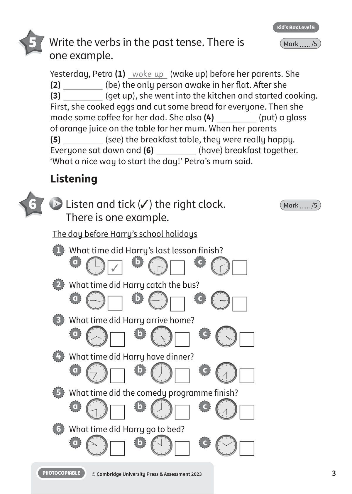
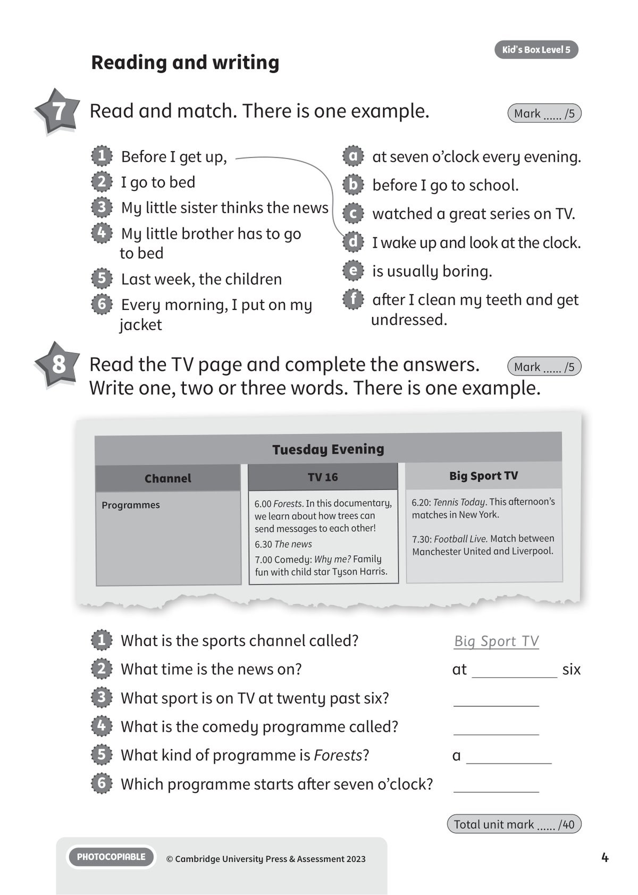

## 音频文件

- 🎧 [KBX_L5_copyright_T1.mp3](KBX_L5_copyright_T1.mp3)
- 🎧 [KBX_L5_U1_audio_T3.mp3](KBX_L5_U1_audio_T3.mp3)

## 第 1 页

Name:
Class:
PHOTOCOPIABLE
© Cambridge University Press & Assessment 2023
1
Vocabulary
1
Time for television
Time for television
Time for television
Kid’s Box Level 5
1
2 	 Listen and write the number.
There is one example.
Mark ...... /5
2 	 Read and choose the correct word.
There is one example.
Mark ...... /5
1   My favourite programme on
TV is a documentary called
Baby Animals.
2   There’s a new TV series called
Island Adventure. I watched
the first
last night.
3   There’s a quiz show tonight at
6.30. It’s on
Eight.
4   My favourite film was on TV
last week, but I couldn’t watch
it. So I want to
it
on my tablet.
5   There are cartoons every
morning on TV. They begin at
9 and
at 9.30.
6   Dad asked me to
on the TV. He wanted to watch
the news.
turn  finish  programme  episode  Channel  stream
1

## 第 2 页

PHOTOCOPIABLE
© Cambridge University Press & Assessment 2023
2
Kid’s Box Level 5
3 	 Read and circle the correct word. There is
one example.
Mark ...... /5
1   If something is not good, it is favourite / bad / great.
2   If you say a film is popular / short / friendly, you mean a lot of
people like it.
3   People like watching action films usually because they are
complete / exciting / funny.
4   If you say a programme is worse / different / amazing, you mean
you like it a lot.
5   Sunny / Boring / Funny films make people laugh.
6   You say a programme is long / interesting / popular if you learn
lots of new things from it.
Grammar and functions
4 	 Read and correct the sentences. There is
one example.
Mark ...... /5
1   Stella got up at half past seven.
Stella got up at ten to eight.
2   She had breakfast at eight o’clock.
3   She caught the bus at five to nine.
4   She went to the supermarket at ten past eleven.
5   She drank some orange juice at twenty to twelve.
6   She watched a comedy at ten to five.

## 第 3 页

PHOTOCOPIABLE
© Cambridge University Press & Assessment 2023
3
Kid’s Box Level 5
5 	 Write the verbs in the past tense. There is
one example.
Mark ...... /5
Yesterday, Petra (1) woke up (wake up) before her parents. She
(2)
(be) the only person awake in her flat. After she
(3)
(get up), she went into the kitchen and started cooking.
First, she cooked eggs and cut some bread for everyone. Then she
made some coffee for her dad. She also (4)
(put) a glass
of orange juice on the table for her mum. When her parents
(5)
(see) the breakfast table, they were really happy.
Everyone sat down and (6)
(have) breakfast together.
‘What a nice way to start the day!’ Petra’s mum said.
Listening
6 	  3 	Listen and tick (✓) the right clock.
There is one example.
Mark ...... /5
The day before Harry’s school holidays
1   What time did Harry’s last lesson finish?
a
✓
b
c
2   What time did Harry catch the bus?
a
b
c
3   What time did Harry arrive home?
a
b
c
4   What time did Harry have dinner?
a
b
c
5   What time did the comedy programme finish?
a
b
c
6   What time did Harry go to bed?
a
b
c

## 第 4 页

PHOTOCOPIABLE
© Cambridge University Press & Assessment 2023
4
Kid’s Box Level 5
Reading and writing
7 	 Read and match. There is one example.
Mark ...... /5
1   Before I get up,
2   I go to bed
3   My little sister thinks the news
4   My little brother has to go
to bed
5   Last week, the children
6   Every morning, I put on my
jacket
a   at seven o’clock every evening.
b   before I go to school.
c   watched a great series on TV.
d   I wake up and look at the clock.
e   is usually boring.
f   after I clean my teeth and get
undressed.
8 	 Read the TV page and complete the answers.
Write one, two or three words. There is one example.
Mark ...... /5
1   What is the sports channel called?
Big Sport TV
2   What time is the news on?
at
six
3   What sport is on TV at twenty past six?
4   What is the comedy programme called?
5   What kind of programme is Forests?
a
6   Which programme starts after seven o’clock?
Total unit mark ...... /40
Tuesday Evening
Channel
TV 16
Big Sport TV
Programmes
6.00 Forests. In this documentary,
we learn about how trees can
send messages to each other!
6.30 The news
7.00 Comedy: Why me? Family
fun with child star Tyson Harris.
6.20: Tennis Today. This afternoon’s
matches in New York.
7.30: Football Live. Match between
Manchester United and Liverpool.
