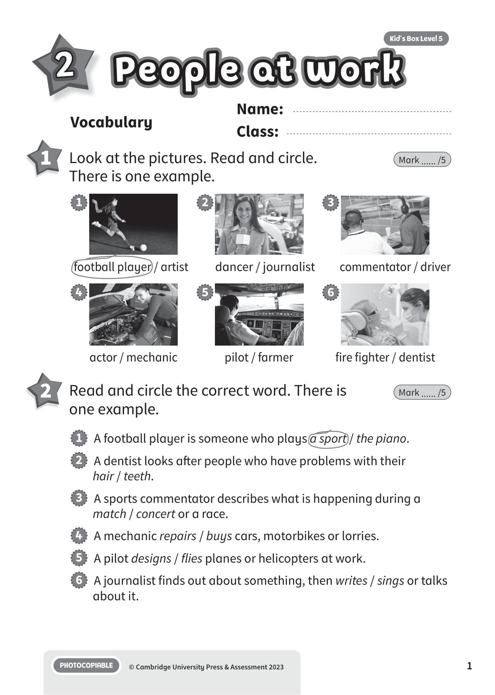
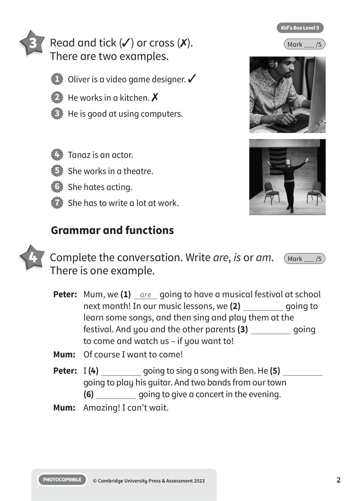
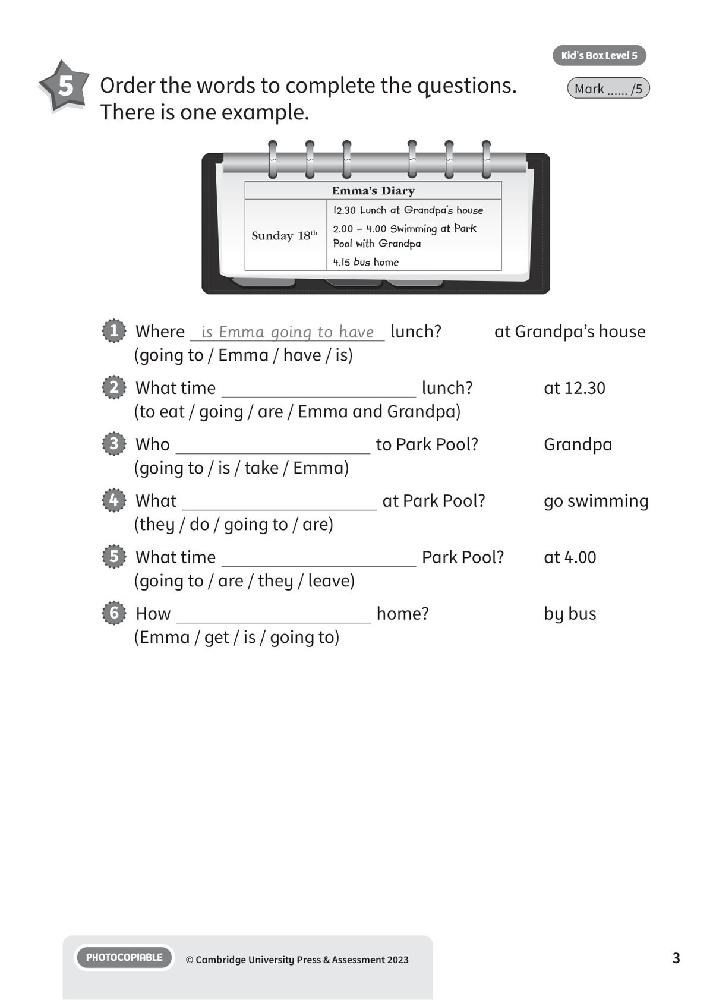
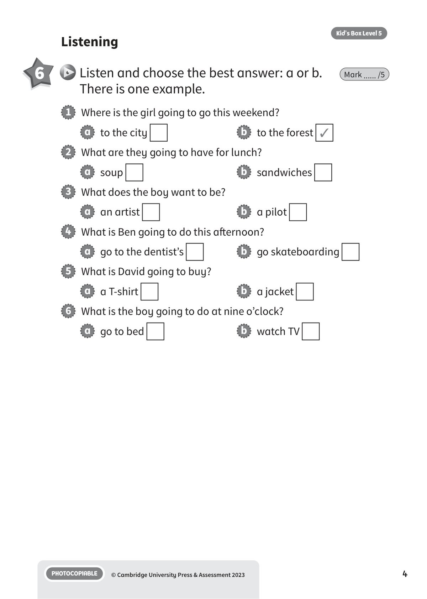
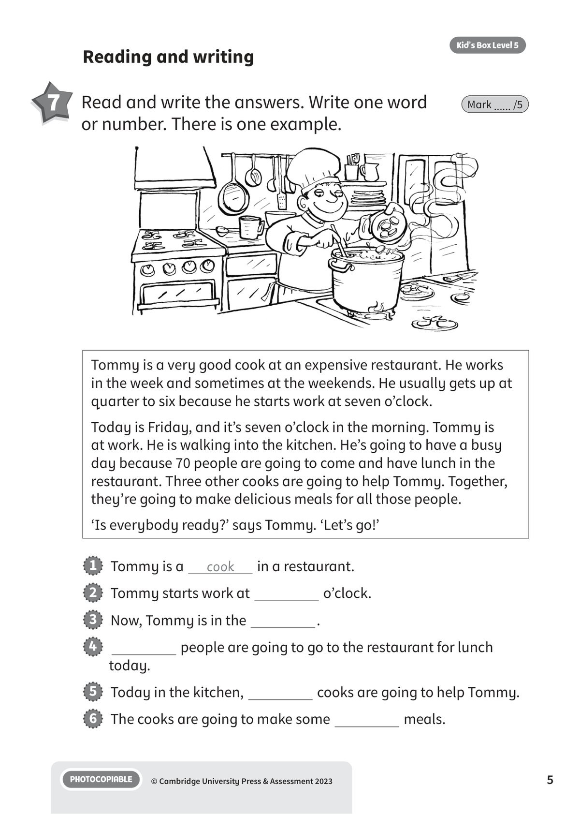
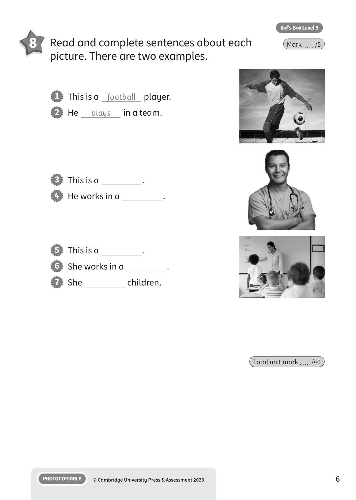

## 第 1 页

Name:
Class:
PHOTOCOPIABLE
© Cambridge University Press & Assessment 2023
1
Vocabulary
2
People at work
People at work
People at work
Kid’s Box Level 5
1 	 Look at the pictures. Read and circle.
There is one example.
Mark ...... /5
2 	 Read and circle the correct word. There is
one example.
Mark ...... /5
1   A football player is someone who plays a sport / the piano.
2   A dentist looks after people who have problems with their
hair / teeth.
3   A sports commentator describes what is happening during a
match / concert or a race.
4   A mechanic repairs / buys cars, motorbikes or lorries.
5   A pilot designs / flies planes or helicopters at work.
6   A journalist finds out about something, then writes / sings or talks
about it.
football player / artist
dancer / journalist
commentator / driver
actor / mechanic
pilot / farmer
fire fighter / dentist
1
4
2
5
3
6

## 第 2 页

PHOTOCOPIABLE
© Cambridge University Press & Assessment 2023
2
Kid’s Box Level 5
Grammar and functions
4 	 Complete the conversation. Write are, is or am.
There is one example.
Mark ...... /5
3 	 Read and tick (✓) or cross (✗).
There are two examples.
Mark ...... /5
Peter: Mum, we (1) are going to have a musical festival at school
next month! In our music lessons, we (2)
going to
learn some songs, and then sing and play them at the
festival. And you and the other parents (3)
going
to come and watch us – if you want to!
Mum:
Of course I want to come!
Peter: I (4)
going to sing a song with Ben. He (5)
going to play his guitar. And two bands from our town
(6)
going to give a concert in the evening.
Mum:
Amazing! I can’t wait.
1   Oliver is a video game designer. ✓
2   He works in a kitchen. ✗
3   He is good at using computers.
4   Tanaz is an actor.
5   She works in a theatre.
6   She hates acting.
7   She has to write a lot at work.

## 第 3 页

PHOTOCOPIABLE
© Cambridge University Press & Assessment 2023
3
Kid’s Box Level 5
5 	 Order the words to complete the questions.
There is one example.
Mark ...... /5
1   Where is Emma going to have lunch?
at Grandpa’s house
(going to / Emma / have / is)
2   What time
lunch?
at 12.30
(to eat / going / are / Emma and Grandpa)
3   Who
to Park Pool?
Grandpa
(going to / is / take / Emma)
4   What
at Park Pool?
go swimming
(they / do / going to / are)
5   What time
Park Pool?
at 4.00
(going to / are / they / leave)
6   How
home?
by bus
(Emma / get / is / going to)
Emma’s Diary
Sunday 18th
12.30 Lunch at Grandpa’s house
2.00 – 4.00 Swimming at Park
Pool with Grandpa
4.15 bus home

## 第 4 页

PHOTOCOPIABLE
© Cambridge University Press & Assessment 2023
4
Kid’s Box Level 5
1   Where is the girl going to go this weekend?
a   to the city
b   to the forest ✓
2   What are they going to have for lunch?
a   soup
b   sandwiches
3   What does the boy want to be?
a   an artist
b   a pilot
4   What is Ben going to do this afternoon?
a   go to the dentist’s
b   go skateboarding
5   What is David going to buy?
a   a T-shirt
b   a jacket
6   What is the boy going to do at nine o’clock?
a   go to bed
b   watch TV
Listening
6
4 	Listen and choose the best answer: a or b.
There is one example.
Mark ...... /5

## 第 5 页

PHOTOCOPIABLE
© Cambridge University Press & Assessment 2023
5
Kid’s Box Level 5
Reading and writing
7 	 Read and write the answers. Write one word
or number. There is one example.
Mark ...... /5
Tommy is a very good cook at an expensive restaurant. He works
in the week and sometimes at the weekends. He usually gets up at
quarter to six because he starts work at seven o’clock.
Today is Friday, and it’s seven o’clock in the morning. Tommy is
at work. He is walking into the kitchen. He’s going to have a busy
day because 70 people are going to come and have lunch in the
restaurant. Three other cooks are going to help Tommy. Together,
they’re going to make delicious meals for all those people.
‘Is everybody ready?’ says Tommy. ‘Let’s go!’
1   Tommy is a
cook
in a restaurant.
2   Tommy starts work at
o’clock.
3   Now, Tommy is in the
.
4
people are going to go to the restaurant for lunch
today.
5   Today in the kitchen,
cooks are going to help Tommy.
6   The cooks are going to make some
meals.

## 第 6 页

PHOTOCOPIABLE
© Cambridge University Press & Assessment 2023
6
Kid’s Box Level 5
8 	 Read and complete sentences about each
picture. There are two examples.
Mark ...... /5
Total unit mark ...... /40
3   This is a
.
4   He works in a
.
5   This is a
.
6   She works in a
.
7   She
children.
1   This is a football player.
2   He
plays
in a team.
