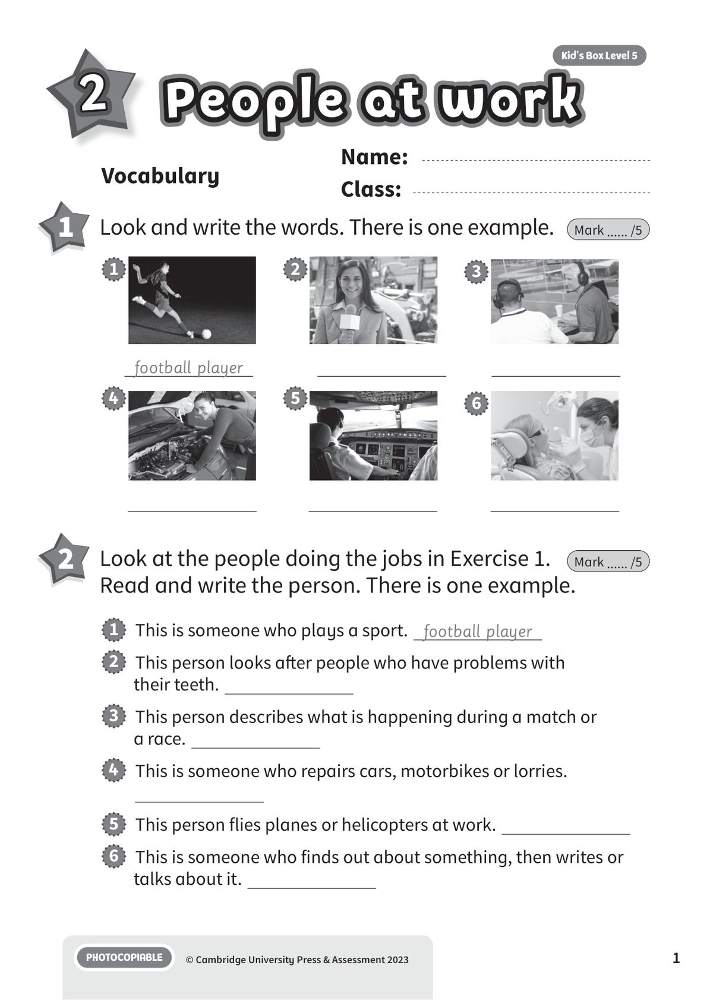
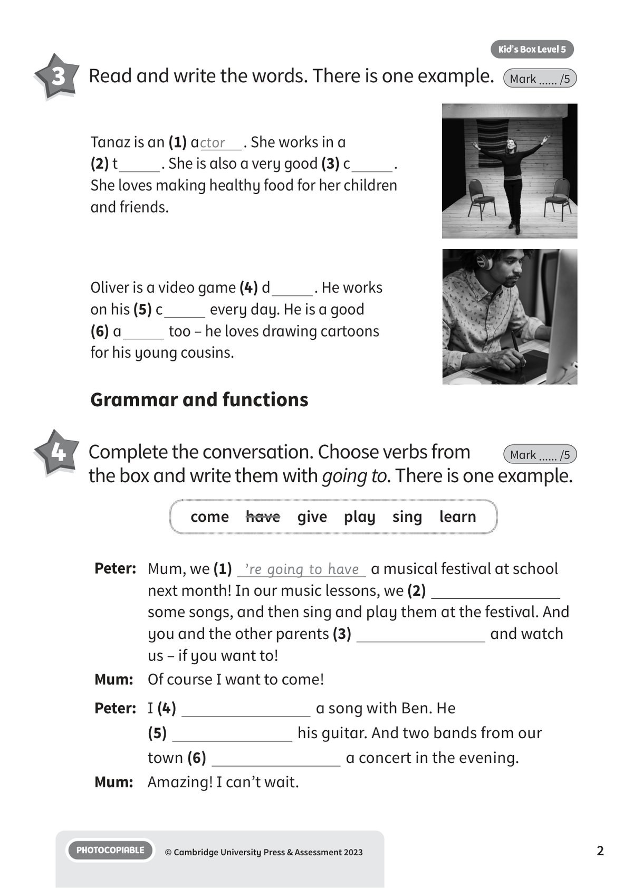
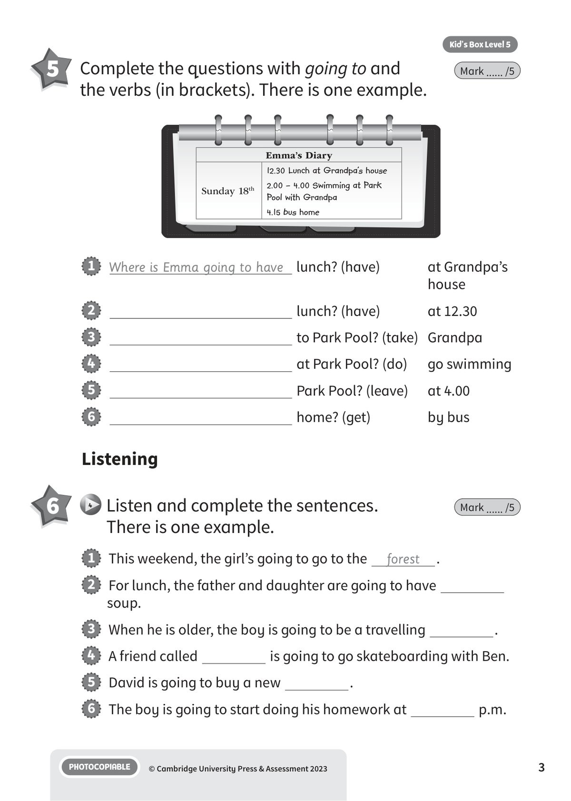
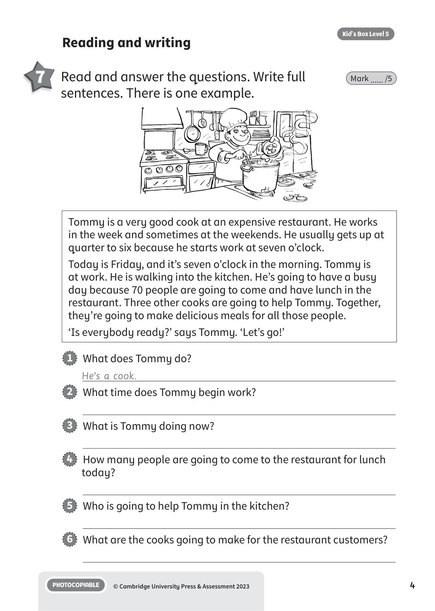
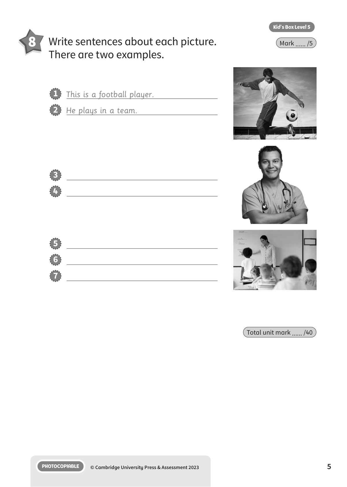

## 第 1 页

Name:
Class:
PHOTOCOPIABLE
© Cambridge University Press & Assessment 2023
1
Vocabulary
2
People at work
People at work
People at work
Kid’s Box Level 5
1 	 Look and write the words. There is one example.
Mark ...... /5
2 	 Look at the people doing the jobs in Exercise 1.
Read and write the person. There is one example.
Mark ...... /5
1   This is someone who plays a sport. football player
2   This person looks after people who have problems with
their teeth.
3   This person describes what is happening during a match or
a race.
4   This is someone who repairs cars, motorbikes or lorries.
5   This person flies planes or helicopters at work.
6   This is someone who finds out about something, then writes or
talks about it.
football player
1
4
2
5
3
6

## 第 2 页

PHOTOCOPIABLE
© Cambridge University Press & Assessment 2023
2
Kid’s Box Level 5
Grammar and functions
4 	 Complete the conversation. Choose verbs from
the box and write them with going to. There is one example.
Mark ...... /5
3 	 Read and write the words. There is one example.
Mark ...... /5
Peter: Mum, we (1) ’re going to have a musical festival at school
next month! In our music lessons, we (2)
some songs, and then sing and play them at the festival. And
you and the other parents (3)
and watch
us – if you want to!
Mum:
Of course I want to come!
Peter: I (4)
a song with Ben. He
(5)
his guitar. And two bands from our
town (6)
a concert in the evening.
Mum:
Amazing! I can’t wait.
come  have  give  play  sing  learn
Tanaz is an (1) actor
. She works in a
(2) t
. She is also a very good (3) c
.
She loves making healthy food for her children
and friends.
Oliver is a video game (4) d
. He works
on his (5) c
every day. He is a good
(6) a
too – he loves drawing cartoons
for his young cousins.

## 第 3 页

PHOTOCOPIABLE
© Cambridge University Press & Assessment 2023
3
Kid’s Box Level 5
5 	 Complete the questions with going to and
the verbs (in brackets). There is one example.
Mark ...... /5
1   Where is Emma going to have lunch? (have)
at Grandpa’s
house
2
lunch? (have)
at 12.30
3
to Park Pool? (take)	 Grandpa
4
at Park Pool? (do)
go swimming
5
Park Pool? (leave)
at 4.00
6
home? (get)
by bus
1   This weekend, the girl’s going to go to the
forest
.
2   For lunch, the father and daughter are going to have
soup.
3   When he is older, the boy is going to be a travelling
.
4   A friend called
is going to go skateboarding with Ben.
5   David is going to buy a new
.
6   The boy is going to start doing his homework at
p.m.
Listening
6
4 	Listen and complete the sentences.
There is one example.
Mark ...... /5
Emma’s Diary
Sunday 18th
12.30 Lunch at Grandpa’s house
2.00 – 4.00 Swimming at Park
Pool with Grandpa
4.15 bus home

## 第 4 页

PHOTOCOPIABLE
© Cambridge University Press & Assessment 2023
4
Kid’s Box Level 5
Reading and writing
7 	 Read and answer the questions. Write full
sentences. There is one example.
Mark ...... /5
Tommy is a very good cook at an expensive restaurant. He works
in the week and sometimes at the weekends. He usually gets up at
quarter to six because he starts work at seven o’clock.
Today is Friday, and it’s seven o’clock in the morning. Tommy is
at work. He is walking into the kitchen. He’s going to have a busy
day because 70 people are going to come and have lunch in the
restaurant. Three other cooks are going to help Tommy. Together,
they’re going to make delicious meals for all those people.
‘Is everybody ready?’ says Tommy. ‘Let’s go!’
1   What does Tommy do?
He’s a cook.
2   What time does Tommy begin work?
3   What is Tommy doing now?
4   How many people are going to come to the restaurant for lunch
today?
5   Who is going to help Tommy in the kitchen?
6   What are the cooks going to make for the restaurant customers?

## 第 5 页

PHOTOCOPIABLE
© Cambridge University Press & Assessment 2023
5
Kid’s Box Level 5
8 	 Write sentences about each picture.
There are two examples.
Mark ...... /5
Total unit mark ...... /40
3
4
5
6
7
1   This is a football player.
2   He plays in a team.
