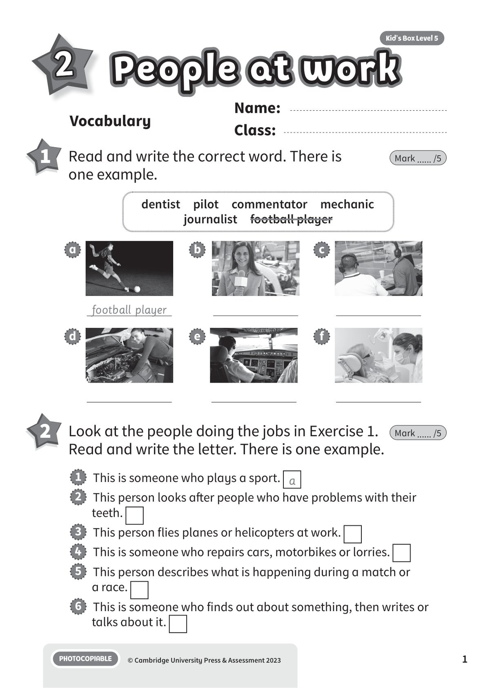
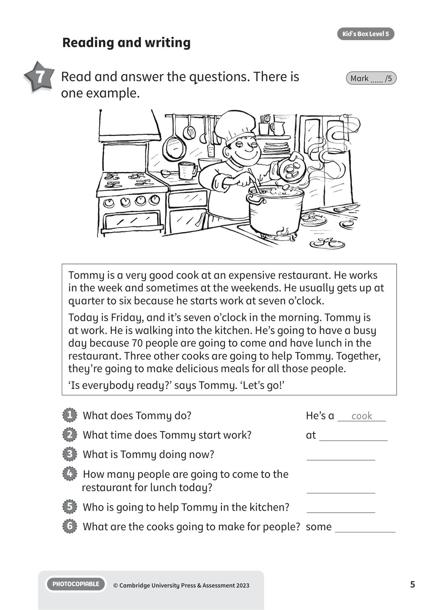
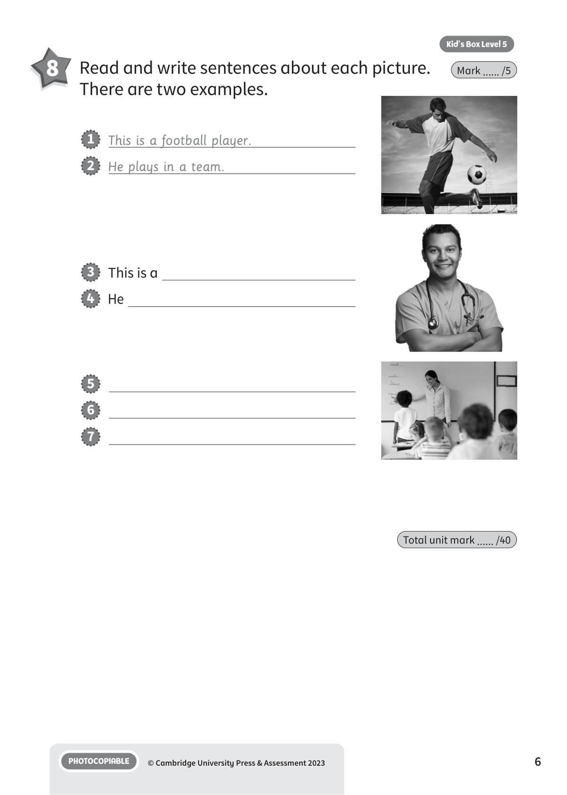

## 第 1 页

Name:
Class:
PHOTOCOPIABLE
© Cambridge University Press & Assessment 2023
1
Vocabulary
2
People at work
People at work
People at work
Kid’s Box Level 5
1 	 Read and write the correct word. There is
one example.
Mark ...... /5
2 	 Look at the people doing the jobs in Exercise 1.
Read and write the letter. There is one example.
Mark ...... /5
1   This is someone who plays a sport. a
2   This person looks after people who have problems with their
teeth.
3   This person flies planes or helicopters at work.
4   This is someone who repairs cars, motorbikes or lorries.
5   This person describes what is happening during a match or
a race.
6   This is someone who finds out about something, then writes or
talks about it.
dentist  pilot  commentator  mechanic
journalist  football player
a
b
c
football player
d
e
f

## 第 2 页

PHOTOCOPIABLE
© Cambridge University Press & Assessment 2023
2
Kid’s Box Level 5
3 	 Read and choose the right words.
There is one example.
Mark ...... /5
Grammar and functions
4 	 Complete the conversation. Write the verbs
with going to. There is one example.
Mark ...... /5
Peter: Mum, we (1) ’re going to have (have) a musical festival at
school next month! In our music lessons, we
(2)
(learn) some songs, and then sing and
play them at the festival. And you and the other parents
(3)
(come) and watch us – if you want to!
Mum:
Of course I want to come!
Peter: I (4)
(sing) a song with Ben. He
(5)
(play) his guitar. And two bands from
our town (6)
(give) a concert in
the evening.
Mum:
Amazing! I can’t wait.
actor  theatre  artist  cook  designer  computer
Tanaz is an (1) actor . She works in a
(2)
. She is also a very good
(3)
. She loves making healthy
food for her children and friends.
Oliver is a video game (4)
.
He works on his (5)
every day.
He is a good (6)
too – he loves
drawing cartoons for his young cousins.

## 第 3 页

PHOTOCOPIABLE
© Cambridge University Press & Assessment 2023
3
Kid’s Box Level 5
5 	 Complete the questions with going to.
There is one example.
Mark ...... /5
1   Where are Emma and Grandpa going to have lunch?
(Emma and Grandpa/have)
2   What time
lunch?
at 12.30
(Emma/have)
3   What
at Park Pool?
(they/do)
4   Who
to Park Pool? 	 Grandpa
(take Emma)
5   What time
Park Pool? 	at 4.00
(they/leave)
6   How
home?
by bus
(Emma/get)
Emma’s Diary
Sunday 18th
12.30 Lunch at Grandpa’s house
2.00 – 4.00 Swimming at Park
Pool with Grandpa
4.15 bus home
at Grandpa’s
house
go
swimming

## 第 4 页

PHOTOCOPIABLE
© Cambridge University Press & Assessment 2023
4
Kid’s Box Level 5
Listening
6 	  4 	Listen and choose the best answer: a, b or c.
There is one example.
Mark ...... /5
1   Where is the girl going to go this weekend?
a
b
c
✓
2   What kind of soup are they going to have for lunch?
a
b
c
3   What is the boy going to be when he’s older?
a
b
c
4   Who is going to go skateboarding with Ben?
a
b
c
5   What is David going to buy?
a
b
c
6   What time is the boy going to do his homework?
a
b
c

## 第 5 页

PHOTOCOPIABLE
© Cambridge University Press & Assessment 2023
5
Kid’s Box Level 5
Reading and writing
7 	 Read and answer the questions. There is
one example.
Mark ...... /5
Tommy is a very good cook at an expensive restaurant. He works
in the week and sometimes at the weekends. He usually gets up at
quarter to six because he starts work at seven o’clock.
Today is Friday, and it’s seven o’clock in the morning. Tommy is
at work. He is walking into the kitchen. He’s going to have a busy
day because 70 people are going to come and have lunch in the
restaurant. Three other cooks are going to help Tommy. Together,
they’re going to make delicious meals for all those people.
‘Is everybody ready?’ says Tommy. ‘Let’s go!’
1   What does Tommy do?
He’s a
cook
2   What time does Tommy start work?
at
3   What is Tommy doing now?
4   How many people are going to come to the
restaurant for lunch today?
5   Who is going to help Tommy in the kitchen?
6   What are the cooks going to make for people?	 some

## 第 6 页

PHOTOCOPIABLE
© Cambridge University Press & Assessment 2023
6
Kid’s Box Level 5
8 	 Read and write sentences about each picture.
There are two examples.
Mark ...... /5
3   This is a
4   He
5
6
7
Total unit mark ...... /40
1   This is a football player.
2   He plays in a team.
