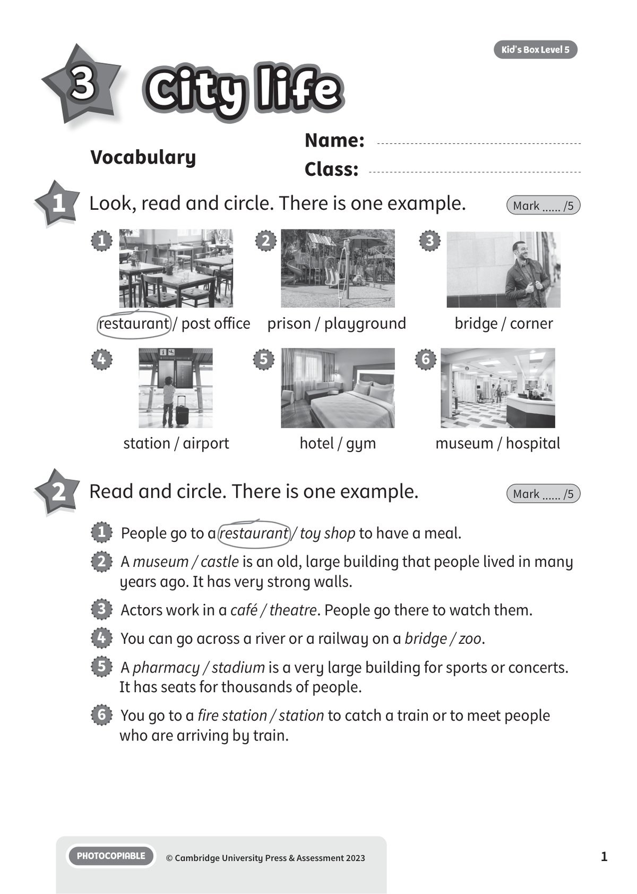
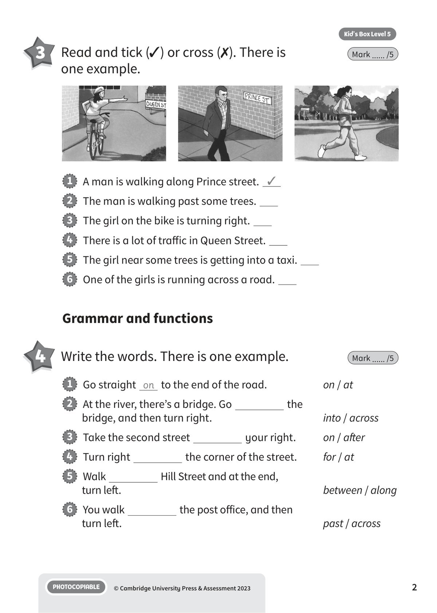
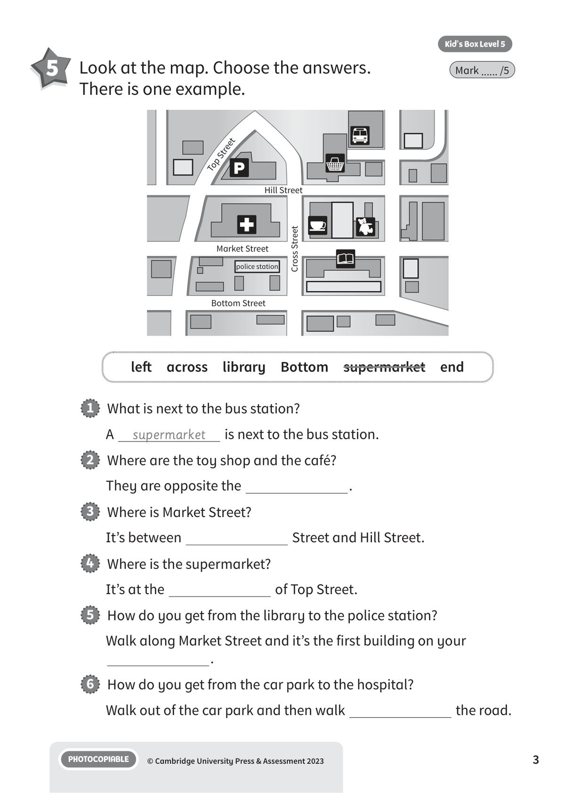
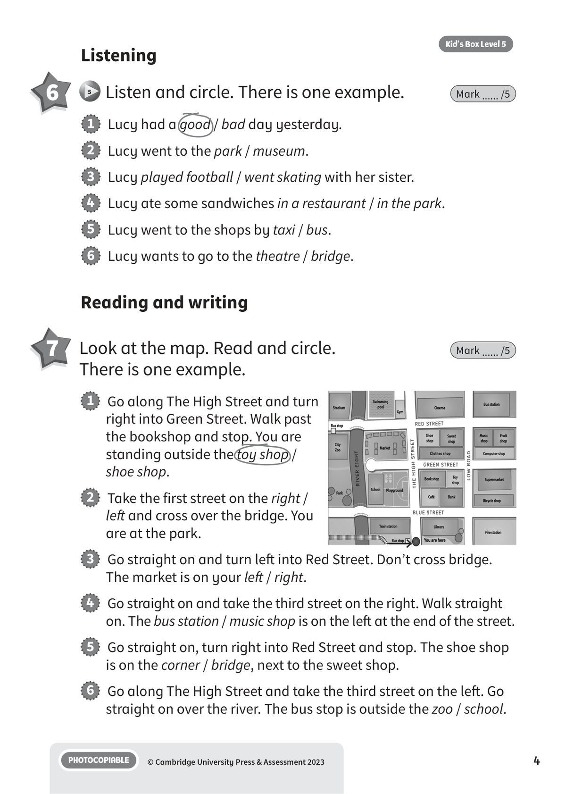
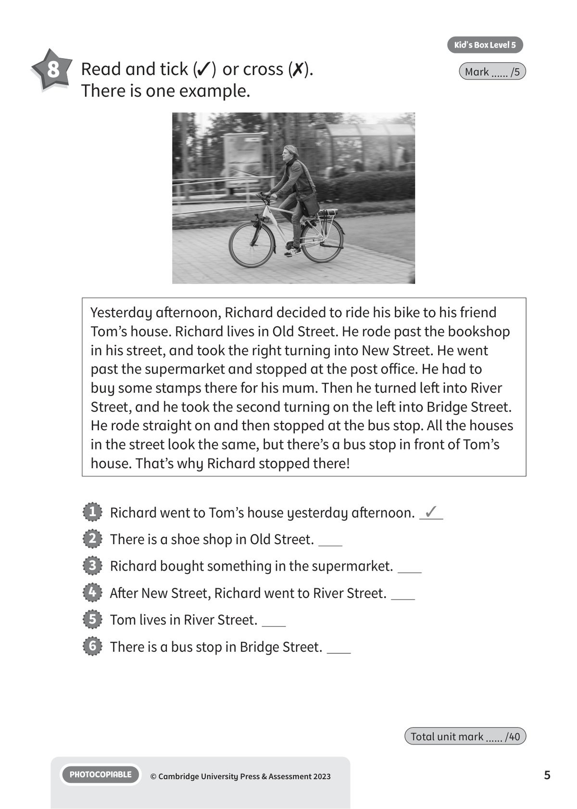
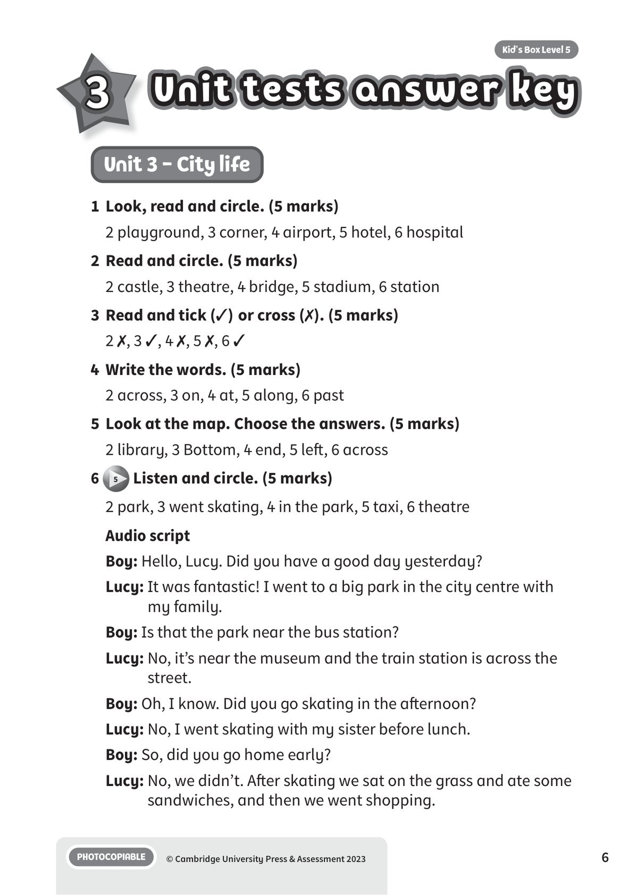
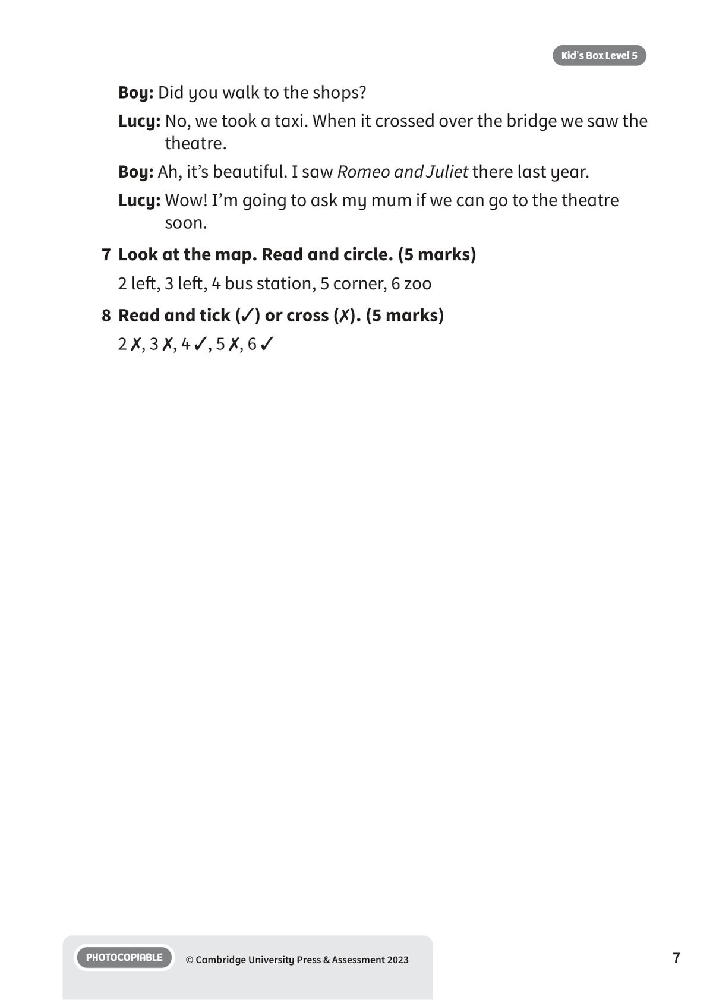

## 音频文件

- 🎧 [KBX_L5_U3_audio_T5.mp3](KBX_L5_U3_audio_T5.mp3)

## 第 1 页

Name:
Class:
PHOTOCOPIABLE
© Cambridge University Press & Assessment 2023
1
Vocabulary
3
City life
City life
City life
Kid’s Box Level 5
1 	 Look, read and circle. There is one example.
Mark ...... /5
2 	 Read and circle. There is one example.
Mark ...... /5
restaurant / post office
1
prison / playground
2
bridge / corner
3
station / airport
4
hotel / gym
5
museum / hospital
6
1   People go to a restaurant / toy shop to have a meal.
2   A museum / castle is an old, large building that people lived in many
years ago. It has very strong walls.
3   Actors work in a café / theatre. People go there to watch them.
4   You can go across a river or a railway on a bridge / zoo.
5   A pharmacy / stadium is a very large building for sports or concerts.
It has seats for thousands of people.
6   You go to a fire station / station to catch a train or to meet people
who are arriving by train.

## 第 2 页

PHOTOCOPIABLE
© Cambridge University Press & Assessment 2023
2
Kid’s Box Level 5
3 	 Read and tick (✓) or cross (✗). There is
one example.
Mark ...... /5
1   A man is walking along Prince street. ✓
2   The man is walking past some trees.
3   The girl on the bike is turning right.
4   There is a lot of traffic in Queen Street.
5   The girl near some trees is getting into a taxi.
6   One of the girls is running across a road.
1   Go straight on to the end of the road.
on / at
2   At the river, there’s a bridge. Go
the
bridge, and then turn right.
into / across
3   Take the second street
your right.
on / after
4   Turn right
the corner of the street.
for / at
5   Walk
Hill Street and at the end,
turn left.
between / along
6   You walk
the post office, and then
turn left.
past / across
Grammar and functions
4 	 Write the words. There is one example.
Mark ...... /5

## 第 3 页

PHOTOCOPIABLE
© Cambridge University Press & Assessment 2023
3
Kid’s Box Level 5
5 	 Look at the map. Choose the answers.
There is one example.
Mark ...... /5
1   What is next to the bus station?
A
supermarket
is next to the bus station.
2   Where are the toy shop and the café?
They are opposite the
.
3   Where is Market Street?
It’s between
Street and Hill Street.
4   Where is the supermarket?
It’s at the
of Top Street.
5   How do you get from the library to the police station?
Walk along Market Street and it’s the first building on your
.
6   How do you get from the car park to the hospital?
Walk out of the car park and then walk
the road.
left  across  library  Bottom  supermarket  end
Market Street
Bottom Street
police station
Hill Street
Top Street
Cross Street

## 第 4 页

PHOTOCOPIABLE
© Cambridge University Press & Assessment 2023
4
Kid’s Box Level 5
Listening
6
5 	Listen and circle. There is one example.
Mark ...... /5
1   Lucy had a good / bad day yesterday.
2   Lucy went to the park / museum.
3   Lucy played football / went skating with her sister.
4   Lucy ate some sandwiches in a restaurant / in the park.
5   Lucy went to the shops by taxi / bus.
6   Lucy wants to go to the theatre / bridge.
Reading and writing
7 	 Look at the map. Read and circle.
There is one example.
Mark ...... /5
1   Go along The High Street and turn
right into Green Street. Walk past
the bookshop and stop. You are
standing outside the toy shop /
shoe shop.
2   Take the first street on the right /
left and cross over the bridge. You
are at the park.
3   Go straight on and turn left into Red Street. Don’t cross bridge.
The market is on your left / right.
4   Go straight on and take the third street on the right. Walk straight
on. The bus station / music shop is on the left at the end of the street.
5   Go straight on, turn right into Red Street and stop. The shoe shop
is on the corner / bridge, next to the sweet shop.
6   Go along The High Street and take the third street on the left. Go
straight on over the river. The bus stop is outside the zoo / school.

## 第 5 页

PHOTOCOPIABLE
© Cambridge University Press & Assessment 2023
5
Kid’s Box Level 5
8 	 Read and tick (✓) or cross (✗).
There is one example.
Mark ...... /5
Yesterday afternoon, Richard decided to ride his bike to his friend
Tom’s house. Richard lives in Old Street. He rode past the bookshop
in his street, and took the right turning into New Street. He went
past the supermarket and stopped at the post office. He had to
buy some stamps there for his mum. Then he turned left into River
Street, and he took the second turning on the left into Bridge Street.
He rode straight on and then stopped at the bus stop. All the houses
in the street look the same, but there’s a bus stop in front of Tom’s
house. That’s why Richard stopped there!
1   Richard went to Tom’s house yesterday afternoon. ✓
2   There is a shoe shop in Old Street.
3   Richard bought something in the supermarket.
4   After New Street, Richard went to River Street.
5   Tom lives in River Street.
6   There is a bus stop in Bridge Street.
Total unit mark ...... /40

## 第 6 页

Unit tests answer key
Unit tests answer key
Unit tests answer key
PHOTOCOPIABLE
© Cambridge University Press & Assessment 2023
6
Kid’s Box Level 5
3
Unit 3 - City life
1	 Look, read and circle. (5 marks)
2 playground, 3 corner, 4 airport, 5 hotel, 6 hospital
2	 Read and circle. (5 marks)
2 castle, 3 theatre, 4 bridge, 5 stadium, 6 station
3	 Read and tick (✓) or cross (✗). (5 marks)
2 ✗, 3 ✓, 4 ✗, 5 ✗, 6 ✓
4	 Write the words. (5 marks)
2 across, 3 on, 4 at, 5 along, 6 past
5	 Look at the map. Choose the answers. (5 marks)
2 library, 3 Bottom, 4 end, 5 left, 6 across
6
5 Listen and circle. (5 marks)
2 park, 3 went skating, 4 in the park, 5 taxi, 6 theatre
Audio script
Boy: Hello, Lucy. Did you have a good day yesterday?
Lucy: It was fantastic! I went to a big park in the city centre with
my family.
Boy: Is that the park near the bus station?
Lucy: No, it’s near the museum and the train station is across the
street.
Boy: Oh, I know. Did you go skating in the afternoon?
Lucy: No, I went skating with my sister before lunch.
Boy: So, did you go home early?
Lucy: No, we didn’t. After skating we sat on the grass and ate some
sandwiches, and then we went shopping.

## 第 7 页

PHOTOCOPIABLE
© Cambridge University Press & Assessment 2023
7
Kid’s Box Level 5
Boy: Did you walk to the shops?
Lucy: No, we took a taxi. When it crossed over the bridge we saw the
theatre.
Boy: Ah, it’s beautiful. I saw Romeo and Juliet there last year.
Lucy: Wow! I’m going to ask my mum if we can go to the theatre
soon.
7	 Look at the map. Read and circle. (5 marks)
2 left, 3 left, 4 bus station, 5 corner, 6 zoo
8	 Read and tick (✓) or cross (✗). (5 marks)
2 ✗, 3 ✗, 4 ✓, 5 ✗, 6 ✓
