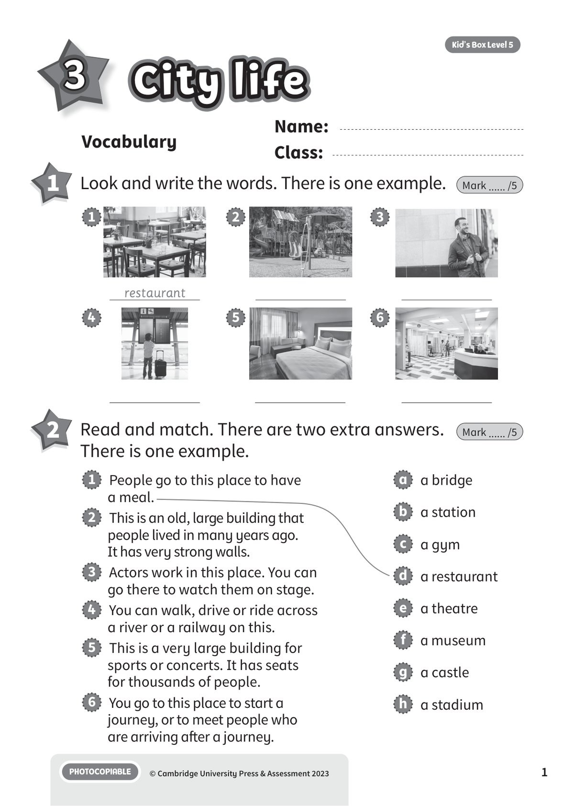
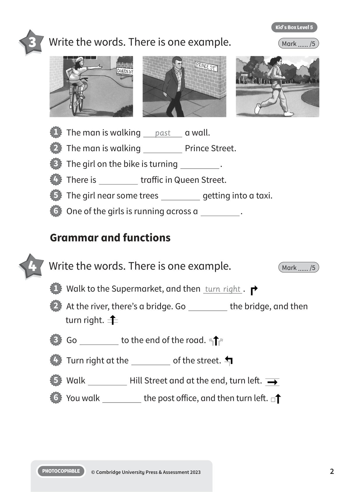
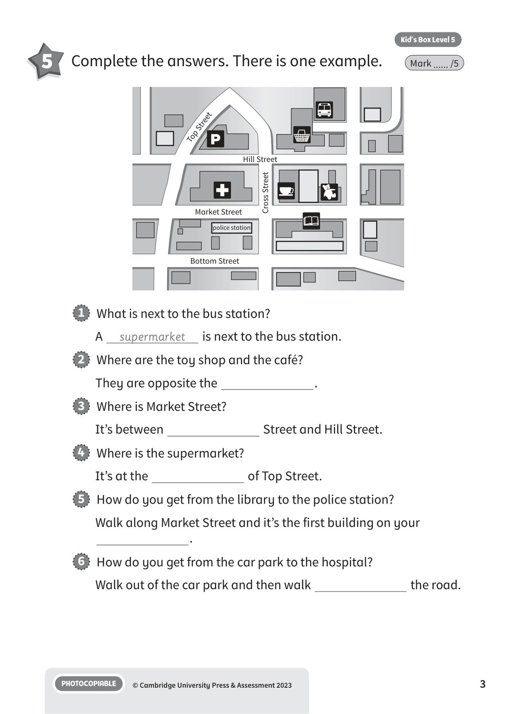
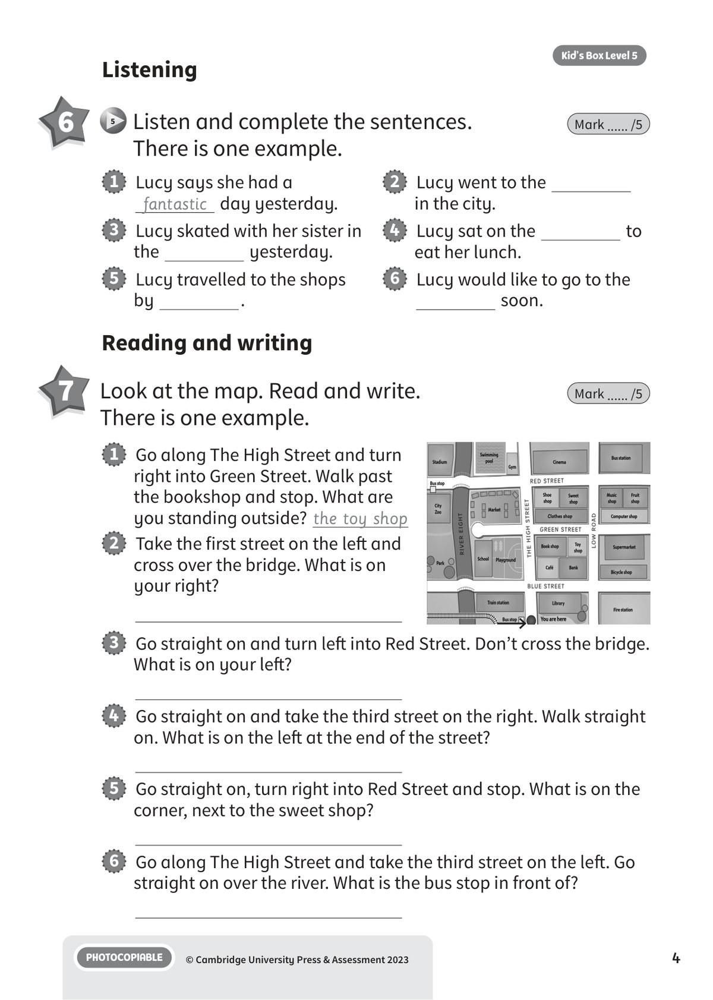
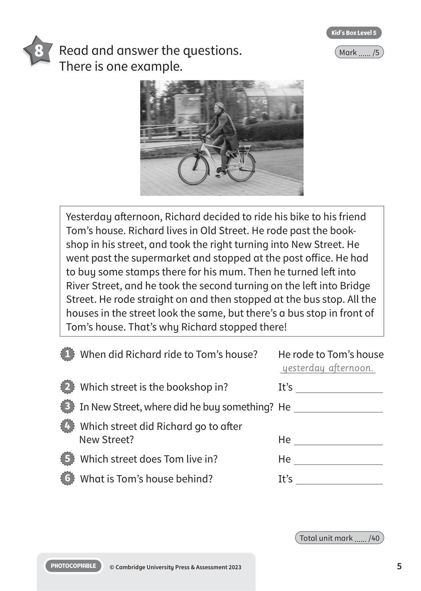
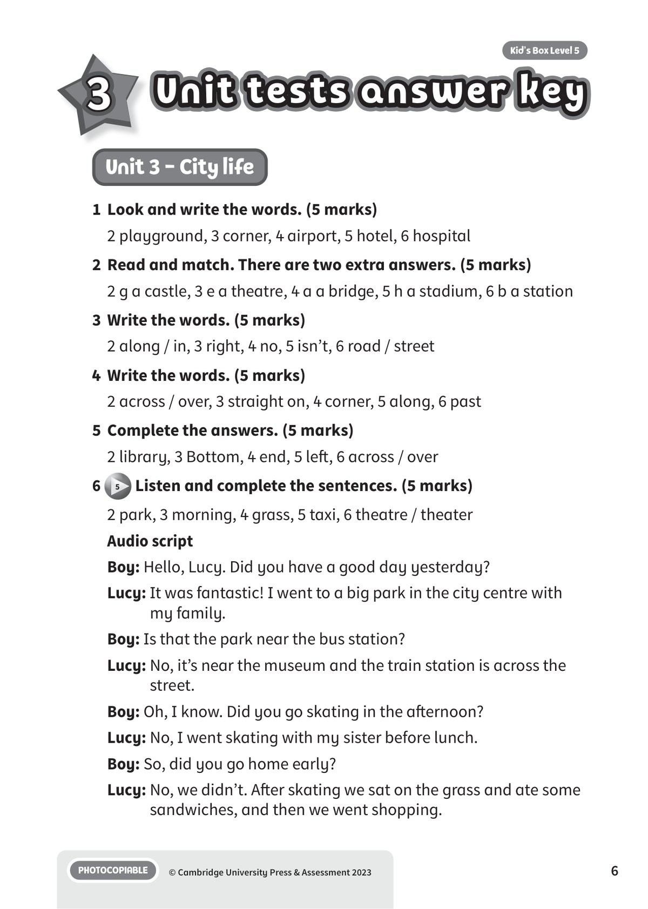
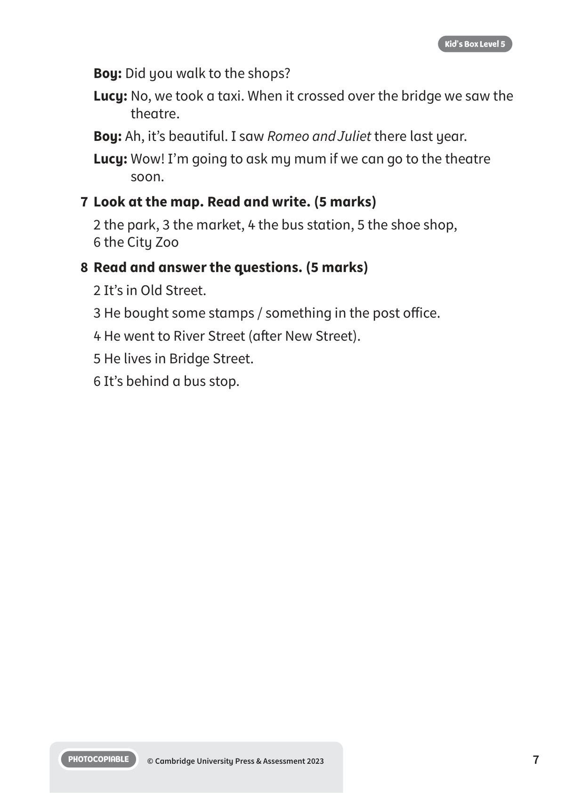

## 音频文件

- 🎧 [KBX_L5_U3_audio_T5.mp3](KBX_L5_U3_audio_T5.mp3)

## 第 1 页

Name:
Class:
PHOTOCOPIABLE
© Cambridge University Press & Assessment 2023
1
Vocabulary
City life
City life
City life
Kid’s Box Level 5
3
1 	 Look and write the words. There is one example.
Mark ...... /5
2 	 Read and match. There are two extra answers.
There is one example.
Mark ...... /5
1   People go to this place to have
a meal.
2   This is an old, large building that
people lived in many years ago.
It has very strong walls.
3   Actors work in this place. You can
go there to watch them on stage.
4   You can walk, drive or ride across
a river or a railway on this.
5   This is a very large building for
sports or concerts. It has seats
for thousands of people.
6   You go to this place to start a
journey, or to meet people who
are arriving after a journey.
restaurant
1
4
2
5
3
6
a   a bridge
b   a station
c   a gym
d   a restaurant
e   a theatre
f   a museum
g   a castle
h   a stadium

## 第 2 页

PHOTOCOPIABLE
© Cambridge University Press & Assessment 2023
2
Kid’s Box Level 5
3 	 Write the words. There is one example.
Mark ...... /5
1   The man is walking
past
a wall.
2   The man is walking
Prince Street.
3   The girl on the bike is turning
.
4   There is
traffic in Queen Street.
5   The girl near some trees
getting into a taxi.
6   One of the girls is running across a
.
1   Walk to the Supermarket, and then turn right .
2   At the river, there’s a bridge. Go
the bridge, and then
turn right.
3   Go
to the end of the road.
4   Turn right at the
of the street.
5   Walk
Hill Street and at the end, turn left.
6   You walk
the post office, and then turn left.
Grammar and functions
4 	 Write the words. There is one example.
Mark ...... /5

## 第 3 页

PHOTOCOPIABLE
© Cambridge University Press & Assessment 2023
3
Kid’s Box Level 5
5 	 Complete the answers. There is one example.
Mark ...... /5
1   What is next to the bus station?
A
supermarket
is next to the bus station.
2   Where are the toy shop and the café?
They are opposite the
.
3   Where is Market Street?
It’s between
Street and Hill Street.
4   Where is the supermarket?
It’s at the
of Top Street.
5   How do you get from the library to the police station?
Walk along Market Street and it’s the first building on your
.
6   How do you get from the car park to the hospital?
Walk out of the car park and then walk
the road.
Market Street
Bottom Street
police station
Hill Street
Top Street
Cross Street

## 第 4 页

PHOTOCOPIABLE
© Cambridge University Press & Assessment 2023
4
Kid’s Box Level 5
1   Lucy says she had a
fantastic day yesterday.
3   Lucy skated with her sister in
the
yesterday.
5   Lucy travelled to the shops
by
.
2   Lucy went to the
in the city.
4   Lucy sat on the
to
eat her lunch.
6   Lucy would like to go to the
soon.
Listening
6
5 	Listen and complete the sentences.
There is one example.
Mark ...... /5
Reading and writing
7 	 Look at the map. Read and write.
There is one example.
Mark ...... /5
1   Go along The High Street and turn
right into Green Street. Walk past
the bookshop and stop. What are
you standing outside? the toy shop
2   Take the first street on the left and
cross over the bridge. What is on
your right?
3   Go straight on and turn left into Red Street. Don’t cross the bridge.
What is on your left?
4   Go straight on and take the third street on the right. Walk straight
on. What is on the left at the end of the street?
5   Go straight on, turn right into Red Street and stop. What is on the
corner, next to the sweet shop?
6   Go along The High Street and take the third street on the left. Go
straight on over the river. What is the bus stop in front of?

## 第 5 页

PHOTOCOPIABLE
© Cambridge University Press & Assessment 2023
5
Kid’s Box Level 5
8 	 Read and answer the questions.
There is one example.
Mark ...... /5
Yesterday afternoon, Richard decided to ride his bike to his friend
Tom’s house. Richard lives in Old Street. He rode past the book-
shop in his street, and took the right turning into New Street. He
went past the supermarket and stopped at the post office. He had
to buy some stamps there for his mum. Then he turned left into
River Street, and he took the second turning on the left into Bridge
Street. He rode straight on and then stopped at the bus stop. All the
houses in the street look the same, but there’s a bus stop in front of
Tom’s house. That’s why Richard stopped there!
1   When did Richard ride to Tom’s house?
He rode to Tom’s house
yesterday afternoon.
2   Which street is the bookshop in?
It’s
3   In New Street, where did he buy something? He
4   Which street did Richard go to after
New Street?
He
5   Which street does Tom live in?
He
6   What is Tom’s house behind?
It’s
Total unit mark ...... /40

## 第 6 页

Unit tests answer key
Unit tests answer key
Unit tests answer key
PHOTOCOPIABLE
© Cambridge University Press & Assessment 2023
6
Kid’s Box Level 5
3
Unit 3 - City life
1	 Look and write the words. (5 marks)
2 playground, 3 corner, 4 airport, 5 hotel, 6 hospital
2	 Read and match. There are two extra answers. (5 marks)
2 g a castle, 3 e a theatre, 4 a a bridge, 5 h a stadium, 6 b a station
3	 Write the words. (5 marks)
2 along / in, 3 right, 4 no, 5 isn’t, 6 road / street
4	 Write the words. (5 marks)
2 across / over, 3 straight on, 4 corner, 5 along, 6 past
5	 Complete the answers. (5 marks)
2 library, 3 Bottom, 4 end, 5 left, 6 across / over
6
5 Listen and complete the sentences. (5 marks)
2 park, 3 morning, 4 grass, 5 taxi, 6 theatre / theater
Audio script
Boy: Hello, Lucy. Did you have a good day yesterday?
Lucy: It was fantastic! I went to a big park in the city centre with
my family.
Boy: Is that the park near the bus station?
Lucy: No, it’s near the museum and the train station is across the
street.
Boy: Oh, I know. Did you go skating in the afternoon?
Lucy: No, I went skating with my sister before lunch.
Boy: So, did you go home early?
Lucy: No, we didn’t. After skating we sat on the grass and ate some
sandwiches, and then we went shopping.

## 第 7 页

PHOTOCOPIABLE
© Cambridge University Press & Assessment 2023
7
Kid’s Box Level 5
Boy: Did you walk to the shops?
Lucy: No, we took a taxi. When it crossed over the bridge we saw the
theatre.
Boy: Ah, it’s beautiful. I saw Romeo and Juliet there last year.
Lucy: Wow! I’m going to ask my mum if we can go to the theatre
soon.
7	 Look at the map. Read and write. (5 marks)
2 the park, 3 the market, 4 the bus station, 5 the shoe shop,
6 the City Zoo
8	 Read and answer the questions. (5 marks)
2 It’s in Old Street.
3 He bought some stamps / something in the post office.
4 He went to River Street (after New Street).
5 He lives in Bridge Street.
6 It’s behind a bus stop.
