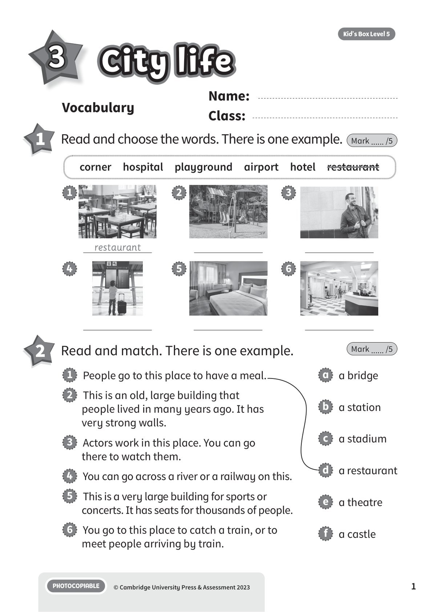
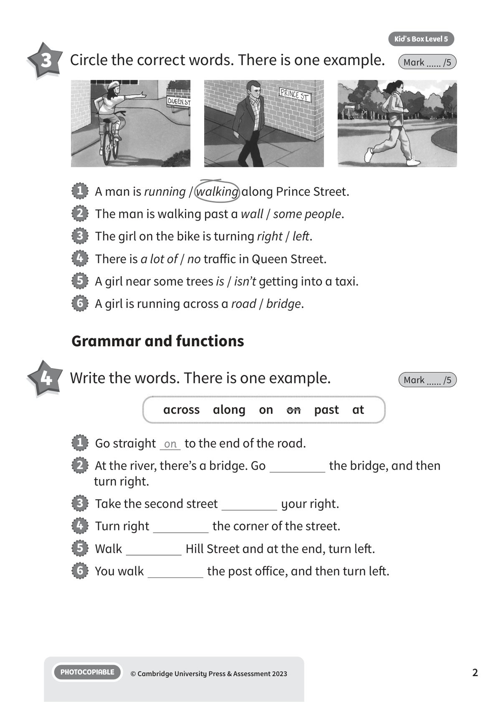
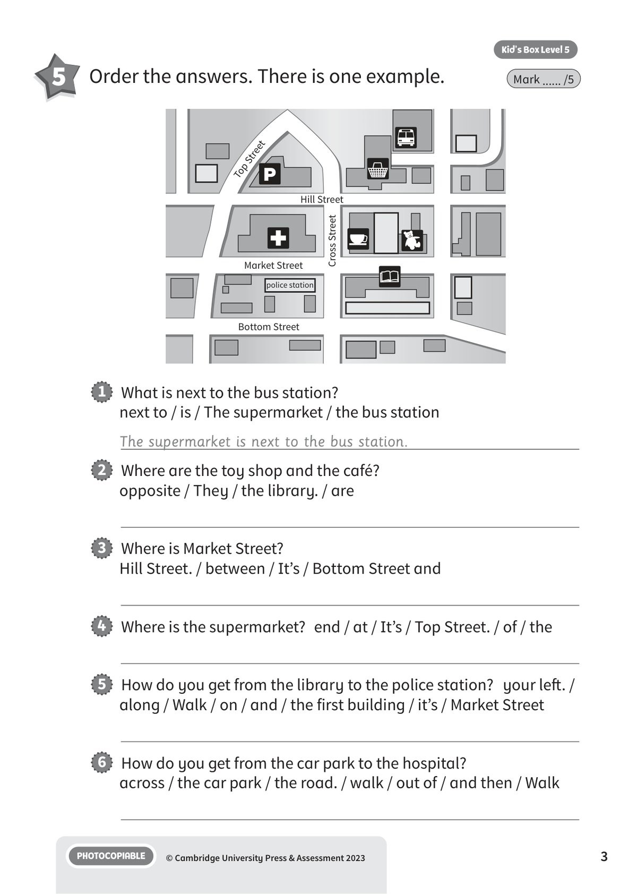
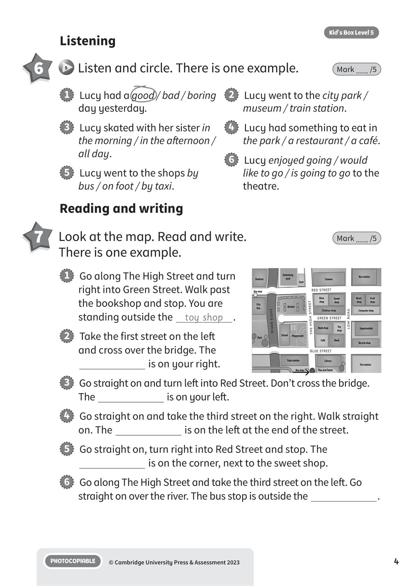
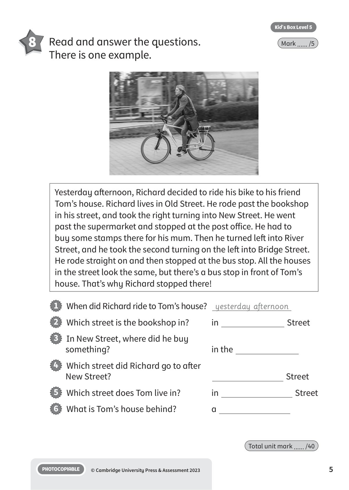
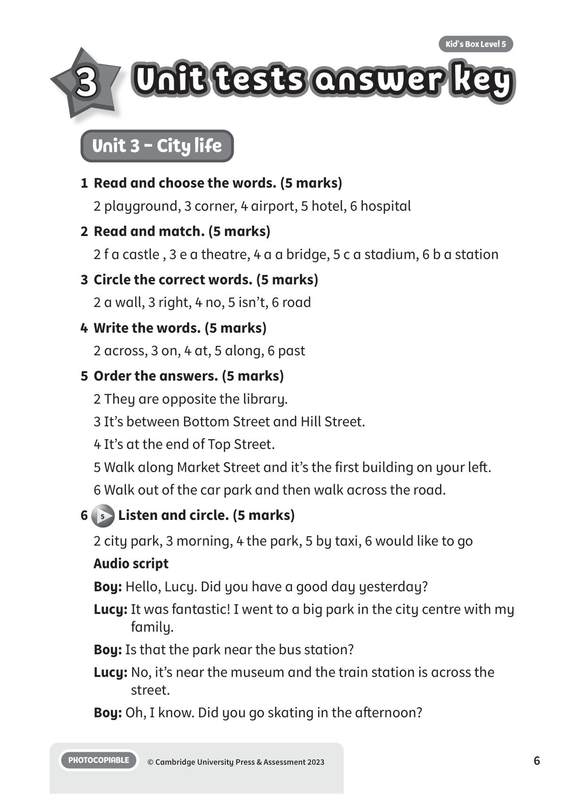
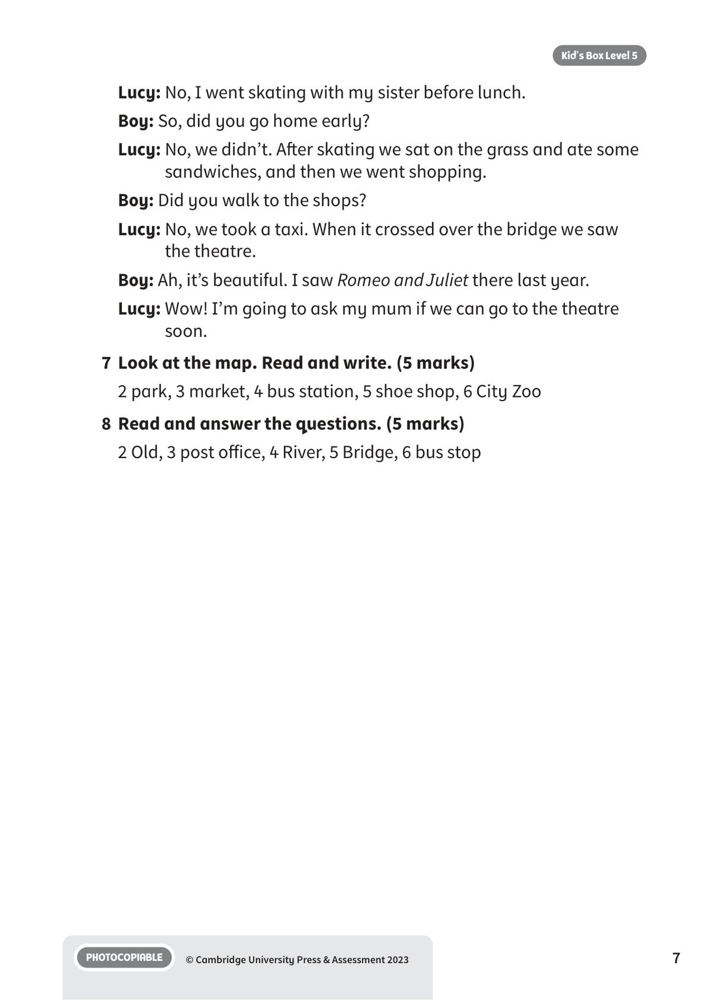

## 音频文件

- 🎧 [KBX_L5_U3_audio_T5.mp3](KBX_L5_U3_audio_T5.mp3)

## 第 1 页

Name:
Class:
PHOTOCOPIABLE
© Cambridge University Press & Assessment 2023
1
Vocabulary
City life
City life
City life
Kid’s Box Level 5
3
1 	 Read and choose the words. There is one example.
Mark ...... /5
corner  hospital  playground  airport  hotel  restaurant
2 	 Read and match. There is one example.
Mark ...... /5
restaurant
1
2
3
4
5
6
1   People go to this place to have a meal.
2   This is an old, large building that
people lived in many years ago. It has
very strong walls.
3   Actors work in this place. You can go
there to watch them.
4   You can go across a river or a railway on this.
5   This is a very large building for sports or
concerts. It has seats for thousands of people.
6   You go to this place to catch a train, or to
meet people arriving by train.
a   a bridge
b   a station
c   a stadium
d   a restaurant
e   a theatre
f   a castle

## 第 2 页

PHOTOCOPIABLE
© Cambridge University Press & Assessment 2023
2
Kid’s Box Level 5
Grammar and functions
4 	 Write the words. There is one example.
Mark ...... /5
3 	 Circle the correct words. There is one example.
Mark ...... /5
1   A man is running / walking along Prince Street.
2   The man is walking past a wall / some people.
3   The girl on the bike is turning right / left.
4   There is a lot of / no traffic in Queen Street.
5   A girl near some trees is / isn’t getting into a taxi.
6   A girl is running across a road / bridge.
1   Go straight on to the end of the road.
2   At the river, there’s a bridge. Go
the bridge, and then
turn right.
3   Take the second street
your right.
4   Turn right
the corner of the street.
5   Walk
Hill Street and at the end, turn left.
6   You walk
the post office, and then turn left.
across  along  on  on  past  at

## 第 3 页

PHOTOCOPIABLE
© Cambridge University Press & Assessment 2023
3
Kid’s Box Level 5
5 	 Order the answers. There is one example.
Mark ...... /5
1   What is next to the bus station?
next to / is / The supermarket / the bus station
The supermarket is next to the bus station.
2   Where are the toy shop and the café?
opposite / They / the library. / are
3   Where is Market Street?
Hill Street. / between / It’s / Bottom Street and
4   Where is the supermarket?  end / at / It’s / Top Street. / of / the
5   How do you get from the library to the police station?	 your left. /
along / Walk / on / and / the first building / it’s / Market Street
6   How do you get from the car park to the hospital?
across / the car park / the road. / walk / out of / and then / Walk
Market Street
Bottom Street
police station
Hill Street
Top Street
Cross Street

## 第 4 页

PHOTOCOPIABLE
© Cambridge University Press & Assessment 2023
4
Kid’s Box Level 5
1   Lucy had a good / bad / boring
day yesterday.
3   Lucy skated with her sister in
the morning / in the afternoon /
all day.
5   Lucy went to the shops by
bus / on foot / by taxi.
2   Lucy went to the city park /
museum / train station.
4   Lucy had something to eat in
the park / a restaurant / a café.
6   Lucy enjoyed going / would
like to go / is going to go to the
theatre.
Listening
6 	  5 	Listen and circle. There is one example.
Mark ...... /5
Reading and writing
7 	 Look at the map. Read and write.
There is one example.
Mark ...... /5
1   Go along The High Street and turn
right into Green Street. Walk past
the bookshop and stop. You are
standing outside the
toy shop
.
2   Take the first street on the left
and cross over the bridge. The
is on your right.
3   Go straight on and turn left into Red Street. Don’t cross the bridge.
The
is on your left.
4   Go straight on and take the third street on the right. Walk straight
on. The
is on the left at the end of the street.
5   Go straight on, turn right into Red Street and stop. The
is on the corner, next to the sweet shop.
6   Go along The High Street and take the third street on the left. Go
straight on over the river. The bus stop is outside the
.

## 第 5 页

PHOTOCOPIABLE
© Cambridge University Press & Assessment 2023
5
Kid’s Box Level 5
8 	 Read and answer the questions.
There is one example.
Mark ...... /5
Yesterday afternoon, Richard decided to ride his bike to his friend
Tom’s house. Richard lives in Old Street. He rode past the bookshop
in his street, and took the right turning into New Street. He went
past the supermarket and stopped at the post office. He had to
buy some stamps there for his mum. Then he turned left into River
Street, and he took the second turning on the left into Bridge Street.
He rode straight on and then stopped at the bus stop. All the houses
in the street look the same, but there’s a bus stop in front of Tom’s
house. That’s why Richard stopped there!
1   When did Richard ride to Tom’s house?	 yesterday afternoon
2   Which street is the bookshop in?
in
Street
3   In New Street, where did he buy
something?
in the
4   Which street did Richard go to after
New Street?
Street
5   Which street does Tom live in?
in
Street
6   What is Tom’s house behind?
a
Total unit mark ...... /40

## 第 6 页

Unit tests answer key
Unit tests answer key
Unit tests answer key
PHOTOCOPIABLE
© Cambridge University Press & Assessment 2023
6
Kid’s Box Level 5
3
Unit 3 - City life
1	 Read and choose the words. (5 marks)
2 playground, 3 corner, 4 airport, 5 hotel, 6 hospital
2	 Read and match. (5 marks)
2 f a castle , 3 e a theatre, 4 a a bridge, 5 c a stadium, 6 b a station
3	 Circle the correct words. (5 marks)
2 a wall, 3 right, 4 no, 5 isn’t, 6 road
4	 Write the words. (5 marks)
2 across, 3 on, 4 at, 5 along, 6 past
5	 Order the answers. (5 marks)
2 They are opposite the library.
3 It’s between Bottom Street and Hill Street.
4 It’s at the end of Top Street.
5 Walk along Market Street and it’s the first building on your left.
6 Walk out of the car park and then walk across the road.
6
5 Listen and circle. (5 marks)
2 city park, 3 morning, 4 the park, 5 by taxi, 6 would like to go
Audio script
Boy: Hello, Lucy. Did you have a good day yesterday?
Lucy: It was fantastic! I went to a big park in the city centre with my
family.
Boy: Is that the park near the bus station?
Lucy: No, it’s near the museum and the train station is across the
street.
Boy: Oh, I know. Did you go skating in the afternoon?

## 第 7 页

PHOTOCOPIABLE
© Cambridge University Press & Assessment 2023
7
Kid’s Box Level 5
Lucy: No, I went skating with my sister before lunch.
Boy: So, did you go home early?
Lucy: No, we didn’t. After skating we sat on the grass and ate some
sandwiches, and then we went shopping.
Boy: Did you walk to the shops?
Lucy: No, we took a taxi. When it crossed over the bridge we saw
the theatre.
Boy: Ah, it’s beautiful. I saw Romeo and Juliet there last year.
Lucy: Wow! I’m going to ask my mum if we can go to the theatre
soon.
7	 Look at the map. Read and write. (5 marks)
2 park, 3 market, 4 bus station, 5 shoe shop, 6 City Zoo
8	 Read and answer the questions. (5 marks)
2 Old, 3 post office, 4 River, 5 Bridge, 6 bus stop
