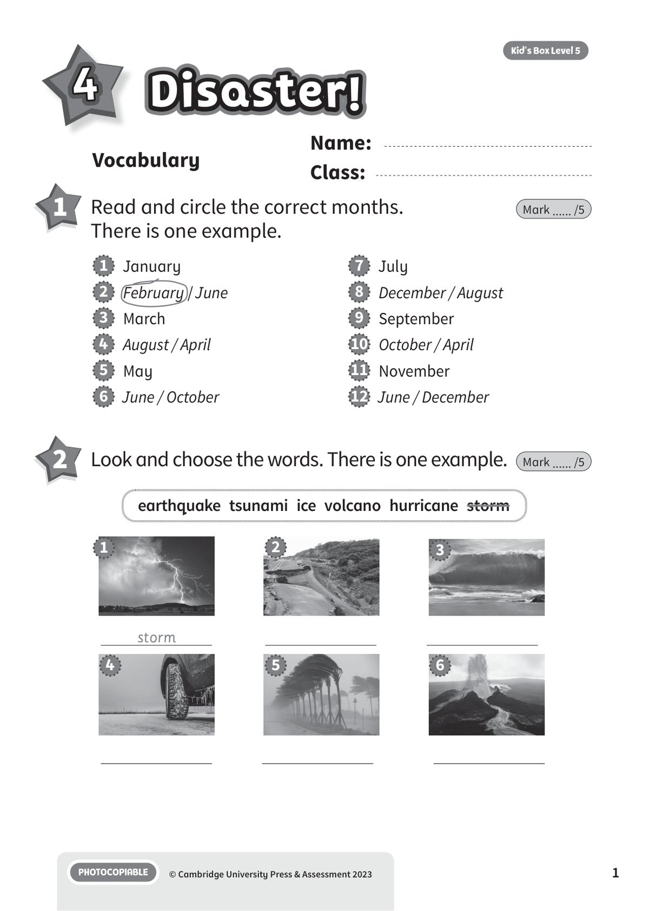
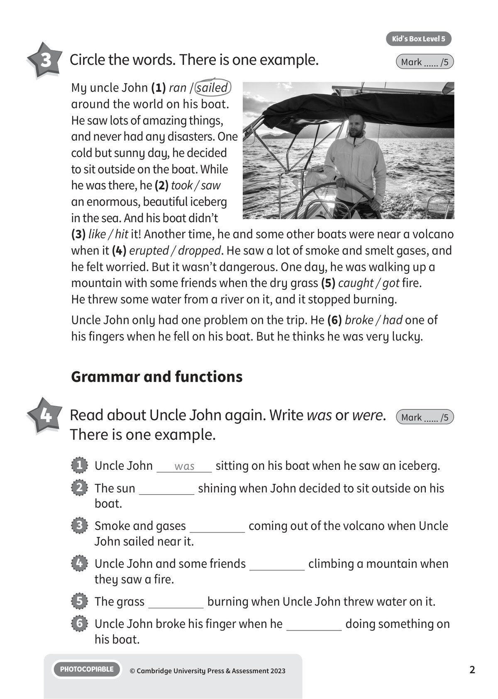
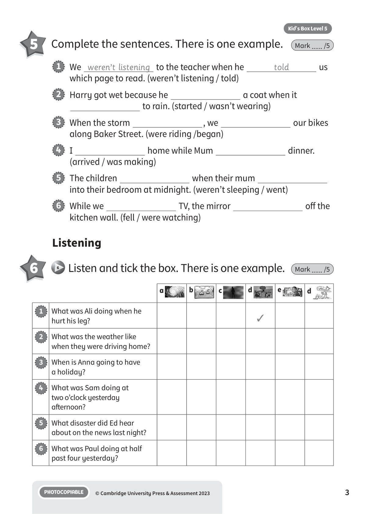
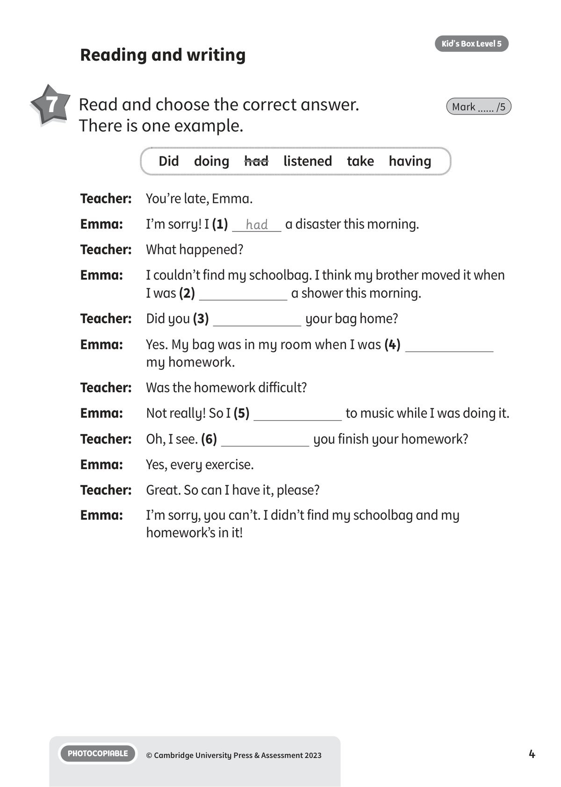
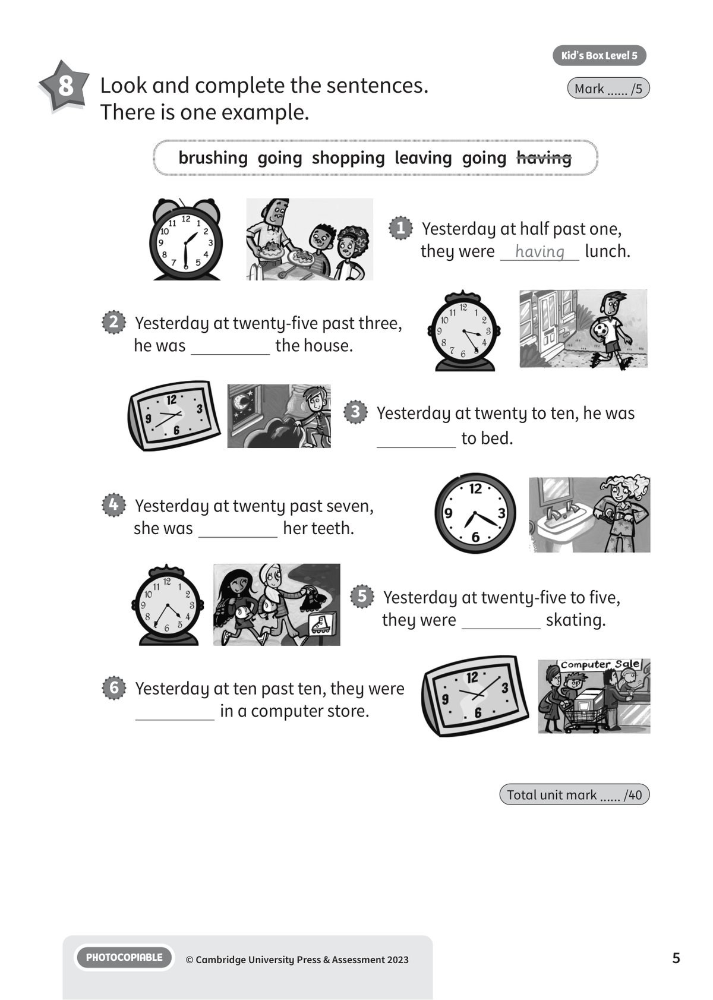
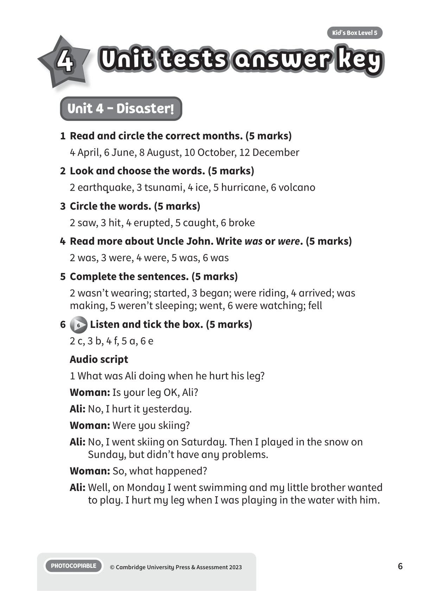
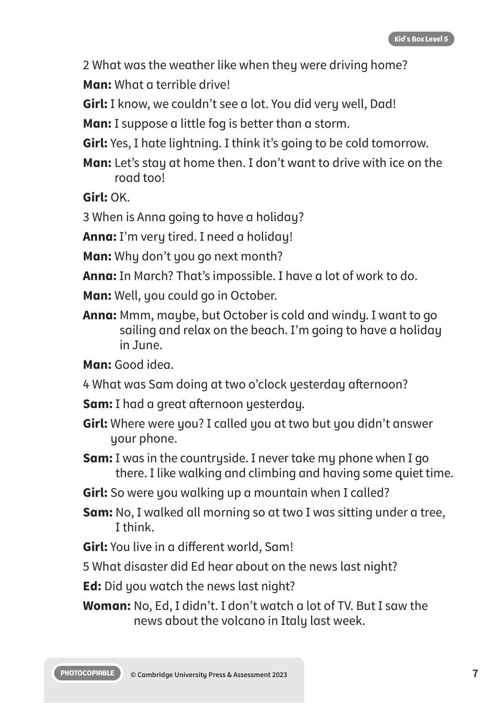
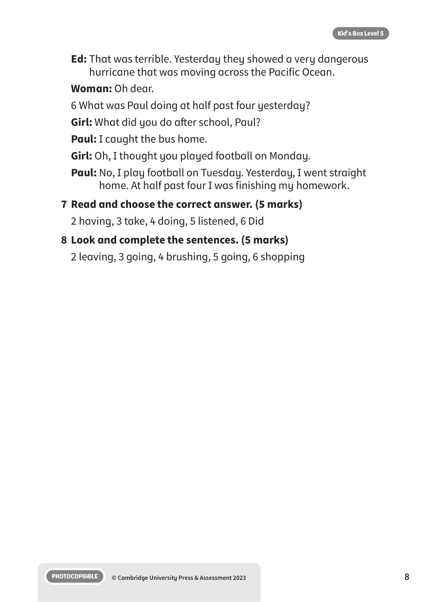

## 音频文件

- 🎧 [KBX_L5_U4_audio_T6.mp3](KBX_L5_U4_audio_T6.mp3)

## 第 1 页

Name:
Class:
PHOTOCOPIABLE
© Cambridge University Press & Assessment 2023
1
Vocabulary
4
Disaster!
Disaster!
Disaster!
Kid’s Box Level 5
1 	 Read and circle the correct months.
There is one example.
Mark ...... /5
1   January
2   February / June
3   March
4   August / April
5   May
6   June / October
7   July
8   December / August
9   September
10  October / April
11   November
12  June / December
2 	 Look and choose the words. There is one example.
Mark ...... /5
earthquake  tsunami  ice  volcano  hurricane  storm
storm
1
2
3
6
5
4

## 第 2 页

PHOTOCOPIABLE
© Cambridge University Press & Assessment 2023
2
Kid’s Box Level 5
Grammar and functions
4 	 Read about Uncle John again. Write was or were.
There is one example.
Mark ...... /5
3 	 Circle the words. There is one example.
Mark ...... /5
1   Uncle John
was
sitting on his boat when he saw an iceberg.
2   The sun
shining when John decided to sit outside on his
boat.
3   Smoke and gases
coming out of the volcano when Uncle
John sailed near it.
4   Uncle John and some friends
climbing a mountain when
they saw a fire.
5   The grass
burning when Uncle John threw water on it.
6   Uncle John broke his finger when he
doing something on
his boat.
My uncle John (1) ran / sailed
around the world on his boat.
He saw lots of amazing things,
and never had any disasters. One
cold but sunny day, he decided
to sit outside on the boat. While
he was there, he (2) took / saw
an enormous, beautiful iceberg
in the sea. And his boat didn’t
(3) like / hit it! Another time, he and some other boats were near a volcano
when it (4) erupted / dropped. He saw a lot of smoke and smelt gases, and
he felt worried. But it wasn’t dangerous. One day, he was walking up a
mountain with some friends when the dry grass (5) caught / got fire.
He threw some water from a river on it, and it stopped burning.
Uncle John only had one problem on the trip. He (6) broke / had one of
his fingers when he fell on his boat. But he thinks he was very lucky.

## 第 3 页

PHOTOCOPIABLE
© Cambridge University Press & Assessment 2023
3
Kid’s Box Level 5
5 	 Complete the sentences. There is one example.
Mark ...... /5
Listening
6
6 	Listen and tick the box. There is one example.
Mark ...... /5
1   We weren’t listening to the teacher when he
told
us
which page to read. (weren’t listening / told)
2   Harry got wet because he
a coat when it
to rain. (started / wasn’t wearing)
3   When the storm
, we
our bikes
along Baker Street. (were riding /began)
4   I
home while Mum
dinner.
(arrived / was making)
5   The children
when their mum
into their bedroom at midnight. (weren’t sleeping / went)
6   While we
TV, the mirror
off the
kitchen wall. (fell / were watching)
a
b
c
d
e
d
1
What was Ali doing when he
hurt his leg?
✓
2
What was the weather like
when they were driving home?
3
When is Anna going to have
a holiday?
4
What was Sam doing at
two o’clock yesterday
afternoon?
5
What disaster did Ed hear
about on the news last night?
6
What was Paul doing at half
past four yesterday?

## 第 4 页

PHOTOCOPIABLE
© Cambridge University Press & Assessment 2023
4
Kid’s Box Level 5
Reading and writing
7 	 Read and choose the correct answer.
There is one example.
Mark ...... /5
Teacher: 	 You’re late, Emma.
Emma:
I’m sorry! I (1)
had
a disaster this morning.
Teacher: 	 What happened?
Emma:
I couldn’t find my schoolbag. I think my brother moved it when
I was (2)
a shower this morning.
Teacher: 	 Did you (3)
your bag home?
Emma:
Yes. My bag was in my room when I was (4)
my homework.
Teacher: 	 Was the homework difficult?
Emma:
Not really! So I (5)
to music while I was doing it.
Teacher: 	 Oh, I see. (6)
you finish your homework?
Emma:
Yes, every exercise.
Teacher:	 Great. So can I have it, please?
Emma:
I’m sorry, you can’t. I didn’t find my schoolbag and my
homework’s in it!
Did  doing  had  listened  take  having

## 第 5 页

PHOTOCOPIABLE
© Cambridge University Press & Assessment 2023
5
Kid’s Box Level 5
Total unit mark ...... /40
8 	 Look and complete the sentences.
There is one example.
Mark ...... /5
brushing  going  shopping  leaving  going  having
1   Yesterday at half past one,
they were
having
lunch.
2   Yesterday at twenty-five past three,
he was
the house.
3   Yesterday at twenty to ten, he was
to bed.
4   Yesterday at twenty past seven,
she was
her teeth.
5   Yesterday at twenty-five to five,
they were
skating.
6   Yesterday at ten past ten, they were
in a computer store.

## 第 6 页

4
Unit tests answer key
Unit tests answer key
Unit tests answer key
PHOTOCOPIABLE
© Cambridge University Press & Assessment 2023
6
Kid’s Box Level 5
Unit 4 - Disaster!
1	 Read and circle the correct months. (5 marks)
4 April, 6 June, 8 August, 10 October, 12 December
2	 Look and choose the words. (5 marks)
2 earthquake, 3 tsunami, 4 ice, 5 hurricane, 6 volcano
3	 Circle the words. (5 marks)
2 saw, 3 hit, 4 erupted, 5 caught, 6 broke
4	 Read more about Uncle John. Write was or were. (5 marks)
2 was, 3 were, 4 were, 5 was, 6 was
5	 Complete the sentences. (5 marks)
2 wasn’t wearing; started, 3 began; were riding, 4 arrived; was
making, 5 weren’t sleeping; went, 6 were watching; fell
6
6 Listen and tick the box. (5 marks)
2 c, 3 b, 4 f, 5 a, 6 e
Audio script
1 What was Ali doing when he hurt his leg?
Woman: Is your leg OK, Ali?
Ali: No, I hurt it yesterday.
Woman: Were you skiing?
Ali: No, I went skiing on Saturday. Then I played in the snow on
Sunday, but didn’t have any problems.
Woman: So, what happened?
Ali: Well, on Monday I went swimming and my little brother wanted
to play. I hurt my leg when I was playing in the water with him.

## 第 7 页

PHOTOCOPIABLE
© Cambridge University Press & Assessment 2023
7
Kid’s Box Level 5
2 What was the weather like when they were driving home?
Man: What a terrible drive!
Girl: I know, we couldn’t see a lot. You did very well, Dad!
Man: I suppose a little fog is better than a storm.
Girl: Yes, I hate lightning. I think it’s going to be cold tomorrow.
Man: Let’s stay at home then. I don’t want to drive with ice on the
road too!
Girl: OK.
3 When is Anna going to have a holiday?
Anna: I’m very tired. I need a holiday!
Man: Why don’t you go next month?
Anna: In March? That’s impossible. I have a lot of work to do.
Man: Well, you could go in October.
Anna: Mmm, maybe, but October is cold and windy. I want to go
sailing and relax on the beach. I’m going to have a holiday
in June.
Man: Good idea.
4 What was Sam doing at two o’clock yesterday afternoon?
Sam: I had a great afternoon yesterday.
Girl: Where were you? I called you at two but you didn’t answer
your phone.
Sam: I was in the countryside. I never take my phone when I go
there. I like walking and climbing and having some quiet time.
Girl: So were you walking up a mountain when I called?
Sam: No, I walked all morning so at two I was sitting under a tree,
I think.
Girl: You live in a different world, Sam!
5 What disaster did Ed hear about on the news last night?
Ed: Did you watch the news last night?
Woman: No, Ed, I didn’t. I don’t watch a lot of TV. But I saw the
news about the volcano in Italy last week.

## 第 8 页

PHOTOCOPIABLE
© Cambridge University Press & Assessment 2023
8
Kid’s Box Level 5
Ed: That was terrible. Yesterday they showed a very dangerous
hurricane that was moving across the Pacific Ocean.
Woman: Oh dear.
6 What was Paul doing at half past four yesterday?
Girl: What did you do after school, Paul?
Paul: I caught the bus home.
Girl: Oh, I thought you played football on Monday.
Paul: No, I play football on Tuesday. Yesterday, I went straight
home. At half past four I was finishing my homework.
7	 Read and choose the correct answer. (5 marks)
2 having, 3 take, 4 doing, 5 listened, 6 Did
8	 Look and complete the sentences. (5 marks)
2 leaving, 3 going, 4 brushing, 5 going, 6 shopping
