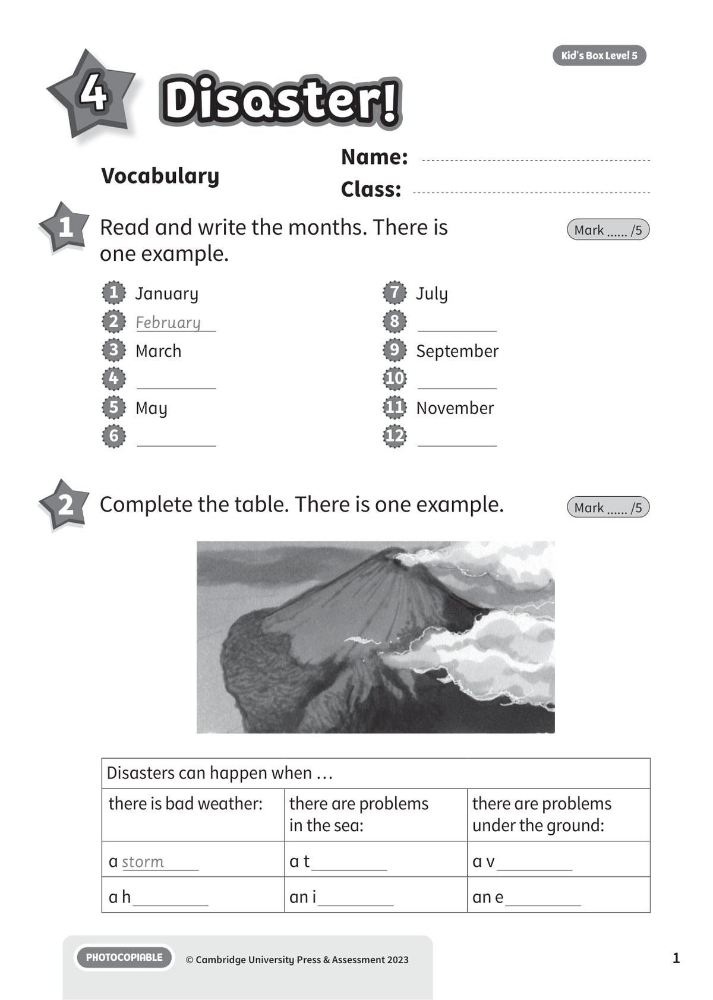
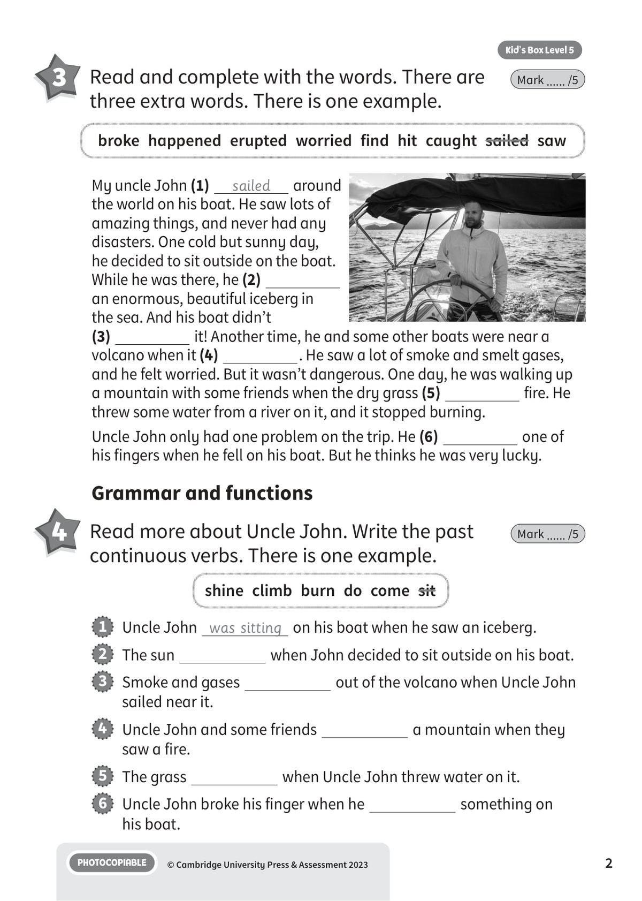
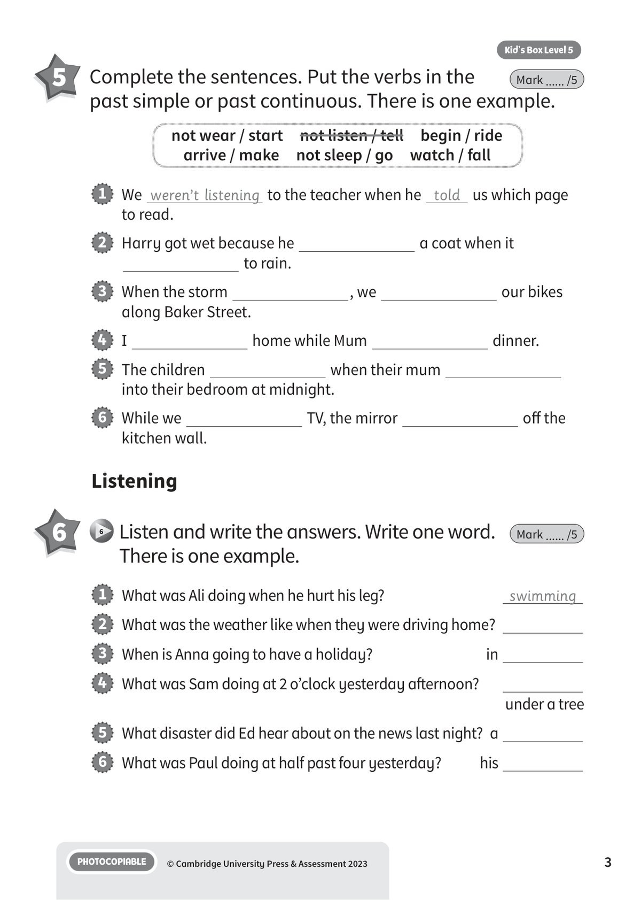
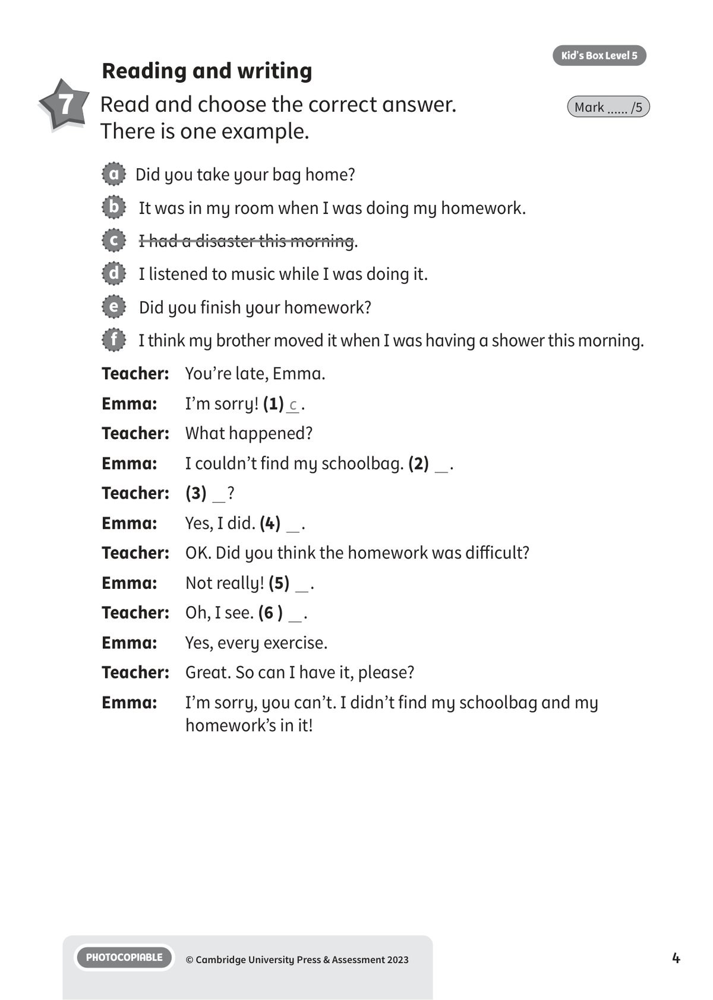
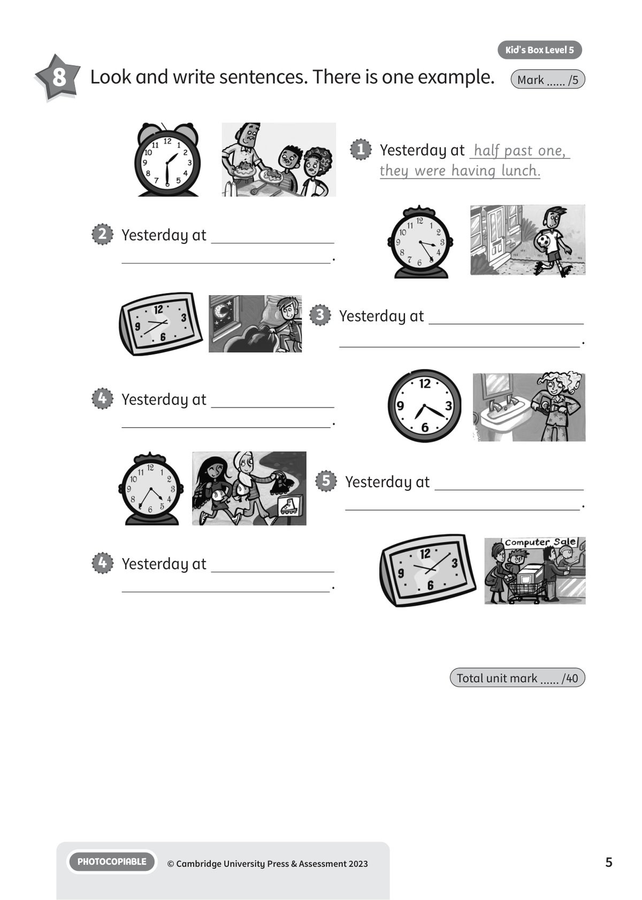

## 音频文件

- 🎧 [KBX_L5_U4_audio_T6.mp3](KBX_L5_U4_audio_T6.mp3)

## 第 1 页

Name:
Class:
PHOTOCOPIABLE
© Cambridge University Press & Assessment 2023
1
Vocabulary
Kid’s Box Level 5
Disaster!
Disaster!
Disaster!
4
1 	 Read and write the months. There is
one example.
Mark ...... /5
2 	 Complete the table. There is one example.
Mark ...... /5
1   January
2   February
3   March
4
5   May
6
7   July
8
9   September
10
11   November
12
Disasters can happen when …
there is bad weather:
there are problems
in the sea:
there are problems
under the ground:
a storm
a t
a v
a h
an i
an e

## 第 2 页

PHOTOCOPIABLE
© Cambridge University Press & Assessment 2023
2
Kid’s Box Level 5
3 	 Read and complete with the words. There are
three extra words. There is one example.
Mark ...... /5
Grammar and functions
4 	 Read more about Uncle John. Write the past
continuous verbs. There is one example.
Mark ...... /5
1   Uncle John was sitting on his boat when he saw an iceberg.
2   The sun
when John decided to sit outside on his boat.
3   Smoke and gases
out of the volcano when Uncle John
sailed near it.
4   Uncle John and some friends
a mountain when they
saw a fire.
5   The grass
when Uncle John threw water on it.
6   Uncle John broke his finger when he
something on
his boat.
broke  happened  erupted  worried  find  hit  caught  sailed  saw
My uncle John (1)
sailed
around
the world on his boat. He saw lots of
amazing things, and never had any
disasters. One cold but sunny day,
he decided to sit outside on the boat.
While he was there, he (2)
an enormous, beautiful iceberg in
the sea. And his boat didn’t
(3)
it! Another time, he and some other boats were near a
volcano when it (4)
. He saw a lot of smoke and smelt gases,
and he felt worried. But it wasn’t dangerous. One day, he was walking up
a mountain with some friends when the dry grass (5)
fire. He
threw some water from a river on it, and it stopped burning.
Uncle John only had one problem on the trip. He (6)
one of
his fingers when he fell on his boat. But he thinks he was very lucky.
shine  climb  burn  do  come  sit

## 第 3 页

PHOTOCOPIABLE
© Cambridge University Press & Assessment 2023
3
Kid’s Box Level 5
Listening
6
6 	Listen and write the answers. Write one word.
There is one example.
Mark ...... /5
not wear / start  not listen / tell  begin / ride
arrive / make  not sleep / go  watch / fall
1   What was Ali doing when he hurt his leg?
swimming
2   What was the weather like when they were driving home?
3   When is Anna going to have a holiday?
in
4   What was Sam doing at 2 o’clock yesterday afternoon?

under a tree
5   What disaster did Ed hear about on the news last night? a
6   What was Paul doing at half past four yesterday?
his
1   We weren’t listening to the teacher when he told us which page
to read.
2   Harry got wet because he
a coat when it
to rain.
3   When the storm
, we
our bikes
along Baker Street.
4   I
home while Mum
dinner.
5   The children
when their mum
into their bedroom at midnight.
6   While we
TV, the mirror
off the
kitchen wall.
5 	 Complete the sentences. Put the verbs in the
past simple or past continuous. There is one example.
Mark ...... /5

## 第 4 页

PHOTOCOPIABLE
© Cambridge University Press & Assessment 2023
4
Kid’s Box Level 5
Reading and writing
7 	 Read and choose the correct answer.
There is one example.
Mark ...... /5
a   Did you take your bag home?
b   It was in my room when I was doing my homework.
c   I had a disaster this morning.
d   I listened to music while I was doing it.
e   Did you finish your homework?
f   I think my brother moved it when I was having a shower this morning.
Teacher:	 You’re late, Emma.
Emma:
I’m sorry! (1) c .
Teacher:	 What happened?
Emma:
I couldn’t find my schoolbag. (2)  .
Teacher:	 (3)  ?
Emma:
Yes, I did. (4)  .
Teacher:	 OK. Did you think the homework was difficult?
Emma:
Not really! (5)  .
Teacher:	 Oh, I see. (6 )  .
Emma:
Yes, every exercise.
Teacher:	 Great. So can I have it, please?
Emma:
I’m sorry, you can’t. I didn’t find my schoolbag and my
homework’s in it!

## 第 5 页

PHOTOCOPIABLE
© Cambridge University Press & Assessment 2023
5
Kid’s Box Level 5
Total unit mark ...... /40
8 	 Look and write sentences. There is one example.
Mark ...... /5
1   Yesterday at half past one,
they were having lunch.
2   Yesterday at
.
3   Yesterday at
.
4   Yesterday at
.
5   Yesterday at
.
4   Yesterday at
.
