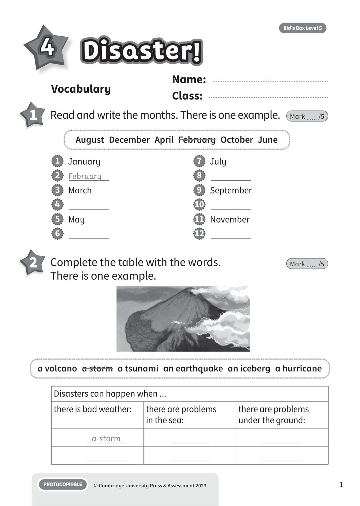
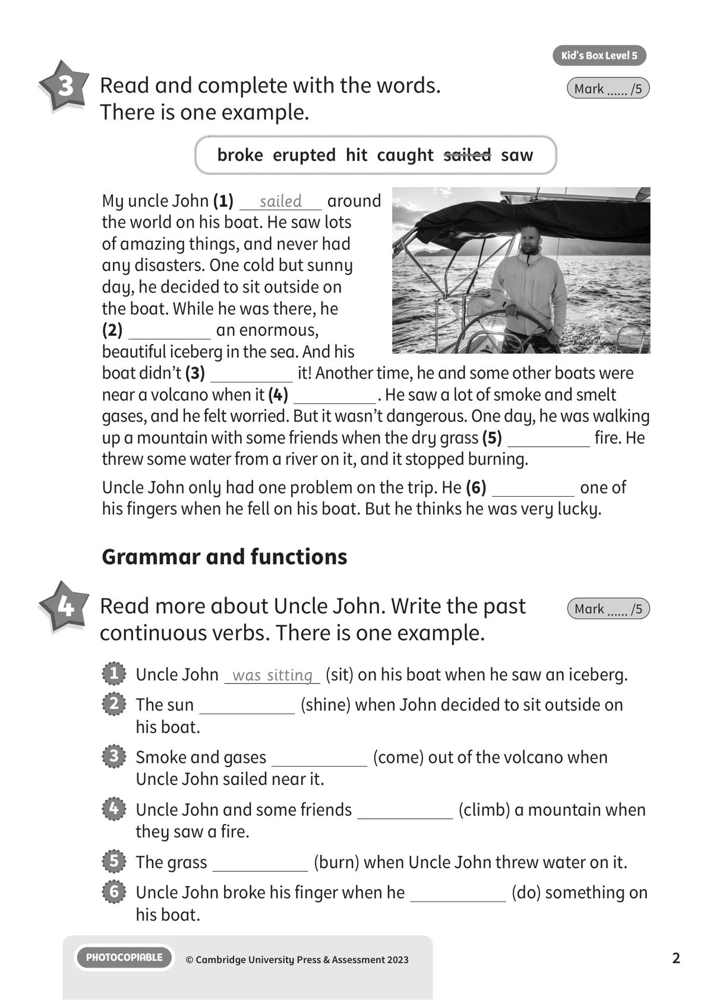
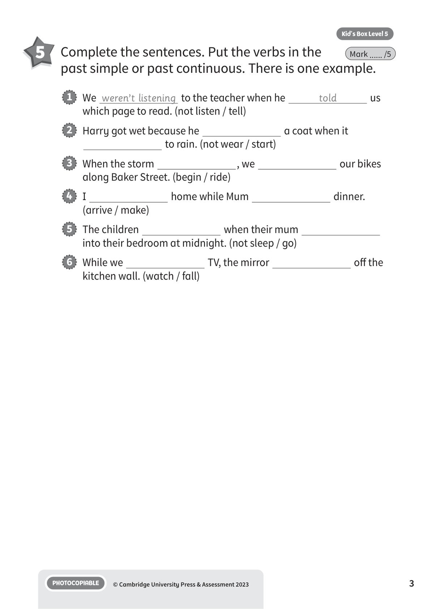
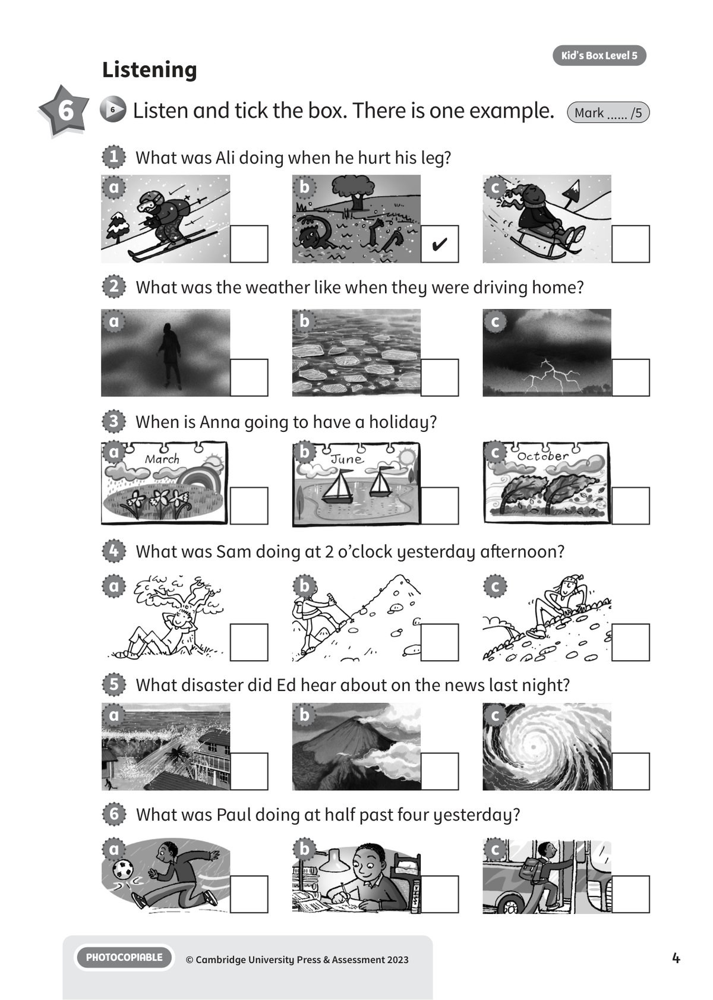
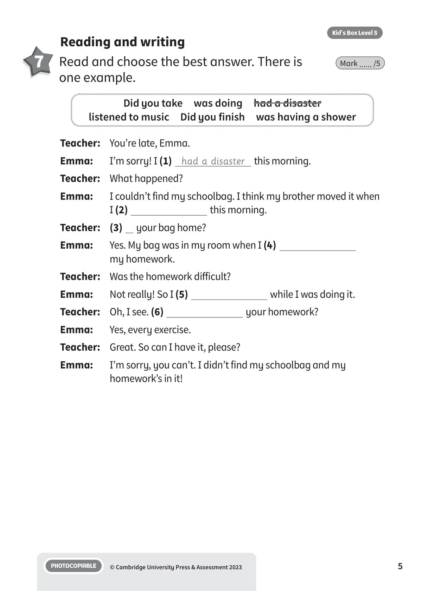
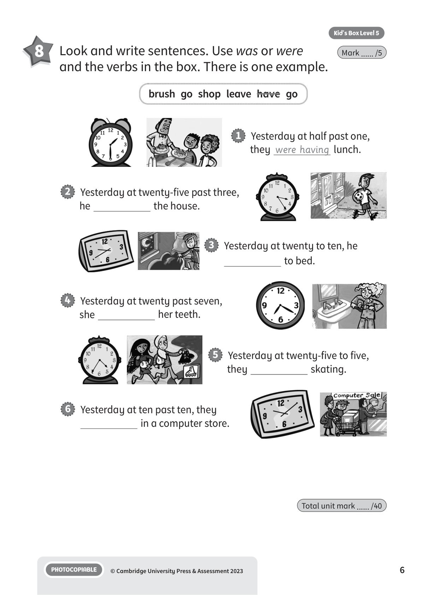

## 音频文件

- 🎧 [KBX_L5_U4_audio_T6.mp3](KBX_L5_U4_audio_T6.mp3)

## 第 1 页

Name:
Class:
PHOTOCOPIABLE
© Cambridge University Press & Assessment 2023
1
Vocabulary
Kid’s Box Level 5
Disaster!
Disaster!
Disaster!
4
1 	 Read and write the months. There is one example.
Mark ...... /5
2 	 Complete the table with the words.
There is one example.
Mark ...... /5
1   January
2   February
3   March
4
5   May
6
7   July
8
9   September
10
11   November
12
Disasters can happen when ...
there is bad weather:
there are problems
in the sea:
there are problems
under the ground:
a storm
August  December  April  February  October  June
a volcano  a storm  a tsunami  an earthquake  an iceberg  a hurricane

## 第 2 页

PHOTOCOPIABLE
© Cambridge University Press & Assessment 2023
2
Kid’s Box Level 5
3 	 Read and complete with the words.
There is one example.
Mark ...... /5
Grammar and functions
4 	 Read more about Uncle John. Write the past
continuous verbs. There is one example.
Mark ...... /5
1   Uncle John was sitting (sit) on his boat when he saw an iceberg.
2   The sun
(shine) when John decided to sit outside on
his boat.
3   Smoke and gases
(come) out of the volcano when
Uncle John sailed near it.
4   Uncle John and some friends
(climb) a mountain when
they saw a fire.
5   The grass
(burn) when Uncle John threw water on it.
6   Uncle John broke his finger when he
(do) something on
his boat.
broke  erupted  hit  caught  sailed  saw
My uncle John (1)
sailed
around
the world on his boat. He saw lots
of amazing things, and never had
any disasters. One cold but sunny
day, he decided to sit outside on
the boat. While he was there, he
(2)
an enormous,
beautiful iceberg in the sea. And his
boat didn’t (3)
it! Another time, he and some other boats were
near a volcano when it (4)
. He saw a lot of smoke and smelt
gases, and he felt worried. But it wasn’t dangerous. One day, he was walking
up a mountain with some friends when the dry grass (5)
fire. He
threw some water from a river on it, and it stopped burning.
Uncle John only had one problem on the trip. He (6)
one of
his fingers when he fell on his boat. But he thinks he was very lucky.

## 第 3 页

PHOTOCOPIABLE
© Cambridge University Press & Assessment 2023
3
Kid’s Box Level 5
Mark ...... /5
1   We weren’t listening to the teacher when he
told
us
which page to read. (not listen / tell)
2   Harry got wet because he
a coat when it
to rain. (not wear / start)
3   When the storm
, we
our bikes
along Baker Street. (begin / ride)
4   I
home while Mum
dinner.
(arrive / make)
5   The children
when their mum
into their bedroom at midnight. (not sleep / go)
6   While we
TV, the mirror
off the
kitchen wall. (watch / fall)
5 	 Complete the sentences. Put the verbs in the
past simple or past continuous. There is one example.

## 第 4 页

PHOTOCOPIABLE
© Cambridge University Press & Assessment 2023
4
Kid’s Box Level 5
Listening
6
6 	Listen and tick the box. There is one example.
Mark ...... /5
1   What was Ali doing when he hurt his leg?
3   When is Anna going to have a holiday?
5   What disaster did Ed hear about on the news last night?
2   What was the weather like when they were driving home?
4   What was Sam doing at 2 o’clock yesterday afternoon?
6   What was Paul doing at half past four yesterday?
✔
a
a
a
a
a
a
b
b
b
b
b
b
c
c
c
c
c
c

## 第 5 页

PHOTOCOPIABLE
© Cambridge University Press & Assessment 2023
5
Kid’s Box Level 5
Reading and writing
7 	 Read and choose the best answer. There is
one example.
Mark ...... /5
Teacher: 	 You’re late, Emma.
Emma:
I’m sorry! I (1) had a disaster this morning.
Teacher: 	 What happened?
Emma:
I couldn’t find my schoolbag. I think my brother moved it when
I (2)
this morning.
Teacher: 	 (3)   your bag home?
Emma:
Yes. My bag was in my room when I (4)
my homework.
Teacher: 	 Was the homework difficult?
Emma:
Not really! So I (5)
while I was doing it.
Teacher: 	 Oh, I see. (6)
your homework?
Emma:
Yes, every exercise.
Teacher: 	 Great. So can I have it, please?
Emma:
I’m sorry, you can’t. I didn’t find my schoolbag and my
homework’s in it!
Did you take  was doing  had a disaster
listened to music  Did you finish  was having a shower

## 第 6 页

PHOTOCOPIABLE
© Cambridge University Press & Assessment 2023
6
Kid’s Box Level 5
Total unit mark ...... /40
8 	 Look and write sentences. Use was or were
and the verbs in the box. There is one example.
Mark ...... /5
brush  go  shop  leave  have  go
1   Yesterday at half past one,
they were having lunch.
2   Yesterday at twenty-five past three,
he
the house.
3   Yesterday at twenty to ten, he
to bed.
4   Yesterday at twenty past seven,
she
her teeth.
5   Yesterday at twenty-five to five,
they
skating.
6   Yesterday at ten past ten, they
in a computer store.
