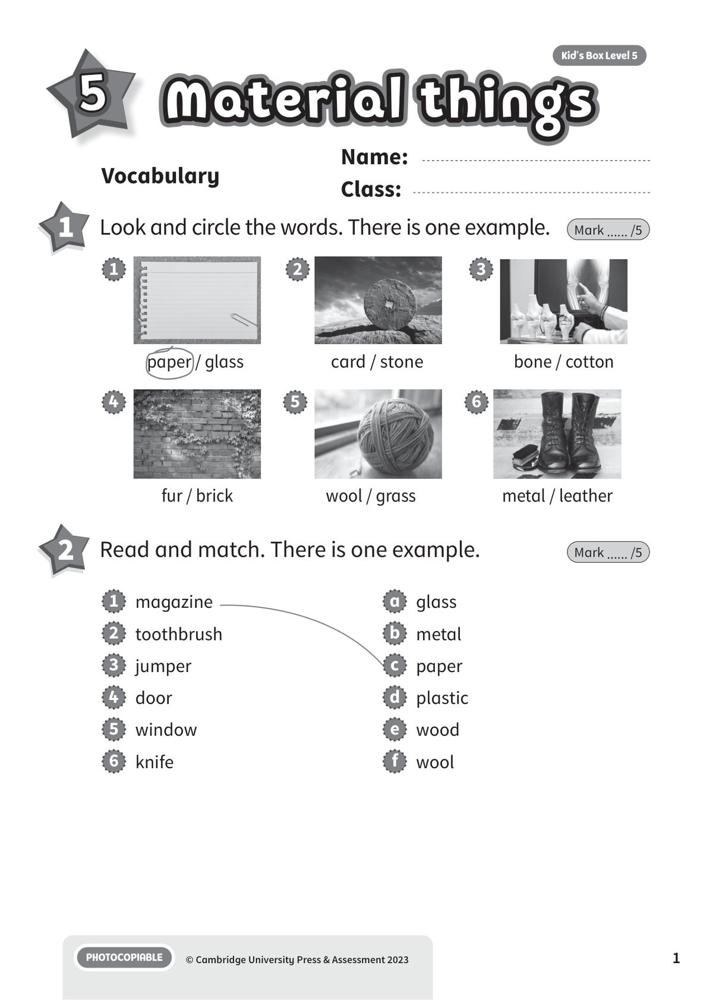
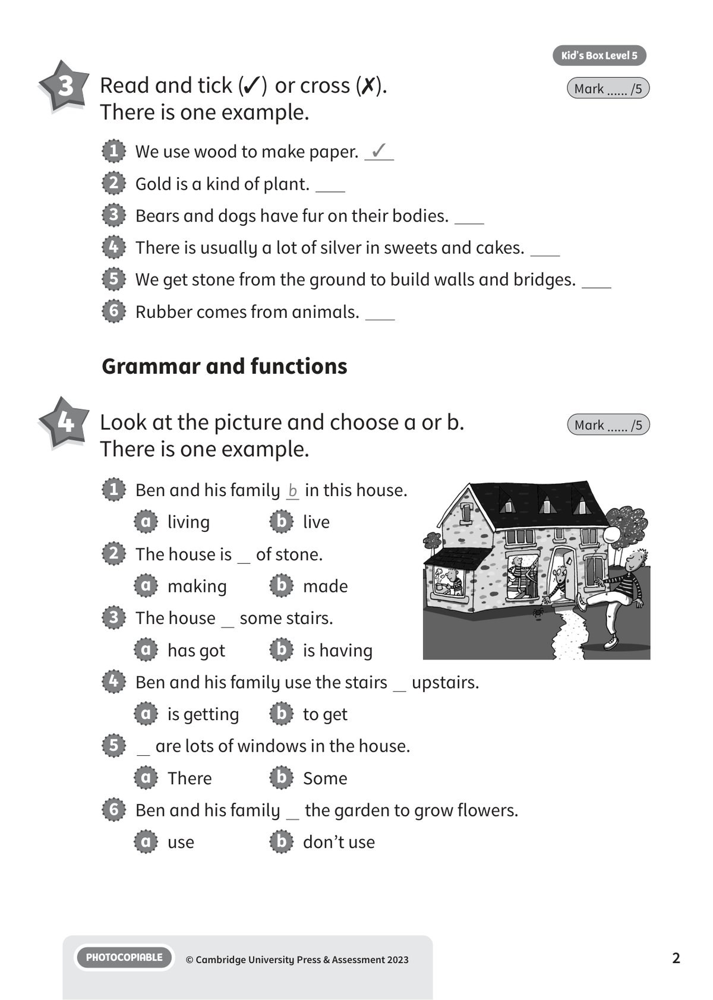
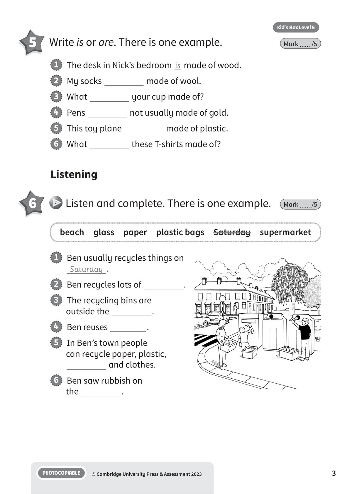
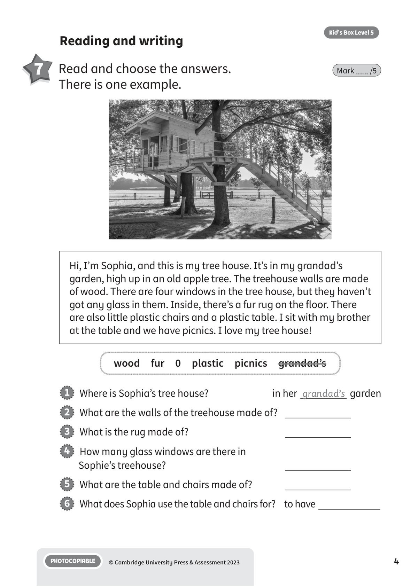
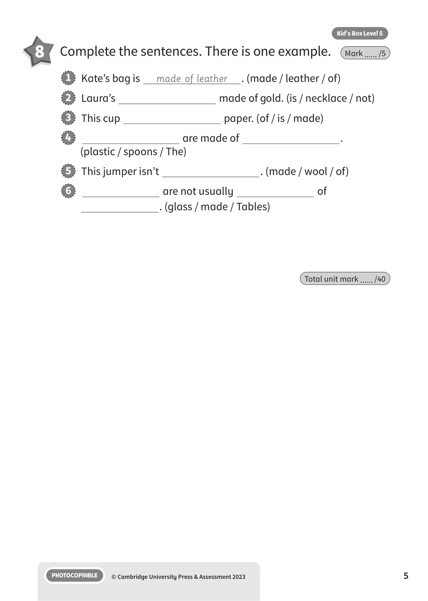
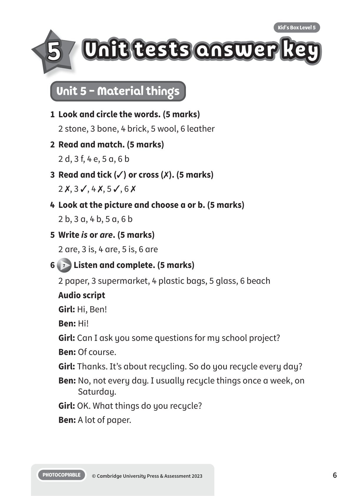
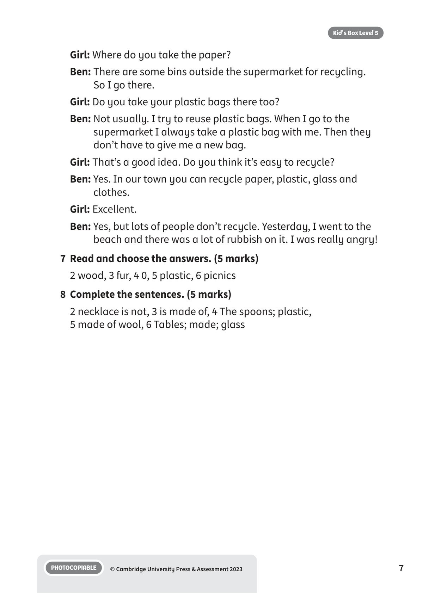

## 音频文件

- 🎧 [KBX_L5_U5_audio_T7.mp3](KBX_L5_U5_audio_T7.mp3)

## 第 1 页

Name:
Class:
PHOTOCOPIABLE
© Cambridge University Press & Assessment 2023
1
Vocabulary
5
Material things
Material things
Material things
Kid’s Box Level 5
1 	 Look and circle the words. There is one example.
Mark ...... /5
2 	 Read and match. There is one example.
Mark ...... /5
paper / glass
1
card / stone
2
bone / cotton
3
fur / brick
4
wool / grass
5
metal / leather
6
1   magazine
2   toothbrush
3   jumper
4   door
5   window
6   knife
a   glass
b   metal
c   paper
d   plastic
e   wood
f   wool

## 第 2 页

PHOTOCOPIABLE
© Cambridge University Press & Assessment 2023
2
Kid’s Box Level 5
3 	 Read and tick (✓) or cross (✗).
There is one example.
Mark ...... /5
1   Ben and his family b in this house.
a   living
b   live
2   The house is   of stone.
a   making
b   made
3   The house   some stairs.
a   has got
b   is having
4   Ben and his family use the stairs   upstairs.
a   is getting
b   to get
5    are lots of windows in the house.
a   There
b   Some
6   Ben and his family   the garden to grow flowers.
a   use
b   don’t use
1   We use wood to make paper. ✓
2   Gold is a kind of plant.
3   Bears and dogs have fur on their bodies.
4   There is usually a lot of silver in sweets and cakes.
5   We get stone from the ground to build walls and bridges.
6   Rubber comes from animals.
Grammar and functions
4 	 Look at the picture and choose a or b.
There is one example.
Mark ...... /5

## 第 3 页

PHOTOCOPIABLE
© Cambridge University Press & Assessment 2023
3
Kid’s Box Level 5
5 	 Write is or are. There is one example.
Mark ...... /5
beach  glass  paper  plastic bags  Saturday  supermarket
1   The desk in Nick’s bedroom is made of wood.
2   My socks
made of wool.
3   What
your cup made of?
4   Pens
not usually made of gold.
5   This toy plane
made of plastic.
6   What
these T-shirts made of?
1   Ben usually recycles things on
Saturday .
2   Ben recycles lots of
.
3   The recycling bins are
outside the
.
4   Ben reuses
.
5   In Ben’s town people
can recycle paper, plastic,
and clothes.
6   Ben saw rubbish on
the
.
Listening
6 	  7 	Listen and complete. There is one example.
Mark ...... /5

## 第 4 页

PHOTOCOPIABLE
© Cambridge University Press & Assessment 2023
4
Kid’s Box Level 5
1   Where is Sophia’s tree house?
in her grandad’s garden
2   What are the walls of the treehouse made of?
3   What is the rug made of?
4   How many glass windows are there in
Sophie’s treehouse?
5   What are the table and chairs made of?
6   What does Sophia use the table and chairs for?	 to have
Reading and writing
7 	 Read and choose the answers.
There is one example.
Mark ...... /5
Hi, I’m Sophia, and this is my tree house. It’s in my grandad’s
garden, high up in an old apple tree. The treehouse walls are made
of wood. There are four windows in the tree house, but they haven’t
got any glass in them. Inside, there’s a fur rug on the floor. There
are also little plastic chairs and a plastic table. I sit with my brother
at the table and we have picnics. I love my tree house!
wood  fur  0  plastic  picnics  grandad’s

## 第 5 页

PHOTOCOPIABLE
© Cambridge University Press & Assessment 2023
5
Kid’s Box Level 5
8 	 Complete the sentences. There is one example.
Mark ...... /5
1   Kate’s bag is
made of leather
. (made / leather / of)
2   Laura’s
made of gold. (is / necklace / not)
3   This cup
paper. (of / is / made)
4
are made of
.
(plastic / spoons / The)
5   This jumper isn’t
. (made / wool / of)
6
are not usually
of
. (glass / made / Tables)
Total unit mark ...... /40

## 第 6 页

Unit tests answer key
Unit tests answer key
Unit tests answer key
PHOTOCOPIABLE
© Cambridge University Press & Assessment 2023
6
Kid’s Box Level 5
5
Unit 5 - Material things
1	 Look and circle the words. (5 marks)
2 stone, 3 bone, 4 brick, 5 wool, 6 leather
2	 Read and match. (5 marks)
2 d, 3 f, 4 e, 5 a, 6 b
3	 Read and tick (✓) or cross (✗). (5 marks)
2 ✗, 3 ✓, 4 ✗, 5 ✓, 6 ✗
4	 Look at the picture and choose a or b. (5 marks)
2 b, 3 a, 4 b, 5 a, 6 b
5	 Write is or are. (5 marks)
2 are, 3 is, 4 are, 5 is, 6 are
6
7 Listen and complete. (5 marks)
2 paper, 3 supermarket, 4 plastic bags, 5 glass, 6 beach
Audio script
Girl: Hi, Ben!
Ben: Hi!
Girl: Can I ask you some questions for my school project?
Ben: Of course.
Girl: Thanks. It’s about recycling. So do you recycle every day?
Ben: No, not every day. I usually recycle things once a week, on
Saturday.
Girl: OK. What things do you recycle?
Ben: A lot of paper.

## 第 7 页

PHOTOCOPIABLE
© Cambridge University Press & Assessment 2023
7
Kid’s Box Level 5
Girl: Where do you take the paper?
Ben: There are some bins outside the supermarket for recycling.
So I go there.
Girl: Do you take your plastic bags there too?
Ben: Not usually. I try to reuse plastic bags. When I go to the
supermarket I always take a plastic bag with me. Then they
don’t have to give me a new bag.
Girl: That’s a good idea. Do you think it’s easy to recycle?
Ben: Yes. In our town you can recycle paper, plastic, glass and
clothes.
Girl: Excellent.
Ben: Yes, but lots of people don’t recycle. Yesterday, I went to the
beach and there was a lot of rubbish on it. I was really angry!
7	 Read and choose the answers. (5 marks)
2 wood, 3 fur, 4 0, 5 plastic, 6 picnics
8	 Complete the sentences. (5 marks)
2 necklace is not, 3 is made of, 4 The spoons; plastic,
5 made of wool, 6 Tables; made; glass
