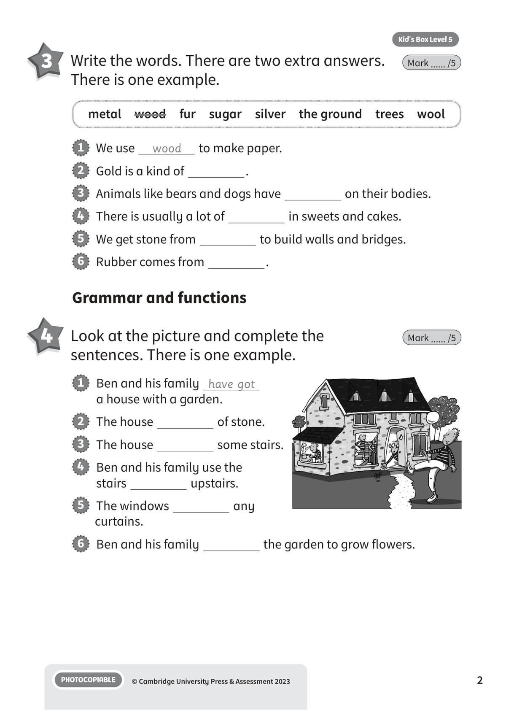
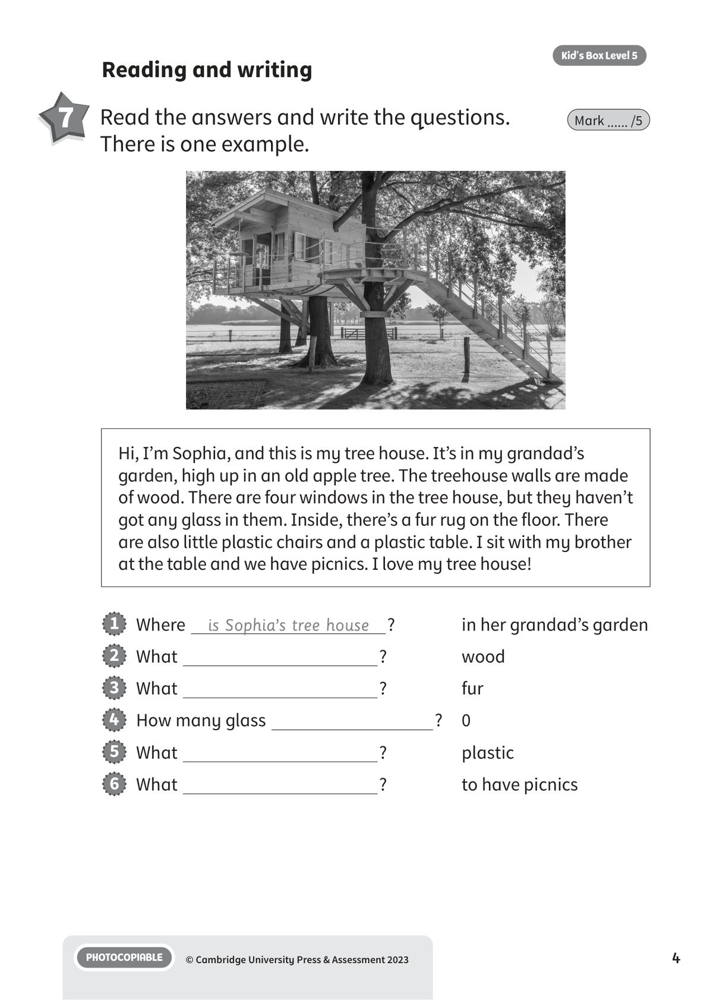
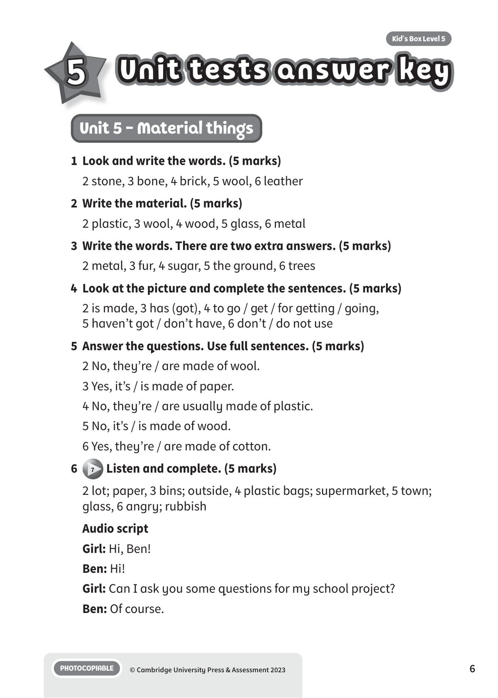
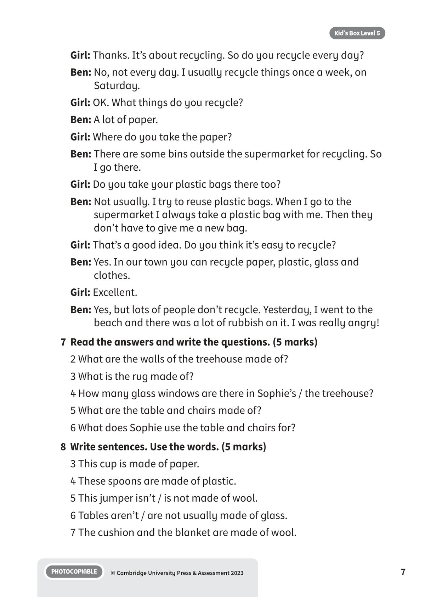

## 音频文件

- 🎧 [KBX_L5_U5_audio_T7.mp3](KBX_L5_U5_audio_T7.mp3)

## 第 1 页

Name:
Class:
PHOTOCOPIABLE
© Cambridge University Press & Assessment 2023
1
Vocabulary
Material things
Material things
Material things
Kid’s Box Level 5
5
2 	 Write the material. There is one example.
Mark ...... /5
1   magazine
notebook
book
paper
2   CD box
pen
toothbrush
3   jumper
hat
scarf
4   door
cupboard
pencil
5   bottle
window
mirror
6   bike
knife
keys
1 	 Look and write the words. There is one example.
Mark ...... /5
paper
s
1
2
b
3
b
4
w
5
l
6

## 第 2 页

PHOTOCOPIABLE
© Cambridge University Press & Assessment 2023
2
Kid’s Box Level 5
3 	 Write the words. There are two extra answers.
There is one example.
Mark ...... /5
1   We use
wood
to make paper.
2   Gold is a kind of
.
3   Animals like bears and dogs have
on their bodies.
4   There is usually a lot of
in sweets and cakes.
5   We get stone from
to build walls and bridges.
6   Rubber comes from
.
Grammar and functions
4 	 Look at the picture and complete the
sentences. There is one example.
Mark ...... /5
metal  wood  fur  sugar  silver  the ground  trees  wool
1   Ben and his family have got
a house with a garden.
2   The house
of stone.
3   The house
some stairs.
4   Ben and his family use the
stairs
upstairs.
5   The windows
any
curtains.
6   Ben and his family
the garden to grow flowers.

## 第 3 页

PHOTOCOPIABLE
© Cambridge University Press & Assessment 2023
3
Kid’s Box Level 5
5 	 Answer the questions. Use full sentences.
There is one example.
Mark ...... /5
1   Is the desk in Nick’s bedroom made of wood?
Yes, it is made of
wood.
2   Are Ollie’s socks made of cotton?
wool.
3   Is that cup made of paper?
paper.
4   Are pens usually made of gold?
plastic.
5   Is this toy plane made of metal?
wood.
6   Are these T-shirts made of cotton?
cotton.
Listening
6
7 	Listen and complete. There is one example.
Mark ...... /5
1   Ben usually recycles things on Saturday .
2   Ben recycles a
of
.
3   The recycling
are
the supermarket.
4   Ben reuses
. When
he goes to the
he always takes
one with him.
5   In Ben’s
people can recycle paper, plastic,
and clothes.
6   Ben was very
when he saw
on the beach.

## 第 4 页

PHOTOCOPIABLE
© Cambridge University Press & Assessment 2023
4
Kid’s Box Level 5
Reading and writing
7 	 Read the answers and write the questions.
There is one example.
Mark ...... /5
1   Where
is Sophia’s tree house
?
in her grandad’s garden
2   What
?
wood
3   What
?
fur
4   How many glass
?
0
5   What
?
plastic
6   What
?
to have picnics
Hi, I’m Sophia, and this is my tree house. It’s in my grandad’s
garden, high up in an old apple tree. The treehouse walls are made
of wood. There are four windows in the tree house, but they haven’t
got any glass in them. Inside, there’s a fur rug on the floor. There
are also little plastic chairs and a plastic table. I sit with my brother
at the table and we have picnics. I love my tree house!

## 第 5 页

PHOTOCOPIABLE
© Cambridge University Press & Assessment 2023
5
Kid’s Box Level 5
8 	 Write sentences. Use the words.
There are two examples.
Mark ...... /5
1   (Kate’s bag / leather)
Kate’s bag is made of leather.
2   (Laura’s necklace / not gold)
Laura’s necklace isn’t made of gold.
3   (This cup / paper)
.
4   (These spoons / plastic)
.
5   (This jumper / not wool)
.
6   (Tables / not usually glass)
.
7   (The cushion and the blanket / wool)
.
Total unit mark ...... /40

## 第 6 页

Unit tests answer key
Unit tests answer key
Unit tests answer key
PHOTOCOPIABLE
© Cambridge University Press & Assessment 2023
6
Kid’s Box Level 5
5
Unit 5 - Material things
1	 Look and write the words. (5 marks)
2 stone, 3 bone, 4 brick, 5 wool, 6 leather
2	 Write the material. (5 marks)
2 plastic, 3 wool, 4 wood, 5 glass, 6 metal
3	 Write the words. There are two extra answers. (5 marks)
2 metal, 3 fur, 4 sugar, 5 the ground, 6 trees
4	 Look at the picture and complete the sentences. (5 marks)
2 is made, 3 has (got), 4 to go / get / for getting / going,
5 haven’t got / don’t have, 6 don’t / do not use
5	 Answer the questions. Use full sentences. (5 marks)
2 No, they’re / are made of wool.
3 Yes, it’s / is made of paper.
4 No, they’re / are usually made of plastic.
5 No, it’s / is made of wood.
6 Yes, they’re / are made of cotton.
6
7 Listen and complete. (5 marks)
2 lot; paper, 3 bins; outside, 4 plastic bags; supermarket, 5 town;
glass, 6 angry; rubbish
Audio script
Girl: Hi, Ben!
Ben: Hi!
Girl: Can I ask you some questions for my school project?
Ben: Of course.

## 第 7 页

PHOTOCOPIABLE
© Cambridge University Press & Assessment 2023
7
Kid’s Box Level 5
Girl: Thanks. It’s about recycling. So do you recycle every day?
Ben: No, not every day. I usually recycle things once a week, on
Saturday.
Girl: OK. What things do you recycle?
Ben: A lot of paper.
Girl: Where do you take the paper?
Ben: There are some bins outside the supermarket for recycling. So
I go there.
Girl: Do you take your plastic bags there too?
Ben: Not usually. I try to reuse plastic bags. When I go to the
supermarket I always take a plastic bag with me. Then they
don’t have to give me a new bag.
Girl: That’s a good idea. Do you think it’s easy to recycle?
Ben: Yes. In our town you can recycle paper, plastic, glass and
clothes.
Girl: Excellent.
Ben: Yes, but lots of people don’t recycle. Yesterday, I went to the
beach and there was a lot of rubbish on it. I was really angry!
7	 Read the answers and write the questions. (5 marks)
2 What are the walls of the treehouse made of?
3 What is the rug made of?
4 How many glass windows are there in Sophie’s / the treehouse?
5 What are the table and chairs made of?
6 What does Sophie use the table and chairs for?
8	 Write sentences. Use the words. (5 marks)
3 This cup is made of paper.
4 These spoons are made of plastic.
5 This jumper isn’t / is not made of wool.
6 Tables aren’t / are not usually made of glass.
7 The cushion and the blanket are made of wool.
