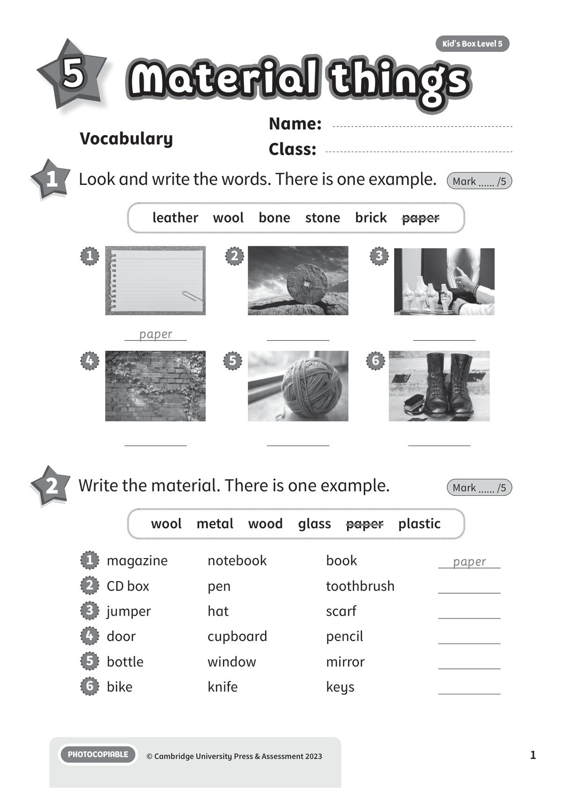
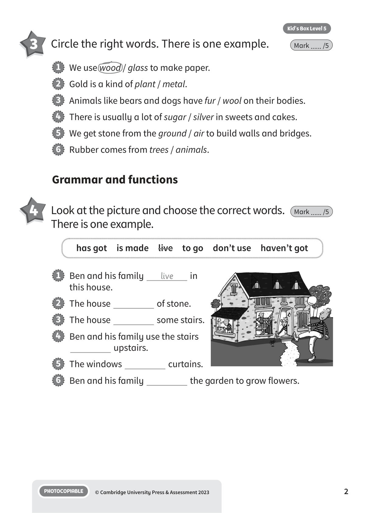
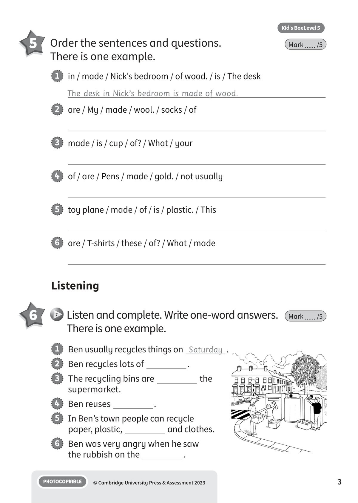
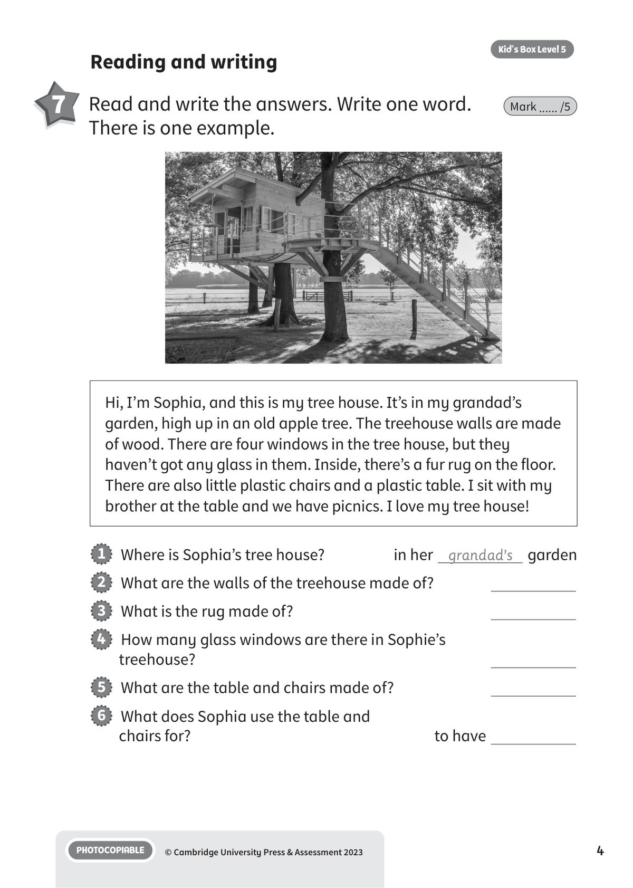
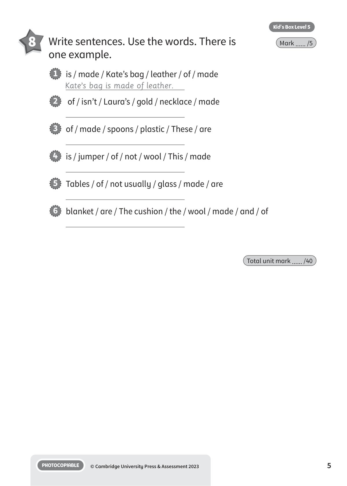
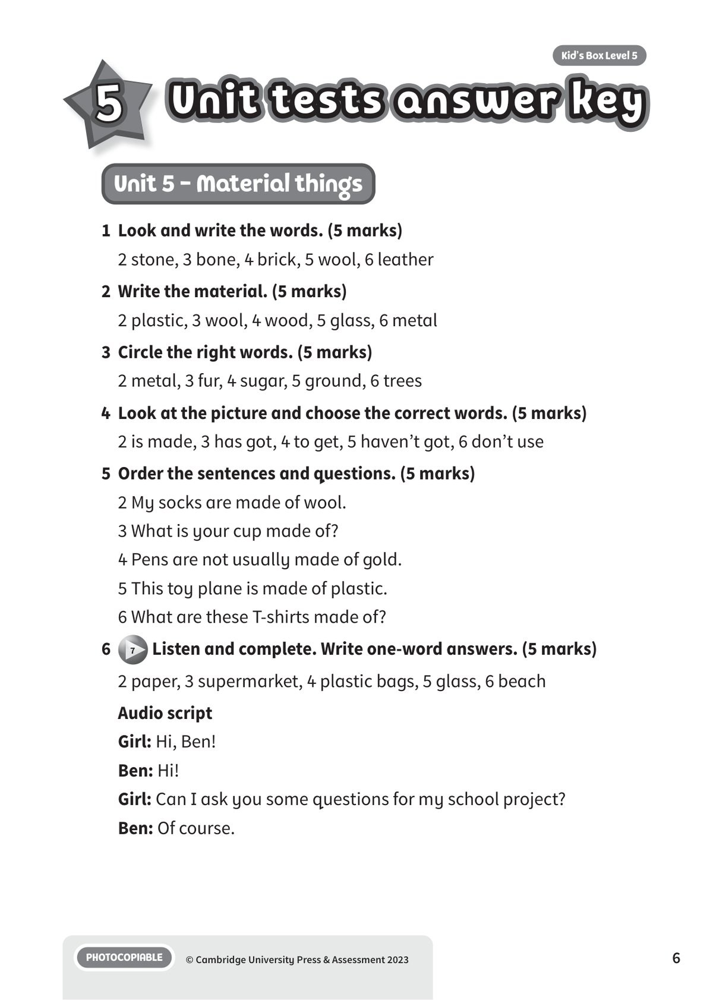
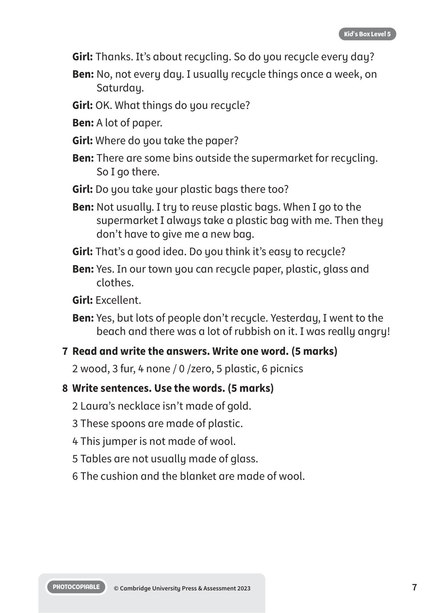

## 音频文件

- 🎧 [KBX_L5_U5_audio_T7.mp3](KBX_L5_U5_audio_T7.mp3)

## 第 1 页

Name:
Class:
PHOTOCOPIABLE
© Cambridge University Press & Assessment 2023
1
Vocabulary
Material things
Material things
Material things
Kid’s Box Level 5
5
1 	 Look and write the words. There is one example.
Mark ...... /5
leather  wool  bone  stone  brick  paper
paper
1
2
3
4
5
6
2 	 Write the material. There is one example.
Mark ...... /5
wool  metal  wood  glass  paper  plastic
1   magazine
notebook
book
paper
2   CD box
pen
toothbrush
3   jumper
hat
scarf
4   door
cupboard
pencil
5   bottle
window
mirror
6   bike
knife
keys

## 第 2 页

PHOTOCOPIABLE
© Cambridge University Press & Assessment 2023
2
Kid’s Box Level 5
3 	 Circle the right words. There is one example.
Mark ...... /5
1   We use wood / glass to make paper.
2   Gold is a kind of plant / metal.
3   Animals like bears and dogs have fur / wool on their bodies.
4   There is usually a lot of sugar / silver in sweets and cakes.
5   We get stone from the ground / air to build walls and bridges.
6   Rubber comes from trees / animals.
Grammar and functions
4 	 Look at the picture and choose the correct words.
There is one example.
Mark ...... /5
1   Ben and his family
live
in
this house.
2   The house
of stone.
3   The house
some stairs.
4   Ben and his family use the stairs
upstairs.
5   The windows
curtains.
6   Ben and his family
the garden to grow flowers.
has got  is made  live  to go  don’t use  haven’t got

## 第 3 页

PHOTOCOPIABLE
© Cambridge University Press & Assessment 2023
3
Kid’s Box Level 5
5 	 Order the sentences and questions.
There is one example.
Mark ...... /5
1   in / made / Nick’s bedroom / of wood. / is / The desk
The desk in Nick’s bedroom is made of wood.
2   are / My / made / wool. / socks / of
3   made / is / cup / of? / What / your
4   of / are / Pens / made / gold. / not usually
5   toy plane / made / of / is / plastic. / This
6   are / T-shirts / these / of? / What / made
Listening
6
7 	Listen and complete. Write one-word answers.
There is one example.
Mark ...... /5
1   Ben usually recycles things on Saturday .
2   Ben recycles lots of
.
3   The recycling bins are
the
supermarket.
4   Ben reuses
.
5   In Ben’s town people can recycle
paper, plastic,
and clothes.
6   Ben was very angry when he saw
the rubbish on the
.

## 第 4 页

PHOTOCOPIABLE
© Cambridge University Press & Assessment 2023
4
Kid’s Box Level 5
Reading and writing
7 	 Read and write the answers. Write one word.
There is one example.
Mark ...... /5
1   Where is Sophia’s tree house?
in her grandad’s garden
2   What are the walls of the treehouse made of?
3   What is the rug made of?
4   How many glass windows are there in Sophie’s
treehouse?
5   What are the table and chairs made of?
6   What does Sophia use the table and
chairs for?
to have
Hi, I’m Sophia, and this is my tree house. It’s in my grandad’s
garden, high up in an old apple tree. The treehouse walls are made
of wood. There are four windows in the tree house, but they
haven’t got any glass in them. Inside, there’s a fur rug on the floor.
There are also little plastic chairs and a plastic table. I sit with my
brother at the table and we have picnics. I love my tree house!

## 第 5 页

PHOTOCOPIABLE
© Cambridge University Press & Assessment 2023
5
Kid’s Box Level 5
8 	 Write sentences. Use the words. There is
one example.
Mark ...... /5
1   is / made / Kate’s bag / leather / of / made
Kate’s bag is made of leather.
2   of / isn’t / Laura’s / gold / necklace / made
3   of / made / spoons / plastic / These / are
4   is / jumper / of / not / wool / This / made
5   Tables / of / not usually / glass / made / are
6   blanket / are / The cushion / the / wool / made / and / of
Total unit mark ...... /40

## 第 6 页

Unit tests answer key
Unit tests answer key
Unit tests answer key
PHOTOCOPIABLE
© Cambridge University Press & Assessment 2023
6
Kid’s Box Level 5
5
Unit 5 - Material things
1	 Look and write the words. (5 marks)
2 stone, 3 bone, 4 brick, 5 wool, 6 leather
2	 Write the material. (5 marks)
2 plastic, 3 wool, 4 wood, 5 glass, 6 metal
3	 Circle the right words. (5 marks)
2 metal, 3 fur, 4 sugar, 5 ground, 6 trees
4	 Look at the picture and choose the correct words. (5 marks)
2 is made, 3 has got, 4 to get, 5 haven’t got, 6 don’t use
5	 Order the sentences and questions. (5 marks)
2 My socks are made of wool.
3 What is your cup made of?
4 Pens are not usually made of gold.
5 This toy plane is made of plastic.
6 What are these T-shirts made of?
6
7 Listen and complete. Write one-word answers. (5 marks)
2 paper, 3 supermarket, 4 plastic bags, 5 glass, 6 beach
Audio script
Girl: Hi, Ben!
Ben: Hi!
Girl: Can I ask you some questions for my school project?
Ben: Of course.

## 第 7 页

PHOTOCOPIABLE
© Cambridge University Press & Assessment 2023
7
Kid’s Box Level 5
Girl: Thanks. It’s about recycling. So do you recycle every day?
Ben: No, not every day. I usually recycle things once a week, on
Saturday.
Girl: OK. What things do you recycle?
Ben: A lot of paper.
Girl: Where do you take the paper?
Ben: There are some bins outside the supermarket for recycling.
So I go there.
Girl: Do you take your plastic bags there too?
Ben: Not usually. I try to reuse plastic bags. When I go to the
supermarket I always take a plastic bag with me. Then they
don’t have to give me a new bag.
Girl: That’s a good idea. Do you think it’s easy to recycle?
Ben: Yes. In our town you can recycle paper, plastic, glass and
clothes.
Girl: Excellent.
Ben: Yes, but lots of people don’t recycle. Yesterday, I went to the
beach and there was a lot of rubbish on it. I was really angry!
7	 Read and write the answers. Write one word. (5 marks)
2 wood, 3 fur, 4 none / 0 /zero, 5 plastic, 6 picnics
8	 Write sentences. Use the words. (5 marks)
2 Laura’s necklace isn’t made of gold.
3 These spoons are made of plastic.
4 This jumper is not made of wool.
5 Tables are not usually made of glass.
6 The cushion and the blanket are made of wool.
