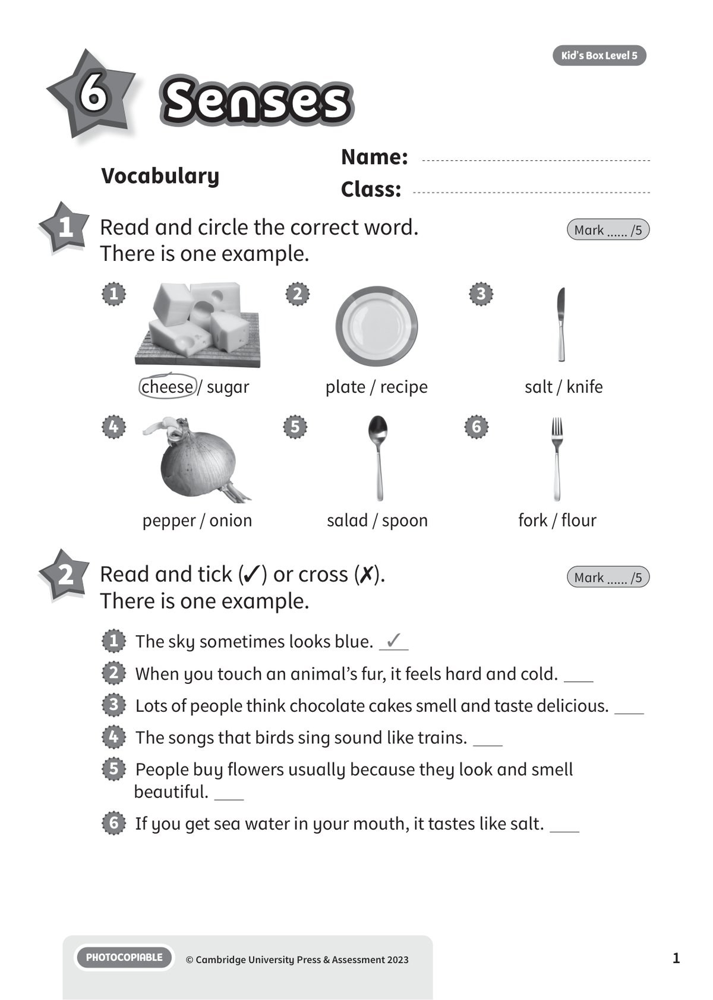
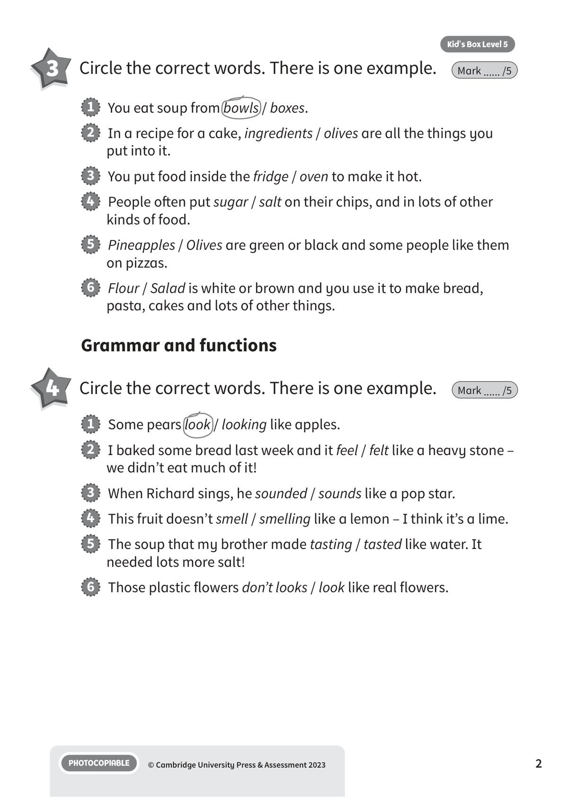
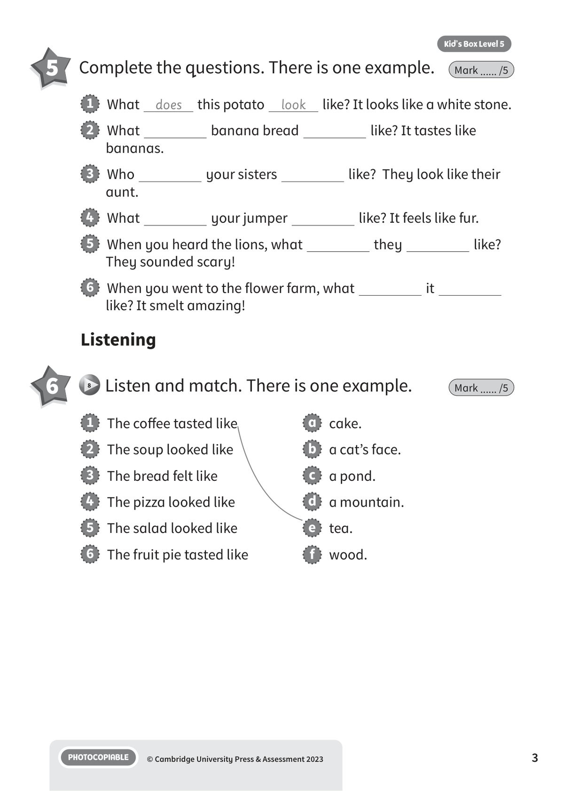

## 音频文件

- 🎧 [KBX_L5_U6_audio_T8.mp3](KBX_L5_U6_audio_T8.mp3)

## 第 1 页

Name:
Class:
PHOTOCOPIABLE
© Cambridge University Press & Assessment 2023
1
Vocabulary
6
Senses
Senses
Senses
Kid’s Box Level 5
1 	 Read and circle the correct word.
There is one example.
Mark ...... /5
2 	 Read and tick (✓) or cross (✗).
There is one example.
Mark ...... /5
1   The sky sometimes looks blue. ✓
2   When you touch an animal’s fur, it feels hard and cold.
3   Lots of people think chocolate cakes smell and taste delicious.
4   The songs that birds sing sound like trains.
5   People buy flowers usually because they look and smell
beautiful.
6   If you get sea water in your mouth, it tastes like salt.
cheese / sugar
1
2
salt / knife
3
pepper / onion
4
salad / spoon
5
fork / flour
6
plate / recipe

## 第 2 页

PHOTOCOPIABLE
© Cambridge University Press & Assessment 2023
2
Kid’s Box Level 5
3 	 Circle the correct words. There is one example.
Mark ...... /5
1   You eat soup from bowls / boxes.
2   In a recipe for a cake, ingredients / olives are all the things you
put into it.
3   You put food inside the fridge / oven to make it hot.
4   People often put sugar / salt on their chips, and in lots of other
kinds of food.
5   Pineapples / Olives are green or black and some people like them
on pizzas.
6   Flour / Salad is white or brown and you use it to make bread,
pasta, cakes and lots of other things.
1   Some pears look / looking like apples.
2   I baked some bread last week and it feel / felt like a heavy stone –
we didn’t eat much of it!
3   When Richard sings, he sounded / sounds like a pop star.
4   This fruit doesn’t smell / smelling like a lemon – I think it’s a lime.
5   The soup that my brother made tasting / tasted like water. It
needed lots more salt!
6   Those plastic flowers don’t looks / look like real flowers.
Grammar and functions
4 	 Circle the correct words. There is one example.
Mark ...... /5

## 第 3 页

PHOTOCOPIABLE
© Cambridge University Press & Assessment 2023
3
Kid’s Box Level 5
5 	 Complete the questions. There is one example.
Mark ...... /5
1   The coffee tasted like
2   The soup looked like
3   The bread felt like
4   The pizza looked like
5   The salad looked like
6   The fruit pie tasted like
a   cake.
b   a cat’s face.
c   a pond.
d   a mountain.
e   tea.
f   wood.
1   What
does
this potato
look
like? It looks like a white stone.
2   What
banana bread
like? It tastes like
bananas.
3   Who
your sisters
like?  They look like their
aunt.
4   What
your jumper
like? It feels like fur.
5   When you heard the lions, what
they
like?
They sounded scary!
6   When you went to the flower farm, what
it
like? It smelt amazing!
Listening
6
8 	Listen and match. There is one example.
Mark ...... /5

## 第 4 页

PHOTOCOPIABLE
© Cambridge University Press & Assessment 2023
4
Kid’s Box Level 5
1   Polly’s favourite food was pizza / fruit.
2   Polly’s parents always put the same toppings / cheese on their
pizzas.
3   Polly didn’t use the tomatoes / onions she found in the fridge.
4   Polly found some pasta in the fridge / cupboard.
5   Polly cooked / cut the fruit before she put it on the pizza.
6   Polly’s family thought the pizza tasted exciting / interesting.
Reading and writing
7 	 Read and circle the correct answers.
There is one example.
Mark ...... /5
Polly loved pizza more than any other food. She loved the smell of
it and the taste of it. But she was bored with the toppings on the
pizzas that her dad made. They were always the same: tomato,
olives, cheese and onion. So one day, Polly decided to make a
‘P pizza’. First she looked in the fridge. There were lots of tomatoes
and potatoes but she couldn’t put tomatoes on a P pizza. She just
took the potatoes. In the cupboard there was some pasta and in the
fruit bowl she found pears, plums and a pineapple. She cut them
and put them on the pizza. Then she put the pizza in the oven. She
was excited! Later, she sat down to eat the pizza with her family and
her parents asked, ‘What has this got on it?’
‘Only food beginning with the letter P!’ Polly said. ‘It’s Polly’s
Perfect P Pizza!’
Then everyone tasted it. They all agreed it was interesting, but
they never wanted to have it again.

## 第 5 页

PHOTOCOPIABLE
© Cambridge University Press & Assessment 2023
5
Kid’s Box Level 5
8 	 Read and choose a or b. There is one example.
Mark ...... /5
Total unit mark ...... /40
1
a   sold
b   made
2
a   sounds
b   looks
3
a   does
b   is
4
a   at
b   like
5
a   taste
b   feel
6
a   think
b   hear
Ollie:
Look what I (1) b at school this morning! It’s a model of my
bedroom.
Dad:
Oh yes! That (2)   amazing! What’s that blue thing in the
middle of the room?
Ollie:
What (3)   it look like?
Dad:
I’m not sure. A big cushion?
Ollie:
No! It doesn’t look (4)   a cushion! It’s a rug!
Dad:
Of course, your blue rug. What’s it made of?
Ollie:
Touch it. What does it (5)   like?
Dad:
Err … it’s very soft. I (6)   it’s wool.
Ollie:
Yes, that’s right.
Dad:
It’s all great, Ollie.
