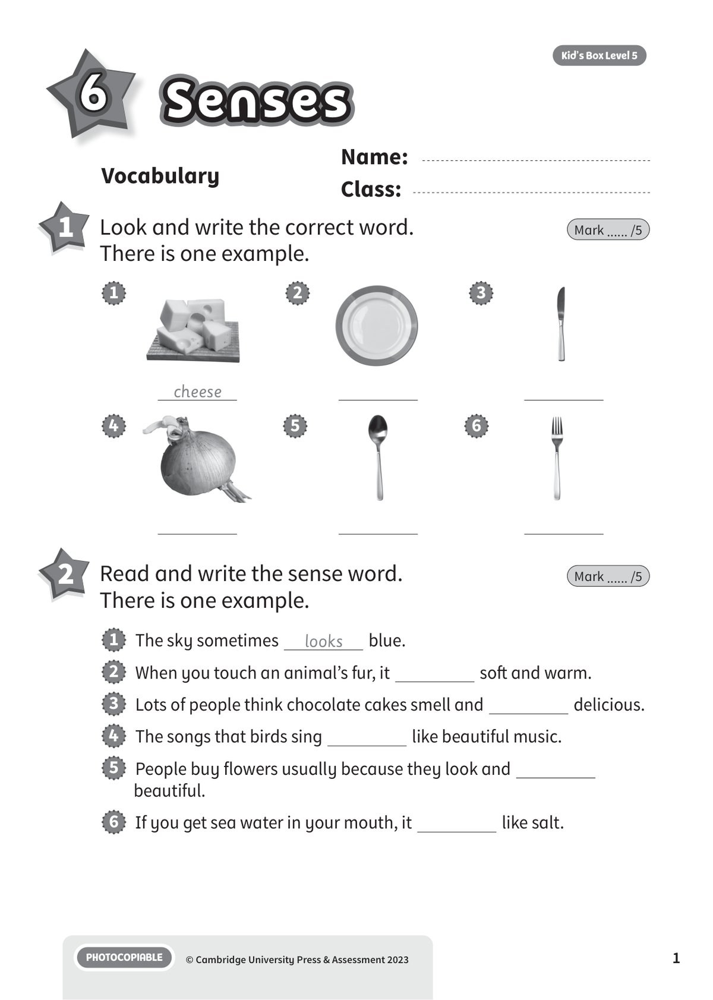
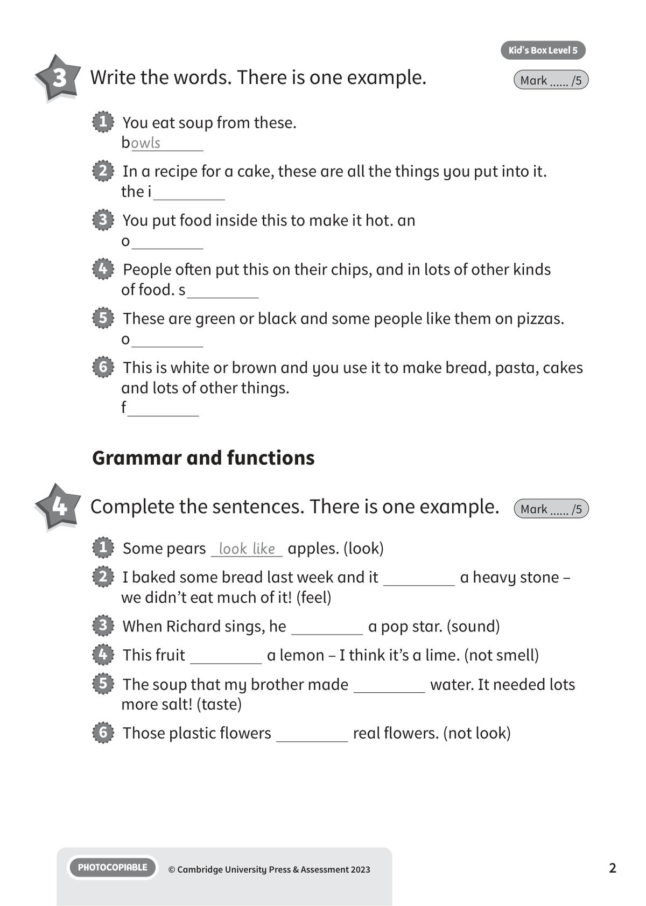
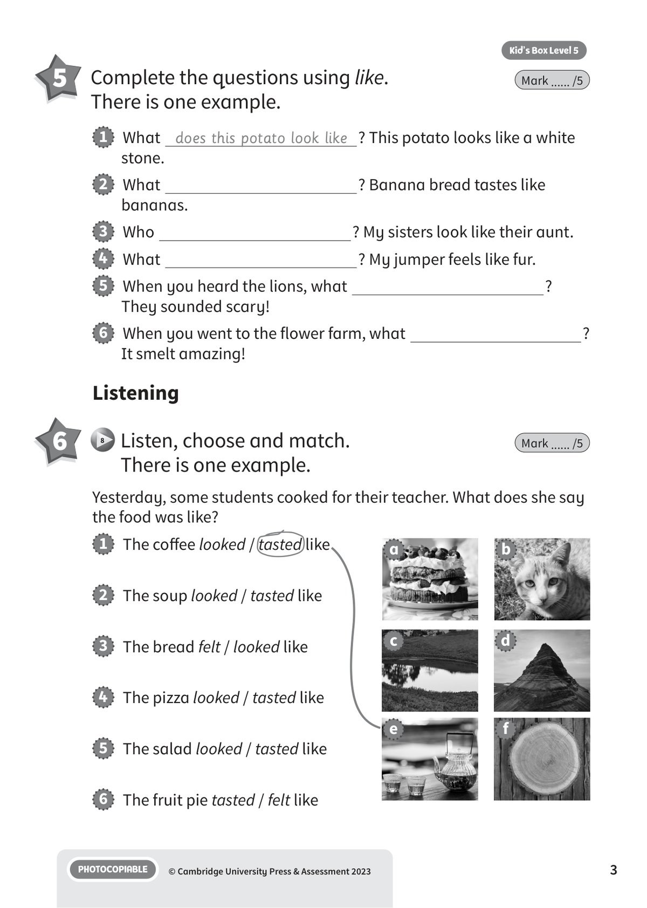
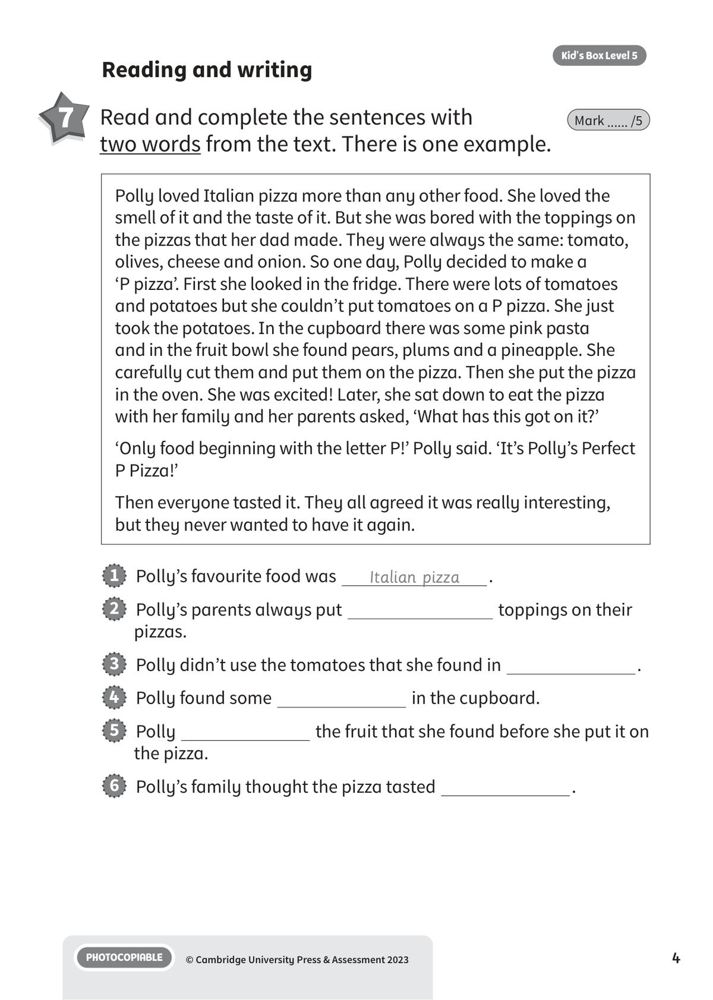
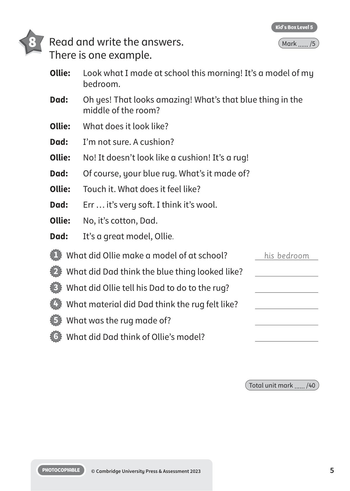

## 音频文件

- 🎧 [KBX_L5_U6_audio_T8.mp3](KBX_L5_U6_audio_T8.mp3)

## 第 1 页

Name:
Class:
PHOTOCOPIABLE
© Cambridge University Press & Assessment 2023
1
Vocabulary
Senses
Senses
Senses
Kid’s Box Level 5
6
1 	 Look and write the correct word.
There is one example.
Mark ...... /5
2 	 Read and write the sense word.
There is one example.
Mark ...... /5
1   The sky sometimes
looks
blue.
2   When you touch an animal’s fur, it
soft and warm.
3   Lots of people think chocolate cakes smell and
delicious.
4   The songs that birds sing
like beautiful music.
5   People buy flowers usually because they look and
beautiful.
6   If you get sea water in your mouth, it
like salt.
cheese
1
2
3
4
5
6

## 第 2 页

PHOTOCOPIABLE
© Cambridge University Press & Assessment 2023
2
Kid’s Box Level 5
Grammar and functions
4 	 Complete the sentences. There is one example.
Mark ...... /5
3 	 Write the words. There is one example.
Mark ...... /5
1   You eat soup from these.
bowls
2   In a recipe for a cake, these are all the things you put into it.
the i
3   You put food inside this to make it hot. an
o
4   People often put this on their chips, and in lots of other kinds
of food. s
5   These are green or black and some people like them on pizzas.
o
6   This is white or brown and you use it to make bread, pasta, cakes
and lots of other things.
f
1   Some pears look like apples. (look)
2   I baked some bread last week and it
a heavy stone –
we didn’t eat much of it! (feel)
3   When Richard sings, he
a pop star. (sound)
4   This fruit
a lemon – I think it’s a lime. (not smell)
5   The soup that my brother made
water. It needed lots
more salt! (taste)
6   Those plastic flowers
real flowers. (not look)

## 第 3 页

PHOTOCOPIABLE
© Cambridge University Press & Assessment 2023
3
Kid’s Box Level 5
5 	 Complete the questions using like.
There is one example.
Mark ...... /5
1   What does this potato look like ? This potato looks like a white
stone.
2   What
? Banana bread tastes like
bananas.
3   Who
? My sisters look like their aunt.
4   What
? My jumper feels like fur.
5   When you heard the lions, what
?
They sounded scary!
6   When you went to the flower farm, what
?
It smelt amazing!
1   The coffee looked / tasted like
2   The soup looked / tasted like
3   The bread felt / looked like
4   The pizza looked / tasted like
5   The salad looked / tasted like
6   The fruit pie tasted / felt like
Listening
6
8 	Listen, choose and match.
There is one example.
Mark ...... /5
Yesterday, some students cooked for their teacher. What does she say
the food was like?
a
b
c
d
e
f

## 第 4 页

PHOTOCOPIABLE
© Cambridge University Press & Assessment 2023
4
Kid’s Box Level 5
1   Polly’s favourite food was
Italian pizza
.
2   Polly’s parents always put
toppings on their
pizzas.
3   Polly didn’t use the tomatoes that she found in
.
4   Polly found some
in the cupboard.
5   Polly
the fruit that she found before she put it on
the pizza.
6   Polly’s family thought the pizza tasted
.
Reading and writing
7 	 Read and complete the sentences with
two words from the text. There is one example.
Mark ...... /5
Polly loved Italian pizza more than any other food. She loved the
smell of it and the taste of it. But she was bored with the toppings on
the pizzas that her dad made. They were always the same: tomato,
olives, cheese and onion. So one day, Polly decided to make a
‘P pizza’. First she looked in the fridge. There were lots of tomatoes
and potatoes but she couldn’t put tomatoes on a P pizza. She just
took the potatoes. In the cupboard there was some pink pasta
and in the fruit bowl she found pears, plums and a pineapple. She
carefully cut them and put them on the pizza. Then she put the pizza
in the oven. She was excited! Later, she sat down to eat the pizza
with her family and her parents asked, ‘What has this got on it?’
‘Only food beginning with the letter P!’ Polly said. ‘It’s Polly’s Perfect
P Pizza!’
Then everyone tasted it. They all agreed it was really interesting,
but they never wanted to have it again.

## 第 5 页

PHOTOCOPIABLE
© Cambridge University Press & Assessment 2023
5
Kid’s Box Level 5
8 	 Read and write the answers.
There is one example.
Mark ...... /5
Ollie:
Look what I made at school this morning! It’s a model of my
bedroom.
Dad:
Oh yes! That looks amazing! What’s that blue thing in the
middle of the room?
Ollie:
What does it look like?
Dad:
I’m not sure. A cushion?
Ollie:
No! It doesn’t look like a cushion! It’s a rug!
Dad:
Of course, your blue rug. What’s it made of?
Ollie:
Touch it. What does it feel like?
Dad:
Err … it’s very soft. I think it’s wool.
Ollie:
No, it’s cotton, Dad.
Dad:
It’s a great model, Ollie.
1   What did Ollie make a model of at school?
his bedroom
2   What did Dad think the blue thing looked like?
3   What did Ollie tell his Dad to do to the rug?
4   What material did Dad think the rug felt like?
5   What was the rug made of?
6   What did Dad think of Ollie’s model?
Total unit mark ...... /40
