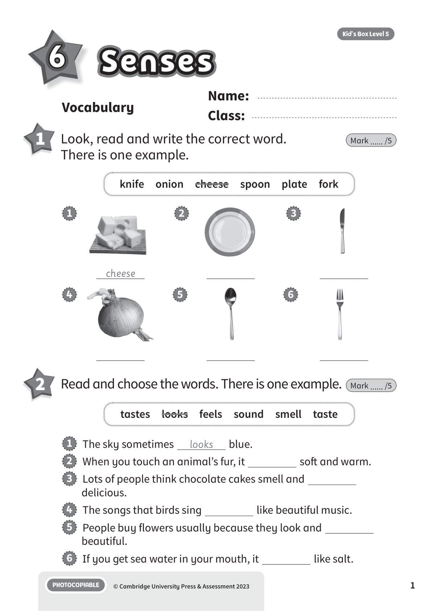
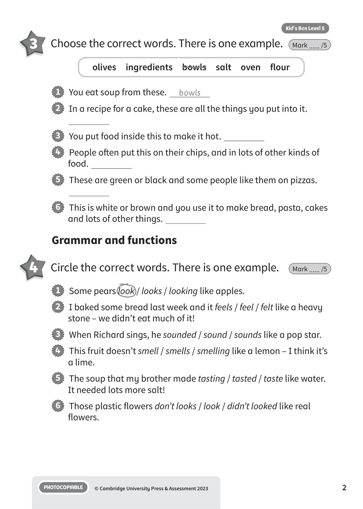
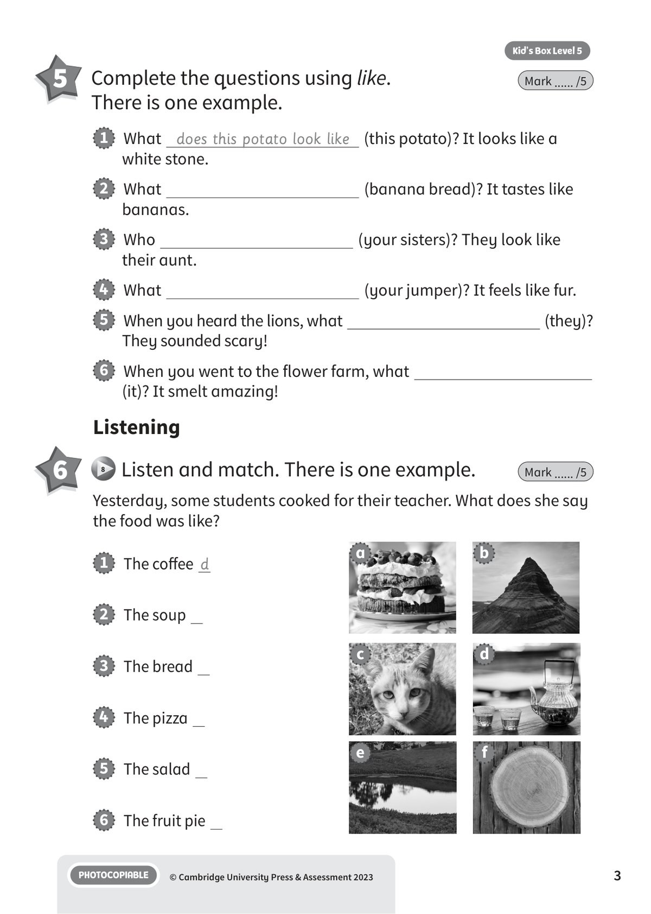
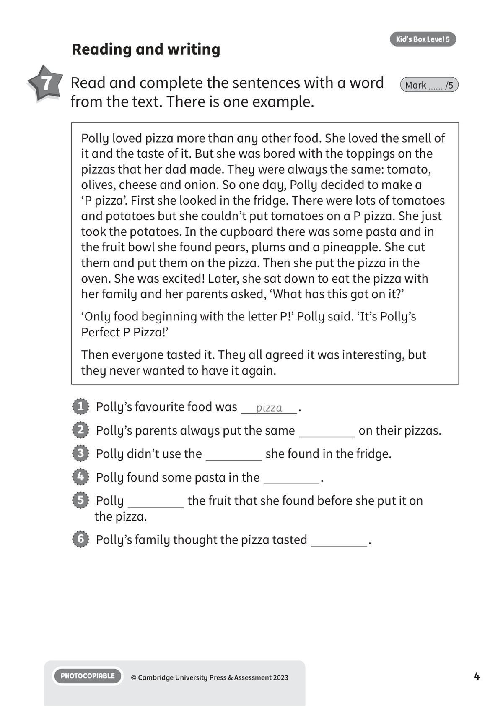
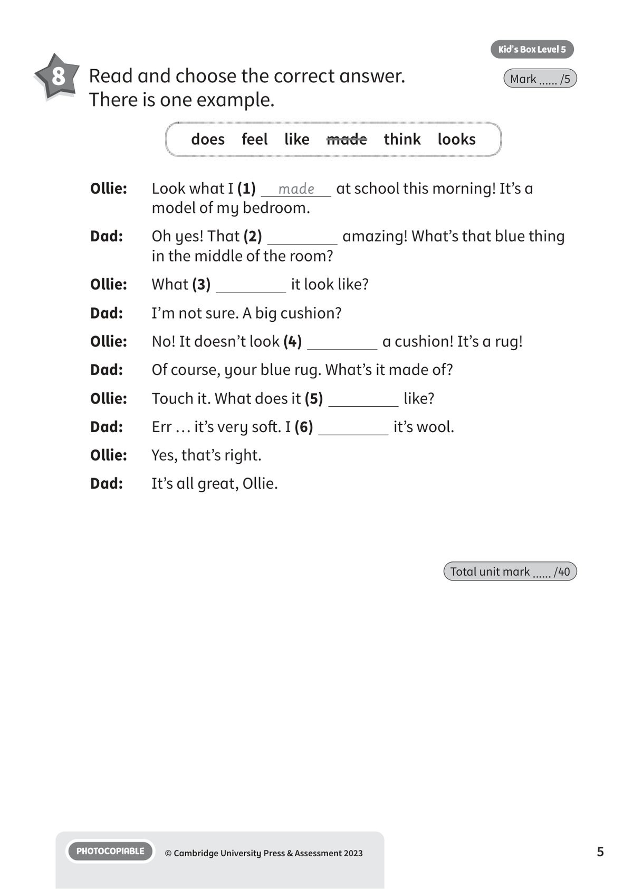
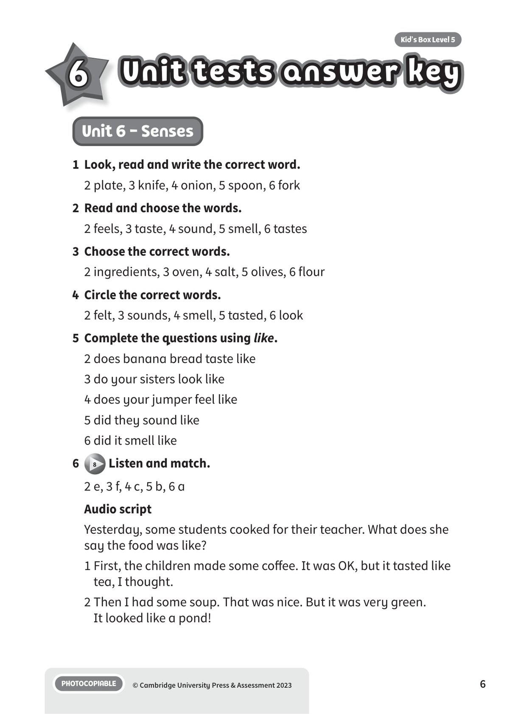
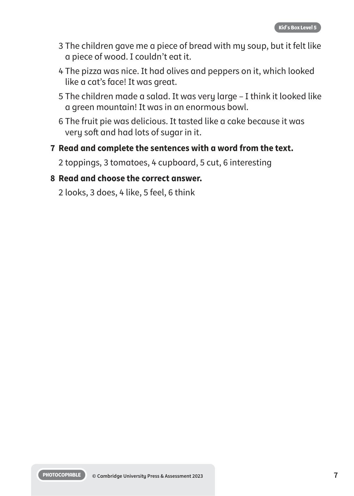

## 音频文件

- 🎧 [KBX_L5_U6_audio_T8.mp3](KBX_L5_U6_audio_T8.mp3)

## 第 1 页

Name:
Class:
PHOTOCOPIABLE
© Cambridge University Press & Assessment 2023
1
Vocabulary
Senses
Senses
Senses
Kid’s Box Level 5
6
1 	 Look, read and write the correct word.
There is one example.
Mark ...... /5
2 	 Read and choose the words. There is one example.
Mark ...... /5
1   The sky sometimes
looks
blue.
2   When you touch an animal’s fur, it
soft and warm.
3   Lots of people think chocolate cakes smell and
delicious.
4   The songs that birds sing
like beautiful music.
5   People buy flowers usually because they look and
beautiful.
6   If you get sea water in your mouth, it
like salt.
tastes  looks  feels  sound  smell  taste
cheese
1
2
3
4
5
6
knife  onion  cheese  spoon  plate  fork

## 第 2 页

PHOTOCOPIABLE
© Cambridge University Press & Assessment 2023
2
Kid’s Box Level 5
3 	 Choose the correct words. There is one example.
Mark ...... /5
1   You eat soup from these.
bowls
2   In a recipe for a cake, these are all the things you put into it.
3   You put food inside this to make it hot.
4   People often put this on their chips, and in lots of other kinds of
food.
5   These are green or black and some people like them on pizzas.
6   This is white or brown and you use it to make bread, pasta, cakes
and lots of other things.
olives  ingredients  bowls  salt  oven  flour
Grammar and functions
4 	 Circle the correct words. There is one example.
Mark ...... /5
1   Some pears look / looks / looking like apples.
2   I baked some bread last week and it feels / feel / felt like a heavy
stone – we didn’t eat much of it!
3   When Richard sings, he sounded / sound / sounds like a pop star.
4   This fruit doesn’t smell / smells / smelling like a lemon – I think it’s
a lime.
5   The soup that my brother made tasting / tasted / taste like water.
It needed lots more salt!
6   Those plastic flowers don’t looks / look / didn’t looked like real
flowers.

## 第 3 页

PHOTOCOPIABLE
© Cambridge University Press & Assessment 2023
3
Kid’s Box Level 5
5 	 Complete the questions using like.
There is one example.
Mark ...... /5
1   What does this potato look like (this potato)? It looks like a
white stone.
2   What
(banana bread)? It tastes like
bananas.
3   Who
(your sisters)? They look like
their aunt.
4   What
(your jumper)? It feels like fur.
5   When you heard the lions, what
(they)?
They sounded scary!
6   When you went to the flower farm, what
(it)? It smelt amazing!
Listening
1   The coffee d
2   The soup
3   The bread
4   The pizza
5   The salad
6   The fruit pie
6 	  8 	Listen and match. There is one example.
Mark ...... /5
Yesterday, some students cooked for their teacher. What does she say
the food was like?
a
b
c
d
e
f

## 第 4 页

PHOTOCOPIABLE
© Cambridge University Press & Assessment 2023
4
Kid’s Box Level 5
1   Polly’s favourite food was
pizza
.
2   Polly’s parents always put the same
on their pizzas.
3   Polly didn’t use the
she found in the fridge.
4   Polly found some pasta in the
.
5   Polly
the fruit that she found before she put it on
the pizza.
6   Polly’s family thought the pizza tasted
.
Reading and writing
7 	 Read and complete the sentences with a word
from the text. There is one example.
Mark ...... /5
Polly loved pizza more than any other food. She loved the smell of
it and the taste of it. But she was bored with the toppings on the
pizzas that her dad made. They were always the same: tomato,
olives, cheese and onion. So one day, Polly decided to make a
‘P pizza’. First she looked in the fridge. There were lots of tomatoes
and potatoes but she couldn’t put tomatoes on a P pizza. She just
took the potatoes. In the cupboard there was some pasta and in
the fruit bowl she found pears, plums and a pineapple. She cut
them and put them on the pizza. Then she put the pizza in the
oven. She was excited! Later, she sat down to eat the pizza with
her family and her parents asked, ‘What has this got on it?’
‘Only food beginning with the letter P!’ Polly said. ‘It’s Polly’s
Perfect P Pizza!’
Then everyone tasted it. They all agreed it was interesting, but
they never wanted to have it again.

## 第 5 页

PHOTOCOPIABLE
© Cambridge University Press & Assessment 2023
5
Kid’s Box Level 5
8 	 Read and choose the correct answer.
There is one example.
Mark ...... /5
Ollie:
Look what I (1)
made
at school this morning! It’s a
model of my bedroom.
Dad:
Oh yes! That (2)
amazing! What’s that blue thing
in the middle of the room?
Ollie:
What (3)
it look like?
Dad:
I’m not sure. A big cushion?
Ollie:
No! It doesn’t look (4)
a cushion! It’s a rug!
Dad:
Of course, your blue rug. What’s it made of?
Ollie:
Touch it. What does it (5)
like?
Dad:
Err … it’s very soft. I (6)
it’s wool.
Ollie:
Yes, that’s right.
Dad:
It’s all great, Ollie.
does  feel  like  made  think  looks
Total unit mark ...... /40

## 第 6 页

Unit tests answer key
Unit tests answer key
Unit tests answer key
PHOTOCOPIABLE
© Cambridge University Press & Assessment 2023
6
Kid’s Box Level 5
6
Unit 6 - Senses
1	 Look, read and write the correct word.
2 plate, 3 knife, 4 onion, 5 spoon, 6 fork
2	 Read and choose the words.
2 feels, 3 taste, 4 sound, 5 smell, 6 tastes
3	 Choose the correct words.
2 ingredients, 3 oven, 4 salt, 5 olives, 6 flour
4	 Circle the correct words.
2 felt, 3 sounds, 4 smell, 5 tasted, 6 look
5	 Complete the questions using like.
2 does banana bread taste like
3 do your sisters look like
4 does your jumper feel like
5 did they sound like
6 did it smell like
6
8 Listen and match.
2 e, 3 f, 4 c, 5 b, 6 a
Audio script
Yesterday, some students cooked for their teacher. What does she
say the food was like?
1 First, the children made some coffee. It was OK, but it tasted like
tea, I thought.
2 Then I had some soup. That was nice. But it was very green.
It looked like a pond!

## 第 7 页

PHOTOCOPIABLE
© Cambridge University Press & Assessment 2023
7
Kid’s Box Level 5
3 The children gave me a piece of bread with my soup, but it felt like
a piece of wood. I couldn’t eat it.
4 The pizza was nice. It had olives and peppers on it, which looked
like a cat’s face! It was great.
5 The children made a salad. It was very large – I think it looked like
a green mountain! It was in an enormous bowl.
6 The fruit pie was delicious. It tasted like a cake because it was
very soft and had lots of sugar in it.
7	 Read and complete the sentences with a word from the text.
2 toppings, 3 tomatoes, 4 cupboard, 5 cut, 6 interesting
8	 Read and choose the correct answer.
2 looks, 3 does, 4 like, 5 feel, 6 think
