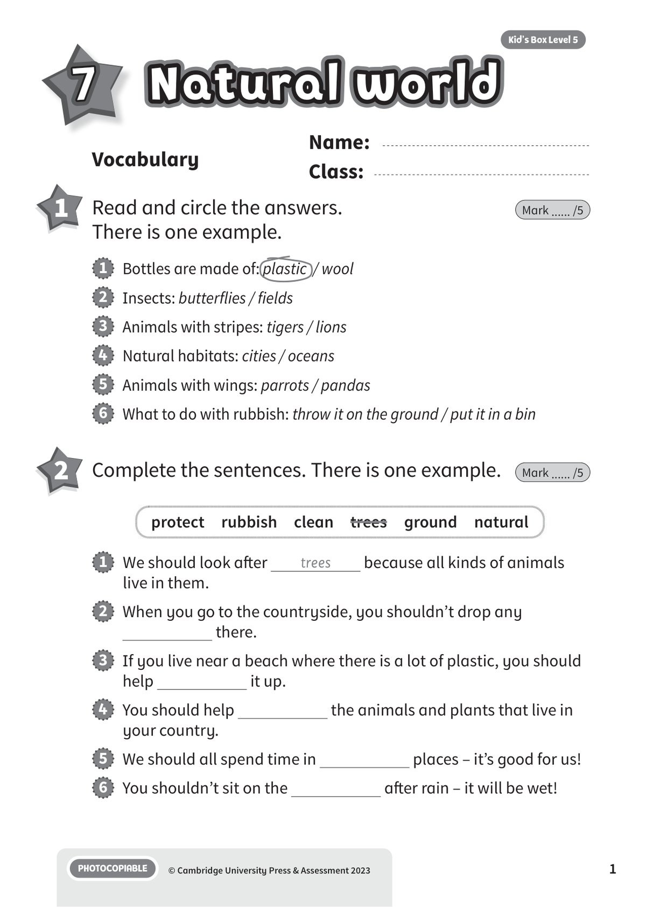
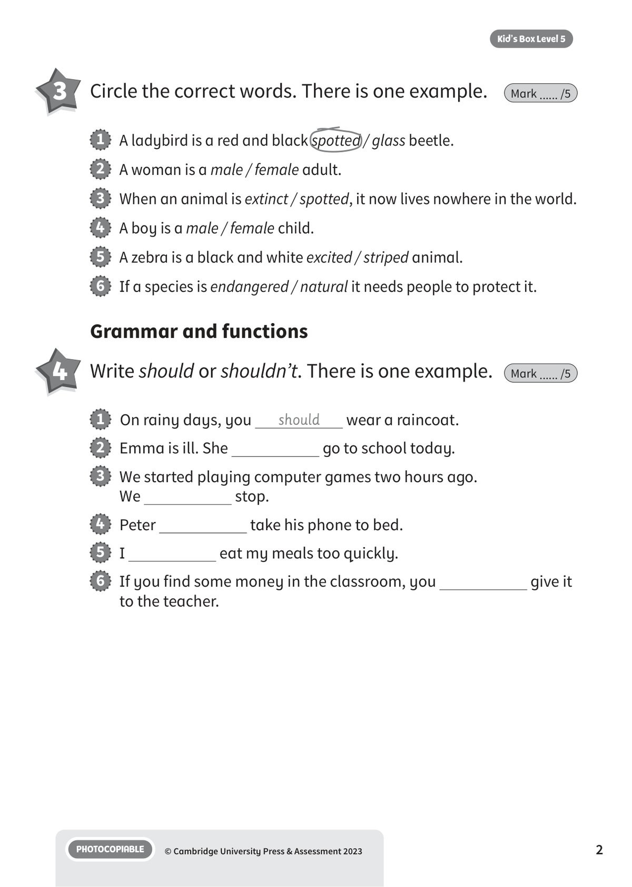
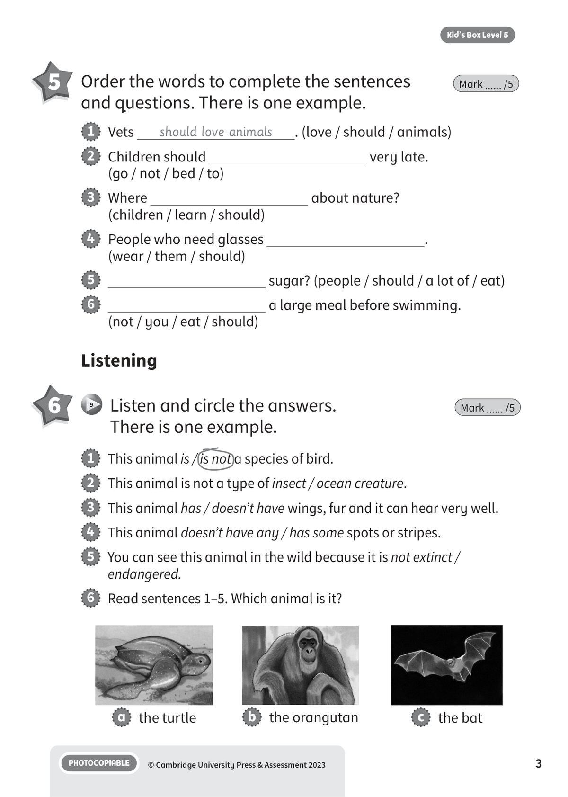
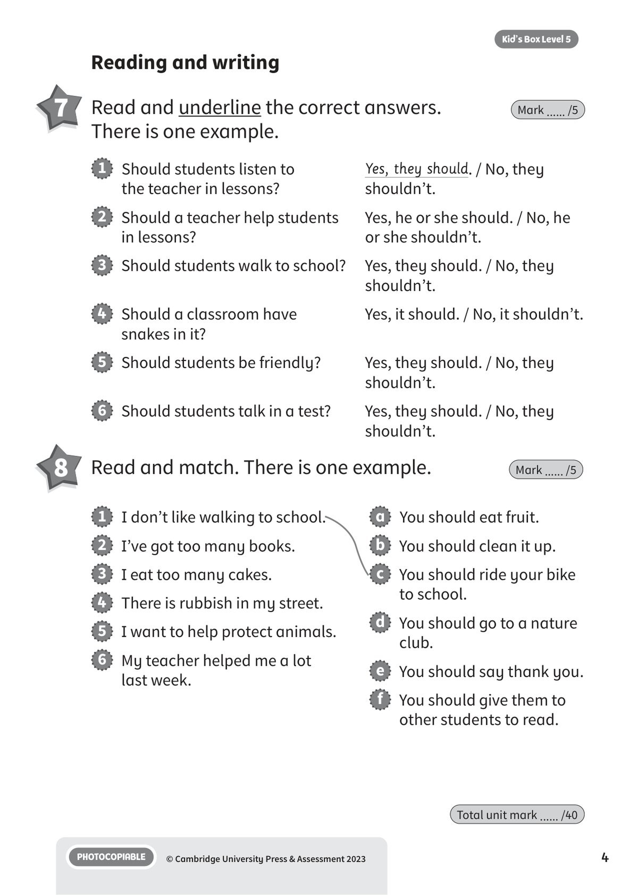

## 音频文件

- 🎧 [KBX_L5_U7_audio_T9.mp3](KBX_L5_U7_audio_T9.mp3)

## 第 1 页

Name:
Class:
PHOTOCOPIABLE
© Cambridge University Press & Assessment 2023
1
Kid’s Box Level 5
Natural world
Natural world
Natural world
7
Vocabulary
1 	 Read and circle the answers.
There is one example.
Mark ...... /5
2 	 Complete the sentences. There is one example.
Mark ...... /5
1   Bottles are made of: plastic  / wool
2   Insects: butterflies / fields
3   Animals with stripes: tigers / lions
4   Natural habitats: cities / oceans
5   Animals with wings: parrots / pandas
6   What to do with rubbish: throw it on the ground / put it in a bin
protect  rubbish  clean  trees  ground  natural
1   We should look after
trees
because all kinds of animals
live in them.
2   When you go to the countryside, you shouldn’t drop any
there.
3   If you live near a beach where there is a lot of plastic, you should
help
it up.
4   You should help
the animals and plants that live in
your country.
5   We should all spend time in
places – it’s good for us!
6   You shouldn’t sit on the
after rain – it will be wet!

## 第 2 页

PHOTOCOPIABLE
© Cambridge University Press & Assessment 2023
2
Kid’s Box Level 5
Grammar and functions
3 	 Circle the correct words. There is one example.
Mark ...... /5
4 	 Write should or shouldn’t. There is one example.
Mark ...... /5
1   A ladybird is a red and black spotted / glass beetle.
2   A woman is a male / female adult.
3   When an animal is extinct / spotted, it now lives nowhere in the world.
4   A boy is a male / female child.
5   A zebra is a black and white excited / striped animal.
6   If a species is endangered / natural it needs people to protect it.
1   On rainy days, you
should
wear a raincoat.
2   Emma is ill. She
go to school today.
3   We started playing computer games two hours ago.
We
stop.
4   Peter
take his phone to bed.
5   I
eat my meals too quickly.
6   If you find some money in the classroom, you
give it
to the teacher.

## 第 3 页

PHOTOCOPIABLE
© Cambridge University Press & Assessment 2023
3
Kid’s Box Level 5
5 	 Order the words to complete the sentences
and questions. There is one example.
Mark ...... /5
Listening
6 	  9   Listen and circle the answers.
There is one example.
Mark ...... /5
1   This animal is / is not a species of bird.
2   This animal is not a type of insect / ocean creature.
3   This animal has / doesn’t have wings, fur and it can hear very well.
4   This animal doesn’t have any / has some spots or stripes.
5   You can see this animal in the wild because it is not extinct /
endangered.
6   Read sentences 1–5. Which animal is it?
1   Vets
should love animals
. (love / should / animals)
2   Children should
very late.
(go / not / bed / to)
3   Where
about nature?
(children / learn / should)
4   People who need glasses
.
(wear / them / should)
5   
sugar? (people / should / a lot of / eat)
6   
a large meal before swimming.
(not / you / eat / should)
a   the turtle
b   the orangutan
c   the bat

## 第 4 页

PHOTOCOPIABLE
© Cambridge University Press & Assessment 2023
4
Kid’s Box Level 5
Reading and writing
7 	 Read and underline the correct answers.
There is one example.
Mark ...... /5
1   Should students listen to
Yes, they should. / No, they
the teacher in lessons?
shouldn’t.
2   Should a teacher help students
Yes, he or she should. / No, he
in lessons?
or she shouldn’t.
3   Should students walk to school?
Yes, they should. / No, they
shouldn’t.
4   Should a classroom have
Yes, it should. / No, it shouldn’t.
snakes in it?
5   Should students be friendly?
Yes, they should. / No, they
shouldn’t.
6   Should students talk in a test?
Yes, they should. / No, they
shouldn’t.
1   I don’t like walking to school.
2   I’ve got too many books.
3   I eat too many cakes.
4   There is rubbish in my street.
5   I want to help protect animals.
6   My teacher helped me a lot
last week.
a   You should eat fruit.
b   You should clean it up.
c   You should ride your bike
to school.
d   You should go to a nature
club.
e   You should say thank you.
f   You should give them to
other students to read.
8 	 Read and match. There is one example.
Mark ...... /5
Total unit mark ...... /40
