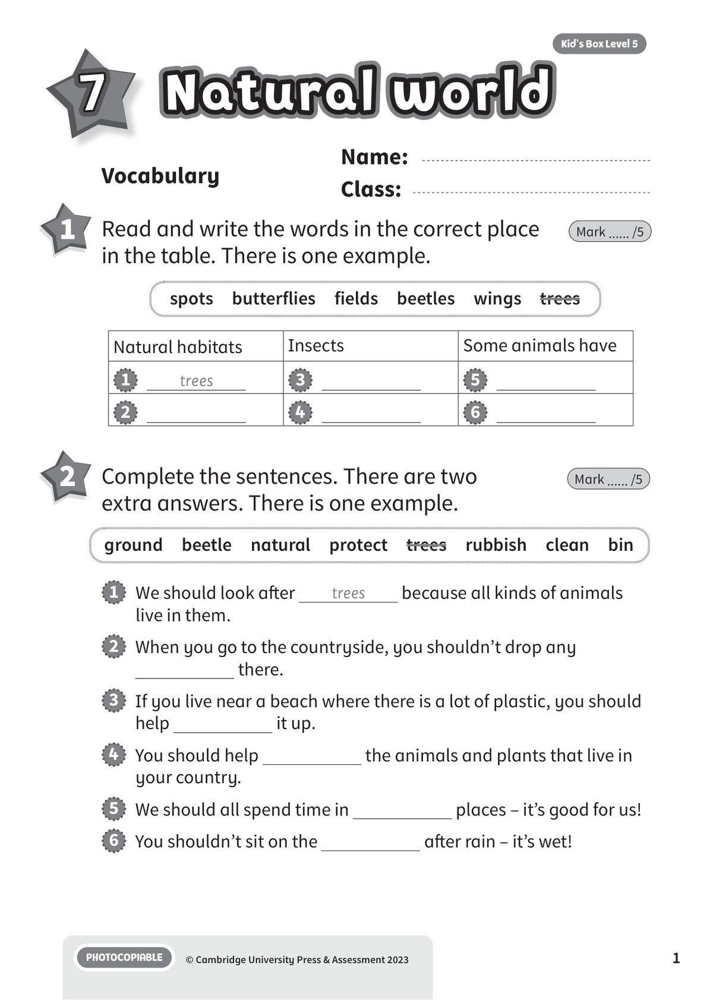
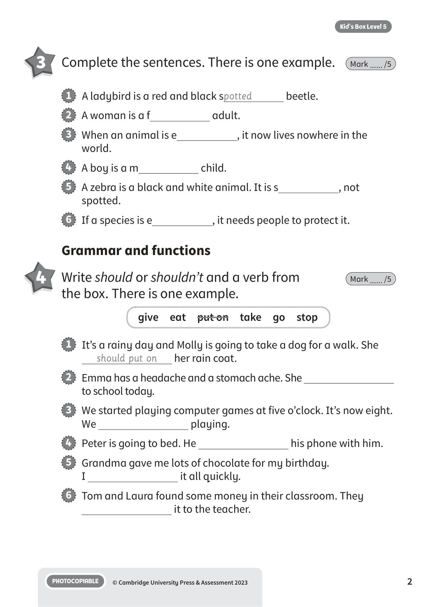
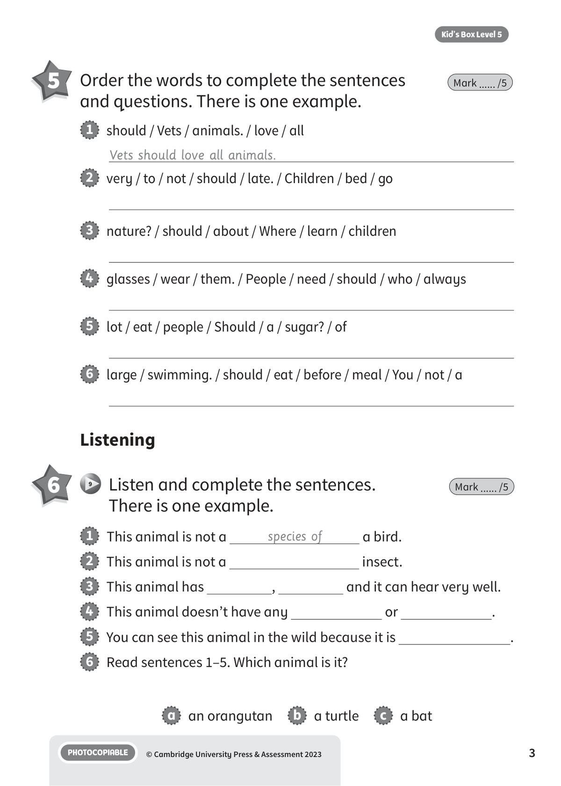
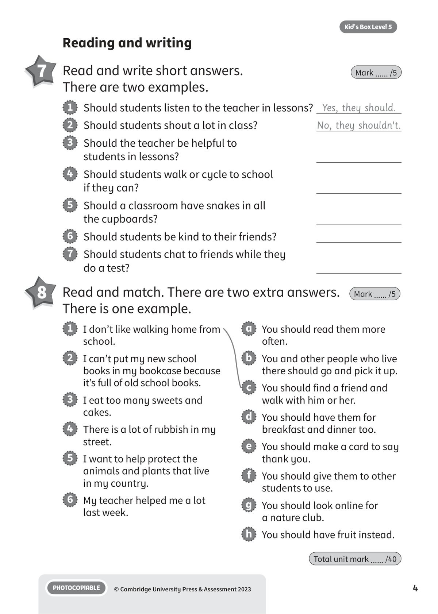
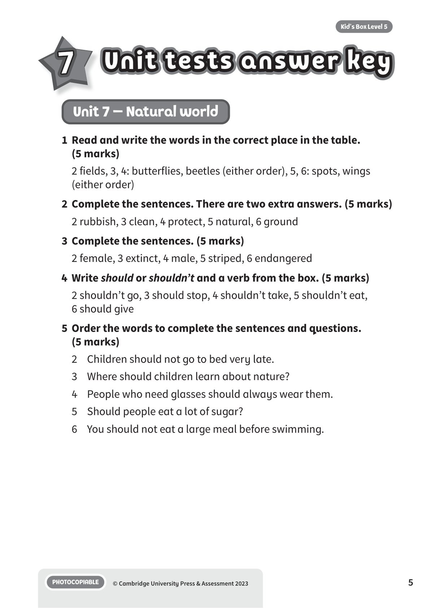
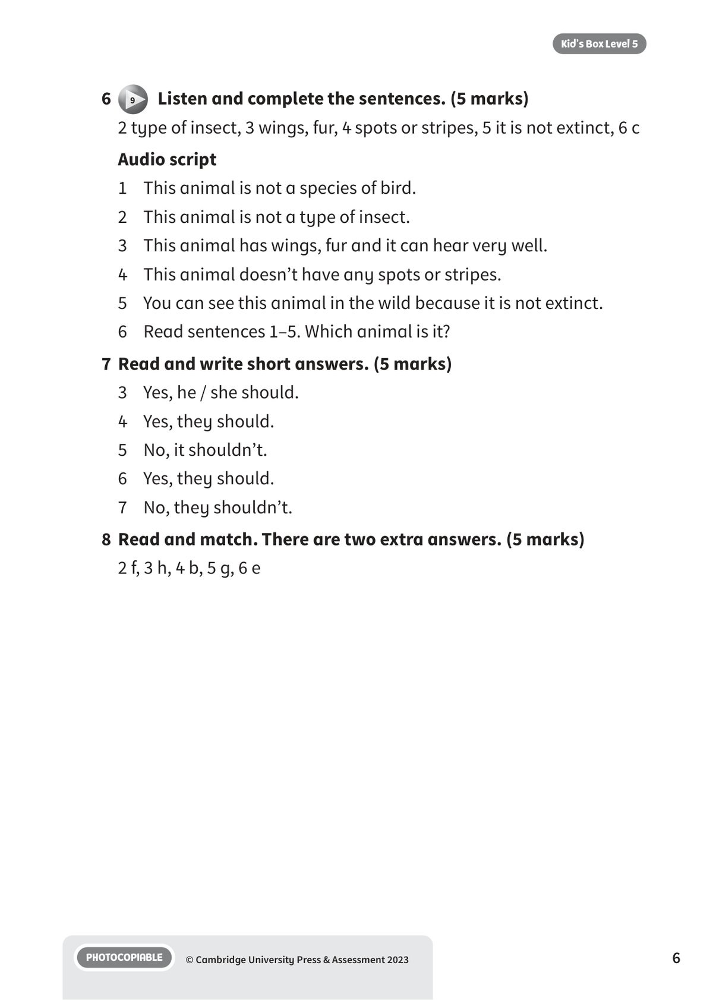

## 音频文件

- 🎧 [KBX_L5_U7_audio_T9.mp3](KBX_L5_U7_audio_T9.mp3)

## 第 1 页

Name:
Class:
PHOTOCOPIABLE
© Cambridge University Press & Assessment 2023
1
Kid’s Box Level 5
Natural world
Natural world
Natural world
7
Vocabulary
1 	 Read and write the words in the correct place
in the table. There is one example.
Mark ...... /5
2 	 Complete the sentences. There are two
extra answers. There is one example.
Mark ...... /5
ground  beetle  natural  protect  trees  rubbish  clean  bin
spots  butterflies  fields  beetles  wings  trees
1   We should look after
trees
because all kinds of animals
live in them.
2   When you go to the countryside, you shouldn’t drop any
there.
3   If you live near a beach where there is a lot of plastic, you should
help
it up.
4   You should help
the animals and plants that live in
your country.
5   We should all spend time in
places – it’s good for us!
6   You shouldn’t sit on the
after rain – it’s wet!
Natural habitats
Insects
Some animals have
1
trees
3
5
2
4
6

## 第 2 页

PHOTOCOPIABLE
© Cambridge University Press & Assessment 2023
2
Kid’s Box Level 5
Grammar and functions
3 	 Complete the sentences. There is one example.
Mark ...... /5
4 	 Write should or shouldn’t and a verb from
the box. There is one example.
Mark ...... /5
1   A ladybird is a red and black spotted
beetle.
2   A woman is a f
adult.
3   When an animal is e
, it now lives nowhere in the
world.
4   A boy is a m
child.
5   A zebra is a black and white animal. It is s
, not
spotted.
6   If a species is e
, it needs people to protect it.
1   It’s a rainy day and Molly is going to take a dog for a walk. She
should put on
her rain coat.
2   Emma has a headache and a stomach ache. She
to school today.
3   We started playing computer games at five o’clock. It’s now eight.
We
playing.
4   Peter is going to bed. He
his phone with him.
5   Grandma gave me lots of chocolate for my birthday.
I
it all quickly.
6   Tom and Laura found some money in their classroom. They
it to the teacher.
give  eat  put on  take  go  stop

## 第 3 页

PHOTOCOPIABLE
© Cambridge University Press & Assessment 2023
3
Kid’s Box Level 5
5 	 Order the words to complete the sentences
and questions. There is one example.
Mark ...... /5
Listening
6 	  9   Listen and complete the sentences.
There is one example.
Mark ...... /5
1   This animal is not a
species of
a bird.
2   This animal is not a
insect.
3   This animal has
,
and it can hear very well.
4   This animal doesn’t have any
or
.
5   You can see this animal in the wild because it is
.
6   Read sentences 1–5. Which animal is it?
a   an orangutan
b   a turtle
c   a bat
1   should / Vets / animals. / love / all
Vets should love all animals.
2   very / to / not / should / late. / Children / bed / go
3   nature? / should / about / Where / learn / children
4   glasses / wear / them. / People / need / should / who / always
5   lot / eat / people / Should / a / sugar? / of
6   large / swimming. / should / eat / before / meal / You / not / a

## 第 4 页

PHOTOCOPIABLE
© Cambridge University Press & Assessment 2023
4
Kid’s Box Level 5
Reading and writing
7 	 Read and write short answers.
There are two examples.
Mark ...... /5
1   Should students listen to the teacher in lessons? Yes, they should.
2   Should students shout a lot in class?
No, they shouldn’t.
3   Should the teacher be helpful to
students in lessons?
4   Should students walk or cycle to school
if they can?
5   Should a classroom have snakes in all
the cupboards?
6   Should students be kind to their friends?
7   Should students chat to friends while they
do a test?
1   I don’t like walking home from
school.
2   I can’t put my new school
books in my bookcase because
it’s full of old school books.
3   I eat too many sweets and
cakes.
4   There is a lot of rubbish in my
street.
5   I want to help protect the
animals and plants that live
in my country.
6   My teacher helped me a lot
last week.
a   You should read them more
often.
b   You and other people who live
there should go and pick it up.
c   You should find a friend and
walk with him or her.
d   You should have them for
breakfast and dinner too.
e   You should make a card to say
thank you.
f   You should give them to other
students to use.
g   You should look online for
a nature club.
h   You should have fruit instead.
8 	 Read and match. There are two extra answers.
There is one example.
Mark ...... /5
Total unit mark ...... /40

## 第 5 页

Unit tests answer key
Unit tests answer key
Unit tests answer key
PHOTOCOPIABLE
© Cambridge University Press & Assessment 2023
5
Kid’s Box Level 5
7
Unit 7 – Natural world
1 	Read and write the words in the correct place in the table.
(5 marks)
2 fields, 3, 4: butterflies, beetles (either order), 5, 6: spots, wings
(either order)
2 	Complete the sentences. There are two extra answers. (5 marks)
2 rubbish, 3 clean, 4 protect, 5 natural, 6 ground
3 	Complete the sentences. (5 marks)
2 female, 3 extinct, 4 male, 5 striped, 6 endangered
4 	Write should or shouldn’t and a verb from the box. (5 marks)
2 shouldn’t go, 3 should stop, 4 shouldn’t take, 5 shouldn’t eat,
6 should give
5 	Order the words to complete the sentences and questions.
(5 marks)
2 	 Children should not go to bed very late.
3 	 Where should children learn about nature?
4 	 People who need glasses should always wear them.
5 	 Should people eat a lot of sugar?
6 	 You should not eat a large meal before swimming.

## 第 6 页

PHOTOCOPIABLE
© Cambridge University Press & Assessment 2023
6
Kid’s Box Level 5
6
9   Listen and complete the sentences. (5 marks)
2 type of insect, 3 wings, fur, 4 spots or stripes, 5 it is not extinct, 6 c
Audio script
1	 This animal is not a species of bird.
2 	 This animal is not a type of insect.
3 	 This animal has wings, fur and it can hear very well.
4 	 This animal doesn’t have any spots or stripes.
5 	 You can see this animal in the wild because it is not extinct.
6 	 Read sentences 1–5. Which animal is it?
7 	Read and write short answers. (5 marks)
3 	 Yes, he / she should.
4 	 Yes, they should.
5 	 No, it shouldn’t.
6 	 Yes, they should.
7 	 No, they shouldn’t.
8 	Read and match. There are two extra answers. (5 marks)
2 f, 3 h, 4 b, 5 g, 6 e
