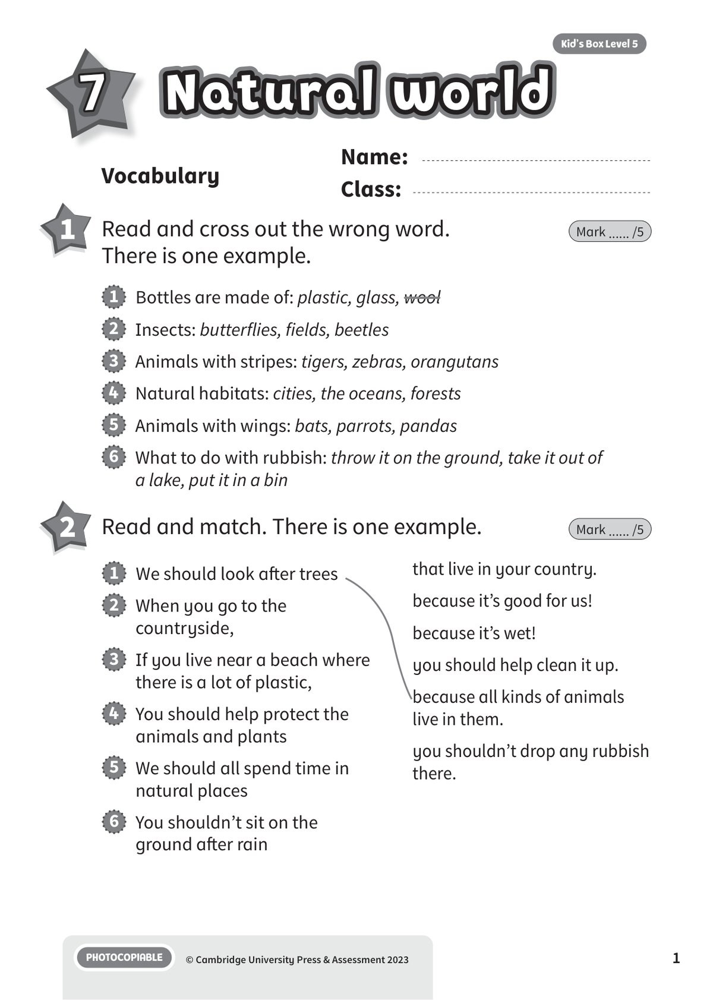
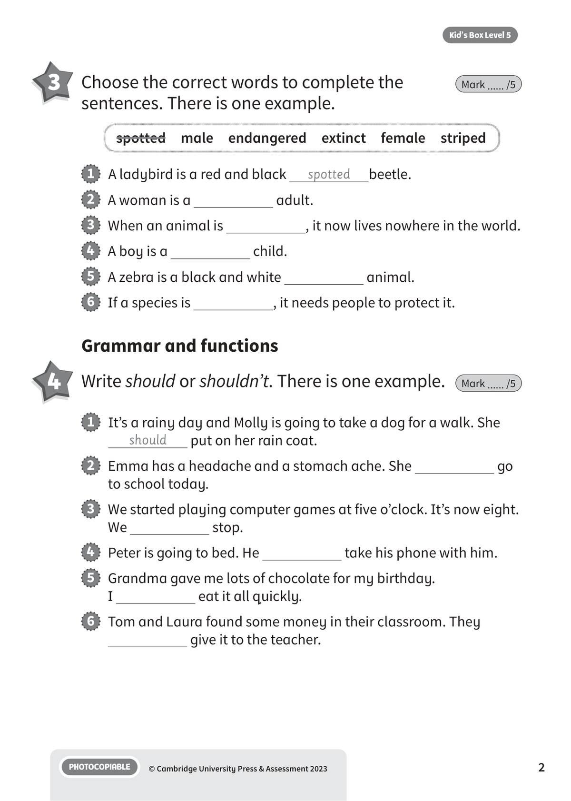
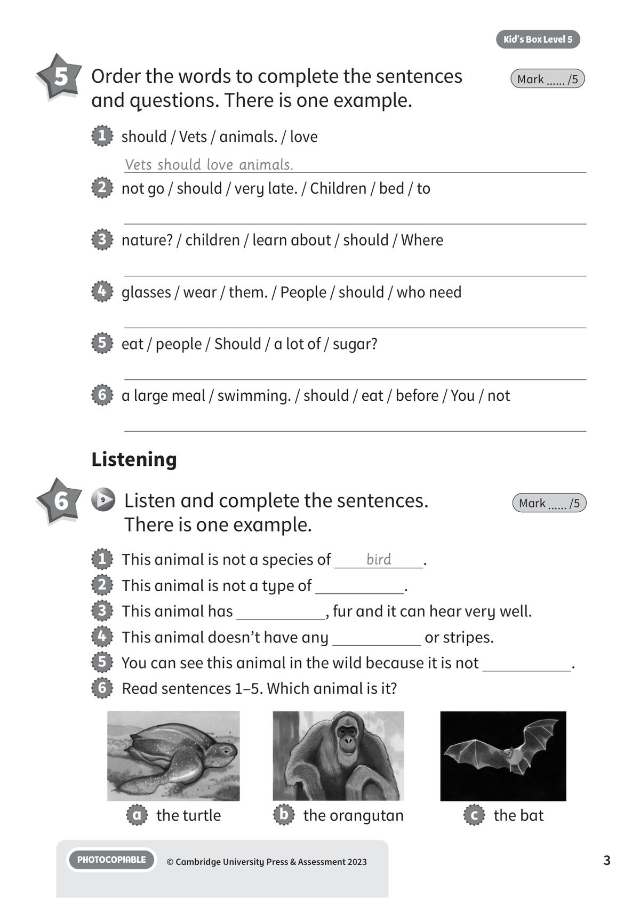
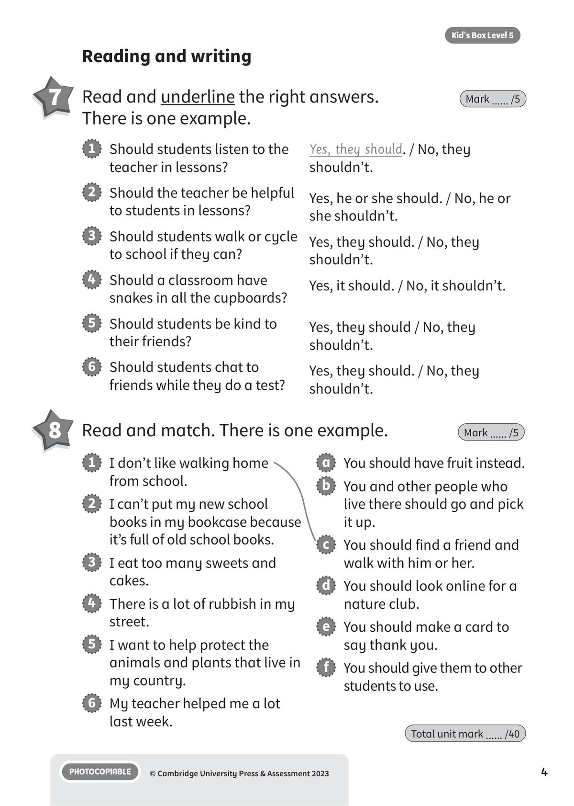
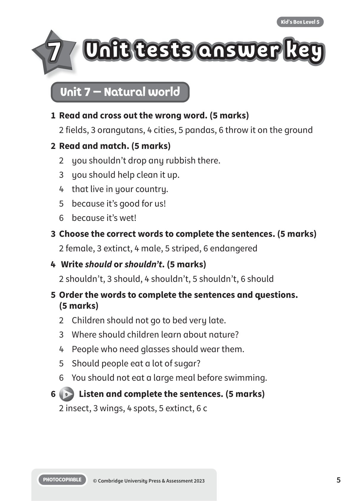
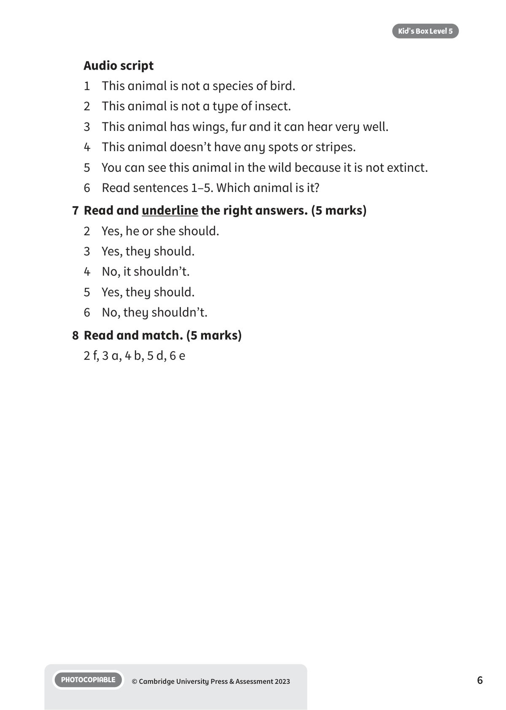

## 音频文件

- 🎧 [KBX_L5_U7_audio_T9.mp3](KBX_L5_U7_audio_T9.mp3)

## 第 1 页

Name:
Class:
PHOTOCOPIABLE
© Cambridge University Press & Assessment 2023
1
Kid’s Box Level 5
Natural world
Natural world
Natural world
7
Vocabulary
1 	 Read and cross out the wrong word.
There is one example.
Mark ...... /5
2 	 Read and match. There is one example.
Mark ...... /5
1   Bottles are made of: plastic, glass, wool
2   Insects: butterflies, fields, beetles
3   Animals with stripes: tigers, zebras, orangutans
4   Natural habitats: cities, the oceans, forests
5   Animals with wings: bats, parrots, pandas
6   What to do with rubbish: throw it on the ground, take it out of
a lake, put it in a bin
1   We should look after trees
2   When you go to the
countryside,
3   If you live near a beach where
there is a lot of plastic,
4   You should help protect the
animals and plants
5   We should all spend time in
natural places
6   You shouldn’t sit on the
ground after rain
that live in your country.
because it’s good for us!
because it’s wet!
you should help clean it up.
because all kinds of animals
live in them.
you shouldn’t drop any rubbish
there.

## 第 2 页

PHOTOCOPIABLE
© Cambridge University Press & Assessment 2023
2
Kid’s Box Level 5
Grammar and functions
3 	 Choose the correct words to complete the
sentences. There is one example.
Mark ...... /5
4 	 Write should or shouldn’t. There is one example.
Mark ...... /5
1   A ladybird is a red and black
spotted
beetle.
2   A woman is a
adult.
3   When an animal is
, it now lives nowhere in the world.
4   A boy is a
child.
5   A zebra is a black and white
animal.
6   If a species is
, it needs people to protect it.
1   It’s a rainy day and Molly is going to take a dog for a walk. She
should
put on her rain coat.
2   Emma has a headache and a stomach ache. She
go
to school today.
3   We started playing computer games at five o’clock. It’s now eight.
We
stop.
4   Peter is going to bed. He
take his phone with him.
5   Grandma gave me lots of chocolate for my birthday.
I
eat it all quickly.
6   Tom and Laura found some money in their classroom. They
give it to the teacher.
spotted  male  endangered  extinct  female  striped

## 第 3 页

PHOTOCOPIABLE
© Cambridge University Press & Assessment 2023
3
Kid’s Box Level 5
5 	 Order the words to complete the sentences
and questions. There is one example.
Mark ...... /5
Listening
6 	  9   Listen and complete the sentences.
There is one example.
Mark ...... /5
1   should / Vets / animals. / love
Vets should love animals.
2   not go / should / very late. / Children / bed / to
3   nature? / children / learn about / should / Where
4   glasses / wear / them. / People / should / who need
5   eat / people / Should / a lot of / sugar?
6   a large meal / swimming. / should / eat / before / You / not
1   This animal is not a species of
bird
.
2   This animal is not a type of
.
3   This animal has
, fur and it can hear very well.
4   This animal doesn’t have any
or stripes.
5   You can see this animal in the wild because it is not
.
6   Read sentences 1–5. Which animal is it?
a   the turtle
b   the orangutan
c   the bat

## 第 4 页

PHOTOCOPIABLE
© Cambridge University Press & Assessment 2023
4
Kid’s Box Level 5
Reading and writing
1   I don’t like walking home
from school.
2   I can’t put my new school
books in my bookcase because
it’s full of old school books.
3   I eat too many sweets and
cakes.
4   There is a lot of rubbish in my
street.
5   I want to help protect the
animals and plants that live in
my country.
6   My teacher helped me a lot
last week.
a   You should have fruit instead.
b   You and other people who
live there should go and pick
it up.
c   You should find a friend and
walk with him or her.
d   You should look online for a
nature club.
e   You should make a card to
say thank you.
f   You should give them to other
students to use.
8 	 Read and match. There is one example.
Mark ...... /5
Total unit mark ...... /40
7 	 Read and underline the right answers.
There is one example.
Mark ...... /5
1   Should students listen to the
teacher in lessons?
2   Should the teacher be helpful
to students in lessons?
3   Should students walk or cycle
to school if they can?
4   Should a classroom have
snakes in all the cupboards?
5   Should students be kind to
their friends?
6   Should students chat to
friends while they do a test?
Yes, they should. / No, they
shouldn’t.
Yes, he or she should. / No, he or
she shouldn’t.
Yes, they should. / No, they
shouldn’t.
Yes, it should. / No, it shouldn’t.
Yes, they should / No, they
shouldn’t.
Yes, they should. / No, they
shouldn’t.

## 第 5 页

Unit tests answer key
Unit tests answer key
Unit tests answer key
PHOTOCOPIABLE
© Cambridge University Press & Assessment 2023
5
Kid’s Box Level 5
7
Unit 7 – Natural world
1 	Read and cross out the wrong word. (5 marks)
2 fields, 3 orangutans, 4 cities, 5 pandas, 6 throw it on the ground
2 	Read and match. (5 marks)
2 	 you shouldn’t drop any rubbish there.
3 	 you should help clean it up.
4 	 that live in your country.
5 	 because it’s good for us!
6 	 because it’s wet!
3 	Choose the correct words to complete the sentences. (5 marks)
2 female, 3 extinct, 4 male, 5 striped, 6 endangered
4	 Write should or shouldn’t. (5 marks)
2 shouldn’t, 3 should, 4 shouldn’t, 5 shouldn’t, 6 should
5 	Order the words to complete the sentences and questions.
(5 marks)
2 	 Children should not go to bed very late.
3 	 Where should children learn about nature?
4 	 People who need glasses should wear them.
5 	 Should people eat a lot of sugar?
6 	 You should not eat a large meal before swimming.
6
9   Listen and complete the sentences. (5 marks)
2 insect, 3 wings, 4 spots, 5 extinct, 6 c

## 第 6 页

PHOTOCOPIABLE
© Cambridge University Press & Assessment 2023
6
Kid’s Box Level 5
Audio script
1 	 This animal is not a species of bird.
2 	 This animal is not a type of insect.
3 	 This animal has wings, fur and it can hear very well.
4	 This animal doesn’t have any spots or stripes.
5 	 You can see this animal in the wild because it is not extinct.
6 	 Read sentences 1–5. Which animal is it?
7 	Read and underline the right answers. (5 marks)
2 	 Yes, he or she should.
3 	 Yes, they should.
4 	 No, it shouldn’t.
5 	 Yes, they should.
6 	 No, they shouldn’t.
8 	Read and match. (5 marks)
2 f, 3 a, 4 b, 5 d, 6 e
