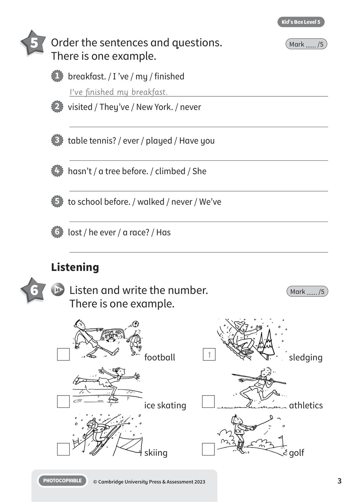
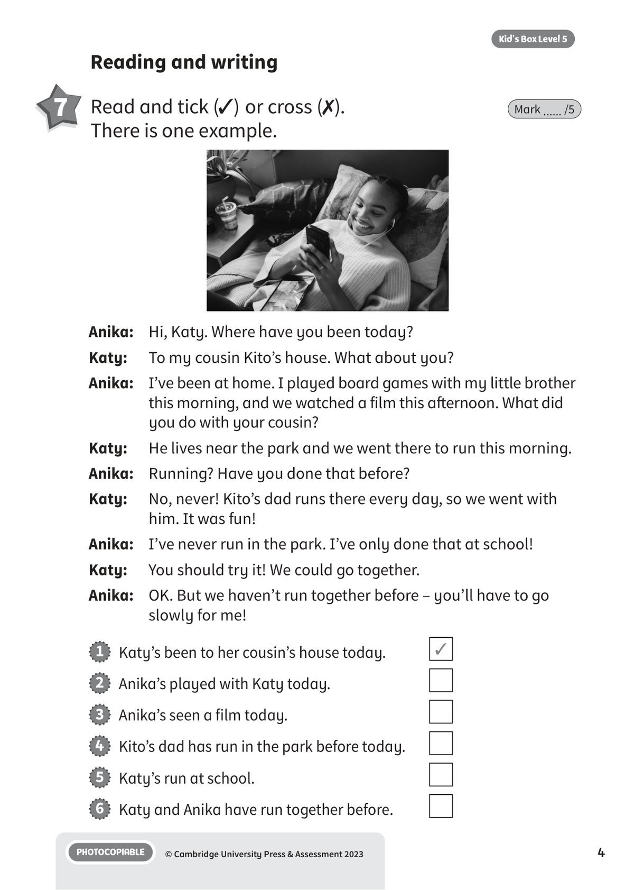
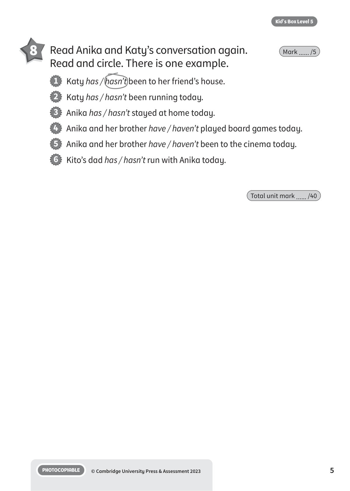

## 音频文件

- 🎧 [KBX_L5_U8_audio_T10.mp3](KBX_L5_U8_audio_T10.mp3)

## 第 1 页

Name:
Class:
PHOTOCOPIABLE
© Cambridge University Press & Assessment 2023
1
Kid’s Box Level 5
World of sport
World of sport
World of sport
8
Vocabulary
1 	 Look and circle the words. There is one example.
Mark ...... /5
2 	 Read and choose a, b or c. There is one example.
Mark ...... /5
running /
walking
swimming /
cycling
golf /
basketball
skateboarding /
snowboarding
baseball /
volleyball
skating /
sailing
1
2
3
4
5
6
1   People drive very fast in this kind of
competition.
2   This is lots of different kinds of sports, for
example running, throwing and jumping.
3   You need snow to do this sport, and you
stand up to do it.
4   You have to wear a special kind of boots
when you do this sport, and people often
do it inside.
5   This is a fun sport which people do outside
in cold weather. They sit or lie down to do it.
6   People usually do this sport inside. Two or
four people play games of it together.
a   athletics
b   skiing
c   car racing
a   badminton
b   sledging
c   ice skating

## 第 2 页

PHOTOCOPIABLE
© Cambridge University Press & Assessment 2023
2
Kid’s Box Level 5
1   The train
has arrived
.
(arrive)
2   He
.
(win)
3   He
the eggs.
(drop)
4   She
her hair.
(brush)
5   They
the castle.
(visit)
6   She
the kitchen. 	 (clean)
Grammar and functions
3 	 Circle the correct answer. There is one example. Mark ...... /5
4 	 Look and complete the sentences.
There is one example.
Mark ...... /5
1   Summer / Winter is the hottest season.
2   Summer / Winter has the coldest weather.
3   In countries that have four seasons, spring / autumn comes next
after summer.
4   In countries that have four seasons, winter / summer is between
spring and autumn.
5   In countries that have four seasons, spring / autumn is when plants
start to grow again.
6   In countries that have four seasons, leaves start to fall from trees in
summer / autumn.
1
2
3
4
5
6

## 第 3 页

PHOTOCOPIABLE
© Cambridge University Press & Assessment 2023
3
Kid’s Box Level 5
5 	 Order the sentences and questions.
There is one example.
Mark ...... /5
1   breakfast. / I ’ve / my / finished
I’ve finished my breakfast.
2   visited / They’ve / New York. / never
3   table tennis? / ever / played / Have you
4   hasn’t / a tree before. / climbed / She
5   to school before. / walked / never / We’ve
6   lost / he ever / a race? / Has
Listening
6 	  10   Listen and write the number.
There is one example.
Mark ...... /5
football
sledging
ice skating
athletics
skiing
golf
1

## 第 4 页

PHOTOCOPIABLE
© Cambridge University Press & Assessment 2023
4
Kid’s Box Level 5
Reading and writing
7 	 Read and tick (✓) or cross (✗).
There is one example.
Mark ...... /5
Anika:	 Hi, Katy. Where have you been today?
Katy:
To my cousin Kito’s house. What about you?
Anika: 	 I’ve been at home. I played board games with my little brother
this morning, and we watched a film this afternoon. What did
you do with your cousin?
Katy:
He lives near the park and we went there to run this morning.
Anika: 	 Running? Have you done that before?
Katy:
No, never! Kito’s dad runs there every day, so we went with
him. It was fun!
Anika: 	 I’ve never run in the park. I’ve only done that at school!
Katy:
You should try it! We could go together.
Anika: 	 OK. But we haven’t run together before – you’ll have to go
slowly for me!
1   Katy’s been to her cousin’s house today.
✓
2   Anika’s played with Katy today.
3   Anika’s seen a film today.
4   Kito’s dad has run in the park before today.
5   Katy’s run at school.
6   Katy and Anika have run together before.

## 第 5 页

PHOTOCOPIABLE
© Cambridge University Press & Assessment 2023
5
Kid’s Box Level 5
8 	 Read Anika and Katy’s conversation again.
Read and circle. There is one example.
Mark ...... /5
Total unit mark ...... /40
1   Katy has / hasn’t been to her friend’s house.
2   Katy has / hasn’t been running today.
3   Anika has / hasn’t stayed at home today.
4   Anika and her brother have / haven’t played board games today.
5   Anika and her brother have / haven’t been to the cinema today.
6   Kito’s dad has / hasn’t run with Anika today.
