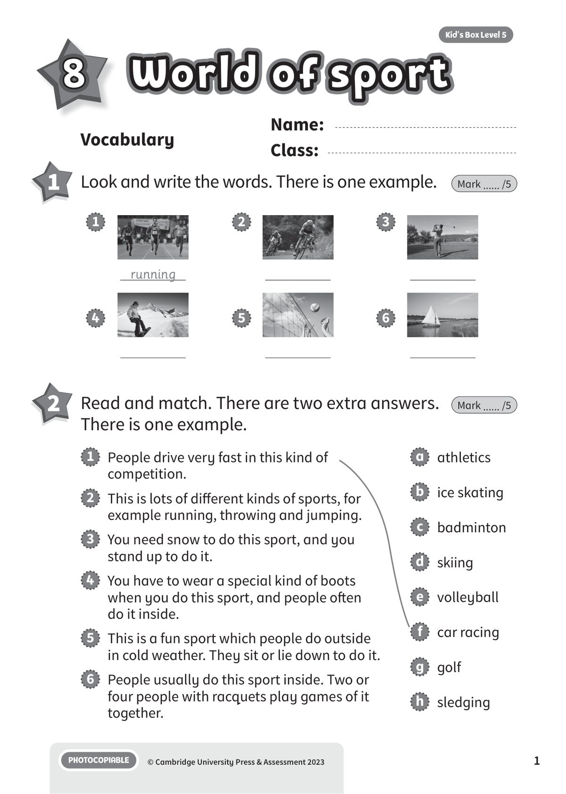
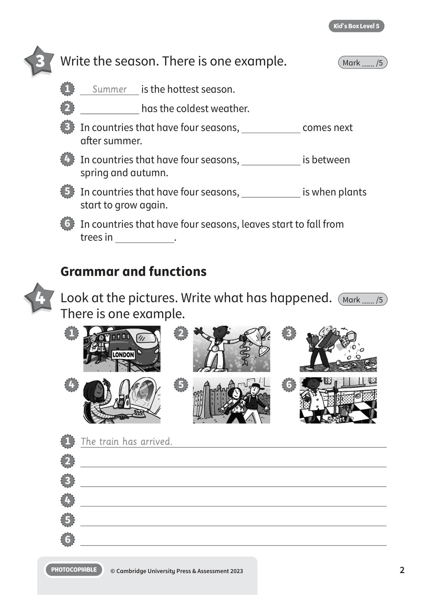
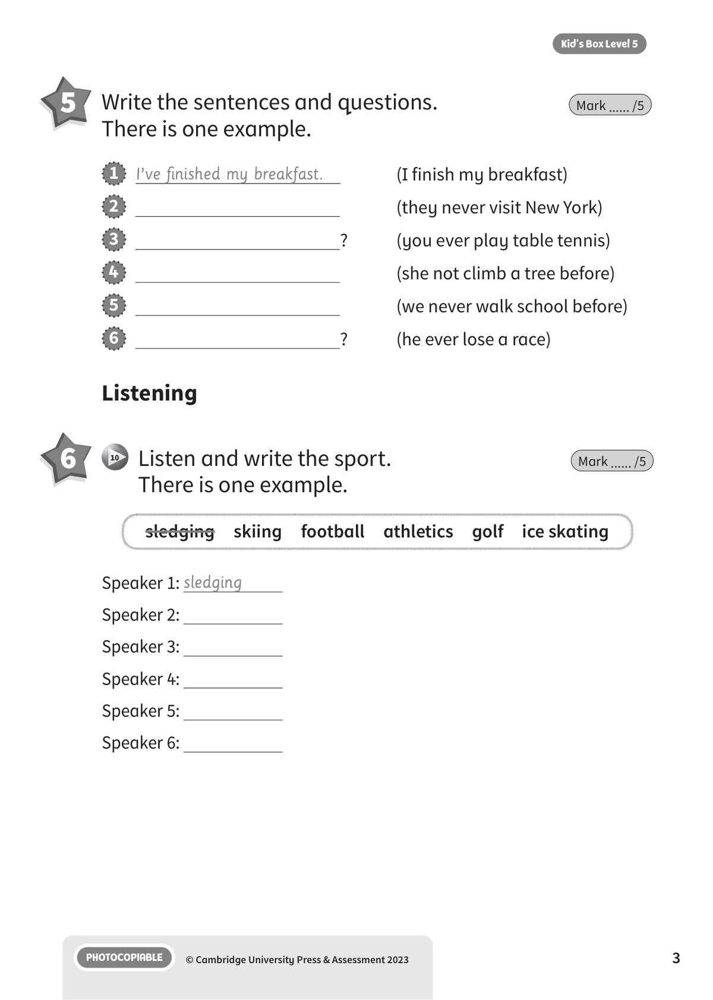
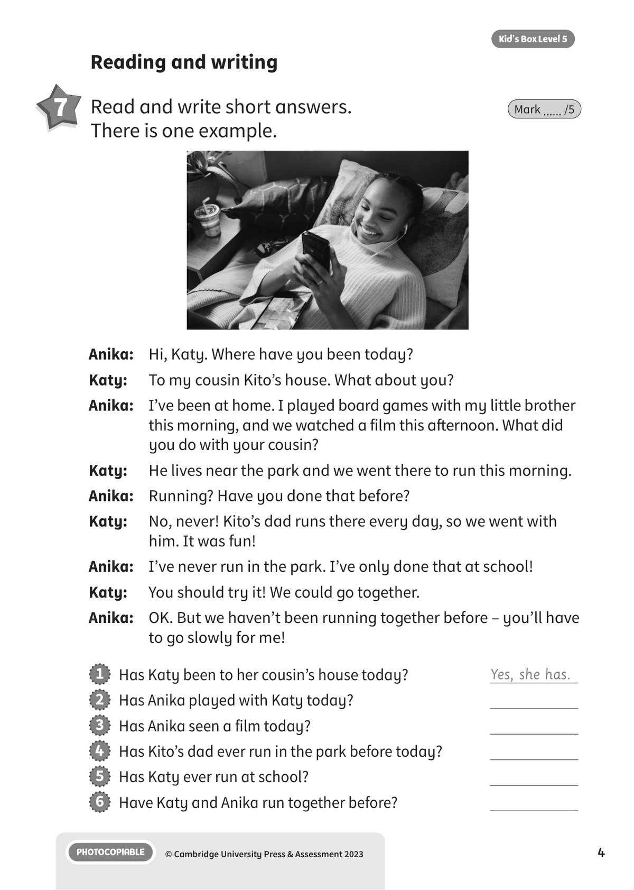
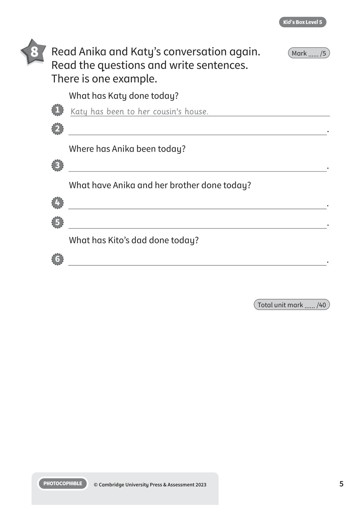
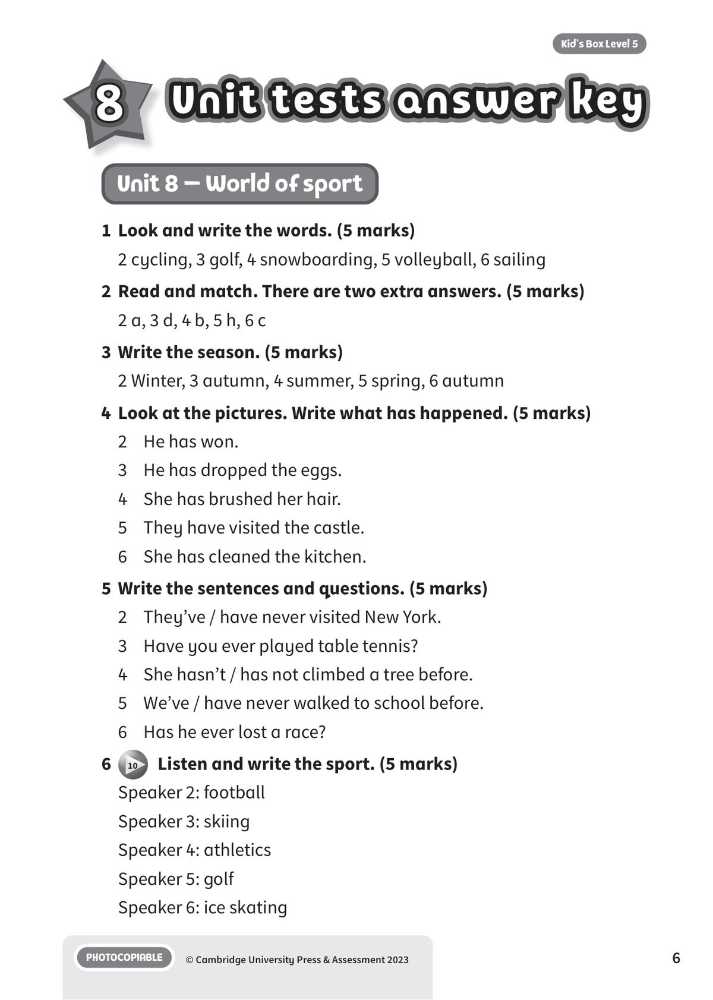
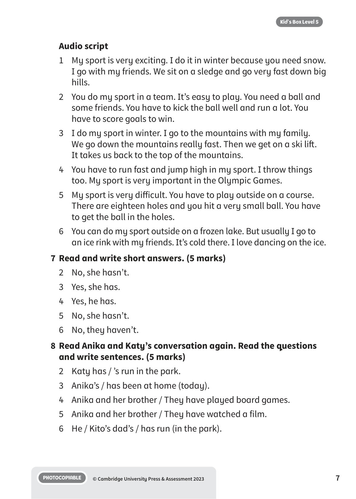

## 音频文件

- 🎧 [KBX_L5_U8_audio_T10.mp3](KBX_L5_U8_audio_T10.mp3)

## 第 1 页

Name:
Class:
PHOTOCOPIABLE
© Cambridge University Press & Assessment 2023
1
Kid’s Box Level 5
World of sport
World of sport
World of sport
8
Vocabulary
1 	 Look and write the words. There is one example.
Mark ...... /5
2 	 Read and match. There are two extra answers.
There is one example.
Mark ...... /5
running
1
2
3
4
5
6
1   People drive very fast in this kind of
competition.
2   This is lots of different kinds of sports, for
example running, throwing and jumping.
3   You need snow to do this sport, and you
stand up to do it.
4   You have to wear a special kind of boots
when you do this sport, and people often
do it inside.
5   This is a fun sport which people do outside
in cold weather. They sit or lie down to do it.
6   People usually do this sport inside. Two or
four people with racquets play games of it
together.
a   athletics
b   ice skating
c   badminton
d   skiing
e   volleyball
f   car racing
g   golf
h   sledging

## 第 2 页

PHOTOCOPIABLE
© Cambridge University Press & Assessment 2023
2
Kid’s Box Level 5
1   The train has arrived.
2
3
4
5
6
Grammar and functions
3 	 Write the season. There is one example.
Mark ...... /5
4 	 Look at the pictures. Write what has happened.
There is one example.
Mark ...... /5
1
Summer
is the hottest season.
2
has the coldest weather.
3   In countries that have four seasons,
comes next
after summer.
4   In countries that have four seasons,
is between
spring and autumn.
5   In countries that have four seasons,
is when plants
start to grow again.
6   In countries that have four seasons, leaves start to fall from
trees in
.
1
2
3
4
5
6

## 第 3 页

PHOTOCOPIABLE
© Cambridge University Press & Assessment 2023
3
Kid’s Box Level 5
5 	 Write the sentences and questions.
There is one example.
Mark ...... /5
Listening
6 	  10   Listen and write the sport.
There is one example.
Mark ...... /5
1   I’ve finished my breakfast.
(I finish my breakfast)
2
(they never visit New York)
3
?
(you ever play table tennis)
4
(she not climb a tree before)
5
(we never walk school before)
6
?
(he ever lose a race)
Speaker 1: sledging
Speaker 2:
Speaker 3:
Speaker 4:
Speaker 5:
Speaker 6:
sledging  skiing  football  athletics  golf  ice skating

## 第 4 页

PHOTOCOPIABLE
© Cambridge University Press & Assessment 2023
4
Kid’s Box Level 5
Reading and writing
7 	 Read and write short answers.
There is one example.
Mark ...... /5
Anika:	 Hi, Katy. Where have you been today?
Katy:
To my cousin Kito’s house. What about you?
Anika: 	 I’ve been at home. I played board games with my little brother
this morning, and we watched a film this afternoon. What did
you do with your cousin?
Katy:
He lives near the park and we went there to run this morning.
Anika: 	 Running? Have you done that before?
Katy:
No, never! Kito’s dad runs there every day, so we went with
him. It was fun!
Anika: 	 I’ve never run in the park. I’ve only done that at school!
Katy:
You should try it! We could go together.
Anika: 	 OK. But we haven’t been running together before – you’ll have
to go slowly for me!
1   Has Katy been to her cousin’s house today?
Yes, she has.
2   Has Anika played with Katy today?
3   Has Anika seen a film today?
4   Has Kito’s dad ever run in the park before today?
5   Has Katy ever run at school?
6   Have Katy and Anika run together before?

## 第 5 页

PHOTOCOPIABLE
© Cambridge University Press & Assessment 2023
5
Kid’s Box Level 5
8 	 Read Anika and Katy’s conversation again.
Read the questions and write sentences.
There is one example.
Mark ...... /5
Total unit mark ...... /40
What has Katy done today?
1   Katy has been to her cousin’s house.
2
.
Where has Anika been today?
3
.
What have Anika and her brother done today?
4
.
5
.
What has Kito’s dad done today?
6
.

## 第 6 页

Unit tests answer key
Unit tests answer key
Unit tests answer key
PHOTOCOPIABLE
© Cambridge University Press & Assessment 2023
6
Kid’s Box Level 5
8
Unit 8 – World of sport
1 	Look and write the words. (5 marks)
2 cycling, 3 golf, 4 snowboarding, 5 volleyball, 6 sailing
2	 Read and match. There are two extra answers. (5 marks)
2 a, 3 d, 4 b, 5 h, 6 c
3 	Write the season. (5 marks)
2 Winter, 3 autumn, 4 summer, 5 spring, 6 autumn
4 	Look at the pictures. Write what has happened. (5 marks)
2	 He has won.
3	 He has dropped the eggs.
4	 She has brushed her hair.
5	 They have visited the castle.
6	 She has cleaned the kitchen.
5 	Write the sentences and questions. (5 marks)
2	 They’ve / have never visited New York.
3	 Have you ever played table tennis?
4	 She hasn’t / has not climbed a tree before.
5	 We’ve / have never walked to school before.
6	 Has he ever lost a race?
6
10   Listen and write the sport. (5 marks)
Speaker 2: football
Speaker 3: skiing
Speaker 4: athletics
Speaker 5: golf
Speaker 6: ice skating

## 第 7 页

PHOTOCOPIABLE
© Cambridge University Press & Assessment 2023
7
Kid’s Box Level 5
Audio script
1	 My sport is very exciting. I do it in winter because you need snow.
I go with my friends. We sit on a sledge and go very fast down big
hills.
2	 You do my sport in a team. It’s easy to play. You need a ball and
some friends. You have to kick the ball well and run a lot. You
have to score goals to win.
3	 I do my sport in winter. I go to the mountains with my family.
We go down the mountains really fast. Then we get on a ski lift.
It takes us back to the top of the mountains.
4	 You have to run fast and jump high in my sport. I throw things
too. My sport is very important in the Olympic Games.
5	 My sport is very difficult. You have to play outside on a course.
There are eighteen holes and you hit a very small ball. You have
to get the ball in the holes.
6	 You can do my sport outside on a frozen lake. But usually I go to
an ice rink with my friends. It’s cold there. I love dancing on the ice.
7	 Read and write short answers. (5 marks)
2	 No, she hasn’t.
3	 Yes, she has.
4	 Yes, he has.
5	 No, she hasn’t.
6	 No, they haven’t.
8	 Read Anika and Katy’s conversation again. Read the questions
and write sentences. (5 marks)
2	 Katy has / ’s run in the park.
3	 Anika’s / has been at home (today).
4	 Anika and her brother / They have played board games.
5	 Anika and her brother / They have watched a film.
6	 He / Kito’s dad’s / has run (in the park).
