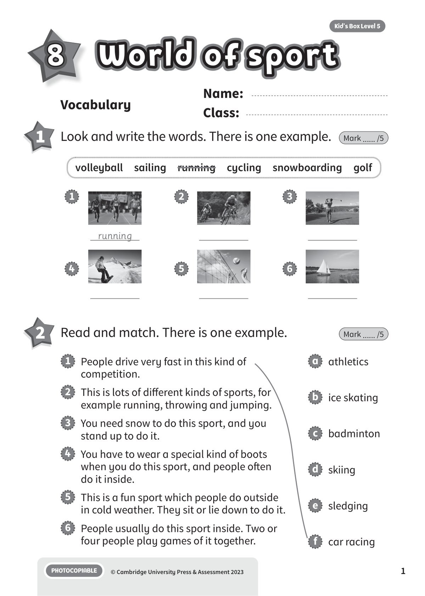
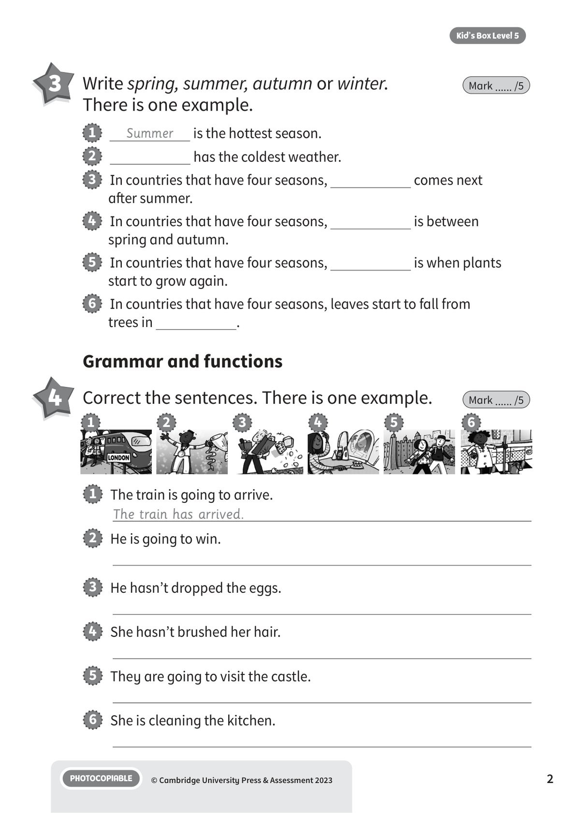
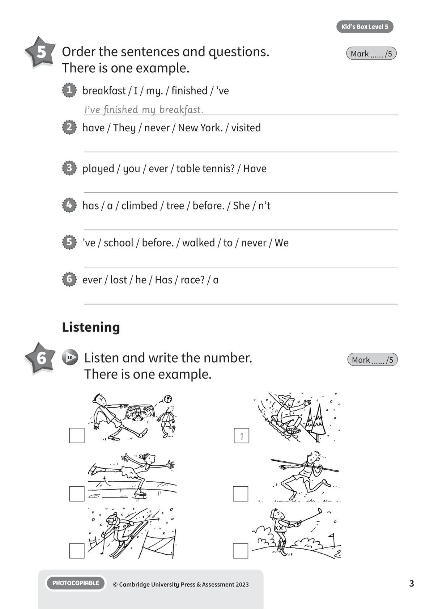
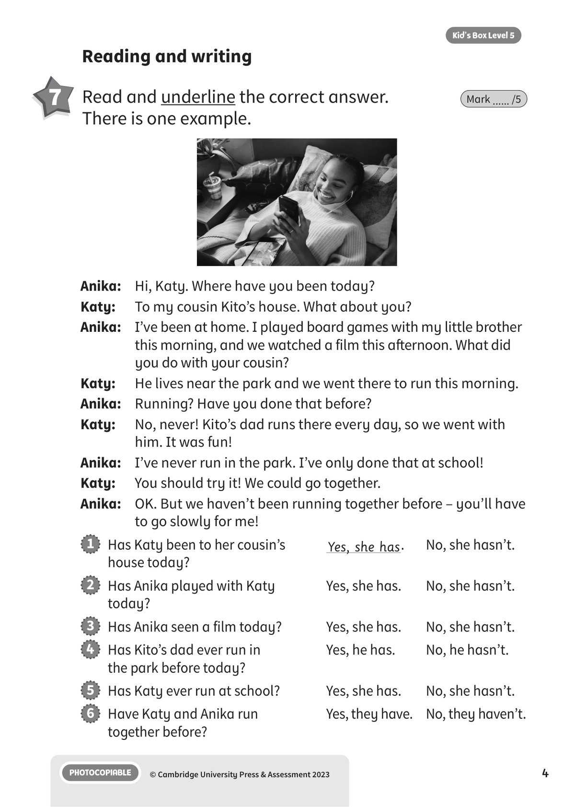
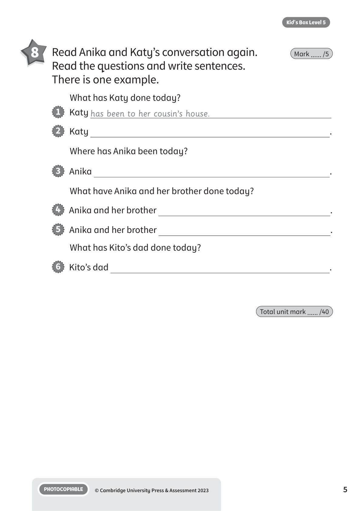

## 音频文件

- 🎧 [KBX_L5_U8_audio_T10.mp3](KBX_L5_U8_audio_T10.mp3)

## 第 1 页

Name:
Class:
PHOTOCOPIABLE
© Cambridge University Press & Assessment 2023
1
Kid’s Box Level 5
World of sport
World of sport
World of sport
8
Vocabulary
1 	 Look and write the words. There is one example.
Mark ...... /5
2 	 Read and match. There is one example.
Mark ...... /5
running
1
2
3
4
5
6
1   People drive very fast in this kind of
competition.
2   This is lots of different kinds of sports, for
example running, throwing and jumping.
3   You need snow to do this sport, and you
stand up to do it.
4   You have to wear a special kind of boots
when you do this sport, and people often
do it inside.
5   This is a fun sport which people do outside
in cold weather. They sit or lie down to do it.
6   People usually do this sport inside. Two or
four people play games of it together.
a   athletics
b   ice skating
c   badminton
d   skiing
e   sledging
f   car racing
volleyball  sailing  running  cycling  snowboarding  golf

## 第 2 页

PHOTOCOPIABLE
© Cambridge University Press & Assessment 2023
2
Kid’s Box Level 5
Grammar and functions
3 	 Write spring, summer, autumn or winter.
There is one example.
Mark ...... /5
4 	 Correct the sentences. There is one example.
Mark ...... /5
1
Summer
is the hottest season.
2
has the coldest weather.
3   In countries that have four seasons,
comes next
after summer.
4   In countries that have four seasons,
is between
spring and autumn.
5   In countries that have four seasons,
is when plants
start to grow again.
6   In countries that have four seasons, leaves start to fall from
trees in
.
1   The train is going to arrive.
The train has arrived.
2   He is going to win.
3   He hasn’t dropped the eggs.
4   She hasn’t brushed her hair.
5   They are going to visit the castle.
6   She is cleaning the kitchen.
1
2
3
4
5
6

## 第 3 页

PHOTOCOPIABLE
© Cambridge University Press & Assessment 2023
3
Kid’s Box Level 5
5 	 Order the sentences and questions.
There is one example.
Mark ...... /5
Listening
1   breakfast / I / my. / finished / ’ve
I’ve finished my breakfast.
2   have / They / never / New York. / visited
3   played / you / ever / table tennis? / Have
4   has / a / climbed / tree / before. / She / n’t
5   ’ve / school / before. / walked / to / never / We
6   ever / lost / he / Has / race? / a
6 	  10   Listen and write the number.
There is one example.
Mark ...... /5
1

## 第 4 页

PHOTOCOPIABLE
© Cambridge University Press & Assessment 2023
4
Kid’s Box Level 5
Reading and writing
7 	 Read and underline the correct answer.
There is one example.
Mark ...... /5
Anika:	 Hi, Katy. Where have you been today?
Katy:
To my cousin Kito’s house. What about you?
Anika: 	 I’ve been at home. I played board games with my little brother
this morning, and we watched a film this afternoon. What did
you do with your cousin?
Katy:
He lives near the park and we went there to run this morning.
Anika: 	 Running? Have you done that before?
Katy:
No, never! Kito’s dad runs there every day, so we went with
him. It was fun!
Anika: 	 I’ve never run in the park. I’ve only done that at school!
Katy:
You should try it! We could go together.
Anika: 	 OK. But we haven’t been running together before – you’ll have
to go slowly for me!
1   Has Katy been to her cousin’s
Yes, she has.
No, she hasn’t.
house today?
2   Has Anika played with Katy
Yes, she has.
No, she hasn’t.
today?
3   Has Anika seen a film today?
Yes, she has.
No, she hasn’t.
4   Has Kito’s dad ever run in
Yes, he has.
No, he hasn’t.
the park before today?
5   Has Katy ever run at school?
Yes, she has.
No, she hasn’t.
6   Have Katy and Anika run
Yes, they have. 	 No, they haven’t.
together before?

## 第 5 页

PHOTOCOPIABLE
© Cambridge University Press & Assessment 2023
5
Kid’s Box Level 5
8 	 Read Anika and Katy’s conversation again.
Read the questions and write sentences.
There is one example.
Mark ...... /5
Total unit mark ...... /40
What has Katy done today?
1   Katy has been to her cousin’s house.
2   Katy
.
Where has Anika been today?
3   Anika
.
What have Anika and her brother done today?
4   Anika and her brother
.
5   Anika and her brother
.
What has Kito’s dad done today?
6   Kito’s dad
.
